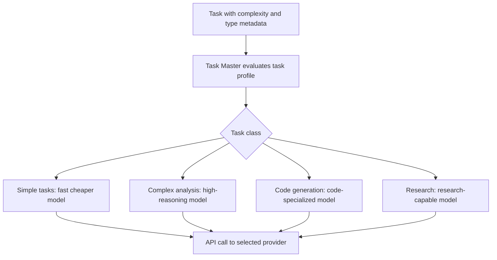

# Chapter 4: Multi-Model Integration

Welcome to **Chapter 4: Multi-Model Integration**. In this part of **Claude Task Master Tutorial: AI-Powered Task Management for Developers**, you will build an intuitive mental model first, then move into concrete implementation details and practical production tradeoffs.


Task Master excels at integrating multiple AI models to handle different types of tasks and workflows. This chapter explores how to leverage specialized models for optimal results across various development scenarios.

## Understanding Multi-Model Architecture

### Model Selection Strategy

Task Master automatically selects the best AI model for each task type:

```python
# Model selection logic
model_selection = {
    "code_generation": "claude-3-opus",      # Complex coding tasks
    "code_review": "gpt-4-turbo",          # Detailed analysis
    "documentation": "claude-3-haiku",     # Fast documentation
    "planning": "claude-3-opus",           # Strategic planning
    "debugging": "gpt-4-turbo",            # Problem-solving
    "research": "perplexity-sonnet",       # Information gathering
    "creative": "claude-3-opus",           # Innovative solutions
    "analysis": "gpt-4-turbo"              # Data analysis
}
```

### Model Capabilities Matrix

| Task Type | Claude 3 Opus | GPT-4 Turbo | Claude 3 Haiku | Perplexity |
|-----------|---------------|-------------|----------------|------------|
| Code Generation | ⭐⭐⭐⭐⭐ | ⭐⭐⭐⭐⭐ | ⭐⭐⭐⭐ | ⭐⭐⭐ |
| Code Review | ⭐⭐⭐⭐⭐ | ⭐⭐⭐⭐⭐ | ⭐⭐⭐ | ⭐⭐⭐ |
| Documentation | ⭐⭐⭐⭐⭐ | ⭐⭐⭐⭐ | ⭐⭐⭐⭐⭐ | ⭐⭐ |
| Planning | ⭐⭐⭐⭐⭐ | ⭐⭐⭐⭐⭐ | ⭐⭐⭐ | ⭐⭐⭐ |
| Debugging | ⭐⭐⭐⭐ | ⭐⭐⭐⭐⭐ | ⭐⭐⭐ | ⭐⭐⭐ |
| Research | ⭐⭐⭐⭐ | ⭐⭐⭐⭐ | ⭐⭐⭐ | ⭐⭐⭐⭐⭐ |
| Creative Tasks | ⭐⭐⭐⭐⭐ | ⭐⭐⭐⭐ | ⭐⭐⭐⭐ | ⭐⭐ |
| Speed | ⭐⭐⭐ | ⭐⭐⭐⭐⭐ | ⭐⭐⭐⭐⭐ | ⭐⭐⭐⭐⭐ |

## Configuring Multiple Models

### API Key Management

```bash
# Configure multiple API keys
task-master config-models \
  --claude-opus "sk-ant-..." \
  --gpt4-turbo "sk-..." \
  --claude-haiku "sk-ant-..." \
  --perplexity "pplx-..."

# Test model connections
task-master test-models

# Output:
🧪 Model Connection Tests:
✅ Claude 3 Opus: Connected (Response: 245ms)
✅ GPT-4 Turbo: Connected (Response: 320ms)
✅ Claude 3 Haiku: Connected (Response: 89ms)
✅ Perplexity: Connected (Response: 156ms)
```

### Model Priority & Fallback

```bash
# Set model priorities
task-master set-model-priority \
  --primary claude-opus \
  --secondary gpt4-turbo \
  --fast claude-haiku \
  --research perplexity

# Configure fallback behavior
task-master config-fallbacks \
  --if-primary-fails secondary \
  --if-secondary-fails fast \
  --max-retries 3 \
  --retry-delay 1000ms
```

## Task-Specific Model Assignment

### Code Generation Tasks

```bash
# Assign Claude Opus for complex architecture
task-master assign-model "design-system-architecture" --model claude-opus

# Use GPT-4 for detailed implementation
task-master assign-model "implement-payment-api" --model gpt4-turbo

# Fast generation with Claude Haiku
task-master assign-model "create-unit-tests" --model claude-haiku
```

### Research & Analysis Tasks

```bash
# Use Perplexity for information gathering
task-master assign-model "research-react-hooks" --model perplexity

# Complex analysis with Claude Opus
task-master assign-model "analyze-performance-bottlenecks" --model claude-opus

# Technical documentation with GPT-4
task-master assign-model "write-api-documentation" --model gpt4-turbo
```

## Automated Model Selection

### Smart Task Analysis

```bash
# Auto-assign models based on task content
task-master auto-assign-models --tasks "1,2,3,4,5"

# Output:
🤖 Auto-Model Assignment Results:
📋 Task 1 "Design authentication system" → Claude 3 Opus (Architecture)
📋 Task 2 "Implement JWT tokens" → GPT-4 Turbo (Implementation)
📋 Task 3 "Write API docs" → Claude 3 Haiku (Documentation)
📋 Task 4 "Research OAuth flows" → Perplexity (Research)
📋 Task 5 "Debug login issues" → GPT-4 Turbo (Debugging)
```

### Performance-Based Selection

```bash
# Optimize for speed vs quality
task-master optimize-models --priority speed

# Optimize for quality
task-master optimize-models --priority quality

# Balance cost and performance
task-master optimize-models --priority cost-effective
```

## Model Collaboration Patterns

### Sequential Processing

```bash
# Chain models for complex tasks
task-master chain-models "design-api" \
  --step1 "research:perplexity" \
  --step2 "design:claude-opus" \
  --step3 "implement:gpt4-turbo" \
  --step4 "document:claude-haiku"
```

### Parallel Processing

```bash
# Run models in parallel for different aspects
task-master parallel-models "feature-implementation" \
  --branch1 "backend:gpt4-turbo" \
  --branch2 "frontend:claude-opus" \
  --branch3 "testing:claude-haiku"
```

### Review & Validation

```bash
# Use multiple models for peer review
task-master peer-review "user-auth-implementation" \
  --reviewer1 claude-opus \
  --reviewer2 gpt4-turbo \
  --consensus-threshold 0.8
```

## Cost Optimization

### Model Cost Tracking

```bash
# Track costs by model
task-master cost-report --period "last-week"

# Output:
💰 Model Cost Report (Last Week):
━━━━━━━━━━━━━━━━━━━━━━━━━━━━━━━━━━━━
Claude 3 Opus: $12.45 (45% of total)
GPT-4 Turbo: $8.30 (30% of total)
Claude 3 Haiku: $3.25 (12% of total)
Perplexity: $4.50 (13% of total)
━━━━━━━━━━━━━━━━━━━━━━━━━━━━━━━━━━━━
Total: $28.50 (2,850 tokens)
```

### Cost-Optimized Workflows

```bash
# Use cheaper models for routine tasks
task-master cost-optimize "code-formatting" --model claude-haiku

# Reserve expensive models for complex tasks
task-master cost-optimize "system-architecture" --model claude-opus

# Set cost limits per task type
task-master set-cost-limits \
  --research-max $5.00 \
  --coding-max $10.00 \
  --review-max $3.00
```

## Quality Assurance Across Models

### Model Performance Benchmarking

```bash
# Benchmark models on your tasks
task-master benchmark-models --tasks "sample-tasks.json"

# Output:
🏁 Model Benchmark Results:
━━━━━━━━━━━━━━━━━━━━━━━━━━━━━━━━━━━━
Task Type: Code Generation
├── Claude 3 Opus: 9.2/10 (Accuracy: 92%, Speed: 85%)
├── GPT-4 Turbo: 8.8/10 (Accuracy: 88%, Speed: 78%)
├── Claude 3 Haiku: 7.5/10 (Accuracy: 75%, Speed: 95%)
└── Perplexity: 6.2/10 (Accuracy: 62%, Speed: 88%)

Task Type: Documentation
├── Claude 3 Opus: 9.5/10 (Clarity: 95%, Completeness: 90%)
├── GPT-4 Turbo: 8.9/10 (Clarity: 89%, Completeness: 88%)
├── Claude 3 Haiku: 8.1/10 (Clarity: 81%, Completeness: 85%)
└── Perplexity: 7.2/10 (Clarity: 72%, Completeness: 78%)
```

### Quality Gates

```bash
# Set quality thresholds
task-master set-quality-gates \
  --min-score 7.5 \
  --require-review "score < 8.0" \
  --auto-approve "score >= 9.0"

# Quality validation pipeline
task-master validate-output "task-5" \
  --criteria "code-quality,functionality,documentation" \
  --reviewer gpt4-turbo
```

## Custom Model Integration

### Adding New Models

```python
# Register custom model
task-master register-model \
  --name "custom-llm" \
  --endpoint "https://api.custom-llm.com/v1/chat" \
  --api-key "custom-key" \
  --capabilities "coding,analysis,creative" \
  --cost-per-token 0.002

# Test custom model
task-master test-model "custom-llm"

# Assign to tasks
task-master assign-model "specialized-task" --model custom-llm
```

### Model Fine-tuning Integration

```bash
# Use fine-tuned models
task-master use-fine-tuned \
  --base-model claude-opus \
  --fine-tuned-model "ft:company-domain-expert" \
  --task-type "domain-specific"

# A/B test fine-tuned vs base models
task-master ab-test-models \
  --model-a "claude-opus" \
  --model-b "ft:company-expert" \
  --tasks "domain-tasks.json" \
  --metric "accuracy"
```

## Advanced Multi-Model Workflows

### Ensemble Methods

```bash
# Combine multiple models for better results
task-master ensemble-models "complex-architecture" \
  --models "claude-opus,gpt4-turbo" \
  --strategy "consensus" \
  --confidence-threshold 0.8

# Model voting system
task-master voting-system "code-review" \
  --models "claude-opus,gpt4-turbo,claude-haiku" \
  --voting-method "majority" \
  --tie-breaker "claude-opus"
```

### Dynamic Model Switching

```bash
# Switch models based on task complexity
task-master dynamic-switching \
  --simple-tasks claude-haiku \
  --medium-tasks gpt4-turbo \
  --complex-tasks claude-opus

# Context-aware model selection
task-master context-aware \
  --code-related claude-opus \
  --research-related perplexity \
  --creative-related claude-opus
```

## Monitoring & Analytics

### Model Performance Dashboard

```bash
# View model performance metrics
task-master model-dashboard

# Output:
📊 Model Performance Dashboard:
━━━━━━━━━━━━━━━━━━━━━━━━━━━━━━━━━━━━
Response Time (avg):
├── Claude 3 Opus: 2.3s
├── GPT-4 Turbo: 1.8s
├── Claude 3 Haiku: 0.8s
└── Perplexity: 1.1s

Success Rate (24h):
├── Claude 3 Opus: 98.5%
├── GPT-4 Turbo: 97.2%
├── Claude 3 Haiku: 99.1%
└── Perplexity: 96.8%

Cost Efficiency:
├── Claude 3 Opus: $0.015/token
├── GPT-4 Turbo: $0.010/token
├── Claude 3 Haiku: $0.003/token
└── Perplexity: $0.005/token
```

### Model Health Monitoring

```bash
# Monitor model availability
task-master health-check --all-models

# Get alerts for model issues
task-master set-alerts \
  --response-time-threshold "5s" \
  --error-rate-threshold "5%" \
  --notification-channel slack
```

## Real-World Multi-Model Examples

### Full-Stack Development Workflow

```bash
# Complete development pipeline
task-master create-pipeline "full-stack-feature" \
  --steps "planning,design,frontend,backend,testing,deployment" \
  --models "claude-opus,gpt4-turbo,claude-haiku,claude-opus,gpt4-turbo,claude-haiku"

# Step-by-step execution:
# 1. Planning: Claude Opus (strategic thinking)
# 2. Design: GPT-4 Turbo (detailed specifications)
# 3. Frontend: Claude Haiku (fast React components)
# 4. Backend: Claude Opus (complex API logic)
# 5. Testing: GPT-4 Turbo (comprehensive test cases)
# 6. Deployment: Claude Haiku (infrastructure as code)
```

### Research & Development Pipeline

```bash
# Research to implementation pipeline
task-master research-pipeline "new-feature" \
  --research-model perplexity \
  --analysis-model claude-opus \
  --implementation-model gpt4-turbo \
  --review-model claude-haiku

# Automated workflow:
# 1. Research latest approaches
# 2. Analyze requirements and constraints
# 3. Generate implementation code
# 4. Review for best practices
```

## Best Practices

### Model Selection Guidelines

1. **Use Claude Opus for:**
   - Complex architecture design
   - Creative problem-solving
   - Strategic planning
   - Code that requires deep understanding

2. **Use GPT-4 Turbo for:**
   - Detailed code implementation
   - Debugging and troubleshooting
   - Technical documentation
   - Data analysis tasks

3. **Use Claude Haiku for:**
   - Fast code generation
   - Routine tasks
   - Documentation
   - Simple implementations

4. **Use Perplexity for:**
   - Research and information gathering
   - Latest technology trends
   - Comparative analysis

### Cost Optimization Strategies

```bash
# Implement cost-saving measures
task-master cost-strategy \
  --use-haiku-for-routine true \
  --cache-frequent-requests true \
  --batch-similar-tasks true \
  --monitor-usage-daily true

# Set up automatic cost alerts
task-master cost-alerts \
  --daily-budget 50.00 \
  --monthly-budget 1000.00 \
  --alert-threshold 80%
```

## Troubleshooting Multi-Model Issues

### Common Problems & Solutions

```bash
# Model rate limiting
task-master handle-rate-limits \
  --strategy "exponential-backoff" \
  --max-retries 5

# Model response inconsistencies
task-master response-validation \
  --enable-consistency-check true \
  --cross-model-verification true

# API key rotation
task-master rotate-keys \
  --schedule "weekly" \
  --backup-keys 2
```

## Multi-Model Integration Architecture



## What We've Accomplished

You've mastered multi-model integration in Task Master:

1. **Model Selection Strategy** - Choosing the right model for each task type
2. **Configuration Management** - Setting up multiple API keys and preferences
3. **Task-Specific Assignment** - Assigning specialized models to different tasks
4. **Automated Selection** - Smart model assignment based on task analysis
5. **Collaboration Patterns** - Sequential, parallel, and review workflows
6. **Cost Optimization** - Managing expenses across multiple models
7. **Quality Assurance** - Benchmarking and validation across models
8. **Custom Integration** - Adding new models and fine-tuned variants
9. **Advanced Workflows** - Ensemble methods and dynamic switching
10. **Monitoring & Analytics** - Performance tracking and health monitoring

## Next Steps

Now that you can leverage multiple AI models effectively, let's explore how Task Master integrates with popular editor environments. In [Chapter 5: Editor Integrations](05-editor-integrations.md), we'll dive into seamless integration with Cursor, Windsurf, VS Code, and other development environments.

---

**Practice what you've learned:**
1. Configure multiple models with different priorities
2. Create a multi-step workflow using different models
3. Analyze the cost-effectiveness of your model choices
4. Set up automated model selection for your tasks

*Which combination of models would you use for building a complex web application?* 🤖

## What Problem Does This Solve?

Most teams struggle here because the hard part is not writing more code, but deciding clear boundaries for `task`, `master`, `model` so behavior stays predictable as complexity grows.

In practical terms, this chapter helps you avoid three common failures:

- coupling core logic too tightly to one implementation path
- missing the handoff boundaries between setup, execution, and validation
- shipping changes without clear rollback or observability strategy

After working through this chapter, you should be able to reason about `Chapter 4: Multi-Model Integration` as an operating subsystem inside **Claude Task Master Tutorial: AI-Powered Task Management for Developers**, with explicit contracts for inputs, state transitions, and outputs.

Use the implementation notes around `claude`, `models`, `Claude` as your checklist when adapting these patterns to your own repository.

## How it Works Under the Hood

Under the hood, `Chapter 4: Multi-Model Integration` usually follows a repeatable control path:

1. **Context bootstrap**: initialize runtime config and prerequisites for `task`.
2. **Input normalization**: shape incoming data so `master` receives stable contracts.
3. **Core execution**: run the main logic branch and propagate intermediate state through `model`.
4. **Policy and safety checks**: enforce limits, auth scopes, and failure boundaries.
5. **Output composition**: return canonical result payloads for downstream consumers.
6. **Operational telemetry**: emit logs/metrics needed for debugging and performance tuning.

When debugging, walk this sequence in order and confirm each stage has explicit success/failure conditions.

## Source Walkthrough

Use the following upstream sources to verify implementation details while reading this chapter:

- [View Repo](https://github.com/eyaltoledano/claude-task-master)
  Why it matters: authoritative reference on `View Repo` (github.com).

Suggested trace strategy:
- search upstream code for `task` and `master` to map concrete implementation paths
- compare docs claims against actual runtime/config code before reusing patterns in production

## Chapter Connections

- [Tutorial Index](README.md)
- [Previous Chapter: Chapter 3: Task Management & Execution](03-task-management.md)
- [Next Chapter: Chapter 5: Editor Integrations](05-editor-integrations.md)
- [Main Catalog](../../README.md#-tutorial-catalog)
- [A-Z Tutorial Directory](../../discoverability/tutorial-directory.md)
