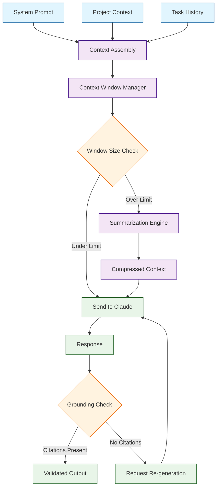
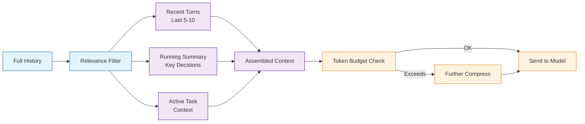
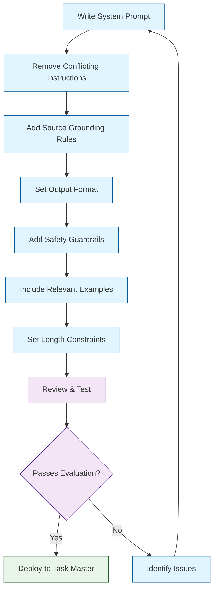

# Chapter 6: Context Management & Grounding

> Keep Claude focused with system prompts, tight context windows, and source-grounded answers.

When you scale AI-powered task management across large projects, the quality of your results depends directly on how well you manage context. Task Master provides tools for controlling what information Claude sees, how it interprets instructions, and how it grounds responses in verified sources. This chapter covers crafting system prompts, managing context windows, enforcing source grounding, and building evaluation loops that catch hallucinations before they reach your workflow.

## How Context Flows Through Task Master



## System Prompts for Control

System prompts establish role, scope, tone, and safety constraints before any task-specific instructions are processed.

### Crafting Effective System Prompts

```text
You are a senior software engineer working within Claude Task Master.
Your role is to help plan, decompose, and track software development tasks.

Rules:
- Be concise and actionable in all responses.
- Cite sources when provided. Use numbered citations like [1], [2].
- If you are unsure about something, say "I'm not sure" rather than guessing.
- Never fabricate file paths, API endpoints, or technical specifications.
- Format task outputs as structured JSON when requested.
- Respect dependency chains: never suggest starting a task whose dependencies are incomplete.
```

### System Prompt Layering

Task Master supports layered system prompts that combine global project rules with task-specific instructions:

```bash
# Set the global system prompt for your project
task-master config --system-prompt .taskmaster/prompts/system.txt

# Set a task-specific prompt overlay
task-master set-prompt --task 5 --prompt .taskmaster/prompts/auth-task.txt

# View the assembled prompt for a specific task
task-master show-prompt --task 5
```

### Prompt Configuration

```json
{
  "prompts": {
    "system": ".taskmaster/prompts/system.txt",
    "taskOverrides": {
      "api-endpoint": ".taskmaster/prompts/api-prompt.txt",
      "database-migration": ".taskmaster/prompts/db-prompt.txt",
      "frontend-component": ".taskmaster/prompts/frontend-prompt.txt"
    },
    "safetyPolicy": ".taskmaster/prompts/safety-policy.txt",
    "outputFormat": "structured-json"
  }
}
```

### System Prompt Guidelines

| Guideline | Good Example | Bad Example |
|-----------|-------------|-------------|
| Be explicit about role | "You are a senior backend engineer" | "You are helpful" |
| Set scope boundaries | "Only answer about this project's codebase" | "Answer any question" |
| Define output format | "Return JSON with keys: summary, tasks, risk" | "Return something useful" |
| Handle uncertainty | "Say 'not sure' when lacking info" | (no instruction) |
| Set length expectations | "Respond in 3-5 bullet points" | "Be concise" |
| Require citations | "Cite sources with [1], [2] notation" | "Use the sources" |

## Context Windows & Summaries

Claude models have large context windows, but effective context management is about quality, not just capacity. Stuffing full history into every request leads to slower responses, higher costs, and diluted focus.

### Context Window Strategy



### Configuring Context Management

```bash
# Set context window policy
task-master config --context-policy sliding-window

# Configure window size (number of recent turns to keep)
task-master config --context-window-size 10

# Enable automatic summarization
task-master config --auto-summarize true

# Set summarization interval (every N messages)
task-master config --summarize-interval 10
```

### Summary Policy Configuration

```json
{
  "contextManagement": {
    "strategy": "sliding-window-with-summary",
    "windowSize": 10,
    "summarizeEvery": 10,
    "summaryFormat": {
      "sections": ["facts", "decisions", "openQuestions", "nextSteps"],
      "maxBulletsPerSection": 5,
      "includeTimestamps": true
    },
    "stripPatterns": ["greetings", "filler", "unrelatedTangents"],
    "preservePatterns": ["codeBlocks", "taskReferences", "dependencyMentions"]
  }
}
```

### Manual Context Control

```bash
# Summarize the current conversation for a task
task-master summarize-context --task 5

# Output:
# Context Summary for Task 5 (Implement User Authentication):
#
# Facts:
# - Using JWT tokens with 24h expiry
# - PostgreSQL stores user credentials with bcrypt hashing
# - Rate limiting set to 5 login attempts per minute
#
# Decisions:
# - Chose passport.js over custom auth middleware
# - Will implement refresh tokens in phase 2
#
# Next Steps:
# - Implement login/register endpoints
# - Write integration tests for auth flow

# Inject specific context into a task
task-master inject-context --task 5 --file docs/auth-spec.md

# Clear stale context
task-master clear-context --task 5 --before "2024-01-10"
```

## Source Grounding

Source grounding anchors AI responses to verified, provided source material. This prevents fabricated details -- wrong file paths, invented API endpoints, or hallucinated dependencies -- from derailing your project.

### Grounding Configuration

```bash
# Enable source grounding for all tasks
task-master config --grounding-mode strict

# Attach sources to a task
task-master attach-source --task 5 --file README.md --label "Project README"
task-master attach-source --task 5 --file docs/api-spec.yaml --label "API Spec"

# View attached sources
task-master show-sources --task 5
```

### Grounding Prompt Pattern

```text
Use only the provided sources to answer. If an answer is not supported
by the sources, say "Not enough information in the provided sources."

Sources:
[1] README extract:
  - Project uses Express.js with TypeScript
  - Database: PostgreSQL 15
  - Authentication: JWT with passport.js

[2] API specification:
  - POST /api/auth/login - accepts email, password
  - POST /api/auth/register - accepts email, password, name
  - GET /api/auth/profile - requires Bearer token

Question: What authentication library does this project use?

Rules:
- Answer with numbered citations like [1], [2].
- If no source supports a claim, say so explicitly.
- Be concise (3-5 sentences maximum).
```

### Grounding Modes

| Mode | Behavior | Use Case |
|------|----------|----------|
| `strict` | Only use provided sources; refuse if unsourced | Critical tasks, compliance |
| `preferred` | Prefer sources; note when using general knowledge | Standard development tasks |
| `supplementary` | Use sources to augment general knowledge | Research and exploration |
| `disabled` | No grounding enforcement | Brainstorming, ideation |

## JSON & Structured Outputs

For deterministic automation, Task Master encourages structured output formats that can be parsed and validated programmatically.

### Task Analysis Schema

```json
{
  "$schema": "http://json-schema.org/draft-07/schema#",
  "type": "object",
  "required": ["summary", "tasks", "risk"],
  "properties": {
    "summary": { "type": "string", "maxLength": 500 },
    "tasks": {
      "type": "array",
      "items": {
        "type": "object",
        "required": ["title", "estimatedHours", "priority"],
        "properties": {
          "title": { "type": "string" },
          "estimatedHours": { "type": "number", "minimum": 0.5 },
          "priority": { "enum": ["low", "medium", "high", "critical"] }
        }
      }
    },
    "risk": { "enum": ["low", "medium", "high"] }
  }
}
```

### Temperature Settings for Structured Output

| Temperature | Use Case | Output Character |
|-------------|----------|-----------------|
| 0.0-0.1 | JSON automation, code generation | Highly deterministic |
| 0.2-0.3 | Task analysis, structured reports | Consistent with slight variation |
| 0.4-0.5 | Planning, architecture decisions | Balanced creativity and consistency |
| 0.6-0.7 | Brainstorming, exploration | Creative, diverse suggestions |

## Guardrails & Refusals

Guardrails prevent the AI from producing harmful or policy-violating content -- exposing secrets, fabricating specifications, or generating unsafe code patterns.

### Safety Policy Configuration

```text
# .taskmaster/prompts/safety-policy.txt

SAFETY POLICY:
- Never include API keys, passwords, secrets, or credentials in outputs.
- Never generate code that executes system commands without confirmation.
- Never fabricate file paths, URLs, or endpoint addresses.
- If asked for information outside provided sources, respond:
  "I don't have enough information to answer that accurately."
```

### Implementing Guardrails

```bash
# Enable safety policy globally
task-master config --safety-policy .taskmaster/prompts/safety-policy.txt

# Set disallowed content patterns
task-master config --disallow-patterns "API_KEY,SECRET,PASSWORD,PRIVATE_KEY"

# Enable PII detection
task-master config --pii-detection true

# View refusal log
task-master show-refusals --period "last-7-days"
```

## Prompt Hygiene Checklist



| Check | Description | Priority |
|-------|-------------|----------|
| Single system prompt | One authoritative source of instructions | Critical |
| No conflicts | No contradictory directives across prompt layers | Critical |
| Source grounding | Rules for citation and source usage | High |
| Output format | Defined structure for responses | High |
| Safety guardrails | Disallowed topics and refusal templates | High |
| Examples | Short, relevant few-shot examples | Medium |
| Length constraints | Max length or bullet count expectations | Medium |
| Uncertainty handling | "Don't guess; say not sure" directive | Medium |

## Evaluation Loop

An evaluation loop tests your prompts against known inputs and checks for hallucinations, format violations, and quality regressions.

### Building and Running Evaluations

```bash
# Create evaluation test cases
task-master create-eval --name "auth-task-grounding" \
  --input "What database does the project use?" \
  --expected-citation "[1]" \
  --expected-contains "PostgreSQL" \
  --sources docs/tech-stack.md

task-master create-eval --name "hallucination-check" \
  --input "What caching layer does the project use?" \
  --expected-response "Not enough information" \
  --sources docs/tech-stack.md

# Run all evaluation tests
task-master run-evals

# Output:
# Evaluation Results:
# auth-task-grounding:  PASS (citation [1] present, "PostgreSQL" found)
# hallucination-check:  PASS ("Not enough information" returned)
# json-format:          PASS (valid JSON, schema validated)
# edge-case-empty:      FAIL (expected refusal, got fabricated answer)
#
# Results: 3/4 passed (75%)

# Compare results across models
task-master compare-evals --models "claude-3-5-sonnet-20241022,gpt-4o"
```

## Example: Grounded Q&A for Task Context

A complete example combining system prompts, source grounding, structured output, and guardrails:

```json
{
  "model": "claude-3-5-sonnet-20241022",
  "system": "You are a precise technical assistant. Use only the provided sources. Cite every factual claim.",
  "prompt": "Sources:\n[1] {{ $json.doc1 }}\n[2] {{ $json.doc2 }}\n\nQuestion: {{ $json.question }}\n\nRules:\n- Answer with citations [1], [2]\n- If not in sources, say \"Not enough info\"\n- Return JSON: {\"answer\": \"...\", \"citations\": [...], \"confidence\": \"high|medium|low\"}",
  "temperature": 0.2,
  "max_tokens": 500
}
```

### Example Output

```json
{
  "answer": "The project uses PostgreSQL 15 as its primary database [1] with JWT-based authentication handled by passport.js [1]. Login and registration endpoints accept email and password fields [2].",
  "citations": [1, 2],
  "confidence": "high"
}
```

## Summary

Context management and grounding are the backbone of reliable AI-powered task management. By controlling what Claude sees (context windows), how it behaves (system prompts), what it references (source grounding), and what it refuses (guardrails), you build a task management system that produces consistent, trustworthy results at scale.

## Key Takeaways

1. **System prompts define behavior** -- Invest time in clear, non-conflicting system prompts that establish role, scope, and output expectations.
2. **Context windows need management** -- Use sliding windows with periodic summarization rather than dumping full history into every request.
3. **Source grounding prevents hallucinations** -- Attach sources to tasks and require citations to keep AI responses anchored in reality.
4. **Structured outputs enable automation** -- Use JSON schemas and low temperature settings for deterministic, parseable responses.
5. **Guardrails protect your workflow** -- Define safety policies, disallowed patterns, and refusal templates to prevent harmful or fabricated output.
6. **Evaluation loops catch regressions** -- Build test suites that verify grounding, format compliance, and hallucination resistance on an ongoing basis.
7. **Prompt hygiene is ongoing** -- Regularly audit your prompts for conflicts, redundancy, and drift as your project evolves.

## Next Steps

With your context management strategy in place, it is time to wire Task Master into automated pipelines. In [Chapter 7: Automation, CI/CD, and Guardrails](07-automation.md), you will learn how to integrate Claude-powered task management into Git hooks, PR review bots, CI validation steps, and scheduled workflows.

---

**Practice what you've learned:**
1. Write a system prompt for your current project and test it with Task Master
2. Attach source documents to your active tasks and enable strict grounding mode
3. Create an evaluation test case that checks for hallucination on an unsourced question
4. Run the prompt hygiene checker and address any warnings or failures

*Built with insights from the [Claude Task Master](https://github.com/eyaltoledano/claude-task-master) project.*
