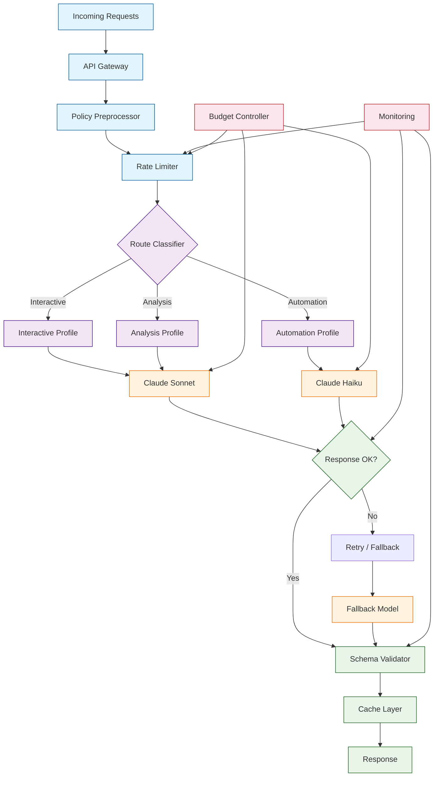
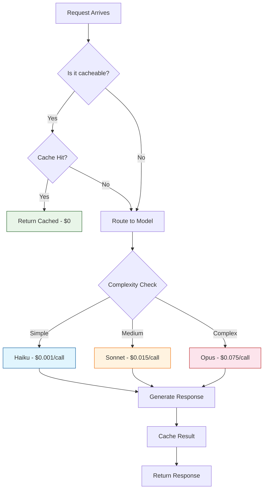
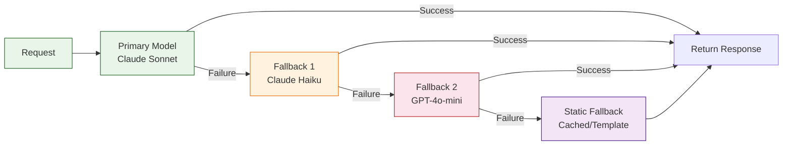
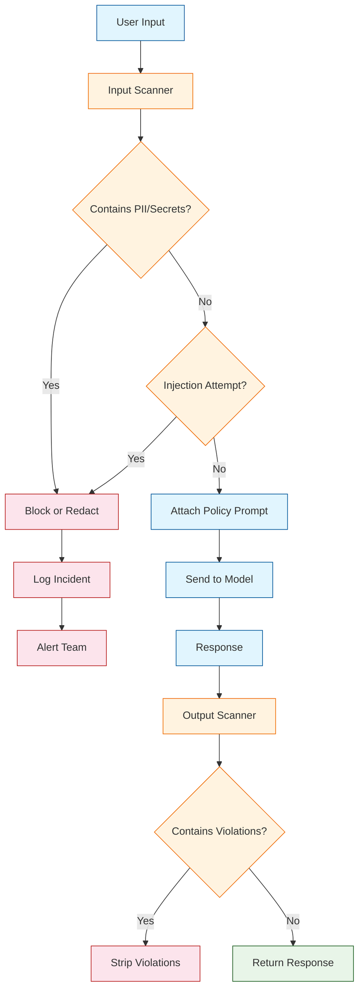

# Chapter 8: Production Hardening, Cost, and Reliability

Welcome to **Chapter 8: Production Hardening, Cost, and Reliability**. In this part of **Claude Task Master Tutorial: AI-Powered Task Management for Developers**, you will build an intuitive mental model first, then move into concrete implementation details and practical production tradeoffs.


> Ship Claude-powered workflows safely with monitoring, budgets, and fail-safes.

Taking Task Master from development into production requires careful attention to reliability, cost management, and operational safety. This chapter covers runtime profiles for different use cases, cost controls that prevent budget overruns, reliability patterns that handle failures gracefully, and deployment strategies that keep your workflows predictable and observable.

## Production Architecture Overview



## Runtime Profiles

Different use cases demand different model configurations. Task Master supports runtime profiles that adjust model selection, temperature, token limits, and output format based on request type.

### Profile Definitions

```json
{
  "runtimeProfiles": {
    "interactive": {
      "description": "Developer-facing chat and task exploration",
      "model": "claude-3-5-sonnet-20241022",
      "temperature": 0.5,
      "maxTokens": 1500,
      "streaming": true,
      "outputFormat": "markdown",
      "timeout_ms": 30000,
      "retries": 1
    },
    "automation": {
      "description": "CI/CD pipelines, Git hooks, PR bots",
      "model": "claude-3-haiku-20240307",
      "temperature": 0.1,
      "maxTokens": 600,
      "streaming": false,
      "outputFormat": "json",
      "enforceSchema": true,
      "timeout_ms": 20000,
      "retries": 2
    },
    "analysis": {
      "description": "Deep task analysis, complexity assessment, planning",
      "model": "claude-3-5-sonnet-20241022",
      "temperature": 0.3,
      "maxTokens": 2000,
      "streaming": false,
      "outputFormat": "json",
      "citationsRequired": true,
      "timeout_ms": 45000,
      "retries": 1
    }
  }
}
```

### Configuring Profiles

```bash
# Set the default profile
task-master config --default-profile interactive

# Override profile for specific commands
task-master analyze --task 5 --profile analysis
task-master analyze-pr --diff "$DIFF" --profile automation

# View active profile settings
task-master show-profile --name automation

# List all available profiles
task-master list-profiles
```

### Profile Selection Matrix

| Use Case | Profile | Model | Temperature | Output | Timeout |
|----------|---------|-------|-------------|--------|---------|
| Developer chat | `interactive` | Sonnet | 0.5 | Markdown | 30s |
| PR review bot | `automation` | Haiku | 0.1 | JSON | 20s |
| Task breakdown | `analysis` | Sonnet | 0.3 | JSON | 45s |
| Release notes | `automation` | Haiku | 0.2 | JSON | 20s |
| Sprint planning | `analysis` | Sonnet | 0.4 | JSON | 45s |
| Quick task update | `automation` | Haiku | 0.1 | JSON | 15s |

## Cost Controls

AI API costs can escalate quickly without proper controls. Task Master provides per-route caps, budget alerts, model tiering, and caching strategies to keep costs predictable.

### Budget Configuration

```json
{
  "costControls": {
    "globalBudget": {
      "daily_usd": 50.00,
      "weekly_usd": 250.00,
      "monthly_usd": 800.00,
      "action_on_exceed": "switch_to_fallback"
    },
    "perProfileBudget": {
      "interactive": { "daily_usd": 20.00, "max_requests_per_hour": 100 },
      "automation": { "daily_usd": 10.00, "max_requests_per_hour": 500 },
      "analysis": { "daily_usd": 15.00, "max_requests_per_hour": 50 }
    },
    "alerts": {
      "warn_at_percentage": 80,
      "critical_at_percentage": 95,
      "channels": ["slack", "email"]
    }
  }
}
```

### Cost Management Commands

```bash
# View current cost status
task-master cost-status

# Output:
# Cost Status (Today):
# Global:      $12.34 / $50.00 (24.7%)
# Interactive:  $5.20 / $20.00 (26.0%)
# Automation:   $3.80 / $10.00 (38.0%)
# Analysis:     $2.14 / $15.00 (14.3%)
#
# This Week:   $87.50 / $250.00 (35.0%)
# This Month: $342.00 / $800.00 (42.8%)

# View cost breakdown by team member
task-master cost-report --by-user --period "last-7-days"

# Set budget alerts
task-master config --budget-warn 80 --budget-critical 95
```

### Cost Optimization Strategies



| Strategy | Implementation | Savings |
|----------|---------------|---------|
| Response caching | Cache by input hash, 24h TTL | 40-70% reduction |
| Model tiering | Haiku for simple, Sonnet for complex | 50-80% per call |
| Token limits | Set max_tokens per profile | Prevents runaway costs |
| Prompt compression | Summarize long contexts before sending | 20-40% token reduction |
| Batch processing | Combine multiple small requests | 10-20% overhead reduction |

## Reliability Patterns

Production systems must handle failures gracefully. Task Master implements industry-standard reliability patterns for continuous availability.

### Retry with Exponential Backoff

```json
{
  "reliability": {
    "retry": {
      "maxAttempts": 3,
      "initialDelay_ms": 1000,
      "maxDelay_ms": 30000,
      "backoffMultiplier": 2,
      "retryableErrors": ["rate_limit_exceeded", "server_error", "timeout"],
      "nonRetryableErrors": ["invalid_api_key", "content_policy_violation"]
    }
  }
}
```

### Fallback Model Chain



### Fallback and Circuit Breaker Configuration

```json
{
  "fallback": {
    "chains": {
      "interactive": [
        { "model": "claude-3-5-sonnet-20241022", "timeout_ms": 30000 },
        { "model": "claude-3-haiku-20240307", "timeout_ms": 15000 },
        { "model": "gpt-4o-mini", "timeout_ms": 20000 }
      ],
      "automation": [
        { "model": "claude-3-haiku-20240307", "timeout_ms": 20000 },
        { "model": "gpt-4o-mini", "timeout_ms": 15000 },
        { "model": "static", "template": ".taskmaster/templates/fallback-review.json" }
      ]
    },
    "circuitBreaker": {
      "failureThreshold": 5,
      "resetTimeout_ms": 60000,
      "halfOpenRequests": 2
    }
  }
}
```

### Circuit Breaker Management

```bash
# View circuit breaker status
task-master circuit-status

# Output:
# Circuit Breaker Status:
# claude-3-5-sonnet-20241022:  CLOSED (healthy, 0 failures)
# claude-3-haiku-20240307:     CLOSED (healthy, 0 failures)
# gpt-4o:                      HALF-OPEN (testing, 3/5 threshold)

# Manually reset a circuit breaker
task-master circuit-reset --model "gpt-4o"
```

### Reliability Pattern Reference

| Pattern | When to Use | Configuration |
|---------|------------|---------------|
| Retry with backoff | Transient errors (rate limits, timeouts) | 1-3 retries, exponential delay |
| Model fallback | Primary model unavailable | Chain of decreasing capability |
| Circuit breaker | Repeated failures to same endpoint | 5 failures, 60s reset window |
| Timeout enforcement | Prevent indefinite waits | 15-60s depending on profile |
| Static fallback | All models unavailable | Pre-built template responses |
| Graceful degradation | Budget exceeded | Switch to cheaper model |

## Safety & Policy Enforcement

Production deployments require centralized safety policies that apply consistently across all request paths.

### Policy Enforcement Pipeline



### Input Scanning Rules

```json
{
  "inputScanning": {
    "enabled": true,
    "rules": [
      {
        "name": "credential_detection",
        "pattern": "(api[_-]?key|secret|password|token)\\s*[=:]\\s*\\S+",
        "action": "redact_and_warn",
        "severity": "high"
      },
      {
        "name": "pii_detection",
        "pattern": "(ssn|social.security|\\b\\d{3}-\\d{2}-\\d{4}\\b)",
        "action": "block",
        "severity": "critical"
      },
      {
        "name": "injection_detection",
        "pattern": "(ignore previous|disregard instructions|new system prompt)",
        "action": "block_and_log",
        "severity": "critical"
      }
    ]
  }
}
```

### Policy Testing

```bash
# Test policy enforcement
task-master test-policy --input "Show me the API key for the production database"

# Output:
# Policy Test Result:
# Input:    "Show me the API key for the production database"
# Action:   REFUSED
# Rule:     "No secrets, credentials, API keys"
# Response: "I can't help with that. Accessing production credentials
#            is outside the scope of task management."
# Logged:   Yes (audit ID: pol-2024-0115-0042)
```

## Monitoring & SLOs

Production deployments need service-level objectives and comprehensive monitoring to detect issues before they impact users.

### SLO Definitions

```json
{
  "slos": {
    "availability": { "target": 99.9, "window": "30d" },
    "latency": {
      "p50_target_ms": 2000,
      "p95_target_ms": 8000,
      "p99_target_ms": 15000,
      "window": "7d"
    },
    "accuracy": {
      "schema_compliance_target": 99.0,
      "citation_compliance_target": 95.0,
      "window": "7d"
    },
    "cost": { "daily_budget_usd": 50.00, "per_request_ceiling_usd": 0.50 }
  }
}
```

### Production Dashboard

```bash
# View production dashboard
task-master dashboard --production

# Output:
# Task Master Production Dashboard
# =============================================
# Availability (30d):  99.94% [TARGET: 99.9%]  OK
# Error Budget:        43.2 minutes remaining
#
# Latency (7d):
#   p50:  1.4s  [TARGET: 2.0s]  OK
#   p95:  5.2s  [TARGET: 8.0s]  OK
#   p99: 11.8s  [TARGET: 15.0s] OK
#
# Accuracy (7d):
#   Schema compliance:    99.4% [TARGET: 99.0%]  OK
#   Citation compliance:  96.2% [TARGET: 95.0%]  OK
#
# Cost (Today):
#   Spent:    $18.42 / $50.00 (36.8%)
#   Per-call: $0.008 avg  [CEILING: $0.50]  OK
#
# Model Health:
#   claude-3-5-sonnet:  HEALTHY (circuit: CLOSED)
#   claude-3-haiku:     HEALTHY (circuit: CLOSED)
#   gpt-4o:             DEGRADED (circuit: HALF-OPEN)
```

### Alert Configuration

```yaml
# .taskmaster/alerts.yml
alerts:
  - name: high_error_rate
    condition: "error_rate > 5%"
    window: 15m
    severity: critical
    channels: [pagerduty, slack]

  - name: budget_critical
    condition: "daily_cost > daily_budget * 0.95"
    severity: critical
    channels: [pagerduty, slack, email]
    action: switch_to_fallback_models

  - name: circuit_breaker_opened
    condition: "circuit_state == 'OPEN'"
    severity: critical
    channels: [pagerduty, slack]

  - name: schema_violations
    condition: "schema_compliance < 95%"
    window: 1h
    severity: warning
    channels: [slack]
```

## Deployment Strategies

### Versioned Prompts and Schemas

```bash
# Version your prompts alongside your code
.taskmaster/
  prompts/
    v1/system.txt
    v2/system.txt
  schemas/
    v1/pr-review.json
    v2/pr-review.json

# Pin prompt version in configuration
task-master config --prompt-version v2
task-master config --schema-version v2

# Rollback to previous version
task-master rollback-prompts --to v1
```

### Canary Deployments

```bash
# Deploy a canary with new prompt version
task-master deploy-canary --percentage 10 --prompt-version v2

# Monitor canary vs stable
task-master canary-status

# Output:
# Canary Deployment Status:
# Duration:   8h 42m (min: 24h)
# Traffic:    10% canary / 90% stable
#
# Canary (v2):
#   Requests:   142
#   Error rate: 1.4%  [MAX: 2.0%]  OK
#   Schema:     99.3% [MIN: 99.0%] OK
#
# Stable (v1):
#   Requests:   1,278
#   Error rate: 0.8%
#   Schema:     99.6%
#
# Decision: CONTINUE (criteria not yet met: minDuration)

# Promote canary to stable
task-master promote-canary

# Rollback canary
task-master rollback-canary
```

## Operational Playbooks

When things go wrong in production, documented playbooks ensure fast, consistent incident response.

| Symptom | Diagnosis | Remediation |
|---------|-----------|-------------|
| Hallucinations increasing | Context too large or sources missing | Lower temperature, enforce citations, shrink context |
| Cost spike | Traffic surge or prompt bloat | Throttle max_tokens, switch to cheaper model, expand cache |
| Latency spike | Model overloaded or prompts too long | Shorten prompts, reduce context, check model status page |
| Frequent refusals | Safety policy too strict or unclear | Review policy wording, add allowed/blocked examples |
| Schema violations | Prompt drift or model update | Re-validate prompts against schema, pin model version |
| Circuit breaker open | Upstream model outage | Confirm on status page, verify fallback chain active |
| Budget exhausted | Unexpected traffic | Switch to fallback models, review per-user limits |

### Incident Diagnostics

```bash
# Quick diagnostics during an incident
task-master diagnose

# Output:
# Task Master Diagnostic Report:
# Model Status:
#   claude-3-5-sonnet: HEALTHY
#   claude-3-haiku:    HEALTHY
#   gpt-4o:            UNAVAILABLE (circuit: OPEN since 14:22)
#
# Recent Errors (last 30m):
#   rate_limit_exceeded: 8
#   timeout: 3
#   schema_violation: 2
#
# Budget Status:  $38.20 / $50.00 (76.4%) WARNING
# Cache Hit Rate: 45.2% (below 50% threshold) WARNING
#
# Recommendations:
#   1. gpt-4o circuit is OPEN - fallback to gpt-4o-mini active
#   2. Budget approaching limit - consider switching automation to Haiku
#   3. Cache hit rate low - review cache TTL and key strategy
```

## Pre-Launch Checklist

```bash
# Run the production readiness check
task-master production-check

# Output:
# Production Readiness Checklist:
# [PASS] JSON output schemas defined and validated
# [PASS] Budget alerts configured (warn: 80%, critical: 95%)
# [PASS] Fallback model chain defined (3 levels)
# [PASS] Circuit breaker configured (threshold: 5, reset: 60s)
# [PASS] Safety policy deployed to all profiles
# [PASS] Input scanning enabled (3 rules active)
# [PASS] Audit logging enabled (secrets scrubbed)
# [PASS] Metrics shipping to monitoring backend
# [PASS] SLOs defined (availability, latency, accuracy, cost)
# [PASS] Prompts and schemas versioned in source control
# [WARN] Load test not run in last 7 days
# Score: 95/100 - Ready (1 warning)
```

| Category | Check | Status |
|----------|-------|--------|
| Output | JSON schemas defined and validated in CI | Required |
| Budget | Daily/weekly/monthly limits configured | Required |
| Budget | Alert thresholds at 80% and 95% | Required |
| Reliability | Fallback model chain with 2+ levels | Required |
| Reliability | Circuit breaker configured | Required |
| Safety | Safety policy deployed to all profiles | Required |
| Observability | Metrics shipping to monitoring backend | Required |
| Observability | SLOs defined with alert thresholds | Required |
| Deployment | Prompts versioned in source control | Required |
| Deployment | Load test run with production-like traffic | Recommended |
| Deployment | Canary deployment strategy configured | Recommended |

## Summary

Production hardening transforms Task Master from a development convenience into a reliable, cost-controlled, observable infrastructure component. By implementing runtime profiles, budget controls, reliability patterns, safety enforcement, and comprehensive monitoring, you deploy AI-powered task management with the same confidence and rigor as any other production service.

## Key Takeaways

1. **Runtime profiles separate concerns** -- Use distinct configurations for interactive, automation, and analysis workloads to optimize cost and performance.
2. **Budget controls prevent surprises** -- Set per-profile daily limits, configure alerts at 80% and 95%, and auto-switch to cheaper models when budgets are tight.
3. **Reliability requires multiple layers** -- Combine retries with exponential backoff, model fallback chains, circuit breakers, and timeout enforcement.
4. **Safety is a pipeline, not a prompt** -- Scan inputs for credentials, PII, and injection attempts; attach policies to every request; scan outputs before returning.
5. **SLOs make quality measurable** -- Define targets for availability, latency, schema compliance, and cost, then monitor and alert against them.
6. **Versioned prompts enable safe rollouts** -- Treat prompts and schemas like code: version them, canary-deploy changes, and rollback when metrics degrade.
7. **Operational playbooks speed up incident response** -- Document remediation steps for common failure modes so your team responds quickly and consistently.

## Next Steps

Congratulations -- you have completed the Claude Task Master tutorial! You now have the knowledge to set up, configure, automate, and deploy AI-powered task management at any scale. Here are some ways to continue:

- **Contribute to Task Master**: Visit the [Claude Task Master repository](https://github.com/eyaltoledano/claude-task-master) to report issues, suggest features, or contribute code.
- **Build custom integrations**: Use the Task Master API to build custom editor extensions, dashboard integrations, or workflow automations.
- **Revisit earlier chapters**: As your projects grow, revisit [Chapter 6: Context & Grounding](06-context-control.md) and [Chapter 7: Automation & CI/CD](07-automation.md) to refine your approach.

---

**Practice what you've learned:**
1. Define runtime profiles for your project's interactive, automation, and analysis workloads
2. Configure budget controls with daily limits and alert thresholds
3. Set up a fallback model chain and circuit breaker for your primary model
4. Run the production readiness checklist and address any warnings before deploying

*Built with insights from the [Claude Task Master](https://github.com/eyaltoledano/claude-task-master) project.*

## What Problem Does This Solve?

Most teams struggle here because the hard part is not writing more code, but deciding clear boundaries for `task`, `master`, `classDef` so behavior stays predictable as complexity grows.

In practical terms, this chapter helps you avoid three common failures:

- coupling core logic too tightly to one implementation path
- missing the handoff boundaries between setup, execution, and validation
- shipping changes without clear rollback or observability strategy

After working through this chapter, you should be able to reason about `Chapter 8: Production Hardening, Cost, and Reliability` as an operating subsystem inside **Claude Task Master Tutorial: AI-Powered Task Management for Developers**, with explicit contracts for inputs, state transitions, and outputs.

Use the implementation notes around `fill`, `stroke`, `model` as your checklist when adapting these patterns to your own repository.

## How it Works Under the Hood

Under the hood, `Chapter 8: Production Hardening, Cost, and Reliability` usually follows a repeatable control path:

1. **Context bootstrap**: initialize runtime config and prerequisites for `task`.
2. **Input normalization**: shape incoming data so `master` receives stable contracts.
3. **Core execution**: run the main logic branch and propagate intermediate state through `classDef`.
4. **Policy and safety checks**: enforce limits, auth scopes, and failure boundaries.
5. **Output composition**: return canonical result payloads for downstream consumers.
6. **Operational telemetry**: emit logs/metrics needed for debugging and performance tuning.

When debugging, walk this sequence in order and confirm each stage has explicit success/failure conditions.

## Source Walkthrough

Use the following upstream sources to verify implementation details while reading this chapter:

- [View Repo](https://github.com/eyaltoledano/claude-task-master)
  Why it matters: authoritative reference on `View Repo` (github.com).

Suggested trace strategy:
- search upstream code for `task` and `master` to map concrete implementation paths
- compare docs claims against actual runtime/config code before reusing patterns in production

## Chapter Connections

- [Tutorial Index](index.md)
- [Previous Chapter: Chapter 7: Automation, CI/CD, and Guardrails](07-automation.md)
- [Main Catalog](../../README.md#-tutorial-catalog)
- [A-Z Tutorial Directory](../../discoverability/tutorial-directory.md)
