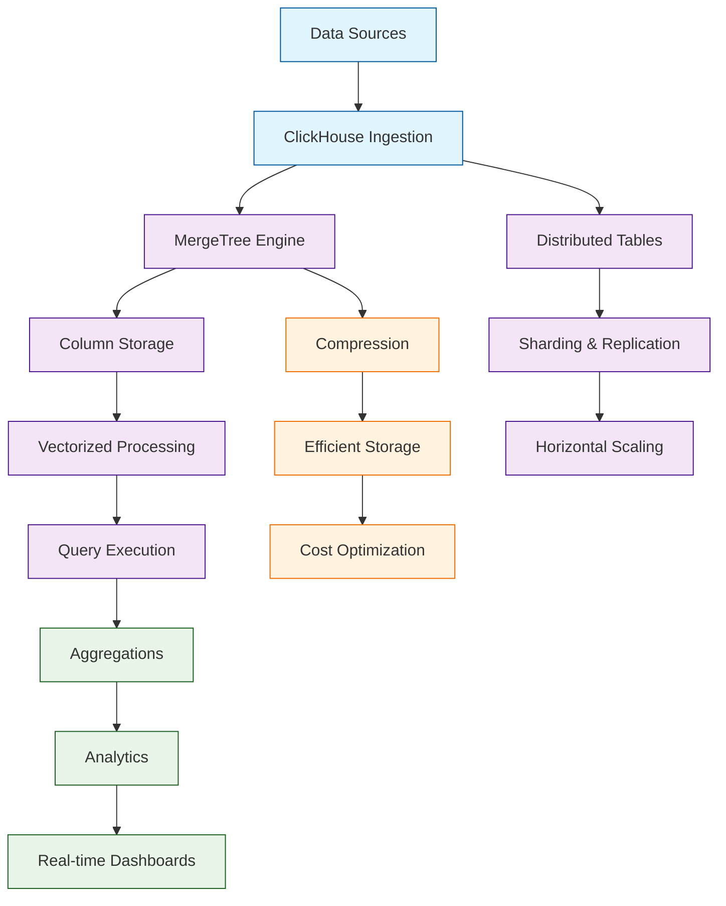

# ClickHouse Tutorial: High-Performance Analytical Database

> A deep technical walkthrough of ClickHouse covering High-Performance Analytical Database.

ClickHouse[View Repo](https://github.com/ClickHouse/ClickHouse) is an open-source column-oriented database management system designed for online analytical processing (OLAP) workloads. It excels at processing massive amounts of data with lightning-fast query performance, making it ideal for real-time analytics, log analysis, and time-series data.

ClickHouse provides unparalleled performance for analytical queries while maintaining simplicity in deployment and management, making it a go-to solution for modern data analytics platforms.

## Mental Model

## Why This Track Matters

ClickHouse is increasingly relevant for developers working with modern AI/ML infrastructure. A deep technical walkthrough of ClickHouse covering High-Performance Analytical Database, and this track helps you understand the architecture, key patterns, and production considerations.

This track focuses on:

- understanding getting started with clickhouse
- understanding data modeling & schemas
- understanding data ingestion & etl
- understanding query optimization

## Chapter Guide

Welcome to your journey through high-performance analytical databases! This tutorial explores how to master ClickHouse for building fast, scalable analytics systems.

1. **[Chapter 1: Getting Started with ClickHouse](01-getting-started.md)** - Installation, basic setup, and first queries
2. **[Chapter 2: Data Modeling & Schemas](02-data-modeling.md)** - Table engines, data types, and schema design
3. **[Chapter 3: Data Ingestion & ETL](03-data-ingestion.md)** - Loading data from various sources
4. **[Chapter 4: Query Optimization](04-query-optimization.md)** - Writing efficient analytical queries
5. **[Chapter 5: Aggregation & Analytics](05-aggregation-analytics.md)** - Advanced analytical functions and patterns
6. **[Chapter 6: Distributed ClickHouse](06-distributed-setup.md)** - Clustering, sharding, and high availability
7. **[Chapter 7: Performance Tuning](07-performance-tuning.md)** - Optimization techniques and monitoring
8. **[Chapter 8: Production Deployment](08-production-deployment.md)** - Scaling, backup, and enterprise features

## Current Snapshot (auto-updated)

- repository: [`ClickHouse/ClickHouse`](https://github.com/ClickHouse/ClickHouse)
- stars: about **47k**
- latest release: [`v25.8.22.28-lts`](https://github.com/ClickHouse/ClickHouse/releases/tag/v25.8.22.28-lts) (published 2026-04-17)

## What You Will Learn

By the end of this tutorial, you'll be able to:

- **Set up and configure ClickHouse** for high-performance analytics
- **Design efficient data schemas** using ClickHouse's table engines
- **Ingest data at scale** from various sources and formats
- **Write optimized analytical queries** leveraging ClickHouse's strengths
- **Implement advanced analytics** with window functions and aggregations
- **Deploy distributed clusters** for horizontal scaling
- **Monitor and tune performance** for production workloads
- **Build real-time analytical applications** with streaming data

## What's New in ClickHouse v24/v25 (2024-2025)

> **Analytical Powerhouse Evolution**: JSON support, vector search, enhanced time-series, and advanced storage mark ClickHouse's latest breakthroughs.

**📋 Semi-Structured Data Revolution:**
- 🗂️ **JSON Data Type**: Beta support for flexible schema management (GA expected 2025)
- 🔄 **Dynamic Data Types**: Efficient handling of JSON and semi-structured data
- 📊 **Schema Flexibility**: Mix structured and unstructured data seamlessly

**⏰ Enhanced Time-Series Analytics:**
- 🕒 **Time/Time64 Data Types**: Precise time-only value storage and comparison
- 📈 **Delta & Rate Functions**: Built-in functions for time-series analysis
- 📊 **Advanced Metrics**: Simplified time-series computations and aggregations

**🗺️ Geospatial Excellence:**
- 🌍 **Standardized geoToH3()**: Updated to (latitude, longitude, resolution) order
- ⚙️ **Legacy Compatibility**: `geotoh3_argument_order = 'lon_lat'` for existing code
- 🎯 **Enhanced Geospatial**: Better compatibility with analytics workflows

**💾 Advanced Storage & Backup:**
- 🔄 **Copy-on-Write Policies**: Combine read-only and read-write disks in storage policies
- 💰 **Cost Optimization**: Prioritize writable disks for inserts, read across all volumes
- 🚀 **Instant Recovery**: `DatabaseBackup` engine for immediate table/database attachment
- ⏱️ **Minimal Downtime**: Fast restoration for large datasets

**🎛️ Enhanced User Experience:**
- 🌐 **Interactive Web UI**: Browse databases and tables without manual queries
- 🔍 **Parquet Bloom Filters**: Default support for improved large dataset performance
- 🔗 **Better Navigation**: Visual database exploration and management

**🔍 Vector & Hybrid Search:**
- 🎯 **Vector Similarity Search**: Experimental beta for pre/post-filtering strategies
- 🔄 **Hybrid Workloads**: Support for recommendation systems and advanced search
- 🚀 **Performance Optimized**: Efficient vector operations for analytical queries

**⚡ Query Performance:**
- 📊 **Filter Pushdown**: Optimized JOIN ON clauses reduce data scans
- 🧠 **Memory Efficiency**: Reduced usage in window functions
- 🔄 **Parallel Partitioning**: Faster replication with parallel fetching
- 🕒 **Query Insights**: `initialQueryStartTime` for consistent distributed timing

## Learning Path

### 🟢 Beginner Track
Perfect for developers new to analytical databases:
1. Chapters 1-2: Installation and basic data modeling
2. Focus on understanding ClickHouse fundamentals

### 🟡 Intermediate Track
For developers building analytical applications:
1. Chapters 3-5: Data ingestion, query optimization, and analytics
2. Learn to build efficient analytical pipelines

### 🔴 Advanced Track
For production analytical system development:
1. Chapters 6-8: Distributed deployment, performance tuning, and scaling
2. Master enterprise-grade analytical databases

---

**Ready to unlock the power of high-performance analytics with ClickHouse? Let's begin with [Chapter 1: Getting Started](01-getting-started.md)!**

## Related Tutorials

- [Athens Research](../athens-research-tutorial/)
- [Logseq](../logseq-tutorial/)
- [MeiliSearch Tutorial](../meilisearch-tutorial/)
- [NocoDB](../nocodb-tutorial/)
- [PostgreSQL Query Planner Deep Dive](../postgresql-tutorial/)
## Navigation & Backlinks

- [Start Here: Chapter 1: Getting Started with ClickHouse](01-getting-started.md)
- [Back to Main Catalog](../../README.md#-tutorial-catalog)
- [Browse A-Z Tutorial Directory](../../discoverability/tutorial-directory.md)
- [Search by Intent](../../discoverability/query-hub.md)
- [Explore Category Hubs](../../README.md#category-hubs)

*Generated by [AI Codebase Knowledge Builder](https://github.com/The-Pocket/Tutorial-Codebase-Knowledge)*

## Full Chapter Map

1. [Chapter 1: Getting Started with ClickHouse](01-getting-started.md)
2. [Chapter 2: Data Modeling & Schemas](02-data-modeling.md)
3. [Chapter 3: Data Ingestion & ETL](03-data-ingestion.md)
4. [Chapter 4: Query Optimization](04-query-optimization.md)
5. [Chapter 5: Aggregation & Analytics](05-aggregation-analytics.md)
6. [Chapter 6: Distributed ClickHouse](06-distributed-setup.md)
7. [Chapter 7: Performance Tuning](07-performance-tuning.md)
8. [Chapter 8: Production Deployment](08-production-deployment.md)

## Source References

- [View Repo](https://github.com/ClickHouse/ClickHouse)

