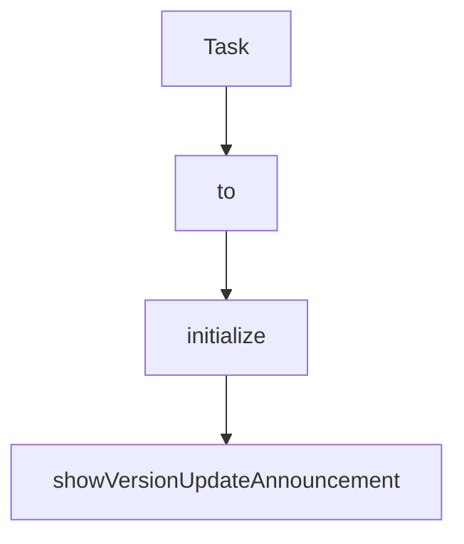

# Chapter 1: Getting Started

Welcome to **Chapter 1: Getting Started**. In this part of **Cline Tutorial: Agentic Coding with Human Control**, you will build an intuitive mental model first, then move into concrete implementation details and practical production tradeoffs.


This chapter gets Cline installed and configured for safe day-to-day engineering use.

## Objectives

By the end, you will have:

1. Cline installed in VS Code-compatible environment
2. a working provider/model configuration
3. a first task that exercises read, edit, command, and summary phases
4. a baseline safety policy for approvals

## Prerequisites

| Requirement | Why It Matters |
|:------------|:---------------|
| VS Code (or compatible editor) | Cline runs as an editor extension |
| API key for at least one provider | model-backed planning and tool use |
| sandbox repository | low-risk environment for calibration |
| test/lint command in repo | deterministic validation signal |

## Install Flow

### Option A: VS Code Marketplace

1. Open Extensions panel.
2. Search for Cline.
3. Install and reload editor.

### Option B: Prebuilt extension package (team-managed)

Use this for internal distribution or controlled rollouts.

## Provider Setup

Cline supports multiple providers and local options. Start with one reliable model/provider pair before configuring advanced routing.

Recommended first-run approach:

- choose one strong default model
- keep approvals enabled for file edits and terminal commands
- disable risky automations until baseline is stable

## First Task (Deterministic)

Use a bounded prompt contract:

```text
Analyze src/auth/session.ts,
refactor one function for readability without changing behavior,
run npm test -- auth-session,
and summarize changed files and test results.
```

Success criteria:

- Cline proposes edits as reviewable diffs
- only expected files are modified
- command output is captured
- final summary maps changes to validation evidence

## Baseline Safety Settings

Before broader usage, set defaults:

- explicit approval required for commands with side effects
- explicit approval for file writes
- disable YOLO-style behavior by default
- require task summary before completion

## First-Run Health Checklist

| Area | Check | Pass Signal |
|:-----|:------|:------------|
| Install | extension activates correctly | Cline panel opens without errors |
| Provider | API call succeeds | first prompt returns actionable response |
| Diff flow | write proposals are reviewable | file patch appears before apply |
| Command flow | terminal execution works | output attached to task timeline |
| Context flow | file understanding is accurate | summary references real code facts |

## Common Setup Failures

### Provider authentication failures

- verify API key placement and provider selection
- test with one provider first
- avoid mixing multiple misconfigured profiles at startup

### Command execution confusion

- ensure repository has canonical commands (`npm test`, `pnpm test`, etc.)
- explicitly state the command in prompts
- avoid ambiguous "run tests" instructions on first day

### Noisy outputs

- tighten task scope to one file/module
- include non-goals in prompt
- require strict summary format

## Team Onboarding Template

When onboarding multiple engineers, standardize:

1. default provider/model
2. required approval policy
3. prompt template
4. required validation commands per repo
5. escalation path for unsafe proposals

This prevents inconsistent behavior across developers.

## Chapter Summary

You now have a working Cline baseline with:

- installation complete
- provider configuration validated
- first deterministic task executed
- safety settings ready for deeper workflows

Next: [Chapter 2: Agent Workflow](02-agent-workflow.md)

## Source Code Walkthrough

### `package.json`

The `Task` interface in [`package.json`](https://github.com/cline/cline/blob/HEAD/package.json) handles a key part of this chapter's functionality:

```json
			{
				"command": "cline.plusButtonClicked",
				"title": "New Task",
				"icon": "$(add)"
			},
			{
				"command": "cline.mcpButtonClicked",
				"title": "MCP Servers",
				"icon": "$(server)"
			},
			{
				"command": "cline.historyButtonClicked",
				"title": "History",
				"icon": "$(history)"
			},
			{
				"command": "cline.accountButtonClicked",
				"title": "Account",
				"icon": "$(account)"
			},
			{
				"command": "cline.settingsButtonClicked",
				"title": "Settings",
				"icon": "$(settings-gear)"
			},
			{
				"command": "cline.dev.createTestTasks",
				"title": "Create Test Tasks",
				"category": "Cline",
				"when": "cline.isDevMode"
			},
			{
```

This interface is important because it defines how Cline Tutorial: Agentic Coding with Human Control implements the patterns covered in this chapter.

### `src/common.ts`

The `to` class in [`src/common.ts`](https://github.com/cline/cline/blob/HEAD/src/common.ts) handles a key part of this chapter's functionality:

```ts
import { WebviewProvider } from "./core/webview"
import "./utils/path" // necessary to have access to String.prototype.toPosix

import { HostProvider } from "@/hosts/host-provider"
import { Logger } from "@/shared/services/Logger"
import type { StorageContext } from "@/shared/storage/storage-context"
import { FileContextTracker } from "./core/context/context-tracking/FileContextTracker"
import { clearOnboardingModelsCache } from "./core/controller/models/getClineOnboardingModels"
import { HookDiscoveryCache } from "./core/hooks/HookDiscoveryCache"
import { HookProcessRegistry } from "./core/hooks/HookProcessRegistry"
import { StateManager } from "./core/storage/StateManager"
import { AgentConfigLoader } from "./core/task/tools/subagent/AgentConfigLoader"
import { ExtensionRegistryInfo } from "./registry"
import { ErrorService } from "./services/error"
import { featureFlagsService } from "./services/feature-flags"
import { getDistinctId } from "./services/logging/distinctId"
import { telemetryService } from "./services/telemetry"
import { PostHogClientProvider } from "./services/telemetry/providers/posthog/PostHogClientProvider"
import { ClineTempManager } from "./services/temp"
import { cleanupTestMode } from "./services/test/TestMode"
import { ShowMessageType } from "./shared/proto/host/window"
import { syncWorker } from "./shared/services/worker/sync"
import { getBlobStoreSettingsFromEnv } from "./shared/services/worker/worker"
import { getLatestAnnouncementId } from "./utils/announcements"
import { arePathsEqual } from "./utils/path"

/**
 * Performs intialization for Cline that is common to all platforms.
 *
 * @param context
 * @returns The webview provider
```

This class is important because it defines how Cline Tutorial: Agentic Coding with Human Control implements the patterns covered in this chapter.

### `src/common.ts`

The `initialize` function in [`src/common.ts`](https://github.com/cline/cline/blob/HEAD/src/common.ts) handles a key part of this chapter's functionality:

```ts
 * @throws ClineConfigurationError if endpoints.json exists but is invalid
 */
export async function initialize(storageContext: StorageContext): Promise<WebviewProvider> {
	// Configure the shared Logging class to use HostProvider's output channels and debug logger
	Logger.subscribe((msg: string) => HostProvider.get().logToChannel(msg)) // File system logging
	Logger.subscribe((msg: string) => HostProvider.env.debugLog({ value: msg })) // Host debug logging

	// Initialize ClineEndpoint configuration (reads bundled and ~/.cline/endpoints.json if present)
	// This must be done before any other code that calls ClineEnv.config()
	// Throws ClineConfigurationError if config file exists but is invalid
	const { ClineEndpoint } = await import("./config")
	await ClineEndpoint.initialize(HostProvider.get().extensionFsPath)

	try {
		await StateManager.initialize(storageContext)
	} catch (error) {
		Logger.error("[Cline] CRITICAL: Failed to initialize StateManager:", error)
		HostProvider.window.showMessage({
			type: ShowMessageType.ERROR,
			message: "Failed to initialize storage. Please check logs for details or try restarting the client.",
		})
	}

	// =============== External services ===============
	await ErrorService.initialize()
	// Initialize PostHog client provider (skip in self-hosted mode)
	if (!ClineEndpoint.isSelfHosted()) {
		PostHogClientProvider.getInstance()
	}

	// =============== Webview services ===============
	const webview = HostProvider.get().createWebviewProvider()
```

This function is important because it defines how Cline Tutorial: Agentic Coding with Human Control implements the patterns covered in this chapter.

### `src/common.ts`

The `showVersionUpdateAnnouncement` function in [`src/common.ts`](https://github.com/cline/cline/blob/HEAD/src/common.ts) handles a key part of this chapter's functionality:

```ts
	const stateManager = StateManager.get()
	// Non-blocking announcement check and display
	showVersionUpdateAnnouncement(stateManager)
	// Check if this workspace was opened from worktree quick launch
	await checkWorktreeAutoOpen(stateManager)

	// =============== Background sync and cleanup tasks ===============
	// Use remote config blobStoreConfig if available, otherwise fall back to env vars
	const blobStoreSettings = stateManager.getRemoteConfigSettings()?.blobStoreConfig ?? getBlobStoreSettingsFromEnv()
	syncWorker().init({ ...blobStoreSettings, userDistinctId: getDistinctId() })
	// Clean up old temp files in background (non-blocking) and start periodic cleanup every 24 hours
	ClineTempManager.startPeriodicCleanup()
	// Clean up orphaned file context warnings (startup cleanup)
	FileContextTracker.cleanupOrphanedWarnings(stateManager)

	telemetryService.captureExtensionActivated()

	return webview
}

async function showVersionUpdateAnnouncement(stateManager: StateManager) {
	// Version checking for autoupdate notification
	const currentVersion = ExtensionRegistryInfo.version
	const previousVersion = stateManager.getGlobalStateKey("clineVersion")
	// Perform post-update actions if necessary
	try {
		if (!previousVersion || currentVersion !== previousVersion) {
			Logger.log(`Cline version changed: ${previousVersion} -> ${currentVersion}. First run or update detected.`)

			// Check if there's a new announcement to show
			const lastShownAnnouncementId = stateManager.getGlobalStateKey("lastShownAnnouncementId")
			const latestAnnouncementId = getLatestAnnouncementId()
```

This function is important because it defines how Cline Tutorial: Agentic Coding with Human Control implements the patterns covered in this chapter.


## How These Components Connect


