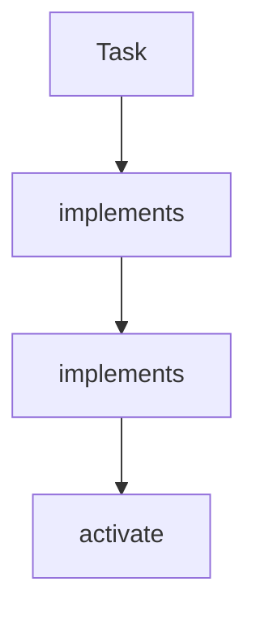

# Chapter 1: Getting Started

Welcome to **Chapter 1: Getting Started**. In this part of **Cline Tutorial: Agentic Coding with Human Control**, you will build an intuitive mental model first, then move into concrete implementation details and practical production tradeoffs.


This chapter gets Cline installed and configured for safe day-to-day engineering use.

## Objectives

By the end, you will have:

1. Cline installed in VS Code-compatible environment
2. a working provider/model configuration
3. a first task that exercises read, edit, command, and summary phases
4. a baseline safety policy for approvals

## Prerequisites

| Requirement | Why It Matters |
|:------------|:---------------|
| VS Code (or compatible editor) | Cline runs as an editor extension |
| API key for at least one provider | model-backed planning and tool use |
| sandbox repository | low-risk environment for calibration |
| test/lint command in repo | deterministic validation signal |

## Install Flow

### Option A: VS Code Marketplace

1. Open Extensions panel.
2. Search for Cline.
3. Install and reload editor.

### Option B: Prebuilt extension package (team-managed)

Use this for internal distribution or controlled rollouts.

## Provider Setup

Cline supports multiple providers and local options. Start with one reliable model/provider pair before configuring advanced routing.

Recommended first-run approach:

- choose one strong default model
- keep approvals enabled for file edits and terminal commands
- disable risky automations until baseline is stable

## First Task (Deterministic)

Use a bounded prompt contract:

```text
Analyze src/auth/session.ts,
refactor one function for readability without changing behavior,
run npm test -- auth-session,
and summarize changed files and test results.
```

Success criteria:

- Cline proposes edits as reviewable diffs
- only expected files are modified
- command output is captured
- final summary maps changes to validation evidence

## Baseline Safety Settings

Before broader usage, set defaults:

- explicit approval required for commands with side effects
- explicit approval for file writes
- disable YOLO-style behavior by default
- require task summary before completion

## First-Run Health Checklist

| Area | Check | Pass Signal |
|:-----|:------|:------------|
| Install | extension activates correctly | Cline panel opens without errors |
| Provider | API call succeeds | first prompt returns actionable response |
| Diff flow | write proposals are reviewable | file patch appears before apply |
| Command flow | terminal execution works | output attached to task timeline |
| Context flow | file understanding is accurate | summary references real code facts |

## Common Setup Failures

### Provider authentication failures

- verify API key placement and provider selection
- test with one provider first
- avoid mixing multiple misconfigured profiles at startup

### Command execution confusion

- ensure repository has canonical commands (`npm test`, `pnpm test`, etc.)
- explicitly state the command in prompts
- avoid ambiguous "run tests" instructions on first day

### Noisy outputs

- tighten task scope to one file/module
- include non-goals in prompt
- require strict summary format

## Team Onboarding Template

When onboarding multiple engineers, standardize:

1. default provider/model
2. required approval policy
3. prompt template
4. required validation commands per repo
5. escalation path for unsafe proposals

This prevents inconsistent behavior across developers.

## Chapter Summary

You now have a working Cline baseline with:

- installation complete
- provider configuration validated
- first deterministic task executed
- safety settings ready for deeper workflows

Next: [Chapter 2: Agent Workflow](02-agent-workflow.md)

## Depth Expansion Playbook

## Source Code Walkthrough

### `package.json`

The `Task` interface in [`package.json`](https://github.com/cline/cline/blob/HEAD/package.json) handles a key part of this chapter's functionality:

```json
			{
				"command": "cline.plusButtonClicked",
				"title": "New Task",
				"icon": "$(add)"
			},
			{
				"command": "cline.mcpButtonClicked",
				"title": "MCP Servers",
				"icon": "$(server)"
			},
			{
				"command": "cline.historyButtonClicked",
				"title": "History",
				"icon": "$(history)"
			},
			{
				"command": "cline.accountButtonClicked",
				"title": "Account",
				"icon": "$(account)"
			},
			{
				"command": "cline.settingsButtonClicked",
				"title": "Settings",
				"icon": "$(settings-gear)"
			},
			{
				"command": "cline.dev.createTestTasks",
				"title": "Create Test Tasks",
				"category": "Cline",
				"when": "cline.isDevMode"
			},
			{
```

This interface is important because it defines how Cline Tutorial: Agentic Coding with Human Control implements the patterns covered in this chapter.

### `src/extension.ts`

The `implements` class in [`src/extension.ts`](https://github.com/cline/cline/blob/HEAD/src/extension.ts) handles a key part of this chapter's functionality:

```ts
	https://code.visualstudio.com/api/extension-guides/virtual-documents
	*/
	const diffContentProvider = new (class implements vscode.TextDocumentContentProvider {
		provideTextDocumentContent(uri: vscode.Uri): string {
			return Buffer.from(uri.query, "base64").toString("utf-8")
		}
	})()
	context.subscriptions.push(vscode.workspace.registerTextDocumentContentProvider(DIFF_VIEW_URI_SCHEME, diffContentProvider))

	const handleUri = async (uri: vscode.Uri) => {
		const url = decodeURIComponent(uri.toString())
		const isTaskUri = getUriPath(url) === TASK_URI_PATH

		if (isTaskUri) {
			await openClineSidebarForTaskUri()
		}

		let success = await SharedUriHandler.handleUri(url)

		// Task deeplinks can race with first-time sidebar initialization.
		if (!success && isTaskUri) {
			await openClineSidebarForTaskUri()
			success = await SharedUriHandler.handleUri(url)
		}

		if (!success) {
			Logger.warn("Extension URI handler: Failed to process URI:", uri.toString())
		}
	}
	context.subscriptions.push(vscode.window.registerUriHandler({ handleUri }))

	// Register size testing commands in development mode
```

This class is important because it defines how Cline Tutorial: Agentic Coding with Human Control implements the patterns covered in this chapter.

### `src/extension.ts`

The `implements` class in [`src/extension.ts`](https://github.com/cline/cline/blob/HEAD/src/extension.ts) handles a key part of this chapter's functionality:

```ts
	https://code.visualstudio.com/api/extension-guides/virtual-documents
	*/
	const diffContentProvider = new (class implements vscode.TextDocumentContentProvider {
		provideTextDocumentContent(uri: vscode.Uri): string {
			return Buffer.from(uri.query, "base64").toString("utf-8")
		}
	})()
	context.subscriptions.push(vscode.workspace.registerTextDocumentContentProvider(DIFF_VIEW_URI_SCHEME, diffContentProvider))

	const handleUri = async (uri: vscode.Uri) => {
		const url = decodeURIComponent(uri.toString())
		const isTaskUri = getUriPath(url) === TASK_URI_PATH

		if (isTaskUri) {
			await openClineSidebarForTaskUri()
		}

		let success = await SharedUriHandler.handleUri(url)

		// Task deeplinks can race with first-time sidebar initialization.
		if (!success && isTaskUri) {
			await openClineSidebarForTaskUri()
			success = await SharedUriHandler.handleUri(url)
		}

		if (!success) {
			Logger.warn("Extension URI handler: Failed to process URI:", uri.toString())
		}
	}
	context.subscriptions.push(vscode.window.registerUriHandler({ handleUri }))

	// Register size testing commands in development mode
```

This class is important because it defines how Cline Tutorial: Agentic Coding with Human Control implements the patterns covered in this chapter.

### `src/extension.ts`

The `activate` function in [`src/extension.ts`](https://github.com/cline/cline/blob/HEAD/src/extension.ts) handles a key part of this chapter's functionality:

```ts
import { fileExistsAtPath } from "./utils/fs"

// This method is called when the VS Code extension is activated.
// NOTE: This is VS Code specific - services that should be registered
// for all-platform should be registered in common.ts.
export async function activate(context: vscode.ExtensionContext) {
	const activationStartTime = performance.now()

	// 1. Set up HostProvider for VSCode
	// IMPORTANT: This must be done before any service can be registered
	setupHostProvider(context)

	// 2. Clean up legacy data patterns within VSCode's native storage.
	// Moves workspace→global keys, task history→file, custom instructions→rules, etc.
	// Must run BEFORE the file export so we copy clean state.
	await cleanupLegacyVSCodeStorage(context)

	// 3. One-time export of VSCode's native storage to shared file-backed stores.
	// After this, all platforms (VSCode, CLI, JetBrains) read from ~/.cline/data/.
	const workspacePath = vscode.workspace.workspaceFolders?.[0]?.uri.fsPath
	const storageContext = createStorageContext({ workspacePath })
	await exportVSCodeStorageToSharedFiles(context, storageContext)

	// 4. Register services and perform common initialization
	// IMPORTANT: Must be done after host provider is setup and migrations are complete
	const webview = (await initialize(storageContext)) as VscodeWebviewProvider

	// 5. Register services and commands specific to VS Code
	// Initialize test mode and add disposables to context
	const testModeWatchers = await initializeTestMode(webview)
	context.subscriptions.push(...testModeWatchers)

```

This function is important because it defines how Cline Tutorial: Agentic Coding with Human Control implements the patterns covered in this chapter.


## How These Components Connect


