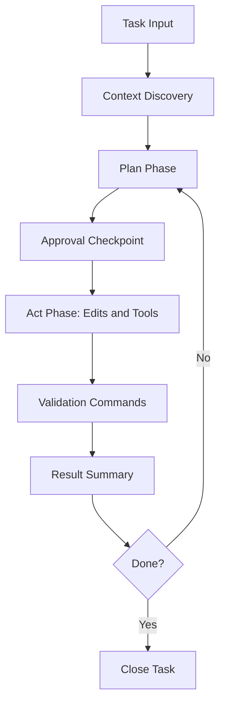

# Chapter 2: Agent Workflow

Welcome to **Chapter 2: Agent Workflow**. In this part of **Cline Tutorial: Agentic Coding with Human Control**, you will build an intuitive mental model first, then move into concrete implementation details and practical production tradeoffs.


This chapter defines a repeatable operating loop for Cline tasks, including planning, execution, and validation.

## Core Workflow



## Plan/Act Discipline

Many failures come from jumping directly into edits. Use two explicit phases:

- **Plan**: define scope, risks, and success criteria
- **Act**: execute only after plan approval

This keeps changes intentional and auditable.

## Prompt Contract for Task Reliability

Use this template for every meaningful task:

```text
Goal:
Allowed files/directories:
Forbidden changes:
Validation command(s):
Definition of done:
```

If any field is missing, quality drops quickly.

## Task Sizing Rules

| Task Size | Recommendation |
|:----------|:---------------|
| tiny fix (1 file) | single task loop |
| medium feature | split into 2-4 milestones |
| large migration | plan-only task, then staged execution tasks |

Avoid combining architecture redesign and bugfix work in one run.

## Approval Strategy by Action Type

| Action Type | Default Policy |
|:------------|:---------------|
| file reads/search | usually allow |
| file writes | diff review required |
| terminal commands | explicit approval for side effects |
| external tools/MCP | allowlist and intent review |
| multi-step automation | require plan checkpoint |

## Evidence-First Iteration

When results fail, feed exact evidence back into next prompt:

- failing command output
- expected vs actual behavior
- precise target function/file
- constraints to preserve existing behavior

Avoid vague feedback like "still broken".

## Example Milestone Workflow

```text
Task A (Plan):
Map affected modules and propose sequence.

Task B (Act):
Implement changes in module 1 only.
Run targeted tests.

Task C (Act):
Integrate module 2 and re-run integration checks.
```

This reduces correction cost.

## Workflow Anti-Patterns

- broad prompts with no file boundaries
- repeated retries without updating evidence
- accepting large edits without validation
- skipping summary review before merge

## Summary Format Standard

Require Cline to finish with:

1. changed files
2. behavior impact summary
3. commands run + results
4. remaining risks

This creates predictable handoff quality.

## Chapter Summary

You now have a reliable task orchestration model:

- plan before action
- clear approval checkpoints
- evidence-driven iteration
- standardized completion summaries

Next: [Chapter 3: File Editing and Diffs](03-file-editing-and-diffs.md)

## Depth Expansion Playbook

<!-- depth-expansion-v2 -->

This chapter is expanded to v1-style depth for production-grade learning and implementation quality.

### Strategic Context

- tutorial: **Cline Tutorial: Agentic Coding with Human Control**
- tutorial slug: **cline-tutorial**
- chapter focus: **Chapter 2: Agent Workflow**
- system context: **Cline Tutorial**
- objective: move from surface-level usage to repeatable engineering operation

### Architecture Decomposition

1. Define the runtime boundary for `Chapter 2: Agent Workflow`.
2. Separate control-plane decisions from data-plane execution.
3. Capture input contracts, transformation points, and output contracts.
4. Trace state transitions across request lifecycle stages.
5. Identify extension hooks and policy interception points.
6. Map ownership boundaries for team and automation workflows.
7. Specify rollback and recovery paths for unsafe changes.
8. Track observability signals for correctness, latency, and cost.

### Operator Decision Matrix

| Decision Area | Low-Risk Path | High-Control Path | Tradeoff |
|:--------------|:--------------|:------------------|:---------|
| Runtime mode | managed defaults | explicit policy config | speed vs control |
| State handling | local ephemeral | durable persisted state | simplicity vs auditability |
| Tool integration | direct API use | mediated adapter layer | velocity vs governance |
| Rollout method | manual change | staged + canary rollout | effort vs safety |
| Incident response | best effort logs | runbooks + SLO alerts | cost vs reliability |

### Failure Modes and Countermeasures

| Failure Mode | Early Signal | Root Cause Pattern | Countermeasure |
|:-------------|:-------------|:-------------------|:---------------|
| stale context | inconsistent outputs | missing refresh window | enforce context TTL and refresh hooks |
| policy drift | unexpected execution | ad hoc overrides | centralize policy profiles |
| auth mismatch | 401/403 bursts | credential sprawl | rotation schedule + scope minimization |
| schema breakage | parser/validation errors | unmanaged upstream changes | contract tests per release |
| retry storms | queue congestion | no backoff controls | jittered backoff + circuit breakers |
| silent regressions | quality drop without alerts | weak baseline metrics | eval harness with thresholds |

### Implementation Runbook

1. Establish a reproducible baseline environment.
2. Capture chapter-specific success criteria before changes.
3. Implement minimal viable path with explicit interfaces.
4. Add observability before expanding feature scope.
5. Run deterministic tests for happy-path behavior.
6. Inject failure scenarios for negative-path validation.
7. Compare output quality against baseline snapshots.
8. Promote through staged environments with rollback gates.
9. Record operational lessons in release notes.

### Quality Gate Checklist

- [ ] chapter-level assumptions are explicit and testable
- [ ] API/tool boundaries are documented with input/output examples
- [ ] failure handling includes retry, timeout, and fallback policy
- [ ] security controls include auth scopes and secret rotation plans
- [ ] observability includes logs, metrics, traces, and alert thresholds
- [ ] deployment guidance includes canary and rollback paths
- [ ] docs include links to upstream sources and related tracks
- [ ] post-release verification confirms expected behavior under load

### Source Alignment

- [Cline README](https://github.com/cline/cline/blob/main/README.md)
- [Cline Docs](https://docs.cline.bot/)
- [Cline docs config (repo)](https://github.com/cline/cline/blob/main/docs/docs.json)
- [Cline Releases](https://github.com/cline/cline/releases)

### Cross-Tutorial Connection Map

- [Roo Code Tutorial](../roo-code-tutorial/)
- [Continue Tutorial](../continue-tutorial/)
- [Aider Tutorial](../aider-tutorial/)
- [OpenHands Tutorial](../openhands-tutorial/)
- [MCP Servers Tutorial](../mcp-servers-tutorial/)
- [Chapter 1: Getting Started](01-getting-started.md)

### Advanced Practice Exercises

1. Build a minimal end-to-end implementation for `Chapter 2: Agent Workflow`.
2. Add instrumentation and measure baseline latency and error rate.
3. Introduce one controlled failure and confirm graceful recovery.
4. Add policy constraints and verify they are enforced consistently.
5. Run a staged rollout and document rollback decision criteria.

### Review Questions

1. Which execution boundary matters most for this chapter and why?
2. What signal detects regressions earliest in your environment?
3. What tradeoff did you make between delivery speed and governance?
4. How would you recover from the highest-impact failure mode?
5. What must be automated before scaling to team-wide adoption?

### Scenario Playbook 1: Chapter 2: Agent Workflow

- tutorial context: **Cline Tutorial: Agentic Coding with Human Control**
- trigger condition: incoming request volume spikes after release
- initial hypothesis: identify the smallest reproducible failure boundary
- immediate action: protect user-facing stability before optimization work
- engineering control: introduce adaptive concurrency limits and queue bounds
- verification target: latency p95 and p99 stay within defined SLO windows
- rollback trigger: pre-defined quality gate fails for two consecutive checks
- communication step: publish incident status with owner and ETA
- learning capture: add postmortem and convert findings into automated tests

### Scenario Playbook 2: Chapter 2: Agent Workflow

- tutorial context: **Cline Tutorial: Agentic Coding with Human Control**
- trigger condition: tool dependency latency increases under concurrency
- initial hypothesis: identify the smallest reproducible failure boundary
- immediate action: protect user-facing stability before optimization work
- engineering control: enable staged retries with jitter and circuit breaker fallback
- verification target: error budget burn rate remains below escalation threshold
- rollback trigger: pre-defined quality gate fails for two consecutive checks
- communication step: publish incident status with owner and ETA
- learning capture: add postmortem and convert findings into automated tests

### Scenario Playbook 3: Chapter 2: Agent Workflow

- tutorial context: **Cline Tutorial: Agentic Coding with Human Control**
- trigger condition: schema updates introduce incompatible payloads
- initial hypothesis: identify the smallest reproducible failure boundary
- immediate action: protect user-facing stability before optimization work
- engineering control: pin schema versions and add compatibility shims
- verification target: throughput remains stable under target concurrency
- rollback trigger: pre-defined quality gate fails for two consecutive checks
- communication step: publish incident status with owner and ETA
- learning capture: add postmortem and convert findings into automated tests

### Scenario Playbook 4: Chapter 2: Agent Workflow

- tutorial context: **Cline Tutorial: Agentic Coding with Human Control**
- trigger condition: environment parity drifts between staging and production
- initial hypothesis: identify the smallest reproducible failure boundary
- immediate action: protect user-facing stability before optimization work
- engineering control: restore environment parity via immutable config promotion
- verification target: retry volume stays bounded without feedback loops
- rollback trigger: pre-defined quality gate fails for two consecutive checks
- communication step: publish incident status with owner and ETA
- learning capture: add postmortem and convert findings into automated tests

### Scenario Playbook 5: Chapter 2: Agent Workflow

- tutorial context: **Cline Tutorial: Agentic Coding with Human Control**
- trigger condition: access policy changes reduce successful execution rates
- initial hypothesis: identify the smallest reproducible failure boundary
- immediate action: protect user-facing stability before optimization work
- engineering control: re-scope credentials and rotate leaked or stale keys
- verification target: data integrity checks pass across write/read cycles
- rollback trigger: pre-defined quality gate fails for two consecutive checks
- communication step: publish incident status with owner and ETA
- learning capture: add postmortem and convert findings into automated tests

### Scenario Playbook 6: Chapter 2: Agent Workflow

- tutorial context: **Cline Tutorial: Agentic Coding with Human Control**
- trigger condition: background jobs accumulate and exceed processing windows
- initial hypothesis: identify the smallest reproducible failure boundary
- immediate action: protect user-facing stability before optimization work
- engineering control: activate degradation mode to preserve core user paths
- verification target: audit logs capture all control-plane mutations
- rollback trigger: pre-defined quality gate fails for two consecutive checks
- communication step: publish incident status with owner and ETA
- learning capture: add postmortem and convert findings into automated tests

### Scenario Playbook 7: Chapter 2: Agent Workflow

- tutorial context: **Cline Tutorial: Agentic Coding with Human Control**
- trigger condition: incoming request volume spikes after release
- initial hypothesis: identify the smallest reproducible failure boundary
- immediate action: protect user-facing stability before optimization work
- engineering control: introduce adaptive concurrency limits and queue bounds
- verification target: latency p95 and p99 stay within defined SLO windows
- rollback trigger: pre-defined quality gate fails for two consecutive checks
- communication step: publish incident status with owner and ETA
- learning capture: add postmortem and convert findings into automated tests

### Scenario Playbook 8: Chapter 2: Agent Workflow

- tutorial context: **Cline Tutorial: Agentic Coding with Human Control**
- trigger condition: tool dependency latency increases under concurrency
- initial hypothesis: identify the smallest reproducible failure boundary
- immediate action: protect user-facing stability before optimization work
- engineering control: enable staged retries with jitter and circuit breaker fallback
- verification target: error budget burn rate remains below escalation threshold
- rollback trigger: pre-defined quality gate fails for two consecutive checks
- communication step: publish incident status with owner and ETA
- learning capture: add postmortem and convert findings into automated tests

### Scenario Playbook 9: Chapter 2: Agent Workflow

- tutorial context: **Cline Tutorial: Agentic Coding with Human Control**
- trigger condition: schema updates introduce incompatible payloads
- initial hypothesis: identify the smallest reproducible failure boundary
- immediate action: protect user-facing stability before optimization work
- engineering control: pin schema versions and add compatibility shims
- verification target: throughput remains stable under target concurrency
- rollback trigger: pre-defined quality gate fails for two consecutive checks
- communication step: publish incident status with owner and ETA
- learning capture: add postmortem and convert findings into automated tests

### Scenario Playbook 10: Chapter 2: Agent Workflow

- tutorial context: **Cline Tutorial: Agentic Coding with Human Control**
- trigger condition: environment parity drifts between staging and production
- initial hypothesis: identify the smallest reproducible failure boundary
- immediate action: protect user-facing stability before optimization work
- engineering control: restore environment parity via immutable config promotion
- verification target: retry volume stays bounded without feedback loops
- rollback trigger: pre-defined quality gate fails for two consecutive checks
- communication step: publish incident status with owner and ETA
- learning capture: add postmortem and convert findings into automated tests

### Scenario Playbook 11: Chapter 2: Agent Workflow

- tutorial context: **Cline Tutorial: Agentic Coding with Human Control**
- trigger condition: access policy changes reduce successful execution rates
- initial hypothesis: identify the smallest reproducible failure boundary
- immediate action: protect user-facing stability before optimization work
- engineering control: re-scope credentials and rotate leaked or stale keys
- verification target: data integrity checks pass across write/read cycles
- rollback trigger: pre-defined quality gate fails for two consecutive checks
- communication step: publish incident status with owner and ETA
- learning capture: add postmortem and convert findings into automated tests

### Scenario Playbook 12: Chapter 2: Agent Workflow

- tutorial context: **Cline Tutorial: Agentic Coding with Human Control**
- trigger condition: background jobs accumulate and exceed processing windows
- initial hypothesis: identify the smallest reproducible failure boundary
- immediate action: protect user-facing stability before optimization work
- engineering control: activate degradation mode to preserve core user paths
- verification target: audit logs capture all control-plane mutations
- rollback trigger: pre-defined quality gate fails for two consecutive checks
- communication step: publish incident status with owner and ETA
- learning capture: add postmortem and convert findings into automated tests

### Scenario Playbook 13: Chapter 2: Agent Workflow

- tutorial context: **Cline Tutorial: Agentic Coding with Human Control**
- trigger condition: incoming request volume spikes after release
- initial hypothesis: identify the smallest reproducible failure boundary
- immediate action: protect user-facing stability before optimization work
- engineering control: introduce adaptive concurrency limits and queue bounds
- verification target: latency p95 and p99 stay within defined SLO windows
- rollback trigger: pre-defined quality gate fails for two consecutive checks
- communication step: publish incident status with owner and ETA
- learning capture: add postmortem and convert findings into automated tests

### Scenario Playbook 14: Chapter 2: Agent Workflow

- tutorial context: **Cline Tutorial: Agentic Coding with Human Control**
- trigger condition: tool dependency latency increases under concurrency
- initial hypothesis: identify the smallest reproducible failure boundary
- immediate action: protect user-facing stability before optimization work
- engineering control: enable staged retries with jitter and circuit breaker fallback
- verification target: error budget burn rate remains below escalation threshold
- rollback trigger: pre-defined quality gate fails for two consecutive checks
- communication step: publish incident status with owner and ETA
- learning capture: add postmortem and convert findings into automated tests

### Scenario Playbook 15: Chapter 2: Agent Workflow

- tutorial context: **Cline Tutorial: Agentic Coding with Human Control**
- trigger condition: schema updates introduce incompatible payloads
- initial hypothesis: identify the smallest reproducible failure boundary
- immediate action: protect user-facing stability before optimization work
- engineering control: pin schema versions and add compatibility shims
- verification target: throughput remains stable under target concurrency
- rollback trigger: pre-defined quality gate fails for two consecutive checks
- communication step: publish incident status with owner and ETA
- learning capture: add postmortem and convert findings into automated tests

### Scenario Playbook 16: Chapter 2: Agent Workflow

- tutorial context: **Cline Tutorial: Agentic Coding with Human Control**
- trigger condition: environment parity drifts between staging and production
- initial hypothesis: identify the smallest reproducible failure boundary
- immediate action: protect user-facing stability before optimization work
- engineering control: restore environment parity via immutable config promotion
- verification target: retry volume stays bounded without feedback loops
- rollback trigger: pre-defined quality gate fails for two consecutive checks
- communication step: publish incident status with owner and ETA
- learning capture: add postmortem and convert findings into automated tests

### Scenario Playbook 17: Chapter 2: Agent Workflow

- tutorial context: **Cline Tutorial: Agentic Coding with Human Control**
- trigger condition: access policy changes reduce successful execution rates
- initial hypothesis: identify the smallest reproducible failure boundary
- immediate action: protect user-facing stability before optimization work
- engineering control: re-scope credentials and rotate leaked or stale keys
- verification target: data integrity checks pass across write/read cycles
- rollback trigger: pre-defined quality gate fails for two consecutive checks
- communication step: publish incident status with owner and ETA
- learning capture: add postmortem and convert findings into automated tests

### Scenario Playbook 18: Chapter 2: Agent Workflow

- tutorial context: **Cline Tutorial: Agentic Coding with Human Control**
- trigger condition: background jobs accumulate and exceed processing windows
- initial hypothesis: identify the smallest reproducible failure boundary
- immediate action: protect user-facing stability before optimization work
- engineering control: activate degradation mode to preserve core user paths
- verification target: audit logs capture all control-plane mutations
- rollback trigger: pre-defined quality gate fails for two consecutive checks
- communication step: publish incident status with owner and ETA
- learning capture: add postmortem and convert findings into automated tests

### Scenario Playbook 19: Chapter 2: Agent Workflow

- tutorial context: **Cline Tutorial: Agentic Coding with Human Control**
- trigger condition: incoming request volume spikes after release
- initial hypothesis: identify the smallest reproducible failure boundary
- immediate action: protect user-facing stability before optimization work
- engineering control: introduce adaptive concurrency limits and queue bounds
- verification target: latency p95 and p99 stay within defined SLO windows
- rollback trigger: pre-defined quality gate fails for two consecutive checks
- communication step: publish incident status with owner and ETA
- learning capture: add postmortem and convert findings into automated tests

### Scenario Playbook 20: Chapter 2: Agent Workflow

- tutorial context: **Cline Tutorial: Agentic Coding with Human Control**
- trigger condition: tool dependency latency increases under concurrency
- initial hypothesis: identify the smallest reproducible failure boundary
- immediate action: protect user-facing stability before optimization work
- engineering control: enable staged retries with jitter and circuit breaker fallback
- verification target: error budget burn rate remains below escalation threshold
- rollback trigger: pre-defined quality gate fails for two consecutive checks
- communication step: publish incident status with owner and ETA
- learning capture: add postmortem and convert findings into automated tests

### Scenario Playbook 21: Chapter 2: Agent Workflow

- tutorial context: **Cline Tutorial: Agentic Coding with Human Control**
- trigger condition: schema updates introduce incompatible payloads
- initial hypothesis: identify the smallest reproducible failure boundary
- immediate action: protect user-facing stability before optimization work
- engineering control: pin schema versions and add compatibility shims
- verification target: throughput remains stable under target concurrency
- rollback trigger: pre-defined quality gate fails for two consecutive checks
- communication step: publish incident status with owner and ETA
- learning capture: add postmortem and convert findings into automated tests

### Scenario Playbook 22: Chapter 2: Agent Workflow

- tutorial context: **Cline Tutorial: Agentic Coding with Human Control**
- trigger condition: environment parity drifts between staging and production
- initial hypothesis: identify the smallest reproducible failure boundary
- immediate action: protect user-facing stability before optimization work
- engineering control: restore environment parity via immutable config promotion
- verification target: retry volume stays bounded without feedback loops
- rollback trigger: pre-defined quality gate fails for two consecutive checks
- communication step: publish incident status with owner and ETA
- learning capture: add postmortem and convert findings into automated tests

### Scenario Playbook 23: Chapter 2: Agent Workflow

- tutorial context: **Cline Tutorial: Agentic Coding with Human Control**
- trigger condition: access policy changes reduce successful execution rates
- initial hypothesis: identify the smallest reproducible failure boundary
- immediate action: protect user-facing stability before optimization work
- engineering control: re-scope credentials and rotate leaked or stale keys
- verification target: data integrity checks pass across write/read cycles
- rollback trigger: pre-defined quality gate fails for two consecutive checks
- communication step: publish incident status with owner and ETA
- learning capture: add postmortem and convert findings into automated tests

### Scenario Playbook 24: Chapter 2: Agent Workflow

- tutorial context: **Cline Tutorial: Agentic Coding with Human Control**
- trigger condition: background jobs accumulate and exceed processing windows
- initial hypothesis: identify the smallest reproducible failure boundary
- immediate action: protect user-facing stability before optimization work
- engineering control: activate degradation mode to preserve core user paths
- verification target: audit logs capture all control-plane mutations
- rollback trigger: pre-defined quality gate fails for two consecutive checks
- communication step: publish incident status with owner and ETA
- learning capture: add postmortem and convert findings into automated tests

### Scenario Playbook 25: Chapter 2: Agent Workflow

- tutorial context: **Cline Tutorial: Agentic Coding with Human Control**
- trigger condition: incoming request volume spikes after release
- initial hypothesis: identify the smallest reproducible failure boundary
- immediate action: protect user-facing stability before optimization work
- engineering control: introduce adaptive concurrency limits and queue bounds
- verification target: latency p95 and p99 stay within defined SLO windows
- rollback trigger: pre-defined quality gate fails for two consecutive checks
- communication step: publish incident status with owner and ETA
- learning capture: add postmortem and convert findings into automated tests

### Scenario Playbook 26: Chapter 2: Agent Workflow

- tutorial context: **Cline Tutorial: Agentic Coding with Human Control**
- trigger condition: tool dependency latency increases under concurrency
- initial hypothesis: identify the smallest reproducible failure boundary
- immediate action: protect user-facing stability before optimization work
- engineering control: enable staged retries with jitter and circuit breaker fallback
- verification target: error budget burn rate remains below escalation threshold
- rollback trigger: pre-defined quality gate fails for two consecutive checks
- communication step: publish incident status with owner and ETA
- learning capture: add postmortem and convert findings into automated tests

### Scenario Playbook 27: Chapter 2: Agent Workflow

- tutorial context: **Cline Tutorial: Agentic Coding with Human Control**
- trigger condition: schema updates introduce incompatible payloads
- initial hypothesis: identify the smallest reproducible failure boundary
- immediate action: protect user-facing stability before optimization work
- engineering control: pin schema versions and add compatibility shims
- verification target: throughput remains stable under target concurrency
- rollback trigger: pre-defined quality gate fails for two consecutive checks
- communication step: publish incident status with owner and ETA
- learning capture: add postmortem and convert findings into automated tests

### Scenario Playbook 28: Chapter 2: Agent Workflow

- tutorial context: **Cline Tutorial: Agentic Coding with Human Control**
- trigger condition: environment parity drifts between staging and production
- initial hypothesis: identify the smallest reproducible failure boundary
- immediate action: protect user-facing stability before optimization work
- engineering control: restore environment parity via immutable config promotion
- verification target: retry volume stays bounded without feedback loops
- rollback trigger: pre-defined quality gate fails for two consecutive checks
- communication step: publish incident status with owner and ETA
- learning capture: add postmortem and convert findings into automated tests

### Scenario Playbook 29: Chapter 2: Agent Workflow

- tutorial context: **Cline Tutorial: Agentic Coding with Human Control**
- trigger condition: access policy changes reduce successful execution rates
- initial hypothesis: identify the smallest reproducible failure boundary
- immediate action: protect user-facing stability before optimization work
- engineering control: re-scope credentials and rotate leaked or stale keys
- verification target: data integrity checks pass across write/read cycles
- rollback trigger: pre-defined quality gate fails for two consecutive checks
- communication step: publish incident status with owner and ETA
- learning capture: add postmortem and convert findings into automated tests

### Scenario Playbook 30: Chapter 2: Agent Workflow

- tutorial context: **Cline Tutorial: Agentic Coding with Human Control**
- trigger condition: background jobs accumulate and exceed processing windows
- initial hypothesis: identify the smallest reproducible failure boundary
- immediate action: protect user-facing stability before optimization work
- engineering control: activate degradation mode to preserve core user paths
- verification target: audit logs capture all control-plane mutations
- rollback trigger: pre-defined quality gate fails for two consecutive checks
- communication step: publish incident status with owner and ETA
- learning capture: add postmortem and convert findings into automated tests

## What Problem Does This Solve?

Most teams struggle here because the hard part is not writing more code, but deciding clear boundaries for `Task`, `Plan`, `Phase` so behavior stays predictable as complexity grows.

In practical terms, this chapter helps you avoid three common failures:

- coupling core logic too tightly to one implementation path
- missing the handoff boundaries between setup, execution, and validation
- shipping changes without clear rollback or observability strategy

After working through this chapter, you should be able to reason about `Chapter 2: Agent Workflow` as an operating subsystem inside **Cline Tutorial: Agentic Coding with Human Control**, with explicit contracts for inputs, state transitions, and outputs.

Use the implementation notes around `Validation`, `changes`, `module` as your checklist when adapting these patterns to your own repository.

## How it Works Under the Hood

Under the hood, `Chapter 2: Agent Workflow` usually follows a repeatable control path:

1. **Context bootstrap**: initialize runtime config and prerequisites for `Task`.
2. **Input normalization**: shape incoming data so `Plan` receives stable contracts.
3. **Core execution**: run the main logic branch and propagate intermediate state through `Phase`.
4. **Policy and safety checks**: enforce limits, auth scopes, and failure boundaries.
5. **Output composition**: return canonical result payloads for downstream consumers.
6. **Operational telemetry**: emit logs/metrics needed for debugging and performance tuning.

When debugging, walk this sequence in order and confirm each stage has explicit success/failure conditions.

## Source Walkthrough

Use the following upstream sources to verify implementation details while reading this chapter:

- [Cline README](https://github.com/cline/cline/blob/main/README.md)
  Why it matters: authoritative reference on `Cline README` (github.com).
- [Cline Docs](https://docs.cline.bot/)
  Why it matters: authoritative reference on `Cline Docs` (docs.cline.bot).
- [Cline docs config (repo)](https://github.com/cline/cline/blob/main/docs/docs.json)
  Why it matters: authoritative reference on `Cline docs config (repo)` (github.com).
- [Cline Releases](https://github.com/cline/cline/releases)
  Why it matters: authoritative reference on `Cline Releases` (github.com).

Suggested trace strategy:
- search upstream code for `Task` and `Plan` to map concrete implementation paths
- compare docs claims against actual runtime/config code before reusing patterns in production

## Chapter Connections

- [Tutorial Index](index.md)
- [Previous Chapter: Chapter 1: Getting Started](01-getting-started.md)
- [Next Chapter: Chapter 3: File Editing and Diffs](03-file-editing-and-diffs.md)
- [Main Catalog](../../README.md#-tutorial-catalog)
- [A-Z Tutorial Directory](../../discoverability/tutorial-directory.md)
