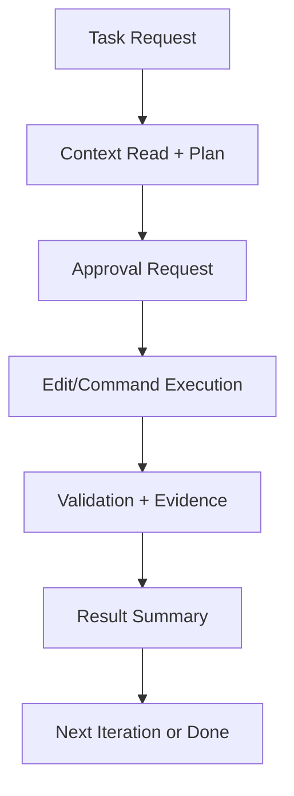

# Chapter 2: Agent Workflow

Cline works best as a deterministic loop, not a one-shot generator.

## Core Loop

## Prompt Contract Design

Every high-quality task prompt should include:

- scope: files/directories Cline may touch
- success criteria: concrete pass/fail outcome
- validation command: exact command to run
- constraints: non-goals and forbidden changes

## Approval Strategy by Risk

| Action Type | Default Policy |
|:------------|:---------------|
| read/search | usually allow |
| small edits in scoped files | review diff, then approve |
| dependency/config changes | require explicit human review |
| shell commands with side effects | approve one-by-one |

## Workflow Anti-Patterns

- vague requests with no validation step
- letting failed commands loop without intervention
- mixing architecture redesign and bugfix in one task

## Summary

You can now run Cline with a repeatable plan-approve-execute-verify loop.

Next: [Chapter 3: File Editing and Diffs](03-file-editing-and-diffs.md)
