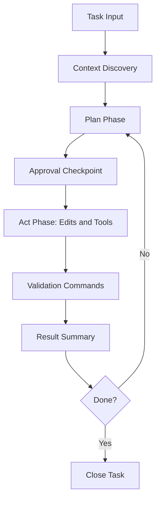

# Chapter 2: Agent Workflow

This chapter defines a repeatable operating loop for Cline tasks, including planning, execution, and validation.

## Core Workflow



## Plan/Act Discipline

Many failures come from jumping directly into edits. Use two explicit phases:

- **Plan**: define scope, risks, and success criteria
- **Act**: execute only after plan approval

This keeps changes intentional and auditable.

## Prompt Contract for Task Reliability

Use this template for every meaningful task:

```text
Goal:
Allowed files/directories:
Forbidden changes:
Validation command(s):
Definition of done:
```

If any field is missing, quality drops quickly.

## Task Sizing Rules

| Task Size | Recommendation |
|:----------|:---------------|
| tiny fix (1 file) | single task loop |
| medium feature | split into 2-4 milestones |
| large migration | plan-only task, then staged execution tasks |

Avoid combining architecture redesign and bugfix work in one run.

## Approval Strategy by Action Type

| Action Type | Default Policy |
|:------------|:---------------|
| file reads/search | usually allow |
| file writes | diff review required |
| terminal commands | explicit approval for side effects |
| external tools/MCP | allowlist and intent review |
| multi-step automation | require plan checkpoint |

## Evidence-First Iteration

When results fail, feed exact evidence back into next prompt:

- failing command output
- expected vs actual behavior
- precise target function/file
- constraints to preserve existing behavior

Avoid vague feedback like "still broken".

## Example Milestone Workflow

```text
Task A (Plan):
Map affected modules and propose sequence.

Task B (Act):
Implement changes in module 1 only.
Run targeted tests.

Task C (Act):
Integrate module 2 and re-run integration checks.
```

This reduces correction cost.

## Workflow Anti-Patterns

- broad prompts with no file boundaries
- repeated retries without updating evidence
- accepting large edits without validation
- skipping summary review before merge

## Summary Format Standard

Require Cline to finish with:

1. changed files
2. behavior impact summary
3. commands run + results
4. remaining risks

This creates predictable handoff quality.

## Chapter Summary

You now have a reliable task orchestration model:

- plan before action
- clear approval checkpoints
- evidence-driven iteration
- standardized completion summaries

Next: [Chapter 3: File Editing and Diffs](03-file-editing-and-diffs.md)
