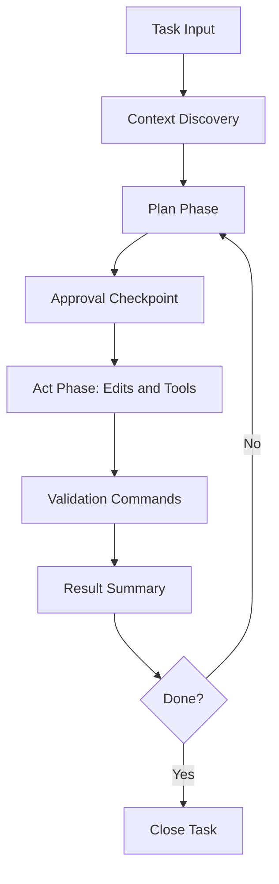
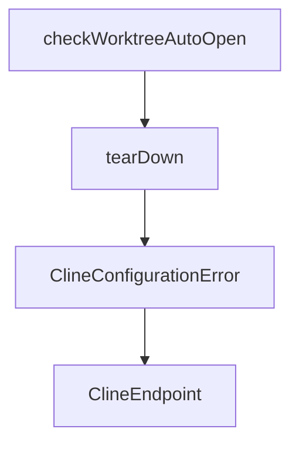

# Chapter 2: Agent Workflow

Welcome to **Chapter 2: Agent Workflow**. In this part of **Cline Tutorial: Agentic Coding with Human Control**, you will build an intuitive mental model first, then move into concrete implementation details and practical production tradeoffs.


This chapter defines a repeatable operating loop for Cline tasks, including planning, execution, and validation.

## Core Workflow


```mermaid
flowchart TD
    A[Task Input] --> B[Context Discovery]
    B --> C[Plan Phase]
    C --> D[Approval Checkpoint]
    D --> E[Act Phase: Edits and Tools]
    E --> F[Validation Commands]
    F --> G[Result Summary]
    G --> H{Done?}
    H -- No --> C
    H -- Yes --> I[Close Task]
```

## Plan/Act Discipline

Many failures come from jumping directly into edits. Use two explicit phases:

- **Plan**: define scope, risks, and success criteria
- **Act**: execute only after plan approval

This keeps changes intentional and auditable.

## Prompt Contract for Task Reliability

Use this template for every meaningful task:

```text
Goal:
Allowed files/directories:
Forbidden changes:
Validation command(s):
Definition of done:
```

If any field is missing, quality drops quickly.

## Task Sizing Rules

| Task Size | Recommendation |
|:----------|:---------------|
| tiny fix (1 file) | single task loop |
| medium feature | split into 2-4 milestones |
| large migration | plan-only task, then staged execution tasks |

Avoid combining architecture redesign and bugfix work in one run.

## Approval Strategy by Action Type

| Action Type | Default Policy |
|:------------|:---------------|
| file reads/search | usually allow |
| file writes | diff review required |
| terminal commands | explicit approval for side effects |
| external tools/MCP | allowlist and intent review |
| multi-step automation | require plan checkpoint |

## Evidence-First Iteration

When results fail, feed exact evidence back into next prompt:

- failing command output
- expected vs actual behavior
- precise target function/file
- constraints to preserve existing behavior

Avoid vague feedback like "still broken".

## Example Milestone Workflow

```text
Task A (Plan):
Map affected modules and propose sequence.

Task B (Act):
Implement changes in module 1 only.
Run targeted tests.

Task C (Act):
Integrate module 2 and re-run integration checks.
```

This reduces correction cost.

## Workflow Anti-Patterns

- broad prompts with no file boundaries
- repeated retries without updating evidence
- accepting large edits without validation
- skipping summary review before merge

## Summary Format Standard

Require Cline to finish with:

1. changed files
2. behavior impact summary
3. commands run + results
4. remaining risks

This creates predictable handoff quality.

## Chapter Summary

You now have a reliable task orchestration model:

- plan before action
- clear approval checkpoints
- evidence-driven iteration
- standardized completion summaries

Next: [Chapter 3: File Editing and Diffs](03-file-editing-and-diffs.md)

## Source Code Walkthrough

### `src/common.ts`

The `checkWorktreeAutoOpen` function in [`src/common.ts`](https://github.com/cline/cline/blob/HEAD/src/common.ts) handles a key part of this chapter's functionality:

```ts
	showVersionUpdateAnnouncement(stateManager)
	// Check if this workspace was opened from worktree quick launch
	await checkWorktreeAutoOpen(stateManager)

	// =============== Background sync and cleanup tasks ===============
	// Use remote config blobStoreConfig if available, otherwise fall back to env vars
	const blobStoreSettings = stateManager.getRemoteConfigSettings()?.blobStoreConfig ?? getBlobStoreSettingsFromEnv()
	syncWorker().init({ ...blobStoreSettings, userDistinctId: getDistinctId() })
	// Clean up old temp files in background (non-blocking) and start periodic cleanup every 24 hours
	ClineTempManager.startPeriodicCleanup()
	// Clean up orphaned file context warnings (startup cleanup)
	FileContextTracker.cleanupOrphanedWarnings(stateManager)

	telemetryService.captureExtensionActivated()

	return webview
}

async function showVersionUpdateAnnouncement(stateManager: StateManager) {
	// Version checking for autoupdate notification
	const currentVersion = ExtensionRegistryInfo.version
	const previousVersion = stateManager.getGlobalStateKey("clineVersion")
	// Perform post-update actions if necessary
	try {
		if (!previousVersion || currentVersion !== previousVersion) {
			Logger.log(`Cline version changed: ${previousVersion} -> ${currentVersion}. First run or update detected.`)

			// Check if there's a new announcement to show
			const lastShownAnnouncementId = stateManager.getGlobalStateKey("lastShownAnnouncementId")
			const latestAnnouncementId = getLatestAnnouncementId()

			if (lastShownAnnouncementId !== latestAnnouncementId) {
```

This function is important because it defines how Cline Tutorial: Agentic Coding with Human Control implements the patterns covered in this chapter.

### `src/common.ts`

The `tearDown` function in [`src/common.ts`](https://github.com/cline/cline/blob/HEAD/src/common.ts) handles a key part of this chapter's functionality:

```ts
 * Performs cleanup when Cline is deactivated that is common to all platforms.
 */
export async function tearDown(): Promise<void> {
	AgentConfigLoader.getInstance()?.dispose()
	PostHogClientProvider.getInstance().dispose()
	telemetryService.dispose()
	ErrorService.get().dispose()
	featureFlagsService.dispose()
	// Dispose all webview instances
	await WebviewProvider.disposeAllInstances()
	syncWorker().dispose()
	clearOnboardingModelsCache()

	// Kill any running hook processes to prevent zombies
	await HookProcessRegistry.terminateAll()
	// Clean up hook discovery cache
	HookDiscoveryCache.getInstance().dispose()
	// Stop periodic temp file cleanup
	ClineTempManager.stopPeriodicCleanup()

	// Clean up test mode
	cleanupTestMode()
}

```

This function is important because it defines how Cline Tutorial: Agentic Coding with Human Control implements the patterns covered in this chapter.

### `src/config.ts`

The `ClineConfigurationError` class in [`src/config.ts`](https://github.com/cline/cline/blob/HEAD/src/config.ts) handles a key part of this chapter's functionality:

```ts
 * This error prevents Cline from starting to avoid misconfiguration in enterprise environments.
 */
export class ClineConfigurationError extends Error {
	constructor(message: string) {
		super(message)
		this.name = "ClineConfigurationError"
	}
}

class ClineEndpoint {
	private static _instance: ClineEndpoint | null = null
	private static _initialized = false
	private static _extensionFsPath: string

	// On-premise config loaded from file (null if not on-premise)
	private onPremiseConfig: EndpointsFileSchema | null = null
	private environment: Environment = Environment.production
	// Track if config came from bundled file (enterprise distribution)
	private isBundled: boolean = false

	private constructor() {
		// Set environment at module load. Use override if provided.
		const _env = process?.env?.CLINE_ENVIRONMENT_OVERRIDE || process?.env?.CLINE_ENVIRONMENT
		if (_env && Object.values(Environment).includes(_env as Environment)) {
			this.environment = _env as Environment
		}
	}

	/**
	 * Initializes the ClineEndpoint singleton.
	 * Must be called before any other methods.
	 * Reads the endpoints.json file if it exists and validates its schema.
```

This class is important because it defines how Cline Tutorial: Agentic Coding with Human Control implements the patterns covered in this chapter.

### `src/config.ts`

The `ClineEndpoint` class in [`src/config.ts`](https://github.com/cline/cline/blob/HEAD/src/config.ts) handles a key part of this chapter's functionality:

```ts
}

class ClineEndpoint {
	private static _instance: ClineEndpoint | null = null
	private static _initialized = false
	private static _extensionFsPath: string

	// On-premise config loaded from file (null if not on-premise)
	private onPremiseConfig: EndpointsFileSchema | null = null
	private environment: Environment = Environment.production
	// Track if config came from bundled file (enterprise distribution)
	private isBundled: boolean = false

	private constructor() {
		// Set environment at module load. Use override if provided.
		const _env = process?.env?.CLINE_ENVIRONMENT_OVERRIDE || process?.env?.CLINE_ENVIRONMENT
		if (_env && Object.values(Environment).includes(_env as Environment)) {
			this.environment = _env as Environment
		}
	}

	/**
	 * Initializes the ClineEndpoint singleton.
	 * Must be called before any other methods.
	 * Reads the endpoints.json file if it exists and validates its schema.
	 *
	 * @param extensionFsPath Path to the extension installation directory (for checking bundled endpoints.json)
	 * @throws ClineConfigurationError if the endpoints.json file exists but is invalid
	 */
	public static async initialize(extensionFsPath: string): Promise<void> {
		if (ClineEndpoint._initialized) {
			return
```

This class is important because it defines how Cline Tutorial: Agentic Coding with Human Control implements the patterns covered in this chapter.


## How These Components Connect


```mermaid
flowchart TD
    A[checkWorktreeAutoOpen]
    B[tearDown]
    C[ClineConfigurationError]
    D[ClineEndpoint]
    A --> B
    B --> C
    C --> D
```
