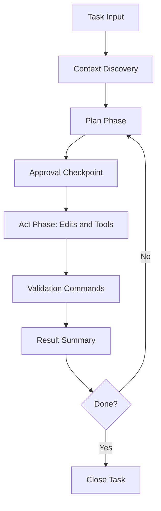
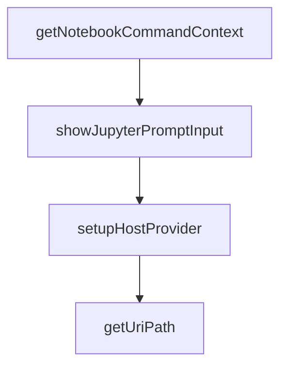

# Chapter 2: Agent Workflow

Welcome to **Chapter 2: Agent Workflow**. In this part of **Cline Tutorial: Agentic Coding with Human Control**, you will build an intuitive mental model first, then move into concrete implementation details and practical production tradeoffs.


This chapter defines a repeatable operating loop for Cline tasks, including planning, execution, and validation.

## Core Workflow


```mermaid
flowchart TD
    A[Task Input] --> B[Context Discovery]
    B --> C[Plan Phase]
    C --> D[Approval Checkpoint]
    D --> E[Act Phase: Edits and Tools]
    E --> F[Validation Commands]
    F --> G[Result Summary]
    G --> H{Done?}
    H -- No --> C
    H -- Yes --> I[Close Task]
```

## Plan/Act Discipline

Many failures come from jumping directly into edits. Use two explicit phases:

- **Plan**: define scope, risks, and success criteria
- **Act**: execute only after plan approval

This keeps changes intentional and auditable.

## Prompt Contract for Task Reliability

Use this template for every meaningful task:

```text
Goal:
Allowed files/directories:
Forbidden changes:
Validation command(s):
Definition of done:
```

If any field is missing, quality drops quickly.

## Task Sizing Rules

| Task Size | Recommendation |
|:----------|:---------------|
| tiny fix (1 file) | single task loop |
| medium feature | split into 2-4 milestones |
| large migration | plan-only task, then staged execution tasks |

Avoid combining architecture redesign and bugfix work in one run.

## Approval Strategy by Action Type

| Action Type | Default Policy |
|:------------|:---------------|
| file reads/search | usually allow |
| file writes | diff review required |
| terminal commands | explicit approval for side effects |
| external tools/MCP | allowlist and intent review |
| multi-step automation | require plan checkpoint |

## Evidence-First Iteration

When results fail, feed exact evidence back into next prompt:

- failing command output
- expected vs actual behavior
- precise target function/file
- constraints to preserve existing behavior

Avoid vague feedback like "still broken".

## Example Milestone Workflow

```text
Task A (Plan):
Map affected modules and propose sequence.

Task B (Act):
Implement changes in module 1 only.
Run targeted tests.

Task C (Act):
Integrate module 2 and re-run integration checks.
```

This reduces correction cost.

## Workflow Anti-Patterns

- broad prompts with no file boundaries
- repeated retries without updating evidence
- accepting large edits without validation
- skipping summary review before merge

## Summary Format Standard

Require Cline to finish with:

1. changed files
2. behavior impact summary
3. commands run + results
4. remaining risks

This creates predictable handoff quality.

## Chapter Summary

You now have a reliable task orchestration model:

- plan before action
- clear approval checkpoints
- evidence-driven iteration
- standardized completion summaries

Next: [Chapter 3: File Editing and Diffs](03-file-editing-and-diffs.md)

## Depth Expansion Playbook

## Source Code Walkthrough

### `src/extension.ts`

The `getNotebookCommandContext` function in [`src/extension.ts`](https://github.com/cline/cline/blob/HEAD/src/extension.ts) handles a key part of this chapter's functionality:

```ts

	// Helper to get notebook context for Jupyter commands
	async function getNotebookCommandContext(range?: vscode.Range, diagnostics?: vscode.Diagnostic[]) {
		const activeNotebook = vscode.window.activeNotebookEditor
		if (!activeNotebook) {
			HostProvider.window.showMessage({
				type: ShowMessageType.ERROR,
				message: "No active Jupyter notebook found. Please open a .ipynb file first.",
			})
			return null
		}

		const ctx = await getContextForCommand(range, diagnostics)
		if (!ctx) {
			return null
		}

		const filePath = ctx.commandContext.filePath || ""
		let cellJson: string | null = null
		if (activeNotebook.notebook.cellCount > 0) {
			const cellIndex = activeNotebook.notebook.cellAt(activeNotebook.selection.start).index
			cellJson = await findMatchingNotebookCell(filePath, cellIndex)
		}

		return { ...ctx, cellJson }
	}

	context.subscriptions.push(
		vscode.commands.registerCommand(
			commands.JupyterGenerateCell,
			async (range?: vscode.Range, diagnostics?: vscode.Diagnostic[]) => {
				const userPrompt = await showJupyterPromptInput(
```

This function is important because it defines how Cline Tutorial: Agentic Coding with Human Control implements the patterns covered in this chapter.

### `src/extension.ts`

The `showJupyterPromptInput` function in [`src/extension.ts`](https://github.com/cline/cline/blob/HEAD/src/extension.ts) handles a key part of this chapter's functionality:

```ts
			commands.JupyterGenerateCell,
			async (range?: vscode.Range, diagnostics?: vscode.Diagnostic[]) => {
				const userPrompt = await showJupyterPromptInput(
					"Generate Notebook Cell",
					"Enter your prompt for generating notebook cell (press Enter to confirm & Esc to cancel)",
				)
				if (!userPrompt) return

				const ctx = await getNotebookCommandContext(range, diagnostics)
				if (!ctx) return

				const notebookContext = `User prompt: ${userPrompt}
Insert a new Jupyter notebook cell above or below the current cell based on user prompt.
${NOTEBOOK_EDIT_INSTRUCTIONS}

Current Notebook Cell Context (JSON, sanitized of image data):
\`\`\`json
${ctx.cellJson || "{}"}
\`\`\``

				await addToCline(ctx.controller, ctx.commandContext, notebookContext)
			},
		),
	)

	context.subscriptions.push(
		vscode.commands.registerCommand(
			commands.JupyterExplainCell,
			async (range?: vscode.Range, diagnostics?: vscode.Diagnostic[]) => {
				const ctx = await getNotebookCommandContext(range, diagnostics)
				if (!ctx) return

```

This function is important because it defines how Cline Tutorial: Agentic Coding with Human Control implements the patterns covered in this chapter.

### `src/extension.ts`

The `setupHostProvider` function in [`src/extension.ts`](https://github.com/cline/cline/blob/HEAD/src/extension.ts) handles a key part of this chapter's functionality:

```ts
	// 1. Set up HostProvider for VSCode
	// IMPORTANT: This must be done before any service can be registered
	setupHostProvider(context)

	// 2. Clean up legacy data patterns within VSCode's native storage.
	// Moves workspace→global keys, task history→file, custom instructions→rules, etc.
	// Must run BEFORE the file export so we copy clean state.
	await cleanupLegacyVSCodeStorage(context)

	// 3. One-time export of VSCode's native storage to shared file-backed stores.
	// After this, all platforms (VSCode, CLI, JetBrains) read from ~/.cline/data/.
	const workspacePath = vscode.workspace.workspaceFolders?.[0]?.uri.fsPath
	const storageContext = createStorageContext({ workspacePath })
	await exportVSCodeStorageToSharedFiles(context, storageContext)

	// 4. Register services and perform common initialization
	// IMPORTANT: Must be done after host provider is setup and migrations are complete
	const webview = (await initialize(storageContext)) as VscodeWebviewProvider

	// 5. Register services and commands specific to VS Code
	// Initialize test mode and add disposables to context
	const testModeWatchers = await initializeTestMode(webview)
	context.subscriptions.push(...testModeWatchers)

	// Initialize hook discovery cache for performance optimization
	HookDiscoveryCache.getInstance().initialize(
		context as any, // Adapt VSCode ExtensionContext to generic interface
		(dir: string) => {
			try {
				const pattern = new vscode.RelativePattern(dir, "*")
				const watcher = vscode.workspace.createFileSystemWatcher(pattern)
				// Ensure watcher is disposed when extension is deactivated
```

This function is important because it defines how Cline Tutorial: Agentic Coding with Human Control implements the patterns covered in this chapter.

### `src/extension.ts`

The `getUriPath` function in [`src/extension.ts`](https://github.com/cline/cline/blob/HEAD/src/extension.ts) handles a key part of this chapter's functionality:

```ts
	const handleUri = async (uri: vscode.Uri) => {
		const url = decodeURIComponent(uri.toString())
		const isTaskUri = getUriPath(url) === TASK_URI_PATH

		if (isTaskUri) {
			await openClineSidebarForTaskUri()
		}

		let success = await SharedUriHandler.handleUri(url)

		// Task deeplinks can race with first-time sidebar initialization.
		if (!success && isTaskUri) {
			await openClineSidebarForTaskUri()
			success = await SharedUriHandler.handleUri(url)
		}

		if (!success) {
			Logger.warn("Extension URI handler: Failed to process URI:", uri.toString())
		}
	}
	context.subscriptions.push(vscode.window.registerUriHandler({ handleUri }))

	// Register size testing commands in development mode
	if (IS_DEV) {
		vscode.commands.executeCommand("setContext", "cline.isDevMode", IS_DEV)
		// Use dynamic import to avoid loading the module in production
		import("./dev/commands/tasks")
			.then((module) => {
				const devTaskCommands = module.registerTaskCommands(webview.controller)
				context.subscriptions.push(...devTaskCommands)
				Logger.log("[Cline Dev] Dev mode activated & dev commands registered")
			})
```

This function is important because it defines how Cline Tutorial: Agentic Coding with Human Control implements the patterns covered in this chapter.


## How These Components Connect


```mermaid
flowchart TD
    A[getNotebookCommandContext]
    B[showJupyterPromptInput]
    C[setupHostProvider]
    D[getUriPath]
    A --> B
    B --> C
    C --> D
```
