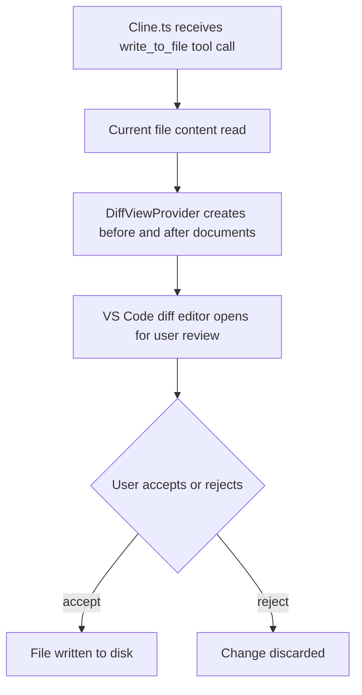

# Chapter 3: File Editing and Diffs

Welcome to **Chapter 3: File Editing and Diffs**. In this part of **Cline Tutorial: Agentic Coding with Human Control**, you will build an intuitive mental model first, then move into concrete implementation details and practical production tradeoffs.

Cline's editing power is useful only when diff governance is strong. This chapter covers that governance model.

## Diff-Centric Edit Lifecycle

1. Cline proposes patch
2. human reviews diff
3. approve/reject with targeted feedback
4. run validation command
5. checkpoint or finalize

Never skip step 2 or step 4.

## Review Rubric

| Lens | Key Question |
|:-----|:-------------|
| Scope | Did changes stay in intended files? |
| Semantics | Does code match requested behavior? |
| Safety | Any secret/config/auth risk introduced? |
| Compatibility | Could this break callers/contracts? |
| Maintainability | Is the patch minimal and understandable? |

## Checkpoints and Restore

Cline supports checkpoint-style workflows for comparing/restoring prior states. Use checkpoints before:

- multi-file refactors
- config or dependency changes
- uncertain bugfix attempts
- broad generated code insertions

This enables fast rollback instead of manual repair.

## Patch Acceptance Gates

Require all gates to pass:

- **Scope gate**: no unrelated files changed
- **Quality gate**: implementation matches prompt contract
- **Validation gate**: required commands pass
- **Risk gate**: no unreviewed high-risk edits

## Reject Triggers

Reject patches when you see:

- unexplained dependency/config updates
- hidden binary or generated artifact churn
- large formatting-only noise masking logic edits
- missing command evidence

Then rerun with tighter scope.

## High-Risk File Strategy

Treat these paths with elevated scrutiny:

- auth and permissions
- deployment and CI config
- billing/cost enforcement
- secret/config loaders

For these files, require explicit second review or stricter approval policy.

## Practical Diff Hygiene

- keep tasks small and file-bounded
- ask for one subsystem per iteration
- request changelog-style summary per accepted patch
- avoid accepting multi-concern patches in one step

## Timeline and Audit Value

A clear edit timeline helps with:

- incident analysis
- regression triage
- policy improvement
- compliance evidence

Make sure each accepted change has associated validation context.

## Chapter Summary

You now have a diff governance model that supports:

- safe patch acceptance
- fast rollback with checkpoints
- high-signal review patterns
- auditable change history

Next: [Chapter 4: Terminal and Runtime Tools](04-terminal-and-runtime-tools.md)

## Source Code Walkthrough

### `src/integrations/editor/DiffViewProvider.ts`

The `DiffViewProvider` in [`src/integrations/editor/DiffViewProvider.ts`](https://github.com/cline/cline/blob/HEAD/src/integrations/editor/DiffViewProvider.ts) is the core of Cline's file-editing UX. It implements VS Code's `TextDocumentContentProvider` to render a side-by-side diff of proposed changes before the user accepts or rejects them.

This file is directly relevant to understanding how Cline presents edits: it creates a virtual "before" document from the current file state and a "after" document from the proposed changes, then opens a standard VS Code diff editor. The accept/reject decision the user makes in the diff view determines whether the file is actually written.

### `src/core/Cline.ts`

The `Cline` class in [`src/core/Cline.ts`](https://github.com/cline/cline/blob/HEAD/src/core/Cline.ts) is the main agent loop. It handles the `write_to_file` and `replace_in_file` tool calls that Claude proposes, delegates to `DiffViewProvider` to show the diff, and waits for user approval before applying the change to disk.

For file editing governance, this is the control plane: tracing the tool-call handling in this class reveals exactly where file-lock checks, scope constraints, and audit logging should be inserted.

### `src/services/glob/list-files.ts`

The file listing service in [`src/services/glob/list-files.ts`](https://github.com/cline/cline/blob/HEAD/src/services/glob/list-files.ts) enumerates the files Cline can read and propose edits on. It respects `.gitignore` and other exclusion patterns, which is the first line of defense for keeping sensitive files out of the edit scope.

## How These Components Connect

