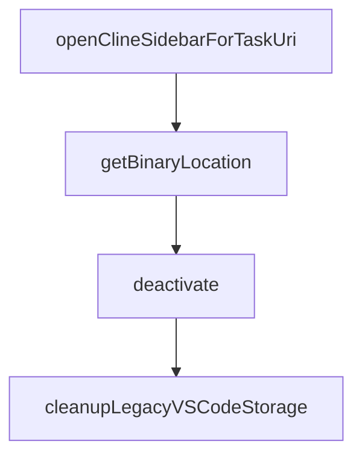

# Chapter 3: File Editing and Diffs

Welcome to **Chapter 3: File Editing and Diffs**. In this part of **Cline Tutorial: Agentic Coding with Human Control**, you will build an intuitive mental model first, then move into concrete implementation details and practical production tradeoffs.


Cline's editing power is useful only when diff governance is strong. This chapter covers that governance model.

## Diff-Centric Edit Lifecycle

1. Cline proposes patch
2. human reviews diff
3. approve/reject with targeted feedback
4. run validation command
5. checkpoint or finalize

Never skip step 2 or step 4.

## Review Rubric

| Lens | Key Question |
|:-----|:-------------|
| Scope | Did changes stay in intended files? |
| Semantics | Does code match requested behavior? |
| Safety | Any secret/config/auth risk introduced? |
| Compatibility | Could this break callers/contracts? |
| Maintainability | Is the patch minimal and understandable? |

## Checkpoints and Restore

Cline supports checkpoint-style workflows for comparing/restoring prior states. Use checkpoints before:

- multi-file refactors
- config or dependency changes
- uncertain bugfix attempts
- broad generated code insertions

This enables fast rollback instead of manual repair.

## Patch Acceptance Gates

Require all gates to pass:

- **Scope gate**: no unrelated files changed
- **Quality gate**: implementation matches prompt contract
- **Validation gate**: required commands pass
- **Risk gate**: no unreviewed high-risk edits

## Reject Triggers

Reject patches when you see:

- unexplained dependency/config updates
- hidden binary or generated artifact churn
- large formatting-only noise masking logic edits
- missing command evidence

Then rerun with tighter scope.

## High-Risk File Strategy

Treat these paths with elevated scrutiny:

- auth and permissions
- deployment and CI config
- billing/cost enforcement
- secret/config loaders

For these files, require explicit second review or stricter approval policy.

## Practical Diff Hygiene

- keep tasks small and file-bounded
- ask for one subsystem per iteration
- request changelog-style summary per accepted patch
- avoid accepting multi-concern patches in one step

## Timeline and Audit Value

A clear edit timeline helps with:

- incident analysis
- regression triage
- policy improvement
- compliance evidence

Make sure each accepted change has associated validation context.

## Chapter Summary

You now have a diff governance model that supports:

- safe patch acceptance
- fast rollback with checkpoints
- high-signal review patterns
- auditable change history

Next: [Chapter 4: Terminal and Runtime Tools](04-terminal-and-runtime-tools.md)

## Depth Expansion Playbook

## Source Code Walkthrough

### `src/extension.ts`

The `openClineSidebarForTaskUri` function in [`src/extension.ts`](https://github.com/cline/cline/blob/HEAD/src/extension.ts) handles a key part of this chapter's functionality:

```ts

		if (isTaskUri) {
			await openClineSidebarForTaskUri()
		}

		let success = await SharedUriHandler.handleUri(url)

		// Task deeplinks can race with first-time sidebar initialization.
		if (!success && isTaskUri) {
			await openClineSidebarForTaskUri()
			success = await SharedUriHandler.handleUri(url)
		}

		if (!success) {
			Logger.warn("Extension URI handler: Failed to process URI:", uri.toString())
		}
	}
	context.subscriptions.push(vscode.window.registerUriHandler({ handleUri }))

	// Register size testing commands in development mode
	if (IS_DEV) {
		vscode.commands.executeCommand("setContext", "cline.isDevMode", IS_DEV)
		// Use dynamic import to avoid loading the module in production
		import("./dev/commands/tasks")
			.then((module) => {
				const devTaskCommands = module.registerTaskCommands(webview.controller)
				context.subscriptions.push(...devTaskCommands)
				Logger.log("[Cline Dev] Dev mode activated & dev commands registered")
			})
			.catch((error) => {
				Logger.log("[Cline Dev] Failed to register dev commands: " + error)
			})
```

This function is important because it defines how Cline Tutorial: Agentic Coding with Human Control implements the patterns covered in this chapter.

### `src/extension.ts`

The `getBinaryLocation` function in [`src/extension.ts`](https://github.com/cline/cline/blob/HEAD/src/extension.ts) handles a key part of this chapter's functionality:

```ts
		() => {}, // No-op logger, logging is handled via HostProvider.env.debugLog
		getCallbackUrl,
		getBinaryLocation,
		context.extensionUri.fsPath,
		context.globalStorageUri.fsPath,
	)
}

function getUriPath(url: string): string | undefined {
	try {
		return new URL(url).pathname
	} catch {
		return undefined
	}
}

async function openClineSidebarForTaskUri(): Promise<void> {
	const sidebarWaitTimeoutMs = 3000
	const sidebarWaitIntervalMs = 50

	await vscode.commands.executeCommand(`${ExtensionRegistryInfo.views.Sidebar}.focus`)

	const startedAt = Date.now()
	while (Date.now() - startedAt < sidebarWaitTimeoutMs) {
		if (WebviewProvider.getVisibleInstance()) {
			return
		}
		await new Promise((resolve) => setTimeout(resolve, sidebarWaitIntervalMs))
	}

	Logger.warn("Task URI handling timed out waiting for Cline sidebar visibility")
}
```

This function is important because it defines how Cline Tutorial: Agentic Coding with Human Control implements the patterns covered in this chapter.

### `src/extension.ts`

The `deactivate` function in [`src/extension.ts`](https://github.com/cline/cline/blob/HEAD/src/extension.ts) handles a key part of this chapter's functionality:

```ts
				const pattern = new vscode.RelativePattern(dir, "*")
				const watcher = vscode.workspace.createFileSystemWatcher(pattern)
				// Ensure watcher is disposed when extension is deactivated
				context.subscriptions.push(watcher)
				// Adapt VSCode FileSystemWatcher to generic interface
				return {
					onDidCreate: (listener: () => void) => watcher.onDidCreate(listener),
					onDidChange: (listener: () => void) => watcher.onDidChange(listener),
					onDidDelete: (listener: () => void) => watcher.onDidDelete(listener),
					dispose: () => watcher.dispose(),
				}
			} catch {
				return null
			}
		},
		(callback: () => void) => {
			// Adapt VSCode Disposable to generic interface
			const disposable = vscode.workspace.onDidChangeWorkspaceFolders(callback)
			context.subscriptions.push(disposable)
			return disposable
		},
	)

	context.subscriptions.push(
		vscode.window.registerWebviewViewProvider(VscodeWebviewProvider.SIDEBAR_ID, webview, {
			webviewOptions: { retainContextWhenHidden: true },
		}),
	)

	// NOTE: Commands must be added to the internal registry before registering them with VSCode
	const { commands } = ExtensionRegistryInfo

```

This function is important because it defines how Cline Tutorial: Agentic Coding with Human Control implements the patterns covered in this chapter.

### `src/extension.ts`

The `cleanupLegacyVSCodeStorage` function in [`src/extension.ts`](https://github.com/cline/cline/blob/HEAD/src/extension.ts) handles a key part of this chapter's functionality:

```ts
	// Moves workspace→global keys, task history→file, custom instructions→rules, etc.
	// Must run BEFORE the file export so we copy clean state.
	await cleanupLegacyVSCodeStorage(context)

	// 3. One-time export of VSCode's native storage to shared file-backed stores.
	// After this, all platforms (VSCode, CLI, JetBrains) read from ~/.cline/data/.
	const workspacePath = vscode.workspace.workspaceFolders?.[0]?.uri.fsPath
	const storageContext = createStorageContext({ workspacePath })
	await exportVSCodeStorageToSharedFiles(context, storageContext)

	// 4. Register services and perform common initialization
	// IMPORTANT: Must be done after host provider is setup and migrations are complete
	const webview = (await initialize(storageContext)) as VscodeWebviewProvider

	// 5. Register services and commands specific to VS Code
	// Initialize test mode and add disposables to context
	const testModeWatchers = await initializeTestMode(webview)
	context.subscriptions.push(...testModeWatchers)

	// Initialize hook discovery cache for performance optimization
	HookDiscoveryCache.getInstance().initialize(
		context as any, // Adapt VSCode ExtensionContext to generic interface
		(dir: string) => {
			try {
				const pattern = new vscode.RelativePattern(dir, "*")
				const watcher = vscode.workspace.createFileSystemWatcher(pattern)
				// Ensure watcher is disposed when extension is deactivated
				context.subscriptions.push(watcher)
				// Adapt VSCode FileSystemWatcher to generic interface
				return {
					onDidCreate: (listener: () => void) => watcher.onDidCreate(listener),
					onDidChange: (listener: () => void) => watcher.onDidChange(listener),
```

This function is important because it defines how Cline Tutorial: Agentic Coding with Human Control implements the patterns covered in this chapter.


## How These Components Connect


