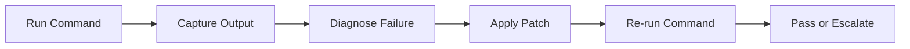

# Chapter 4: Terminal and Runtime Tools

Cline's command execution makes it useful for full fix-verify loops, not just code edits.

## Command Workflow

## High-Value Commands

- lint and static checks
- targeted test suites
- build commands
- runtime diagnostics for failing environments

## Guardrails for Safe Execution

| Guardrail | Purpose |
|:----------|:--------|
| command approval | prevent destructive or unrelated shell actions |
| scoped working directory | avoid cross-project side effects |
| timeout/retry limits | stop runaway loops |
| explicit denylist | block dangerous command classes |

## Long-Running Process Pattern

For dev servers/watchers, keep one controlled background process and ask Cline to use separate short commands for validation checks.

## Summary

You can now use Cline as a controlled terminal copilot for build-test-debug cycles.

Next: [Chapter 5: Browser Automation](05-browser-automation.md)
