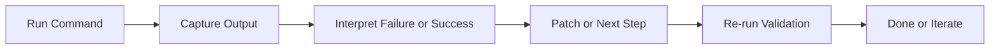

# Chapter 4: Terminal and Runtime Tools

One of Cline's strongest capabilities is command execution with output feedback. This chapter shows how to use that safely and effectively.

## Command Loop



## High-Value Command Classes

| Command Type | Typical Use |
|:-------------|:------------|
| lint/static checks | quick syntax and style signal |
| unit tests | verify behavior on targeted modules |
| integration tests | validate cross-module contracts |
| build checks | detect bundling/type/runtime issues |
| diagnostics | reproduce and isolate environment failures |

## Command Approval Policy

Set clear defaults:

- read-only and low-risk commands can be broadly approved
- mutating or destructive commands require explicit confirmation
- commands outside repo scope should be blocked by default

## Canonical Command Catalog

Define repo-level canonical commands for Cline to use:

```text
lint: pnpm lint
test: pnpm test
test:target: pnpm test -- <module>
build: pnpm build
```

This reduces random command attempts and flaky behavior.

## Long-Running Process Pattern

For dev servers/watchers:

1. start one long-running process
2. allow Cline to proceed while process is running
3. run separate short validation commands for checks
4. stop and restart only when environment changes require it

This avoids repeated startup overhead.

## Terminal Safety Controls

| Control | Why It Matters |
|:--------|:---------------|
| per-command approval | prevents accidental destructive actions |
| timeout limits | avoids runaway loops |
| retry caps | stops endless failing retries |
| command denylist | blocks known-dangerous actions |
| scoped working directory | limits blast radius |

## Failure Triage Pattern

When command fails:

1. classify error type (dependency, syntax, environment, flaky test)
2. ask for minimal fix in known files
3. rerun only relevant command first
4. expand to broader checks after targeted pass

This speeds convergence.

## Evidence Requirements

Before accepting task completion, require:

- exact command(s) executed
- pass/fail status
- key error lines or success indicators
- relationship between patch and command outcome

## Chapter Summary

You now have a command-execution model that balances:

- agent autonomy
- runtime safety
- deterministic validation
- fast failure recovery

Next: [Chapter 5: Browser Automation](05-browser-automation.md)
