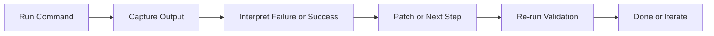
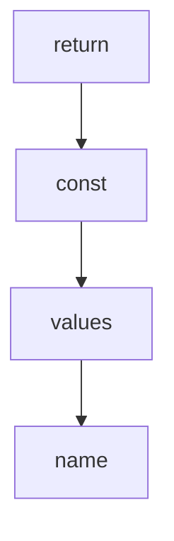

# Chapter 4: Terminal and Runtime Tools

Welcome to **Chapter 4: Terminal and Runtime Tools**. In this part of **Cline Tutorial: Agentic Coding with Human Control**, you will build an intuitive mental model first, then move into concrete implementation details and practical production tradeoffs.


One of Cline's strongest capabilities is command execution with output feedback. This chapter shows how to use that safely and effectively.

## Command Loop


```mermaid
flowchart LR
    A[Run Command] --> B[Capture Output]
    B --> C[Interpret Failure or Success]
    C --> D[Patch or Next Step]
    D --> E[Re-run Validation]
    E --> F[Done or Iterate]
```

## High-Value Command Classes

| Command Type | Typical Use |
|:-------------|:------------|
| lint/static checks | quick syntax and style signal |
| unit tests | verify behavior on targeted modules |
| integration tests | validate cross-module contracts |
| build checks | detect bundling/type/runtime issues |
| diagnostics | reproduce and isolate environment failures |

## Command Approval Policy

Set clear defaults:

- read-only and low-risk commands can be broadly approved
- mutating or destructive commands require explicit confirmation
- commands outside repo scope should be blocked by default

## Canonical Command Catalog

Define repo-level canonical commands for Cline to use:

```text
lint: pnpm lint
test: pnpm test
test:target: pnpm test -- <module>
build: pnpm build
```

This reduces random command attempts and flaky behavior.

## Long-Running Process Pattern

For dev servers/watchers:

1. start one long-running process
2. allow Cline to proceed while process is running
3. run separate short validation commands for checks
4. stop and restart only when environment changes require it

This avoids repeated startup overhead.

## Terminal Safety Controls

| Control | Why It Matters |
|:--------|:---------------|
| per-command approval | prevents accidental destructive actions |
| timeout limits | avoids runaway loops |
| retry caps | stops endless failing retries |
| command denylist | blocks known-dangerous actions |
| scoped working directory | limits blast radius |

## Failure Triage Pattern

When command fails:

1. classify error type (dependency, syntax, environment, flaky test)
2. ask for minimal fix in known files
3. rerun only relevant command first
4. expand to broader checks after targeted pass

This speeds convergence.

## Evidence Requirements

Before accepting task completion, require:

- exact command(s) executed
- pass/fail status
- key error lines or success indicators
- relationship between patch and command outcome

## Chapter Summary

You now have a command-execution model that balances:

- agent autonomy
- runtime safety
- deterministic validation
- fast failure recovery

Next: [Chapter 5: Browser Automation](05-browser-automation.md)

## Depth Expansion Playbook

## Source Code Walkthrough

### `src/extension.ts`

The `return` interface in [`src/extension.ts`](https://github.com/cline/cline/blob/HEAD/src/extension.ts) handles a key part of this chapter's functionality:

```ts
				context.subscriptions.push(watcher)
				// Adapt VSCode FileSystemWatcher to generic interface
				return {
					onDidCreate: (listener: () => void) => watcher.onDidCreate(listener),
					onDidChange: (listener: () => void) => watcher.onDidChange(listener),
					onDidDelete: (listener: () => void) => watcher.onDidDelete(listener),
					dispose: () => watcher.dispose(),
				}
			} catch {
				return null
			}
		},
		(callback: () => void) => {
			// Adapt VSCode Disposable to generic interface
			const disposable = vscode.workspace.onDidChangeWorkspaceFolders(callback)
			context.subscriptions.push(disposable)
			return disposable
		},
	)

	context.subscriptions.push(
		vscode.window.registerWebviewViewProvider(VscodeWebviewProvider.SIDEBAR_ID, webview, {
			webviewOptions: { retainContextWhenHidden: true },
		}),
	)

	// NOTE: Commands must be added to the internal registry before registering them with VSCode
	const { commands } = ExtensionRegistryInfo

	context.subscriptions.push(
		vscode.commands.registerCommand(commands.PlusButton, async () => {
			const sidebarInstance = WebviewProvider.getInstance()
```

This interface is important because it defines how Cline Tutorial: Agentic Coding with Human Control implements the patterns covered in this chapter.

### `src/extension.ts`

The `const` interface in [`src/extension.ts`](https://github.com/cline/cline/blob/HEAD/src/extension.ts) handles a key part of this chapter's functionality:

```ts
// for all-platform should be registered in common.ts.
export async function activate(context: vscode.ExtensionContext) {
	const activationStartTime = performance.now()

	// 1. Set up HostProvider for VSCode
	// IMPORTANT: This must be done before any service can be registered
	setupHostProvider(context)

	// 2. Clean up legacy data patterns within VSCode's native storage.
	// Moves workspace→global keys, task history→file, custom instructions→rules, etc.
	// Must run BEFORE the file export so we copy clean state.
	await cleanupLegacyVSCodeStorage(context)

	// 3. One-time export of VSCode's native storage to shared file-backed stores.
	// After this, all platforms (VSCode, CLI, JetBrains) read from ~/.cline/data/.
	const workspacePath = vscode.workspace.workspaceFolders?.[0]?.uri.fsPath
	const storageContext = createStorageContext({ workspacePath })
	await exportVSCodeStorageToSharedFiles(context, storageContext)

	// 4. Register services and perform common initialization
	// IMPORTANT: Must be done after host provider is setup and migrations are complete
	const webview = (await initialize(storageContext)) as VscodeWebviewProvider

	// 5. Register services and commands specific to VS Code
	// Initialize test mode and add disposables to context
	const testModeWatchers = await initializeTestMode(webview)
	context.subscriptions.push(...testModeWatchers)

	// Initialize hook discovery cache for performance optimization
	HookDiscoveryCache.getInstance().initialize(
		context as any, // Adapt VSCode ExtensionContext to generic interface
		(dir: string) => {
```

This interface is important because it defines how Cline Tutorial: Agentic Coding with Human Control implements the patterns covered in this chapter.

### `buf.yaml`

The `values` interface in [`buf.yaml`](https://github.com/cline/cline/blob/HEAD/buf.yaml) handles a key part of this chapter's functionality:

```yaml
        - RPC_RESPONSE_STANDARD_NAME # response messages dont all end with Response
        - PACKAGE_VERSION_SUFFIX # package name does not contain version.
        - ENUM_VALUE_PREFIX # enum values dont start with the enum name.
        - ENUM_ZERO_VALUE_SUFFIX # first value does not have to be UNSPECIFIED.

# breaking:
#   use:
#     - WIRE_JSON # Detect changes that break the json wire format (this is the minimum recommended level.)

```

This interface is important because it defines how Cline Tutorial: Agentic Coding with Human Control implements the patterns covered in this chapter.

### `buf.yaml`

The `name` interface in [`buf.yaml`](https://github.com/cline/cline/blob/HEAD/buf.yaml) handles a key part of this chapter's functionality:

```yaml
modules:
    - path: proto
      name: cline/cline/lint

lint:
    use:
        - STANDARD

    except: # Add exceptions for current patterns that contradict STANDARD settings
        - RPC_PASCAL_CASE # rpcs are camel case (start with lowercase)
        - RPC_REQUEST_RESPONSE_UNIQUE # request messages are not unique.
        - RPC_REQUEST_STANDARD_NAME # request messages dont all end with Request
        - RPC_RESPONSE_STANDARD_NAME # response messages dont all end with Response
        - PACKAGE_VERSION_SUFFIX # package name does not contain version.
        - ENUM_VALUE_PREFIX # enum values dont start with the enum name.
        - ENUM_ZERO_VALUE_SUFFIX # first value does not have to be UNSPECIFIED.

# breaking:
#   use:
#     - WIRE_JSON # Detect changes that break the json wire format (this is the minimum recommended level.)

```

This interface is important because it defines how Cline Tutorial: Agentic Coding with Human Control implements the patterns covered in this chapter.


## How These Components Connect


```mermaid
flowchart TD
    A[return]
    B[const]
    C[values]
    D[name]
    A --> B
    B --> C
    C --> D
```
