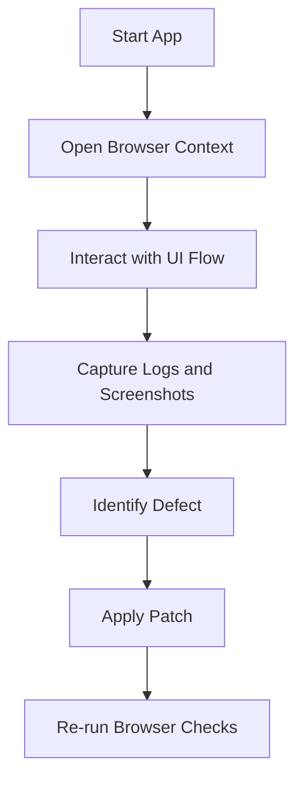

# Chapter 5: Browser Automation

Cline can use browser workflows to validate user-facing behavior, not just source-level correctness.

## Why Browser Validation Matters

Static checks do not catch:

- runtime JavaScript errors
- broken client-side routing
- interaction regressions
- visual defects tied to state flow

Browser automation closes that gap.

## Browser Validation Loop

1. start app/runtime
2. navigate to target flow
3. execute realistic interactions
4. capture evidence (screenshots/logs)
5. patch and re-verify



## High-Value Use Cases

| Use Case | Validation Target |
|:---------|:------------------|
| regression smoke | core user path still works |
| runtime bug triage | console/network error visibility |
| form and state flows | interaction behavior under real events |
| pre-release checks | no obvious UX blockers |

## Safety Boundaries

Apply policy controls before enabling broad browser actions:

- allowlist target domains/environments
- block production admin interfaces by default
- bound action count per task
- require artifact capture for bug claims

## Prompt Pattern for Browser Tasks

```text
Open local app at http://localhost:3000,
verify login flow with valid and invalid inputs,
capture console errors,
then fix only src/auth/login.tsx if needed,
and rerun the browser check.
```

This combines runtime evidence with bounded patch scope.

## Artifact Strategy

For each browser-driven bugfix, keep:

- failing screenshot or log
- patch diff
- passing rerun evidence
- note on root cause

This improves handoff quality and release confidence.

## Common Failure Modes

### Flaky checks from unstable environment

Mitigation:

- stabilize test data and seed state
- use deterministic local env config
- separate exploratory runs from release validation runs

### Overly broad automation scope

Mitigation:

- limit to one user journey per task
- require explicit stop condition

### False positives without artifacts

Mitigation:

- require screenshot/log proof before marking resolved

## Chapter Summary

You now have a browser-grounded verification workflow that:

- validates actual user behavior
- captures runtime evidence
- integrates cleanly with patch and re-test loops

Next: [Chapter 6: MCP and Custom Tools](06-mcp-and-custom-tools.md)
