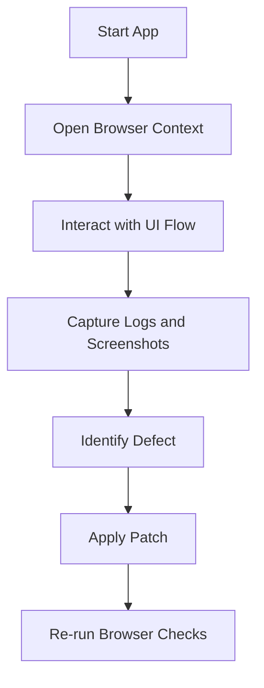
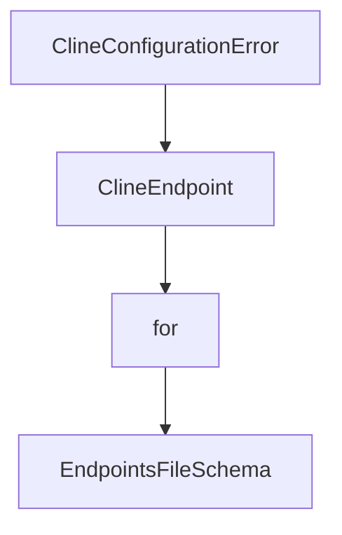

# Chapter 5: Browser Automation

Welcome to **Chapter 5: Browser Automation**. In this part of **Cline Tutorial: Agentic Coding with Human Control**, you will build an intuitive mental model first, then move into concrete implementation details and practical production tradeoffs.


Cline can use browser workflows to validate user-facing behavior, not just source-level correctness.

## Why Browser Validation Matters

Static checks do not catch:

- runtime JavaScript errors
- broken client-side routing
- interaction regressions
- visual defects tied to state flow

Browser automation closes that gap.

## Browser Validation Loop

1. start app/runtime
2. navigate to target flow
3. execute realistic interactions
4. capture evidence (screenshots/logs)
5. patch and re-verify


```mermaid
flowchart TD
    A[Start App] --> B[Open Browser Context]
    B --> C[Interact with UI Flow]
    C --> D[Capture Logs and Screenshots]
    D --> E[Identify Defect]
    E --> F[Apply Patch]
    F --> G[Re-run Browser Checks]
```

## High-Value Use Cases

| Use Case | Validation Target |
|:---------|:------------------|
| regression smoke | core user path still works |
| runtime bug triage | console/network error visibility |
| form and state flows | interaction behavior under real events |
| pre-release checks | no obvious UX blockers |

## Safety Boundaries

Apply policy controls before enabling broad browser actions:

- allowlist target domains/environments
- block production admin interfaces by default
- bound action count per task
- require artifact capture for bug claims

## Prompt Pattern for Browser Tasks

```text
Open local app at http://localhost:3000,
verify login flow with valid and invalid inputs,
capture console errors,
then fix only src/auth/login.tsx if needed,
and rerun the browser check.
```

This combines runtime evidence with bounded patch scope.

## Artifact Strategy

For each browser-driven bugfix, keep:

- failing screenshot or log
- patch diff
- passing rerun evidence
- note on root cause

This improves handoff quality and release confidence.

## Common Failure Modes

### Flaky checks from unstable environment

Mitigation:

- stabilize test data and seed state
- use deterministic local env config
- separate exploratory runs from release validation runs

### Overly broad automation scope

Mitigation:

- limit to one user journey per task
- require explicit stop condition

### False positives without artifacts

Mitigation:

- require screenshot/log proof before marking resolved

## Chapter Summary

You now have a browser-grounded verification workflow that:

- validates actual user behavior
- captures runtime evidence
- integrates cleanly with patch and re-test loops

Next: [Chapter 6: MCP and Custom Tools](06-mcp-and-custom-tools.md)

## Depth Expansion Playbook

## Source Code Walkthrough

### `src/config.ts`

The `ClineConfigurationError` class in [`src/config.ts`](https://github.com/cline/cline/blob/HEAD/src/config.ts) handles a key part of this chapter's functionality:

```ts
 * This error prevents Cline from starting to avoid misconfiguration in enterprise environments.
 */
export class ClineConfigurationError extends Error {
	constructor(message: string) {
		super(message)
		this.name = "ClineConfigurationError"
	}
}

class ClineEndpoint {
	private static _instance: ClineEndpoint | null = null
	private static _initialized = false
	private static _extensionFsPath: string

	// On-premise config loaded from file (null if not on-premise)
	private onPremiseConfig: EndpointsFileSchema | null = null
	private environment: Environment = Environment.production
	// Track if config came from bundled file (enterprise distribution)
	private isBundled: boolean = false

	private constructor() {
		// Set environment at module load. Use override if provided.
		const _env = process?.env?.CLINE_ENVIRONMENT_OVERRIDE || process?.env?.CLINE_ENVIRONMENT
		if (_env && Object.values(Environment).includes(_env as Environment)) {
			this.environment = _env as Environment
		}
	}

	/**
	 * Initializes the ClineEndpoint singleton.
	 * Must be called before any other methods.
	 * Reads the endpoints.json file if it exists and validates its schema.
```

This class is important because it defines how Cline Tutorial: Agentic Coding with Human Control implements the patterns covered in this chapter.

### `src/config.ts`

The `ClineEndpoint` class in [`src/config.ts`](https://github.com/cline/cline/blob/HEAD/src/config.ts) handles a key part of this chapter's functionality:

```ts
}

class ClineEndpoint {
	private static _instance: ClineEndpoint | null = null
	private static _initialized = false
	private static _extensionFsPath: string

	// On-premise config loaded from file (null if not on-premise)
	private onPremiseConfig: EndpointsFileSchema | null = null
	private environment: Environment = Environment.production
	// Track if config came from bundled file (enterprise distribution)
	private isBundled: boolean = false

	private constructor() {
		// Set environment at module load. Use override if provided.
		const _env = process?.env?.CLINE_ENVIRONMENT_OVERRIDE || process?.env?.CLINE_ENVIRONMENT
		if (_env && Object.values(Environment).includes(_env as Environment)) {
			this.environment = _env as Environment
		}
	}

	/**
	 * Initializes the ClineEndpoint singleton.
	 * Must be called before any other methods.
	 * Reads the endpoints.json file if it exists and validates its schema.
	 *
	 * @param extensionFsPath Path to the extension installation directory (for checking bundled endpoints.json)
	 * @throws ClineConfigurationError if the endpoints.json file exists but is invalid
	 */
	public static async initialize(extensionFsPath: string): Promise<void> {
		if (ClineEndpoint._initialized) {
			return
```

This class is important because it defines how Cline Tutorial: Agentic Coding with Human Control implements the patterns covered in this chapter.

### `src/config.ts`

The `for` class in [`src/config.ts`](https://github.com/cline/cline/blob/HEAD/src/config.ts) handles a key part of this chapter's functionality:

```ts

/**
 * Schema for the endpoints.json configuration file used in on-premise deployments.
 * All fields are required and must be valid URLs.
 */
interface EndpointsFileSchema {
	appBaseUrl: string
	apiBaseUrl: string
	mcpBaseUrl: string
}

/**
 * Error thrown when the Cline configuration file exists but is invalid.
 * This error prevents Cline from starting to avoid misconfiguration in enterprise environments.
 */
export class ClineConfigurationError extends Error {
	constructor(message: string) {
		super(message)
		this.name = "ClineConfigurationError"
	}
}

class ClineEndpoint {
	private static _instance: ClineEndpoint | null = null
	private static _initialized = false
	private static _extensionFsPath: string

	// On-premise config loaded from file (null if not on-premise)
	private onPremiseConfig: EndpointsFileSchema | null = null
	private environment: Environment = Environment.production
	// Track if config came from bundled file (enterprise distribution)
	private isBundled: boolean = false
```

This class is important because it defines how Cline Tutorial: Agentic Coding with Human Control implements the patterns covered in this chapter.

### `src/config.ts`

The `EndpointsFileSchema` interface in [`src/config.ts`](https://github.com/cline/cline/blob/HEAD/src/config.ts) handles a key part of this chapter's functionality:

```ts
 * All fields are required and must be valid URLs.
 */
interface EndpointsFileSchema {
	appBaseUrl: string
	apiBaseUrl: string
	mcpBaseUrl: string
}

/**
 * Error thrown when the Cline configuration file exists but is invalid.
 * This error prevents Cline from starting to avoid misconfiguration in enterprise environments.
 */
export class ClineConfigurationError extends Error {
	constructor(message: string) {
		super(message)
		this.name = "ClineConfigurationError"
	}
}

class ClineEndpoint {
	private static _instance: ClineEndpoint | null = null
	private static _initialized = false
	private static _extensionFsPath: string

	// On-premise config loaded from file (null if not on-premise)
	private onPremiseConfig: EndpointsFileSchema | null = null
	private environment: Environment = Environment.production
	// Track if config came from bundled file (enterprise distribution)
	private isBundled: boolean = false

	private constructor() {
		// Set environment at module load. Use override if provided.
```

This interface is important because it defines how Cline Tutorial: Agentic Coding with Human Control implements the patterns covered in this chapter.


## How These Components Connect


```mermaid
flowchart TD
    A[ClineConfigurationError]
    B[ClineEndpoint]
    C[for]
    D[EndpointsFileSchema]
    A --> B
    B --> C
    C --> D
```
