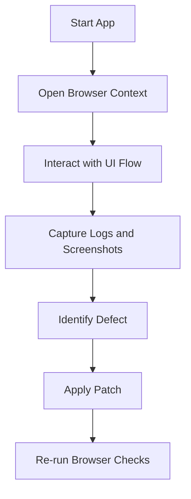
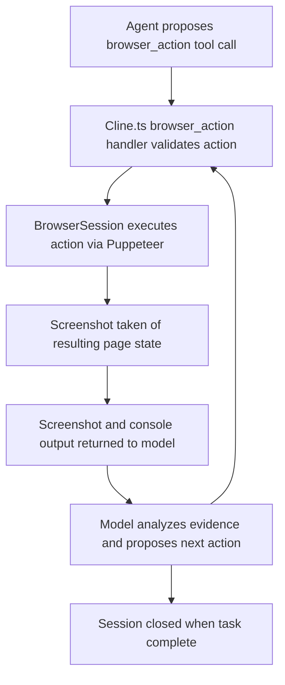

# Chapter 5: Browser Automation

Welcome to **Chapter 5: Browser Automation**. In this part of **Cline Tutorial: Agentic Coding with Human Control**, you will build an intuitive mental model first, then move into concrete implementation details and practical production tradeoffs.


Cline can use browser workflows to validate user-facing behavior, not just source-level correctness.

## Why Browser Validation Matters

Static checks do not catch:

- runtime JavaScript errors
- broken client-side routing
- interaction regressions
- visual defects tied to state flow

Browser automation closes that gap.

## Browser Validation Loop

1. start app/runtime
2. navigate to target flow
3. execute realistic interactions
4. capture evidence (screenshots/logs)
5. patch and re-verify


```mermaid
flowchart TD
    A[Start App] --> B[Open Browser Context]
    B --> C[Interact with UI Flow]
    C --> D[Capture Logs and Screenshots]
    D --> E[Identify Defect]
    E --> F[Apply Patch]
    F --> G[Re-run Browser Checks]
```

## High-Value Use Cases

| Use Case | Validation Target |
|:---------|:------------------|
| regression smoke | core user path still works |
| runtime bug triage | console/network error visibility |
| form and state flows | interaction behavior under real events |
| pre-release checks | no obvious UX blockers |

## Safety Boundaries

Apply policy controls before enabling broad browser actions:

- allowlist target domains/environments
- block production admin interfaces by default
- bound action count per task
- require artifact capture for bug claims

## Prompt Pattern for Browser Tasks

```text
Open local app at http://localhost:3000,
verify login flow with valid and invalid inputs,
capture console errors,
then fix only src/auth/login.tsx if needed,
and rerun the browser check.
```

This combines runtime evidence with bounded patch scope.

## Artifact Strategy

For each browser-driven bugfix, keep:

- failing screenshot or log
- patch diff
- passing rerun evidence
- note on root cause

This improves handoff quality and release confidence.

## Common Failure Modes

### Flaky checks from unstable environment

Mitigation:

- stabilize test data and seed state
- use deterministic local env config
- separate exploratory runs from release validation runs

### Overly broad automation scope

Mitigation:

- limit to one user journey per task
- require explicit stop condition

### False positives without artifacts

Mitigation:

- require screenshot/log proof before marking resolved

## Chapter Summary

You now have a browser-grounded verification workflow that:

- validates actual user behavior
- captures runtime evidence
- integrates cleanly with patch and re-test loops

Next: [Chapter 6: MCP and Custom Tools](06-mcp-and-custom-tools.md)


## Source Code Walkthrough

### `src/services/browser/BrowserSession.ts`

The `BrowserSession` class in [`src/services/browser/BrowserSession.ts`](https://github.com/cline/cline/blob/HEAD/src/services/browser/BrowserSession.ts) manages the Puppeteer browser instance that Cline uses for browser automation. It handles launching a headless (or visible) Chromium instance, navigating to URLs, taking screenshots, and extracting page content.

This is the core implementation behind Cline's `browser_action` tool. Each browser action (launch, click, type, screenshot, close) maps to a method in this class. When you ask Cline to "open the app in a browser and verify the login page looks correct," this class executes those steps.

### `src/core/Cline.ts` (browser_action handler)

The `browser_action` tool handler in [`src/core/Cline.ts`](https://github.com/cline/cline/blob/HEAD/src/core/Cline.ts) is the agent-side integration point for browser actions. It receives the structured action payload from the model, validates the action type, delegates to `BrowserSession`, and returns the screenshot and console output back to the model's context.

Understanding this handler shows the full loop: model proposes action → Cline executes via BrowserSession → screenshot returned as evidence → model decides next step.

### `src/services/browser/UrlContentFetcher.ts`

The `UrlContentFetcher` in [`src/services/browser/UrlContentFetcher.ts`](https://github.com/cline/cline/blob/HEAD/src/services/browser/UrlContentFetcher.ts) handles the read-only URL fetching use case: loading a page and extracting its text content for analysis without the full interactive browser session. This is used when Cline reads documentation or checks an API response page.

## How These Components Connect


```mermaid
flowchart TD
    A[Agent proposes browser_action tool call]
    B[Cline.ts browser_action handler validates action]
    C[BrowserSession executes action via Puppeteer]
    D[Screenshot taken of resulting page state]
    E[Screenshot and console output returned to model]
    F[Model analyzes evidence and proposes next action]
    G[Session closed when task complete]
    A --> B
    B --> C
    C --> D
    D --> E
    E --> F
    F --> B
    F --> G
```
