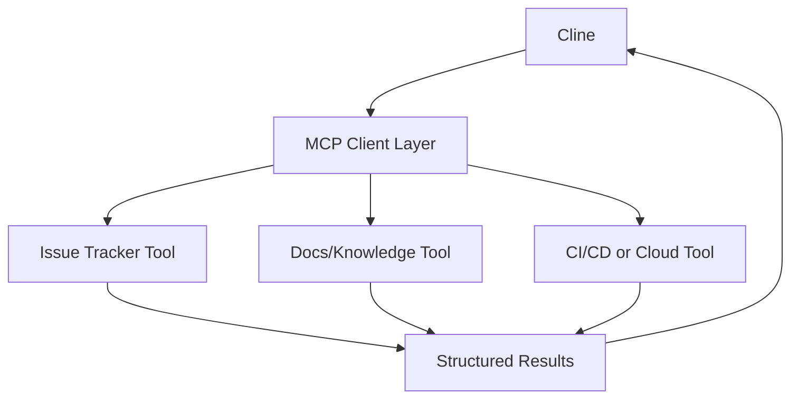

# Chapter 6: MCP and Custom Tools

MCP extends Cline into your internal platform surface area: tickets, docs, infra, and domain-specific systems.

## Integration Model

## Tool Contract Requirements

| Contract Area | Requirement |
|:--------------|:------------|
| input schema | strict typed arguments |
| output schema | predictable machine-readable response |
| side effects | declared read-only vs mutating behavior |
| failure mode | explicit error codes and actionable messages |

## Rollout Pattern

1. start with read-only tools
2. validate result quality in real tasks
3. add mutating tools behind explicit approvals
4. audit usage and prune low-value tools

## Common Pitfalls

- overloading one tool with many unrelated operations
- vague error responses that force model guessing
- skipping timeout and retry behavior definitions

## Summary

You can now extend Cline safely with protocol-based tools that remain auditable and operable.

Next: [Chapter 7: Context and Cost Control](07-context-and-cost-control.md)
