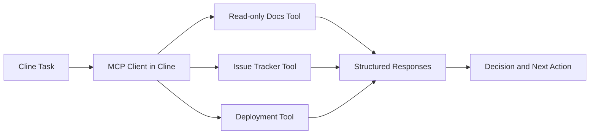

# Chapter 6: MCP and Custom Tools

Cline can be extended with MCP servers and custom tool workflows, turning it into an interface for your internal platform.

## Extension Surface

Cline docs and repository docs cover MCP integration and custom tool flows, including adding/configuring servers and transport mechanisms.

Typical enterprise use cases:

- ticket and incident retrieval
- internal documentation search
- deployment/CI operations
- cloud resource introspection

## MCP Architecture Pattern

## Tool Contract Checklist

| Contract Area | Requirement |
|:--------------|:------------|
| input schema | typed parameters, strict validation |
| output schema | deterministic JSON-style response |
| side effects | explicit read-only vs mutating |
| retries/timeouts | bounded and predictable |
| failure states | machine-readable error types |

## Rollout Sequence

1. onboard read-only tools first
2. validate output quality across real tasks
3. add mutating tools behind strict approvals
4. monitor usage and prune low-signal tools

## Hooks and Workflow Automation

Cline docs also cover hooks/workflow-style automation. Use hooks for standardized checks, not hidden side effects.

Good hook examples:

- enforce summary format
- run lightweight lint checks on specific tasks
- inject required context for known repo workflows

Avoid hooks that quietly mutate production systems.

## Security Model for Tooling

- least-privilege credentials per tool
- environment-specific credentials (dev/stage/prod)
- full audit logs for mutating tool calls
- fast kill switch for unstable servers

## Common MCP Pitfalls

- one server doing too many unrelated actions
- vague errors forcing model guesses
- no distinction between read and write operations
- unlimited retries against unstable endpoints

## Tool Readiness Checklist

- schemas are explicit
- auth scopes are minimized
- side effects are declared
- timeout/retry behavior is tested
- approval policy is documented

## Chapter Summary

You now have a pragmatic model for extending Cline:

- MCP-first tool architecture
- controlled rollout by risk level
- hook usage with clear boundaries
- governance for secure, auditable operations

Next: [Chapter 7: Context and Cost Control](07-context-and-cost-control.md)
