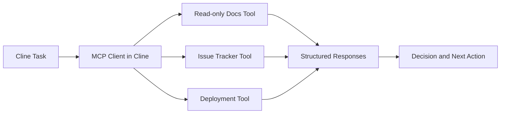
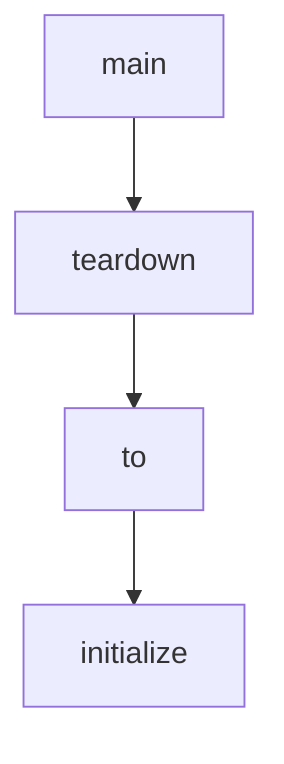

# Chapter 6: MCP and Custom Tools

Welcome to **Chapter 6: MCP and Custom Tools**. In this part of **Cline Tutorial: Agentic Coding with Human Control**, you will build an intuitive mental model first, then move into concrete implementation details and practical production tradeoffs.


Cline can be extended with MCP servers and custom tool workflows, turning it into an interface for your internal platform.

## Extension Surface

Cline docs and repository docs cover MCP integration and custom tool flows, including adding/configuring servers and transport mechanisms.

Typical enterprise use cases:

- ticket and incident retrieval
- internal documentation search
- deployment/CI operations
- cloud resource introspection

## MCP Architecture Pattern


```mermaid
flowchart LR
    A[Cline Task] --> B[MCP Client in Cline]
    B --> C1[Read-only Docs Tool]
    B --> C2[Issue Tracker Tool]
    B --> C3[Deployment Tool]
    C1 --> D[Structured Responses]
    C2 --> D
    C3 --> D
    D --> E[Decision and Next Action]
```

## Tool Contract Checklist

| Contract Area | Requirement |
|:--------------|:------------|
| input schema | typed parameters, strict validation |
| output schema | deterministic JSON-style response |
| side effects | explicit read-only vs mutating |
| retries/timeouts | bounded and predictable |
| failure states | machine-readable error types |

## Rollout Sequence

1. onboard read-only tools first
2. validate output quality across real tasks
3. add mutating tools behind strict approvals
4. monitor usage and prune low-signal tools

## Hooks and Workflow Automation

Cline docs also cover hooks/workflow-style automation. Use hooks for standardized checks, not hidden side effects.

Good hook examples:

- enforce summary format
- run lightweight lint checks on specific tasks
- inject required context for known repo workflows

Avoid hooks that quietly mutate production systems.

## Security Model for Tooling

- least-privilege credentials per tool
- environment-specific credentials (dev/stage/prod)
- full audit logs for mutating tool calls
- fast kill switch for unstable servers

## Common MCP Pitfalls

- one server doing too many unrelated actions
- vague errors forcing model guesses
- no distinction between read and write operations
- unlimited retries against unstable endpoints

## Tool Readiness Checklist

- schemas are explicit
- auth scopes are minimized
- side effects are declared
- timeout/retry behavior is tested
- approval policy is documented

## Chapter Summary

You now have a pragmatic model for extending Cline:

- MCP-first tool architecture
- controlled rollout by risk level
- hook usage with clear boundaries
- governance for secure, auditable operations

Next: [Chapter 7: Context and Cost Control](07-context-and-cost-control.md)

## Depth Expansion Playbook

## Source Code Walkthrough

### `scripts/interactive-playwright.ts`

The `main` function in [`scripts/interactive-playwright.ts`](https://github.com/cline/cline/blob/HEAD/scripts/interactive-playwright.ts) handles a key part of this chapter's functionality:

```ts
import { E2ETestHelper } from "../src/test/e2e/utils/helpers"

async function main() {
	await ClineApiServerMock.startGlobalServer()

	const userDataDir = mkdtempSync(path.join(os.tmpdir(), "vsce-interactive"))
	const executablePath = await downloadAndUnzipVSCode("stable", undefined, new SilentReporter())

	// launch VSCode
	const app = await _electron.launch({
		executablePath,
		env: {
			...process.env,
			TEMP_PROFILE: "true",
			E2E_TEST: "true",
			CLINE_ENVIRONMENT: "local",
			GRPC_RECORDER_ENABLED: "true",
			GRPC_RECORDER_TESTS_FILTERS_ENABLED: "true",
		},
		args: [
			"--no-sandbox",
			"--disable-updates",
			"--disable-workspace-trust",
			"--disable-extensions",
			"--skip-welcome",
			"--skip-release-notes",
			`--user-data-dir=${userDataDir}`,
			`--install-extension=${path.join(E2ETestHelper.CODEBASE_ROOT_DIR, "dist", "e2e.vsix")}`,
			`--extensionDevelopmentPath=${E2ETestHelper.CODEBASE_ROOT_DIR}`,
			path.join(E2ETestHelper.E2E_TESTS_DIR, "fixtures", "workspace"),
		],
	})
```

This function is important because it defines how Cline Tutorial: Agentic Coding with Human Control implements the patterns covered in this chapter.

### `scripts/interactive-playwright.ts`

The `teardown` function in [`scripts/interactive-playwright.ts`](https://github.com/cline/cline/blob/HEAD/scripts/interactive-playwright.ts) handles a key part of this chapter's functionality:

```ts
	console.log("Press Ctrl+C to close when done.")

	async function teardown() {
		console.log("Cleaning up resources...")
		try {
			await app?.close()
			await ClineApiServerMock.stopGlobalServer?.()
			await E2ETestHelper.rmForRetries(userDataDir, { recursive: true })
		} catch (e) {
			console.log(`We could teardown interactive playwright properly, error:${e}`)
		}
		console.log("Finished cleaning up resources...")
	}

	process.on("SIGINT", async () => {
		await teardown()
		process.exit(0)
	})

	process.on("SIGTERM", async () => {
		await teardown()
		process.exit(0)
	})

	const win = await app.firstWindow()
	win.on("close", async () => {
		console.log("VS Code window closed.")
		await teardown()
		process.exit(0)
	})
	process.stdin.resume()
}
```

This function is important because it defines how Cline Tutorial: Agentic Coding with Human Control implements the patterns covered in this chapter.

### `src/common.ts`

The `to` class in [`src/common.ts`](https://github.com/cline/cline/blob/HEAD/src/common.ts) handles a key part of this chapter's functionality:

```ts
import { WebviewProvider } from "./core/webview"
import "./utils/path" // necessary to have access to String.prototype.toPosix

import { HostProvider } from "@/hosts/host-provider"
import { Logger } from "@/shared/services/Logger"
import type { StorageContext } from "@/shared/storage/storage-context"
import { FileContextTracker } from "./core/context/context-tracking/FileContextTracker"
import { clearOnboardingModelsCache } from "./core/controller/models/getClineOnboardingModels"
import { HookDiscoveryCache } from "./core/hooks/HookDiscoveryCache"
import { HookProcessRegistry } from "./core/hooks/HookProcessRegistry"
import { StateManager } from "./core/storage/StateManager"
import { AgentConfigLoader } from "./core/task/tools/subagent/AgentConfigLoader"
import { ExtensionRegistryInfo } from "./registry"
import { ErrorService } from "./services/error"
import { featureFlagsService } from "./services/feature-flags"
import { getDistinctId } from "./services/logging/distinctId"
import { telemetryService } from "./services/telemetry"
import { PostHogClientProvider } from "./services/telemetry/providers/posthog/PostHogClientProvider"
import { ClineTempManager } from "./services/temp"
import { cleanupTestMode } from "./services/test/TestMode"
import { ShowMessageType } from "./shared/proto/host/window"
import { syncWorker } from "./shared/services/worker/sync"
import { getBlobStoreSettingsFromEnv } from "./shared/services/worker/worker"
import { getLatestAnnouncementId } from "./utils/announcements"
import { arePathsEqual } from "./utils/path"

/**
 * Performs intialization for Cline that is common to all platforms.
 *
 * @param context
 * @returns The webview provider
```

This class is important because it defines how Cline Tutorial: Agentic Coding with Human Control implements the patterns covered in this chapter.

### `src/common.ts`

The `initialize` function in [`src/common.ts`](https://github.com/cline/cline/blob/HEAD/src/common.ts) handles a key part of this chapter's functionality:

```ts
 * @throws ClineConfigurationError if endpoints.json exists but is invalid
 */
export async function initialize(storageContext: StorageContext): Promise<WebviewProvider> {
	// Configure the shared Logging class to use HostProvider's output channels and debug logger
	Logger.subscribe((msg: string) => HostProvider.get().logToChannel(msg)) // File system logging
	Logger.subscribe((msg: string) => HostProvider.env.debugLog({ value: msg })) // Host debug logging

	// Initialize ClineEndpoint configuration (reads bundled and ~/.cline/endpoints.json if present)
	// This must be done before any other code that calls ClineEnv.config()
	// Throws ClineConfigurationError if config file exists but is invalid
	const { ClineEndpoint } = await import("./config")
	await ClineEndpoint.initialize(HostProvider.get().extensionFsPath)

	try {
		await StateManager.initialize(storageContext)
	} catch (error) {
		Logger.error("[Cline] CRITICAL: Failed to initialize StateManager:", error)
		HostProvider.window.showMessage({
			type: ShowMessageType.ERROR,
			message: "Failed to initialize storage. Please check logs for details or try restarting the client.",
		})
	}

	// =============== External services ===============
	await ErrorService.initialize()
	// Initialize PostHog client provider (skip in self-hosted mode)
	if (!ClineEndpoint.isSelfHosted()) {
		PostHogClientProvider.getInstance()
	}

	// =============== Webview services ===============
	const webview = HostProvider.get().createWebviewProvider()
```

This function is important because it defines how Cline Tutorial: Agentic Coding with Human Control implements the patterns covered in this chapter.


## How These Components Connect


```mermaid
flowchart TD
    A[main]
    B[teardown]
    C[to]
    D[initialize]
    A --> B
    B --> C
    C --> D
```
