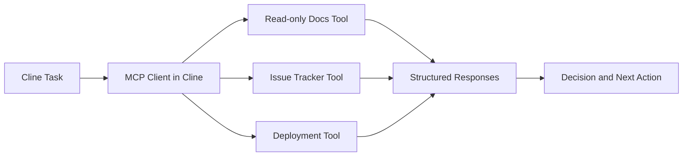
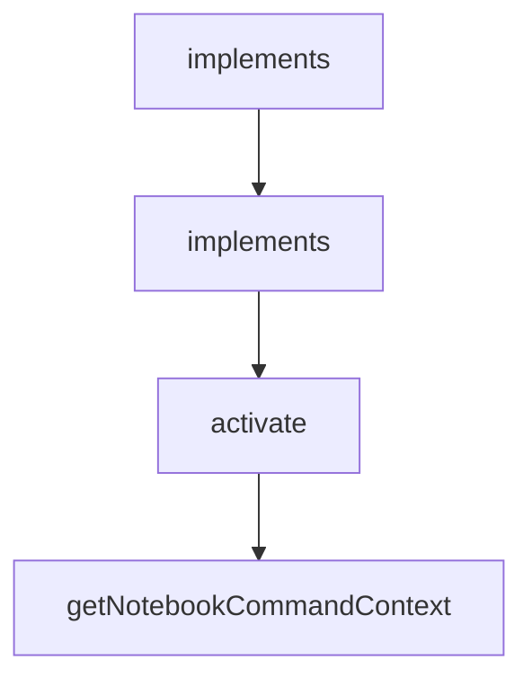

# Chapter 6: MCP and Custom Tools

Welcome to **Chapter 6: MCP and Custom Tools**. In this part of **Cline Tutorial: Agentic Coding with Human Control**, you will build an intuitive mental model first, then move into concrete implementation details and practical production tradeoffs.


Cline can be extended with MCP servers and custom tool workflows, turning it into an interface for your internal platform.

## Extension Surface

Cline docs and repository docs cover MCP integration and custom tool flows, including adding/configuring servers and transport mechanisms.

Typical enterprise use cases:

- ticket and incident retrieval
- internal documentation search
- deployment/CI operations
- cloud resource introspection

## MCP Architecture Pattern


```mermaid
flowchart LR
    A[Cline Task] --> B[MCP Client in Cline]
    B --> C1[Read-only Docs Tool]
    B --> C2[Issue Tracker Tool]
    B --> C3[Deployment Tool]
    C1 --> D[Structured Responses]
    C2 --> D
    C3 --> D
    D --> E[Decision and Next Action]
```

## Tool Contract Checklist

| Contract Area | Requirement |
|:--------------|:------------|
| input schema | typed parameters, strict validation |
| output schema | deterministic JSON-style response |
| side effects | explicit read-only vs mutating |
| retries/timeouts | bounded and predictable |
| failure states | machine-readable error types |

## Rollout Sequence

1. onboard read-only tools first
2. validate output quality across real tasks
3. add mutating tools behind strict approvals
4. monitor usage and prune low-signal tools

## Hooks and Workflow Automation

Cline docs also cover hooks/workflow-style automation. Use hooks for standardized checks, not hidden side effects.

Good hook examples:

- enforce summary format
- run lightweight lint checks on specific tasks
- inject required context for known repo workflows

Avoid hooks that quietly mutate production systems.

## Security Model for Tooling

- least-privilege credentials per tool
- environment-specific credentials (dev/stage/prod)
- full audit logs for mutating tool calls
- fast kill switch for unstable servers

## Common MCP Pitfalls

- one server doing too many unrelated actions
- vague errors forcing model guesses
- no distinction between read and write operations
- unlimited retries against unstable endpoints

## Tool Readiness Checklist

- schemas are explicit
- auth scopes are minimized
- side effects are declared
- timeout/retry behavior is tested
- approval policy is documented

## Chapter Summary

You now have a pragmatic model for extending Cline:

- MCP-first tool architecture
- controlled rollout by risk level
- hook usage with clear boundaries
- governance for secure, auditable operations

Next: [Chapter 7: Context and Cost Control](07-context-and-cost-control.md)

## Source Code Walkthrough

### `src/extension.ts`

The `implements` class in [`src/extension.ts`](https://github.com/cline/cline/blob/HEAD/src/extension.ts) handles a key part of this chapter's functionality:

```ts
	https://code.visualstudio.com/api/extension-guides/virtual-documents
	*/
	const diffContentProvider = new (class implements vscode.TextDocumentContentProvider {
		provideTextDocumentContent(uri: vscode.Uri): string {
			return Buffer.from(uri.query, "base64").toString("utf-8")
		}
	})()
	context.subscriptions.push(vscode.workspace.registerTextDocumentContentProvider(DIFF_VIEW_URI_SCHEME, diffContentProvider))

	const handleUri = async (uri: vscode.Uri) => {
		const url = decodeURIComponent(uri.toString())
		const isTaskUri = getUriPath(url) === TASK_URI_PATH

		if (isTaskUri) {
			await openClineSidebarForTaskUri()
		}

		let success = await SharedUriHandler.handleUri(url)

		// Task deeplinks can race with first-time sidebar initialization.
		if (!success && isTaskUri) {
			await openClineSidebarForTaskUri()
			success = await SharedUriHandler.handleUri(url)
		}

		if (!success) {
			Logger.warn("Extension URI handler: Failed to process URI:", uri.toString())
		}
	}
	context.subscriptions.push(vscode.window.registerUriHandler({ handleUri }))

	// Register size testing commands in development mode
```

This class is important because it defines how Cline Tutorial: Agentic Coding with Human Control implements the patterns covered in this chapter.

### `src/extension.ts`

The `implements` class in [`src/extension.ts`](https://github.com/cline/cline/blob/HEAD/src/extension.ts) handles a key part of this chapter's functionality:

```ts
	https://code.visualstudio.com/api/extension-guides/virtual-documents
	*/
	const diffContentProvider = new (class implements vscode.TextDocumentContentProvider {
		provideTextDocumentContent(uri: vscode.Uri): string {
			return Buffer.from(uri.query, "base64").toString("utf-8")
		}
	})()
	context.subscriptions.push(vscode.workspace.registerTextDocumentContentProvider(DIFF_VIEW_URI_SCHEME, diffContentProvider))

	const handleUri = async (uri: vscode.Uri) => {
		const url = decodeURIComponent(uri.toString())
		const isTaskUri = getUriPath(url) === TASK_URI_PATH

		if (isTaskUri) {
			await openClineSidebarForTaskUri()
		}

		let success = await SharedUriHandler.handleUri(url)

		// Task deeplinks can race with first-time sidebar initialization.
		if (!success && isTaskUri) {
			await openClineSidebarForTaskUri()
			success = await SharedUriHandler.handleUri(url)
		}

		if (!success) {
			Logger.warn("Extension URI handler: Failed to process URI:", uri.toString())
		}
	}
	context.subscriptions.push(vscode.window.registerUriHandler({ handleUri }))

	// Register size testing commands in development mode
```

This class is important because it defines how Cline Tutorial: Agentic Coding with Human Control implements the patterns covered in this chapter.

### `src/extension.ts`

The `activate` function in [`src/extension.ts`](https://github.com/cline/cline/blob/HEAD/src/extension.ts) handles a key part of this chapter's functionality:

```ts
import { fileExistsAtPath } from "./utils/fs"

// This method is called when the VS Code extension is activated.
// NOTE: This is VS Code specific - services that should be registered
// for all-platform should be registered in common.ts.
export async function activate(context: vscode.ExtensionContext) {
	const activationStartTime = performance.now()

	// 1. Set up HostProvider for VSCode
	// IMPORTANT: This must be done before any service can be registered
	setupHostProvider(context)

	// 2. Clean up legacy data patterns within VSCode's native storage.
	// Moves workspace→global keys, task history→file, custom instructions→rules, etc.
	// Must run BEFORE the file export so we copy clean state.
	await cleanupLegacyVSCodeStorage(context)

	// 3. One-time export of VSCode's native storage to shared file-backed stores.
	// After this, all platforms (VSCode, CLI, JetBrains) read from ~/.cline/data/.
	const workspacePath = vscode.workspace.workspaceFolders?.[0]?.uri.fsPath
	const storageContext = createStorageContext({ workspacePath })
	await exportVSCodeStorageToSharedFiles(context, storageContext)

	// 4. Register services and perform common initialization
	// IMPORTANT: Must be done after host provider is setup and migrations are complete
	const webview = (await initialize(storageContext)) as VscodeWebviewProvider

	// 5. Register services and commands specific to VS Code
	// Initialize test mode and add disposables to context
	const testModeWatchers = await initializeTestMode(webview)
	context.subscriptions.push(...testModeWatchers)

```

This function is important because it defines how Cline Tutorial: Agentic Coding with Human Control implements the patterns covered in this chapter.

### `src/extension.ts`

The `getNotebookCommandContext` function in [`src/extension.ts`](https://github.com/cline/cline/blob/HEAD/src/extension.ts) handles a key part of this chapter's functionality:

```ts

	// Helper to get notebook context for Jupyter commands
	async function getNotebookCommandContext(range?: vscode.Range, diagnostics?: vscode.Diagnostic[]) {
		const activeNotebook = vscode.window.activeNotebookEditor
		if (!activeNotebook) {
			HostProvider.window.showMessage({
				type: ShowMessageType.ERROR,
				message: "No active Jupyter notebook found. Please open a .ipynb file first.",
			})
			return null
		}

		const ctx = await getContextForCommand(range, diagnostics)
		if (!ctx) {
			return null
		}

		const filePath = ctx.commandContext.filePath || ""
		let cellJson: string | null = null
		if (activeNotebook.notebook.cellCount > 0) {
			const cellIndex = activeNotebook.notebook.cellAt(activeNotebook.selection.start).index
			cellJson = await findMatchingNotebookCell(filePath, cellIndex)
		}

		return { ...ctx, cellJson }
	}

	context.subscriptions.push(
		vscode.commands.registerCommand(
			commands.JupyterGenerateCell,
			async (range?: vscode.Range, diagnostics?: vscode.Diagnostic[]) => {
				const userPrompt = await showJupyterPromptInput(
```

This function is important because it defines how Cline Tutorial: Agentic Coding with Human Control implements the patterns covered in this chapter.


## How These Components Connect


```mermaid
flowchart TD
    A[implements]
    B[implements]
    C[activate]
    D[getNotebookCommandContext]
    A --> B
    B --> C
    C --> D
```
