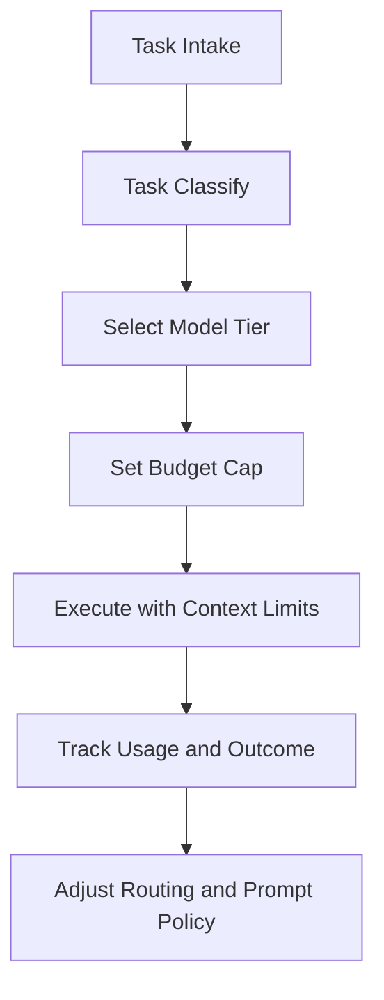

# Chapter 7: Context and Cost Control

For large repositories, output quality depends on context discipline and model-cost governance.

## Core Principle

Better context beats more context.

Relevant, bounded context yields better edits and lower cost than dumping entire repositories into each task.

## Context Strategy

| Technique | Outcome |
|:----------|:--------|
| scoped file targets | lower token waste |
| explicit logs/errors | better root-cause grounding |
| task decomposition | fewer context overflows |
| context mentions (`@file`, `@folder`, `@url`, etc.) | deterministic grounding inputs |

## Cost Governance Framework



## Model Tiering by Task Class

| Task Type | Suggested Tier |
|:----------|:---------------|
| simple refactors | low-cost/fast model |
| architectural planning | high-reasoning model |
| bug RCA with logs | medium-to-high reasoning model |
| repetitive formatting/documentation | cost-efficient model |

Define these tiers once per team to reduce random switching.

## Auto-Compaction and Task Continuity

Cline documentation includes context management features (for example auto-compaction). Treat compaction as a continuity mechanism, not a replacement for good scoping.

Best practice:

- keep each task purpose-focused
- summarize state before context transitions
- preserve key constraints in each iteration prompt

## Budget Controls

Minimum budget controls:

- per-task spend ceiling
- per-session spend visibility
- alerting on unusual spend acceleration
- weekly review by task category

## Prompt Template for Cost Control

```text
Goal:
Allowed files:
Validation command:
Model tier:
Budget cap:
Stop conditions:
```

This creates predictable quality-cost tradeoffs.

## Failure Patterns

### Context dilution

Symptom: model drifts and touches unrelated areas.

Fix: narrower file scope + direct error evidence.

### Cost blowouts

Symptom: long task loops with little progress.

Fix: split tasks and downgrade model for low-complexity steps.

### Summary loss between iterations

Symptom: repeated rediscovery work.

Fix: enforce short state summary at each loop boundary.

## Chapter Summary

You now have a scalable context-and-cost operating model:

- bounded, relevant context
- model tiering by task class
- explicit budget controls
- continuity strategy for long tasks

Next: [Chapter 8: Team and Enterprise Operations](08-team-and-enterprise-operations.md)
