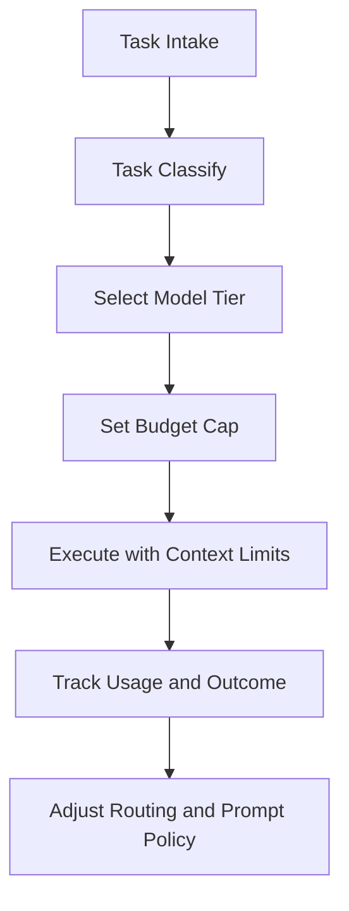
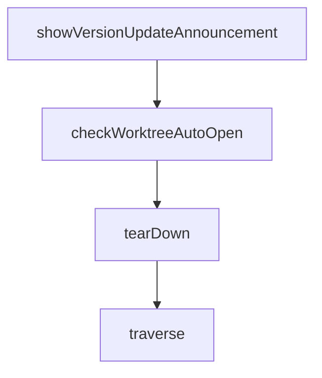

# Chapter 7: Context and Cost Control

Welcome to **Chapter 7: Context and Cost Control**. In this part of **Cline Tutorial: Agentic Coding with Human Control**, you will build an intuitive mental model first, then move into concrete implementation details and practical production tradeoffs.


For large repositories, output quality depends on context discipline and model-cost governance.

## Core Principle

Better context beats more context.

Relevant, bounded context yields better edits and lower cost than dumping entire repositories into each task.

## Context Strategy

| Technique | Outcome |
|:----------|:--------|
| scoped file targets | lower token waste |
| explicit logs/errors | better root-cause grounding |
| task decomposition | fewer context overflows |
| context mentions (`@file`, `@folder`, `@url`, etc.) | deterministic grounding inputs |

## Cost Governance Framework


```mermaid
flowchart TD
    A[Task Intake] --> B[Task Classify]
    B --> C[Select Model Tier]
    C --> D[Set Budget Cap]
    D --> E[Execute with Context Limits]
    E --> F[Track Usage and Outcome]
    F --> G[Adjust Routing and Prompt Policy]
```

## Model Tiering by Task Class

| Task Type | Suggested Tier |
|:----------|:---------------|
| simple refactors | low-cost/fast model |
| architectural planning | high-reasoning model |
| bug RCA with logs | medium-to-high reasoning model |
| repetitive formatting/documentation | cost-efficient model |

Define these tiers once per team to reduce random switching.

## Auto-Compaction and Task Continuity

Cline documentation includes context management features (for example auto-compaction). Treat compaction as a continuity mechanism, not a replacement for good scoping.

Best practice:

- keep each task purpose-focused
- summarize state before context transitions
- preserve key constraints in each iteration prompt

## Budget Controls

Minimum budget controls:

- per-task spend ceiling
- per-session spend visibility
- alerting on unusual spend acceleration
- weekly review by task category

## Prompt Template for Cost Control

```text
Goal:
Allowed files:
Validation command:
Model tier:
Budget cap:
Stop conditions:
```

This creates predictable quality-cost tradeoffs.

## Failure Patterns

### Context dilution

Symptom: model drifts and touches unrelated areas.

Fix: narrower file scope + direct error evidence.

### Cost blowouts

Symptom: long task loops with little progress.

Fix: split tasks and downgrade model for low-complexity steps.

### Summary loss between iterations

Symptom: repeated rediscovery work.

Fix: enforce short state summary at each loop boundary.

## Chapter Summary

You now have a scalable context-and-cost operating model:

- bounded, relevant context
- model tiering by task class
- explicit budget controls
- continuity strategy for long tasks

Next: [Chapter 8: Team and Enterprise Operations](08-team-and-enterprise-operations.md)

## Depth Expansion Playbook

## Source Code Walkthrough

### `src/common.ts`

The `showVersionUpdateAnnouncement` function in [`src/common.ts`](https://github.com/cline/cline/blob/HEAD/src/common.ts) handles a key part of this chapter's functionality:

```ts
	const stateManager = StateManager.get()
	// Non-blocking announcement check and display
	showVersionUpdateAnnouncement(stateManager)
	// Check if this workspace was opened from worktree quick launch
	await checkWorktreeAutoOpen(stateManager)

	// =============== Background sync and cleanup tasks ===============
	// Use remote config blobStoreConfig if available, otherwise fall back to env vars
	const blobStoreSettings = stateManager.getRemoteConfigSettings()?.blobStoreConfig ?? getBlobStoreSettingsFromEnv()
	syncWorker().init({ ...blobStoreSettings, userDistinctId: getDistinctId() })
	// Clean up old temp files in background (non-blocking) and start periodic cleanup every 24 hours
	ClineTempManager.startPeriodicCleanup()
	// Clean up orphaned file context warnings (startup cleanup)
	FileContextTracker.cleanupOrphanedWarnings(stateManager)

	telemetryService.captureExtensionActivated()

	return webview
}

async function showVersionUpdateAnnouncement(stateManager: StateManager) {
	// Version checking for autoupdate notification
	const currentVersion = ExtensionRegistryInfo.version
	const previousVersion = stateManager.getGlobalStateKey("clineVersion")
	// Perform post-update actions if necessary
	try {
		if (!previousVersion || currentVersion !== previousVersion) {
			Logger.log(`Cline version changed: ${previousVersion} -> ${currentVersion}. First run or update detected.`)

			// Check if there's a new announcement to show
			const lastShownAnnouncementId = stateManager.getGlobalStateKey("lastShownAnnouncementId")
			const latestAnnouncementId = getLatestAnnouncementId()
```

This function is important because it defines how Cline Tutorial: Agentic Coding with Human Control implements the patterns covered in this chapter.

### `src/common.ts`

The `checkWorktreeAutoOpen` function in [`src/common.ts`](https://github.com/cline/cline/blob/HEAD/src/common.ts) handles a key part of this chapter's functionality:

```ts
	showVersionUpdateAnnouncement(stateManager)
	// Check if this workspace was opened from worktree quick launch
	await checkWorktreeAutoOpen(stateManager)

	// =============== Background sync and cleanup tasks ===============
	// Use remote config blobStoreConfig if available, otherwise fall back to env vars
	const blobStoreSettings = stateManager.getRemoteConfigSettings()?.blobStoreConfig ?? getBlobStoreSettingsFromEnv()
	syncWorker().init({ ...blobStoreSettings, userDistinctId: getDistinctId() })
	// Clean up old temp files in background (non-blocking) and start periodic cleanup every 24 hours
	ClineTempManager.startPeriodicCleanup()
	// Clean up orphaned file context warnings (startup cleanup)
	FileContextTracker.cleanupOrphanedWarnings(stateManager)

	telemetryService.captureExtensionActivated()

	return webview
}

async function showVersionUpdateAnnouncement(stateManager: StateManager) {
	// Version checking for autoupdate notification
	const currentVersion = ExtensionRegistryInfo.version
	const previousVersion = stateManager.getGlobalStateKey("clineVersion")
	// Perform post-update actions if necessary
	try {
		if (!previousVersion || currentVersion !== previousVersion) {
			Logger.log(`Cline version changed: ${previousVersion} -> ${currentVersion}. First run or update detected.`)

			// Check if there's a new announcement to show
			const lastShownAnnouncementId = stateManager.getGlobalStateKey("lastShownAnnouncementId")
			const latestAnnouncementId = getLatestAnnouncementId()

			if (lastShownAnnouncementId !== latestAnnouncementId) {
```

This function is important because it defines how Cline Tutorial: Agentic Coding with Human Control implements the patterns covered in this chapter.

### `src/common.ts`

The `tearDown` function in [`src/common.ts`](https://github.com/cline/cline/blob/HEAD/src/common.ts) handles a key part of this chapter's functionality:

```ts
 * Performs cleanup when Cline is deactivated that is common to all platforms.
 */
export async function tearDown(): Promise<void> {
	AgentConfigLoader.getInstance()?.dispose()
	PostHogClientProvider.getInstance().dispose()
	telemetryService.dispose()
	ErrorService.get().dispose()
	featureFlagsService.dispose()
	// Dispose all webview instances
	await WebviewProvider.disposeAllInstances()
	syncWorker().dispose()
	clearOnboardingModelsCache()

	// Kill any running hook processes to prevent zombies
	await HookProcessRegistry.terminateAll()
	// Clean up hook discovery cache
	HookDiscoveryCache.getInstance().dispose()
	// Stop periodic temp file cleanup
	ClineTempManager.stopPeriodicCleanup()

	// Clean up test mode
	cleanupTestMode()
}

```

This function is important because it defines how Cline Tutorial: Agentic Coding with Human Control implements the patterns covered in this chapter.

### `scripts/generate-stubs.js`

The `traverse` function in [`scripts/generate-stubs.js`](https://github.com/cline/cline/blob/HEAD/scripts/generate-stubs.js) handles a key part of this chapter's functionality:

```js
const { Project, SyntaxKind } = require("ts-morph")

function traverse(container, output, prefix = "") {
	for (const node of container.getStatements()) {
		const kind = node.getKind()

		if (kind === SyntaxKind.ModuleDeclaration) {
			const name = node.getName().replace(/^['"]|['"]$/g, "")
			var fullPrefix
			if (prefix) {
				fullPrefix = `${prefix}.${name}`
			} else {
				fullPrefix = name
			}
			output.push(`${fullPrefix} = {};`)
			const body = node.getBody()
			if (body && body.getKind() === SyntaxKind.ModuleBlock) {
				traverse(body, output, fullPrefix)
			}
		} else if (kind === SyntaxKind.FunctionDeclaration) {
			const name = node.getName()
			const params = node.getParameters().map((p, i) => sanitizeParam(p.getName(), i))
			const typeNode = node.getReturnTypeNode()
			const returnType = typeNode ? typeNode.getText() : ""
			const ret = mapReturn(returnType)
			output.push(
				`${prefix}.${name} = function(${params.join(", ")}) { console.log('Called stubbed function: ${prefix}.${name}');  ${ret} };`,
			)
		} else if (kind === SyntaxKind.EnumDeclaration) {
			const name = node.getName()
			const members = node.getMembers().map((m) => m.getName())
			output.push(`${prefix}.${name} = { ${members.map((m) => `${m}: 0`).join(", ")} };`)
```

This function is important because it defines how Cline Tutorial: Agentic Coding with Human Control implements the patterns covered in this chapter.


## How These Components Connect


```mermaid
flowchart TD
    A[showVersionUpdateAnnouncement]
    B[checkWorktreeAutoOpen]
    C[tearDown]
    D[traverse]
    A --> B
    B --> C
    C --> D
```
