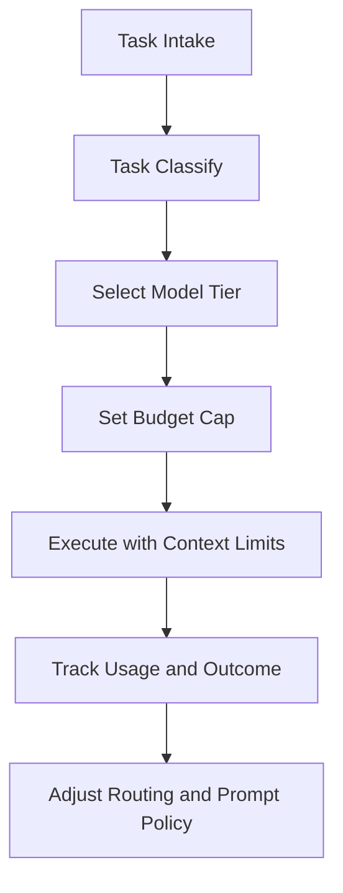
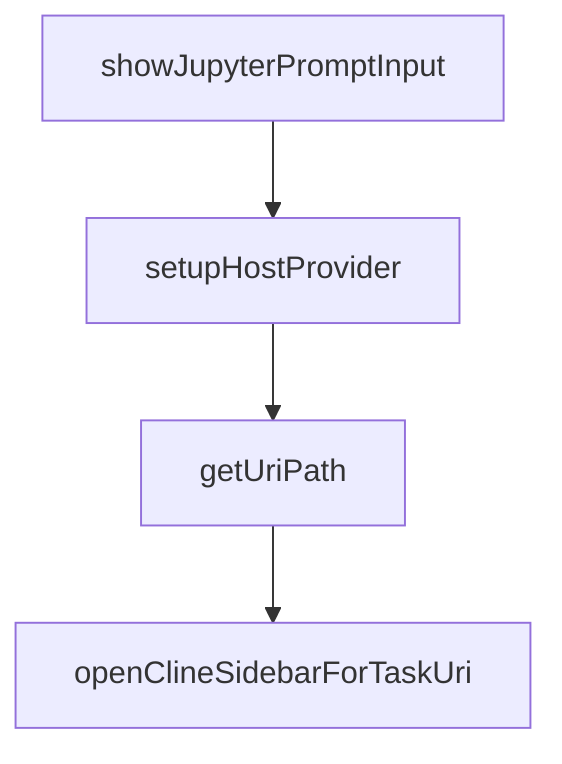

# Chapter 7: Context and Cost Control

Welcome to **Chapter 7: Context and Cost Control**. In this part of **Cline Tutorial: Agentic Coding with Human Control**, you will build an intuitive mental model first, then move into concrete implementation details and practical production tradeoffs.


For large repositories, output quality depends on context discipline and model-cost governance.

## Core Principle

Better context beats more context.

Relevant, bounded context yields better edits and lower cost than dumping entire repositories into each task.

## Context Strategy

| Technique | Outcome |
|:----------|:--------|
| scoped file targets | lower token waste |
| explicit logs/errors | better root-cause grounding |
| task decomposition | fewer context overflows |
| context mentions (`@file`, `@folder`, `@url`, etc.) | deterministic grounding inputs |

## Cost Governance Framework


```mermaid
flowchart TD
    A[Task Intake] --> B[Task Classify]
    B --> C[Select Model Tier]
    C --> D[Set Budget Cap]
    D --> E[Execute with Context Limits]
    E --> F[Track Usage and Outcome]
    F --> G[Adjust Routing and Prompt Policy]
```

## Model Tiering by Task Class

| Task Type | Suggested Tier |
|:----------|:---------------|
| simple refactors | low-cost/fast model |
| architectural planning | high-reasoning model |
| bug RCA with logs | medium-to-high reasoning model |
| repetitive formatting/documentation | cost-efficient model |

Define these tiers once per team to reduce random switching.

## Auto-Compaction and Task Continuity

Cline documentation includes context management features (for example auto-compaction). Treat compaction as a continuity mechanism, not a replacement for good scoping.

Best practice:

- keep each task purpose-focused
- summarize state before context transitions
- preserve key constraints in each iteration prompt

## Budget Controls

Minimum budget controls:

- per-task spend ceiling
- per-session spend visibility
- alerting on unusual spend acceleration
- weekly review by task category

## Prompt Template for Cost Control

```text
Goal:
Allowed files:
Validation command:
Model tier:
Budget cap:
Stop conditions:
```

This creates predictable quality-cost tradeoffs.

## Failure Patterns

### Context dilution

Symptom: model drifts and touches unrelated areas.

Fix: narrower file scope + direct error evidence.

### Cost blowouts

Symptom: long task loops with little progress.

Fix: split tasks and downgrade model for low-complexity steps.

### Summary loss between iterations

Symptom: repeated rediscovery work.

Fix: enforce short state summary at each loop boundary.

## Chapter Summary

You now have a scalable context-and-cost operating model:

- bounded, relevant context
- model tiering by task class
- explicit budget controls
- continuity strategy for long tasks

Next: [Chapter 8: Team and Enterprise Operations](08-team-and-enterprise-operations.md)

## Source Code Walkthrough

### `src/extension.ts`

The `showJupyterPromptInput` function in [`src/extension.ts`](https://github.com/cline/cline/blob/HEAD/src/extension.ts) handles a key part of this chapter's functionality:

```ts
			commands.JupyterGenerateCell,
			async (range?: vscode.Range, diagnostics?: vscode.Diagnostic[]) => {
				const userPrompt = await showJupyterPromptInput(
					"Generate Notebook Cell",
					"Enter your prompt for generating notebook cell (press Enter to confirm & Esc to cancel)",
				)
				if (!userPrompt) return

				const ctx = await getNotebookCommandContext(range, diagnostics)
				if (!ctx) return

				const notebookContext = `User prompt: ${userPrompt}
Insert a new Jupyter notebook cell above or below the current cell based on user prompt.
${NOTEBOOK_EDIT_INSTRUCTIONS}

Current Notebook Cell Context (JSON, sanitized of image data):
\`\`\`json
${ctx.cellJson || "{}"}
\`\`\``

				await addToCline(ctx.controller, ctx.commandContext, notebookContext)
			},
		),
	)

	context.subscriptions.push(
		vscode.commands.registerCommand(
			commands.JupyterExplainCell,
			async (range?: vscode.Range, diagnostics?: vscode.Diagnostic[]) => {
				const ctx = await getNotebookCommandContext(range, diagnostics)
				if (!ctx) return

```

This function is important because it defines how Cline Tutorial: Agentic Coding with Human Control implements the patterns covered in this chapter.

### `src/extension.ts`

The `setupHostProvider` function in [`src/extension.ts`](https://github.com/cline/cline/blob/HEAD/src/extension.ts) handles a key part of this chapter's functionality:

```ts
	// 1. Set up HostProvider for VSCode
	// IMPORTANT: This must be done before any service can be registered
	setupHostProvider(context)

	// 2. Clean up legacy data patterns within VSCode's native storage.
	// Moves workspace→global keys, task history→file, custom instructions→rules, etc.
	// Must run BEFORE the file export so we copy clean state.
	await cleanupLegacyVSCodeStorage(context)

	// 3. One-time export of VSCode's native storage to shared file-backed stores.
	// After this, all platforms (VSCode, CLI, JetBrains) read from ~/.cline/data/.
	const workspacePath = vscode.workspace.workspaceFolders?.[0]?.uri.fsPath
	const storageContext = createStorageContext({ workspacePath })
	await exportVSCodeStorageToSharedFiles(context, storageContext)

	// 4. Register services and perform common initialization
	// IMPORTANT: Must be done after host provider is setup and migrations are complete
	const webview = (await initialize(storageContext)) as VscodeWebviewProvider

	// 5. Register services and commands specific to VS Code
	// Initialize test mode and add disposables to context
	const testModeWatchers = await initializeTestMode(webview)
	context.subscriptions.push(...testModeWatchers)

	// Initialize hook discovery cache for performance optimization
	HookDiscoveryCache.getInstance().initialize(
		context as any, // Adapt VSCode ExtensionContext to generic interface
		(dir: string) => {
			try {
				const pattern = new vscode.RelativePattern(dir, "*")
				const watcher = vscode.workspace.createFileSystemWatcher(pattern)
				// Ensure watcher is disposed when extension is deactivated
```

This function is important because it defines how Cline Tutorial: Agentic Coding with Human Control implements the patterns covered in this chapter.

### `src/extension.ts`

The `getUriPath` function in [`src/extension.ts`](https://github.com/cline/cline/blob/HEAD/src/extension.ts) handles a key part of this chapter's functionality:

```ts
	const handleUri = async (uri: vscode.Uri) => {
		const url = decodeURIComponent(uri.toString())
		const isTaskUri = getUriPath(url) === TASK_URI_PATH

		if (isTaskUri) {
			await openClineSidebarForTaskUri()
		}

		let success = await SharedUriHandler.handleUri(url)

		// Task deeplinks can race with first-time sidebar initialization.
		if (!success && isTaskUri) {
			await openClineSidebarForTaskUri()
			success = await SharedUriHandler.handleUri(url)
		}

		if (!success) {
			Logger.warn("Extension URI handler: Failed to process URI:", uri.toString())
		}
	}
	context.subscriptions.push(vscode.window.registerUriHandler({ handleUri }))

	// Register size testing commands in development mode
	if (IS_DEV) {
		vscode.commands.executeCommand("setContext", "cline.isDevMode", IS_DEV)
		// Use dynamic import to avoid loading the module in production
		import("./dev/commands/tasks")
			.then((module) => {
				const devTaskCommands = module.registerTaskCommands(webview.controller)
				context.subscriptions.push(...devTaskCommands)
				Logger.log("[Cline Dev] Dev mode activated & dev commands registered")
			})
```

This function is important because it defines how Cline Tutorial: Agentic Coding with Human Control implements the patterns covered in this chapter.

### `src/extension.ts`

The `openClineSidebarForTaskUri` function in [`src/extension.ts`](https://github.com/cline/cline/blob/HEAD/src/extension.ts) handles a key part of this chapter's functionality:

```ts

		if (isTaskUri) {
			await openClineSidebarForTaskUri()
		}

		let success = await SharedUriHandler.handleUri(url)

		// Task deeplinks can race with first-time sidebar initialization.
		if (!success && isTaskUri) {
			await openClineSidebarForTaskUri()
			success = await SharedUriHandler.handleUri(url)
		}

		if (!success) {
			Logger.warn("Extension URI handler: Failed to process URI:", uri.toString())
		}
	}
	context.subscriptions.push(vscode.window.registerUriHandler({ handleUri }))

	// Register size testing commands in development mode
	if (IS_DEV) {
		vscode.commands.executeCommand("setContext", "cline.isDevMode", IS_DEV)
		// Use dynamic import to avoid loading the module in production
		import("./dev/commands/tasks")
			.then((module) => {
				const devTaskCommands = module.registerTaskCommands(webview.controller)
				context.subscriptions.push(...devTaskCommands)
				Logger.log("[Cline Dev] Dev mode activated & dev commands registered")
			})
			.catch((error) => {
				Logger.log("[Cline Dev] Failed to register dev commands: " + error)
			})
```

This function is important because it defines how Cline Tutorial: Agentic Coding with Human Control implements the patterns covered in this chapter.


## How These Components Connect


```mermaid
flowchart TD
    A[showJupyterPromptInput]
    B[setupHostProvider]
    C[getUriPath]
    D[openClineSidebarForTaskUri]
    A --> B
    B --> C
    C --> D
```
