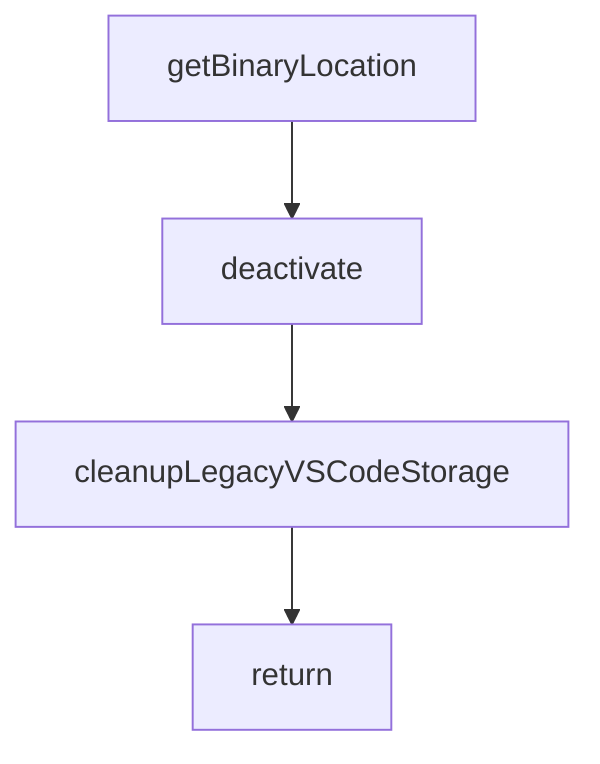

# Chapter 8: Team and Enterprise Operations

Welcome to **Chapter 8: Team and Enterprise Operations**. In this part of **Cline Tutorial: Agentic Coding with Human Control**, you will build an intuitive mental model first, then move into concrete implementation details and practical production tradeoffs.


This chapter covers how to operate Cline consistently across teams, including policy, observability, and incident readiness.

## Team Operating Baseline

Standardize these four items first:

1. shared prompt/task template
2. command allowlist and denylist
3. review thresholds for high-risk edits
4. model tiering and budget policy

Without this baseline, output quality and cost vary wildly across engineers.

## Enterprise Control Areas

| Control Area | Purpose |
|:-------------|:--------|
| identity and access | ensure only authorized users and roles can perform privileged actions |
| policy and config management | enforce consistent command/tool behavior across teams |
| telemetry and audit trails | understand usage, failures, and risk patterns |
| network and data boundaries | align agent operations with security requirements |

## Release and Policy Change Process

Treat policy updates like code changes:

1. propose policy change
2. test in staging with representative tasks
3. measure impact on quality/cost/latency
4. roll out gradually with rollback path

## Operational Metrics

Track these signals weekly:

- task completion success rate
- percentage of tasks requiring rollback
- command/tool error rate by category
- median task cycle time
- average cost per completed task

## Alerting Priorities

Alert on:

- sudden provider error spikes
- command timeout surges
- unusual cost acceleration
- increase in rejected high-risk patches
- repeated MCP tool failure patterns

## Incident Playbooks

### Provider incident

- route to fallback model/provider profile
- temporarily tighten task scope policy
- communicate expected degradation

### Unsafe automation behavior

- disable risky tools or approvals mode
- enforce manual review-only operation
- analyze prompt and policy drift

### Cost incident

- impose lower budget caps
- reduce high-tier model usage
- run post-incident routing review

## Governance and Compliance Notes

For regulated environments, add:

- retention policies for task logs and command evidence
- redaction strategy for sensitive prompt content
- formal access review cadence
- control evidence for audits

## Maturity Model

| Stage | Characteristics |
|:------|:----------------|
| pilot | individual usage, manual policy |
| team | shared templates and approval rules |
| scaled | centralized monitoring and budget governance |
| enterprise | identity integration, policy-as-code, audit-ready operations |

## Final Summary

You now have an end-to-end Cline operating model:

- safe installation and workflow patterns
- governed edit, command, browser, and MCP usage
- large-repo context/cost controls
- team and enterprise-scale operations discipline

Related:

- [Roo Code Tutorial](../roo-code-tutorial/)
- [Continue Tutorial](../continue-tutorial/)
- [OpenHands Tutorial](../openhands-tutorial/)
- [MCP Servers Tutorial](../mcp-servers-tutorial/)

## Source Code Walkthrough

### `src/extension.ts`

The `getBinaryLocation` function in [`src/extension.ts`](https://github.com/cline/cline/blob/HEAD/src/extension.ts) handles a key part of this chapter's functionality:

```ts
		() => {}, // No-op logger, logging is handled via HostProvider.env.debugLog
		getCallbackUrl,
		getBinaryLocation,
		context.extensionUri.fsPath,
		context.globalStorageUri.fsPath,
	)
}

function getUriPath(url: string): string | undefined {
	try {
		return new URL(url).pathname
	} catch {
		return undefined
	}
}

async function openClineSidebarForTaskUri(): Promise<void> {
	const sidebarWaitTimeoutMs = 3000
	const sidebarWaitIntervalMs = 50

	await vscode.commands.executeCommand(`${ExtensionRegistryInfo.views.Sidebar}.focus`)

	const startedAt = Date.now()
	while (Date.now() - startedAt < sidebarWaitTimeoutMs) {
		if (WebviewProvider.getVisibleInstance()) {
			return
		}
		await new Promise((resolve) => setTimeout(resolve, sidebarWaitIntervalMs))
	}

	Logger.warn("Task URI handling timed out waiting for Cline sidebar visibility")
}
```

This function is important because it defines how Cline Tutorial: Agentic Coding with Human Control implements the patterns covered in this chapter.

### `src/extension.ts`

The `deactivate` function in [`src/extension.ts`](https://github.com/cline/cline/blob/HEAD/src/extension.ts) handles a key part of this chapter's functionality:

```ts
				const pattern = new vscode.RelativePattern(dir, "*")
				const watcher = vscode.workspace.createFileSystemWatcher(pattern)
				// Ensure watcher is disposed when extension is deactivated
				context.subscriptions.push(watcher)
				// Adapt VSCode FileSystemWatcher to generic interface
				return {
					onDidCreate: (listener: () => void) => watcher.onDidCreate(listener),
					onDidChange: (listener: () => void) => watcher.onDidChange(listener),
					onDidDelete: (listener: () => void) => watcher.onDidDelete(listener),
					dispose: () => watcher.dispose(),
				}
			} catch {
				return null
			}
		},
		(callback: () => void) => {
			// Adapt VSCode Disposable to generic interface
			const disposable = vscode.workspace.onDidChangeWorkspaceFolders(callback)
			context.subscriptions.push(disposable)
			return disposable
		},
	)

	context.subscriptions.push(
		vscode.window.registerWebviewViewProvider(VscodeWebviewProvider.SIDEBAR_ID, webview, {
			webviewOptions: { retainContextWhenHidden: true },
		}),
	)

	// NOTE: Commands must be added to the internal registry before registering them with VSCode
	const { commands } = ExtensionRegistryInfo

```

This function is important because it defines how Cline Tutorial: Agentic Coding with Human Control implements the patterns covered in this chapter.

### `src/extension.ts`

The `cleanupLegacyVSCodeStorage` function in [`src/extension.ts`](https://github.com/cline/cline/blob/HEAD/src/extension.ts) handles a key part of this chapter's functionality:

```ts
	// Moves workspace→global keys, task history→file, custom instructions→rules, etc.
	// Must run BEFORE the file export so we copy clean state.
	await cleanupLegacyVSCodeStorage(context)

	// 3. One-time export of VSCode's native storage to shared file-backed stores.
	// After this, all platforms (VSCode, CLI, JetBrains) read from ~/.cline/data/.
	const workspacePath = vscode.workspace.workspaceFolders?.[0]?.uri.fsPath
	const storageContext = createStorageContext({ workspacePath })
	await exportVSCodeStorageToSharedFiles(context, storageContext)

	// 4. Register services and perform common initialization
	// IMPORTANT: Must be done after host provider is setup and migrations are complete
	const webview = (await initialize(storageContext)) as VscodeWebviewProvider

	// 5. Register services and commands specific to VS Code
	// Initialize test mode and add disposables to context
	const testModeWatchers = await initializeTestMode(webview)
	context.subscriptions.push(...testModeWatchers)

	// Initialize hook discovery cache for performance optimization
	HookDiscoveryCache.getInstance().initialize(
		context as any, // Adapt VSCode ExtensionContext to generic interface
		(dir: string) => {
			try {
				const pattern = new vscode.RelativePattern(dir, "*")
				const watcher = vscode.workspace.createFileSystemWatcher(pattern)
				// Ensure watcher is disposed when extension is deactivated
				context.subscriptions.push(watcher)
				// Adapt VSCode FileSystemWatcher to generic interface
				return {
					onDidCreate: (listener: () => void) => watcher.onDidCreate(listener),
					onDidChange: (listener: () => void) => watcher.onDidChange(listener),
```

This function is important because it defines how Cline Tutorial: Agentic Coding with Human Control implements the patterns covered in this chapter.

### `src/extension.ts`

The `return` interface in [`src/extension.ts`](https://github.com/cline/cline/blob/HEAD/src/extension.ts) handles a key part of this chapter's functionality:

```ts
				context.subscriptions.push(watcher)
				// Adapt VSCode FileSystemWatcher to generic interface
				return {
					onDidCreate: (listener: () => void) => watcher.onDidCreate(listener),
					onDidChange: (listener: () => void) => watcher.onDidChange(listener),
					onDidDelete: (listener: () => void) => watcher.onDidDelete(listener),
					dispose: () => watcher.dispose(),
				}
			} catch {
				return null
			}
		},
		(callback: () => void) => {
			// Adapt VSCode Disposable to generic interface
			const disposable = vscode.workspace.onDidChangeWorkspaceFolders(callback)
			context.subscriptions.push(disposable)
			return disposable
		},
	)

	context.subscriptions.push(
		vscode.window.registerWebviewViewProvider(VscodeWebviewProvider.SIDEBAR_ID, webview, {
			webviewOptions: { retainContextWhenHidden: true },
		}),
	)

	// NOTE: Commands must be added to the internal registry before registering them with VSCode
	const { commands } = ExtensionRegistryInfo

	context.subscriptions.push(
		vscode.commands.registerCommand(commands.PlusButton, async () => {
			const sidebarInstance = WebviewProvider.getInstance()
```

This interface is important because it defines how Cline Tutorial: Agentic Coding with Human Control implements the patterns covered in this chapter.


## How These Components Connect


