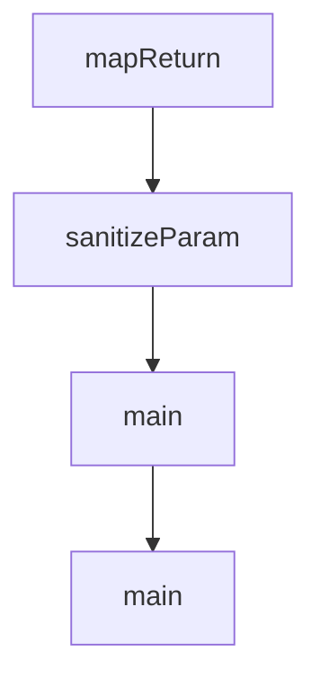

# Chapter 8: Team and Enterprise Operations

Welcome to **Chapter 8: Team and Enterprise Operations**. In this part of **Cline Tutorial: Agentic Coding with Human Control**, you will build an intuitive mental model first, then move into concrete implementation details and practical production tradeoffs.


This chapter covers how to operate Cline consistently across teams, including policy, observability, and incident readiness.

## Team Operating Baseline

Standardize these four items first:

1. shared prompt/task template
2. command allowlist and denylist
3. review thresholds for high-risk edits
4. model tiering and budget policy

Without this baseline, output quality and cost vary wildly across engineers.

## Enterprise Control Areas

| Control Area | Purpose |
|:-------------|:--------|
| identity and access | ensure only authorized users and roles can perform privileged actions |
| policy and config management | enforce consistent command/tool behavior across teams |
| telemetry and audit trails | understand usage, failures, and risk patterns |
| network and data boundaries | align agent operations with security requirements |

## Release and Policy Change Process

Treat policy updates like code changes:

1. propose policy change
2. test in staging with representative tasks
3. measure impact on quality/cost/latency
4. roll out gradually with rollback path

## Operational Metrics

Track these signals weekly:

- task completion success rate
- percentage of tasks requiring rollback
- command/tool error rate by category
- median task cycle time
- average cost per completed task

## Alerting Priorities

Alert on:

- sudden provider error spikes
- command timeout surges
- unusual cost acceleration
- increase in rejected high-risk patches
- repeated MCP tool failure patterns

## Incident Playbooks

### Provider incident

- route to fallback model/provider profile
- temporarily tighten task scope policy
- communicate expected degradation

### Unsafe automation behavior

- disable risky tools or approvals mode
- enforce manual review-only operation
- analyze prompt and policy drift

### Cost incident

- impose lower budget caps
- reduce high-tier model usage
- run post-incident routing review

## Governance and Compliance Notes

For regulated environments, add:

- retention policies for task logs and command evidence
- redaction strategy for sensitive prompt content
- formal access review cadence
- control evidence for audits

## Maturity Model

| Stage | Characteristics |
|:------|:----------------|
| pilot | individual usage, manual policy |
| team | shared templates and approval rules |
| scaled | centralized monitoring and budget governance |
| enterprise | identity integration, policy-as-code, audit-ready operations |

## Final Summary

You now have an end-to-end Cline operating model:

- safe installation and workflow patterns
- governed edit, command, browser, and MCP usage
- large-repo context/cost controls
- team and enterprise-scale operations discipline

Related:

- [Roo Code Tutorial](../roo-code-tutorial/)
- [Continue Tutorial](../continue-tutorial/)
- [OpenHands Tutorial](../openhands-tutorial/)
- [MCP Servers Tutorial](../mcp-servers-tutorial/)

## Depth Expansion Playbook

## Source Code Walkthrough

### `scripts/generate-stubs.js`

The `mapReturn` function in [`scripts/generate-stubs.js`](https://github.com/cline/cline/blob/HEAD/scripts/generate-stubs.js) handles a key part of this chapter's functionality:

```js
			const typeNode = node.getReturnTypeNode()
			const returnType = typeNode ? typeNode.getText() : ""
			const ret = mapReturn(returnType)
			output.push(
				`${prefix}.${name} = function(${params.join(", ")}) { console.log('Called stubbed function: ${prefix}.${name}');  ${ret} };`,
			)
		} else if (kind === SyntaxKind.EnumDeclaration) {
			const name = node.getName()
			const members = node.getMembers().map((m) => m.getName())
			output.push(`${prefix}.${name} = { ${members.map((m) => `${m}: 0`).join(", ")} };`)
		} else if (kind === SyntaxKind.VariableStatement) {
			for (const decl of node.getDeclarations()) {
				const name = decl.getName()
				output.push(`${prefix}.${name} = createStub("${prefix}.${name}");`)
			}
		} else if (kind === SyntaxKind.ClassDeclaration) {
			const name = node.getName()
			output.push(
				`${prefix}.${name} = class { constructor(...args) {
  console.log('Constructed stubbed class: new ${prefix}.${name}(', args, ')');
  return createStub(${prefix}.${name});
}};`,
			)
		} else if (kind === SyntaxKind.TypeAliasDeclaration || kind === SyntaxKind.InterfaceDeclaration) {
			//console.log("Skipping", SyntaxKind[kind], node.getName())
			// Skip interfaces and type aliases because they are only used at compile time by typescript.
		} else {
			console.log("Can't handle: ", SyntaxKind[kind])
		}
	}
}

```

This function is important because it defines how Cline Tutorial: Agentic Coding with Human Control implements the patterns covered in this chapter.

### `scripts/generate-stubs.js`

The `sanitizeParam` function in [`scripts/generate-stubs.js`](https://github.com/cline/cline/blob/HEAD/scripts/generate-stubs.js) handles a key part of this chapter's functionality:

```js
		} else if (kind === SyntaxKind.FunctionDeclaration) {
			const name = node.getName()
			const params = node.getParameters().map((p, i) => sanitizeParam(p.getName(), i))
			const typeNode = node.getReturnTypeNode()
			const returnType = typeNode ? typeNode.getText() : ""
			const ret = mapReturn(returnType)
			output.push(
				`${prefix}.${name} = function(${params.join(", ")}) { console.log('Called stubbed function: ${prefix}.${name}');  ${ret} };`,
			)
		} else if (kind === SyntaxKind.EnumDeclaration) {
			const name = node.getName()
			const members = node.getMembers().map((m) => m.getName())
			output.push(`${prefix}.${name} = { ${members.map((m) => `${m}: 0`).join(", ")} };`)
		} else if (kind === SyntaxKind.VariableStatement) {
			for (const decl of node.getDeclarations()) {
				const name = decl.getName()
				output.push(`${prefix}.${name} = createStub("${prefix}.${name}");`)
			}
		} else if (kind === SyntaxKind.ClassDeclaration) {
			const name = node.getName()
			output.push(
				`${prefix}.${name} = class { constructor(...args) {
  console.log('Constructed stubbed class: new ${prefix}.${name}(', args, ')');
  return createStub(${prefix}.${name});
}};`,
			)
		} else if (kind === SyntaxKind.TypeAliasDeclaration || kind === SyntaxKind.InterfaceDeclaration) {
			//console.log("Skipping", SyntaxKind[kind], node.getName())
			// Skip interfaces and type aliases because they are only used at compile time by typescript.
		} else {
			console.log("Can't handle: ", SyntaxKind[kind])
		}
```

This function is important because it defines how Cline Tutorial: Agentic Coding with Human Control implements the patterns covered in this chapter.

### `scripts/generate-stubs.js`

The `main` function in [`scripts/generate-stubs.js`](https://github.com/cline/cline/blob/HEAD/scripts/generate-stubs.js) handles a key part of this chapter's functionality:

```js
}

async function main() {
	const inputPath = "node_modules/@types/vscode/index.d.ts"
	const outputPath = "standalone/runtime-files/vscode/vscode-stubs.js"

	const project = new Project()
	const sourceFile = project.addSourceFileAtPath(inputPath)

	const output = []
	output.push("// GENERATED CODE -- DO NOT EDIT!")
	output.push('console.log("Loading stubs...");')
	output.push('const { createStub } = require("./stub-utils")')
	traverse(sourceFile, output)
	output.push("module.exports = vscode;")
	output.push('console.log("Finished loading stubs");')

	fs.mkdirSync(path.dirname(outputPath), { recursive: true })
	fs.writeFileSync(outputPath, output.join("\n"))

	console.log(`Wrote vscode SDK stubs to ${outputPath}`)
}

main().catch((err) => {
	console.error(err)
	process.exit(1)
})

```

This function is important because it defines how Cline Tutorial: Agentic Coding with Human Control implements the patterns covered in this chapter.

### `scripts/report-issue.js`

The `main` function in [`scripts/report-issue.js`](https://github.com/cline/cline/blob/HEAD/scripts/report-issue.js) handles a key part of this chapter's functionality:

```js
}

async function main() {
	const consent = await ask("Do you consent to collect system data and submit a GitHub issue? (y/n): ")
	if (consent.trim().toLowerCase() !== "y") {
		console.log("\nAborted.")
		rl.close()
		return
	}

	console.log("Collecting system data...")
	const systemInfo = collectSystemInfo()

	const isAuthenticated = await checkGitHubAuth()
	if (!isAuthenticated) {
		rl.close()
		return
	}

	const issueTitle = await ask("Enter the title for your issue: ")

	await submitIssue(issueTitle, systemInfo)
	rl.close()
}

main().catch((err) => {
	console.error("\nAn error occurred:", err)
	rl.close()
})

```

This function is important because it defines how Cline Tutorial: Agentic Coding with Human Control implements the patterns covered in this chapter.


## How These Components Connect


