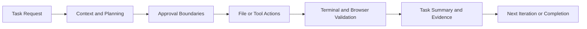

# Cline Tutorial: Agentic Coding with Human Control

> A practical engineering guide to `cline/cline`: install, operate, and govern Cline across local development and team environments.

## Why This Track Matters

Cline can read code, edit files, execute commands, use browser workflows, and integrate MCP tools. That power is valuable only if you can keep it:

- deterministic
- auditable
- cost-aware
- safe for shared repositories

This tutorial focuses on those outcomes.

## Current Snapshot (Verified February 11, 2026)

- repository: [`cline/cline`](https://github.com/cline/cline)
- stars: about **57.8k**
- latest release: [`v3.57.1`](https://github.com/cline/cline/releases/tag/v3.57.1)
- extension package version in source: `3.57.1`
- docs surface includes: CLI, MCP integration, hooks, plan/act, worktrees, tasks, enterprise controls

## Cline Operating Model

## Chapter Guide

| Chapter | Key Question | Deliverable |
|:--------|:-------------|:------------|
| [01 - Getting Started](01-getting-started.md) | How do I install and validate Cline safely? | Working extension + first deterministic task loop |
| [02 - Agent Workflow](02-agent-workflow.md) | How should tasks be structured for predictable results? | Prompt contract + Plan/Act workflow template |
| [03 - File Editing and Diffs](03-file-editing-and-diffs.md) | How do we review and govern AI edits? | Diff rubric, rollback, and acceptance gates |
| [04 - Terminal and Runtime Tools](04-terminal-and-runtime-tools.md) | How do we run command-driven fix loops safely? | Command policy + long-running process pattern |
| [05 - Browser Automation](05-browser-automation.md) | How do we verify runtime UX and browser behavior? | Browser validation loop with evidence artifacts |
| [06 - MCP and Custom Tools](06-mcp-and-custom-tools.md) | How do we extend Cline with external tools? | MCP rollout strategy and tool contract checklist |
| [07 - Context and Cost Control](07-context-and-cost-control.md) | How do we handle large repos and spend governance? | Context strategy + token/cost operating model |
| [08 - Team and Enterprise Operations](08-team-and-enterprise-operations.md) | How do teams run Cline reliably at scale? | Team policy baseline + incident playbooks |

## What You Will Learn

- how to run Cline with explicit human-in-the-loop controls
- how to design task prompts that produce small, reviewable patches
- how to combine file edits, terminal tools, browser checks, and MCP integrations safely
- how to standardize usage across teams with measurable quality and cost outcomes

## Source References

- [Cline README](https://github.com/cline/cline/blob/main/README.md)
- [Cline Docs](https://docs.cline.bot/)
- [Cline docs config (repo)](https://github.com/cline/cline/blob/main/docs/docs.json)
- [Cline Releases](https://github.com/cline/cline/releases)

## Related Tutorials

- [Roo Code Tutorial](../roo-code-tutorial/)
- [Continue Tutorial](../continue-tutorial/)
- [Aider Tutorial](../aider-tutorial/)
- [OpenHands Tutorial](../openhands-tutorial/)
- [MCP Servers Tutorial](../mcp-servers-tutorial/)

---

Start with [Chapter 1: Getting Started](01-getting-started.md).
