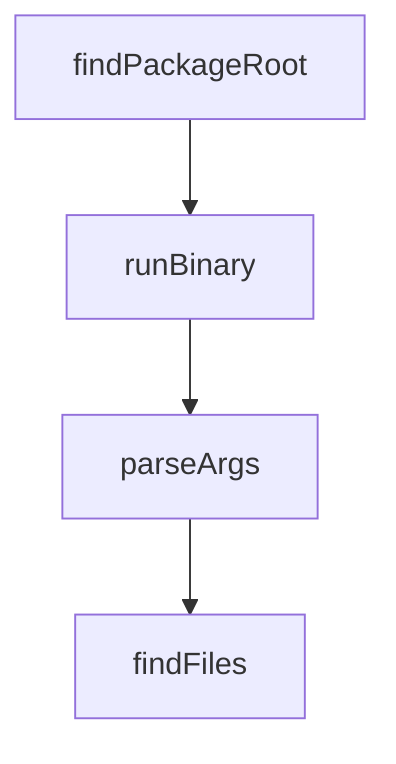

# Chapter 1: Getting Started

Welcome to **Chapter 1: Getting Started**. In this part of **CodeMachine CLI Tutorial: Orchestrating Long-Running Coding Agent Workflows**, you will build an intuitive mental model first, then move into concrete implementation details and practical production tradeoffs.


This chapter gets CodeMachine installed and running with a first orchestrated workflow.

## Quick Start

```bash
npm i -g codemachine
```

## Learning Goals

- install CodeMachine CLI
- run a starter workflow pattern
- inspect execution state and agent outputs

## Source References

- [CodeMachine Quickstart](https://docs.codemachine.co/getting-started/quickstart)
- [CodeMachine Repository](https://github.com/moazbuilds/CodeMachine-CLI)

## Summary

You now have a working CodeMachine baseline.

Next: [Chapter 2: Orchestration Architecture](02-orchestration-architecture.md)

## Source Code Walkthrough

### `bin/codemachine.js`

The `findPackageRoot` function in [`bin/codemachine.js`](https://github.com/moazbuilds/CodeMachine-CLI/blob/HEAD/bin/codemachine.js) handles a key part of this chapter's functionality:

```js
const ROOT_FALLBACK = join(__dirname, '..');

function findPackageRoot(startDir) {
  let current = startDir;
  const maxDepth = 10;
  let depth = 0;

  while (current && depth < maxDepth) {
    const candidate = join(current, 'package.json');
    if (existsSync(candidate)) {
      try {
        const pkg = JSON.parse(readFileSync(candidate, 'utf8'));
        if (pkg?.name === 'codemachine') {
          return current;
        }
      } catch {
        // ignore malformed package.json
      }
    }
    const parent = dirname(current);
    if (parent === current) break;
    current = parent;
    depth++;
  }
  return undefined;
}

const DEFAULT_PACKAGE_ROOT = findPackageRoot(ROOT_FALLBACK) ?? ROOT_FALLBACK;

function runBinary(binaryPath, packageRoot) {
  const child = spawn(binaryPath, process.argv.slice(2), {
    stdio: 'inherit',
```

This function is important because it defines how CodeMachine CLI Tutorial: Orchestrating Long-Running Coding Agent Workflows implements the patterns covered in this chapter.

### `bin/codemachine.js`

The `runBinary` function in [`bin/codemachine.js`](https://github.com/moazbuilds/CodeMachine-CLI/blob/HEAD/bin/codemachine.js) handles a key part of this chapter's functionality:

```js
const DEFAULT_PACKAGE_ROOT = findPackageRoot(ROOT_FALLBACK) ?? ROOT_FALLBACK;

function runBinary(binaryPath, packageRoot) {
  const child = spawn(binaryPath, process.argv.slice(2), {
    stdio: 'inherit',
    windowsHide: false,
    env: {
      ...process.env,
      CODEMACHINE_PACKAGE_ROOT: packageRoot,
      CODEMACHINE_PACKAGE_JSON: join(packageRoot, 'package.json'),
    },
  });

  child.on('exit', (code, signal) => {
    if (signal) {
      process.kill(process.pid, signal);
    } else {
      process.exit(code ?? 1);
    }
  });

  child.on('error', (error) => {
    console.error('Error spawning binary:', error.message);
    process.exit(1);
  });
}

// Map Node.js platform/arch to our package names
const platformMap = {
  'linux-x64': { pkg: 'codemachine-linux-x64', bin: 'codemachine' },
  'linux-arm64': { pkg: 'codemachine-linux-arm64', bin: 'codemachine' },
  'darwin-arm64': { pkg: 'codemachine-darwin-arm64', bin: 'codemachine' },
```

This function is important because it defines how CodeMachine CLI Tutorial: Orchestrating Long-Running Coding Agent Workflows implements the patterns covered in this chapter.

### `scripts/import-telemetry.ts`

The `parseArgs` function in [`scripts/import-telemetry.ts`](https://github.com/moazbuilds/CodeMachine-CLI/blob/HEAD/scripts/import-telemetry.ts) handles a key part of this chapter's functionality:

```ts

// Parse command line arguments
function parseArgs(): Config {
  const args = process.argv.slice(2);
  const config: Config = {
    lokiUrl: 'http://localhost:3100',
    tempoUrl: 'http://localhost:4318',
    logsOnly: false,
    tracesOnly: false,
    sourcePath: '',
  };

  for (let i = 0; i < args.length; i++) {
    const arg = args[i];
    if (arg === '--loki-url' && args[i + 1]) {
      config.lokiUrl = args[++i];
    } else if (arg === '--tempo-url' && args[i + 1]) {
      config.tempoUrl = args[++i];
    } else if (arg === '--logs-only') {
      config.logsOnly = true;
    } else if (arg === '--traces-only') {
      config.tracesOnly = true;
    } else if (!arg.startsWith('-')) {
      config.sourcePath = arg;
    }
  }

  return config;
}

// Find trace and log files in a directory
function findFiles(dir: string): { traceFiles: string[]; logFiles: string[] } {
```

This function is important because it defines how CodeMachine CLI Tutorial: Orchestrating Long-Running Coding Agent Workflows implements the patterns covered in this chapter.

### `scripts/import-telemetry.ts`

The `findFiles` function in [`scripts/import-telemetry.ts`](https://github.com/moazbuilds/CodeMachine-CLI/blob/HEAD/scripts/import-telemetry.ts) handles a key part of this chapter's functionality:

```ts

// Find trace and log files in a directory
function findFiles(dir: string): { traceFiles: string[]; logFiles: string[] } {
  const traceFiles: string[] = [];
  const logFiles: string[] = [];

  function scan(path: string) {
    const stat = statSync(path);
    if (stat.isDirectory()) {
      for (const entry of readdirSync(path)) {
        scan(join(path, entry));
      }
    } else if (stat.isFile() && path.endsWith('.json')) {
      const name = basename(path);
      if (name.includes('-logs') || name === 'latest-logs.json') {
        logFiles.push(path);
      } else if (!name.includes('-logs')) {
        traceFiles.push(path);
      }
    }
  }

  scan(dir);
  return { traceFiles, logFiles };
}

// Convert our span format to OTLP JSON format
function spansToOTLP(spans: SerializedSpan[], serviceName: string): object {
  // Group spans by trace ID
  const spansByTrace = new Map<string, SerializedSpan[]>();
  for (const span of spans) {
    const existing = spansByTrace.get(span.traceId) || [];
```

This function is important because it defines how CodeMachine CLI Tutorial: Orchestrating Long-Running Coding Agent Workflows implements the patterns covered in this chapter.


## How These Components Connect


