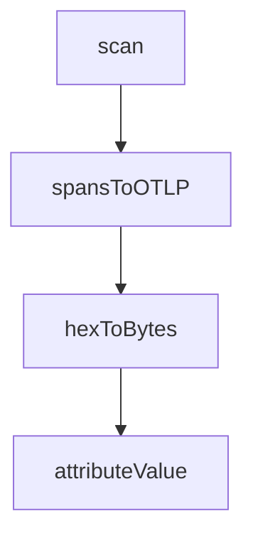

# Chapter 2: Orchestration Architecture

Welcome to **Chapter 2: Orchestration Architecture**. In this part of **CodeMachine CLI Tutorial: Orchestrating Long-Running Coding Agent Workflows**, you will build an intuitive mental model first, then move into concrete implementation details and practical production tradeoffs.


CodeMachine acts as an orchestration layer above coding-agent CLIs.

## Core Layers

| Layer | Role |
|:------|:-----|
| workflow definition | declarative process logic |
| orchestrator runtime | step coordination and control |
| engine adapters | execution via coding-agent CLIs |
| state layer | persistence, context, and transitions |

## Summary

You now understand how CodeMachine coordinates workflows and engines.

Next: [Chapter 3: Workflow Design Patterns](03-workflow-design-patterns.md)

## Source Code Walkthrough

### `scripts/import-telemetry.ts`

The `scan` function in [`scripts/import-telemetry.ts`](https://github.com/moazbuilds/CodeMachine-CLI/blob/HEAD/scripts/import-telemetry.ts) handles a key part of this chapter's functionality:

```ts
  const logFiles: string[] = [];

  function scan(path: string) {
    const stat = statSync(path);
    if (stat.isDirectory()) {
      for (const entry of readdirSync(path)) {
        scan(join(path, entry));
      }
    } else if (stat.isFile() && path.endsWith('.json')) {
      const name = basename(path);
      if (name.includes('-logs') || name === 'latest-logs.json') {
        logFiles.push(path);
      } else if (!name.includes('-logs')) {
        traceFiles.push(path);
      }
    }
  }

  scan(dir);
  return { traceFiles, logFiles };
}

// Convert our span format to OTLP JSON format
function spansToOTLP(spans: SerializedSpan[], serviceName: string): object {
  // Group spans by trace ID
  const spansByTrace = new Map<string, SerializedSpan[]>();
  for (const span of spans) {
    const existing = spansByTrace.get(span.traceId) || [];
    existing.push(span);
    spansByTrace.set(span.traceId, existing);
  }

```

This function is important because it defines how CodeMachine CLI Tutorial: Orchestrating Long-Running Coding Agent Workflows implements the patterns covered in this chapter.

### `scripts/import-telemetry.ts`

The `spansToOTLP` function in [`scripts/import-telemetry.ts`](https://github.com/moazbuilds/CodeMachine-CLI/blob/HEAD/scripts/import-telemetry.ts) handles a key part of this chapter's functionality:

```ts

// Convert our span format to OTLP JSON format
function spansToOTLP(spans: SerializedSpan[], serviceName: string): object {
  // Group spans by trace ID
  const spansByTrace = new Map<string, SerializedSpan[]>();
  for (const span of spans) {
    const existing = spansByTrace.get(span.traceId) || [];
    existing.push(span);
    spansByTrace.set(span.traceId, existing);
  }

  // Convert to OTLP format
  const resourceSpans = [
    {
      resource: {
        attributes: [
          { key: 'service.name', value: { stringValue: serviceName } },
          { key: 'telemetry.sdk.name', value: { stringValue: 'codemachine-import' } },
        ],
      },
      scopeSpans: [
        {
          scope: { name: 'codemachine.import' },
          spans: spans.map((span) => ({
            traceId: hexToBytes(span.traceId),
            spanId: hexToBytes(span.spanId),
            parentSpanId: span.parentSpanId ? hexToBytes(span.parentSpanId) : undefined,
            name: span.name,
            kind: 1, // INTERNAL
            startTimeUnixNano: String(Math.floor(span.startTime * 1_000_000)),
            endTimeUnixNano: String(Math.floor(span.endTime * 1_000_000)),
            attributes: Object.entries(span.attributes || {}).map(([key, value]) => ({
```

This function is important because it defines how CodeMachine CLI Tutorial: Orchestrating Long-Running Coding Agent Workflows implements the patterns covered in this chapter.

### `scripts/import-telemetry.ts`

The `hexToBytes` function in [`scripts/import-telemetry.ts`](https://github.com/moazbuilds/CodeMachine-CLI/blob/HEAD/scripts/import-telemetry.ts) handles a key part of this chapter's functionality:

```ts
          scope: { name: 'codemachine.import' },
          spans: spans.map((span) => ({
            traceId: hexToBytes(span.traceId),
            spanId: hexToBytes(span.spanId),
            parentSpanId: span.parentSpanId ? hexToBytes(span.parentSpanId) : undefined,
            name: span.name,
            kind: 1, // INTERNAL
            startTimeUnixNano: String(Math.floor(span.startTime * 1_000_000)),
            endTimeUnixNano: String(Math.floor(span.endTime * 1_000_000)),
            attributes: Object.entries(span.attributes || {}).map(([key, value]) => ({
              key,
              value: attributeValue(value),
            })),
            status: {
              code: span.status.code === 2 ? 2 : span.status.code === 1 ? 1 : 0,
              message: span.status.message,
            },
            events: (span.events || []).map((event) => ({
              name: event.name,
              timeUnixNano: String(Math.floor(event.time * 1_000_000)),
              attributes: Object.entries(event.attributes || {}).map(([key, value]) => ({
                key,
                value: attributeValue(value),
              })),
            })),
          })),
        },
      ],
    },
  ];

  return { resourceSpans };
```

This function is important because it defines how CodeMachine CLI Tutorial: Orchestrating Long-Running Coding Agent Workflows implements the patterns covered in this chapter.

### `scripts/import-telemetry.ts`

The `attributeValue` function in [`scripts/import-telemetry.ts`](https://github.com/moazbuilds/CodeMachine-CLI/blob/HEAD/scripts/import-telemetry.ts) handles a key part of this chapter's functionality:

```ts
            attributes: Object.entries(span.attributes || {}).map(([key, value]) => ({
              key,
              value: attributeValue(value),
            })),
            status: {
              code: span.status.code === 2 ? 2 : span.status.code === 1 ? 1 : 0,
              message: span.status.message,
            },
            events: (span.events || []).map((event) => ({
              name: event.name,
              timeUnixNano: String(Math.floor(event.time * 1_000_000)),
              attributes: Object.entries(event.attributes || {}).map(([key, value]) => ({
                key,
                value: attributeValue(value),
              })),
            })),
          })),
        },
      ],
    },
  ];

  return { resourceSpans };
}

// Convert hex string to byte array for OTLP JSON
// OTLP JSON expects byte arrays as base64-encoded strings
function hexToBytes(hex: string): string {
  // For OTLP JSON format, we need to provide hex string directly
  // The receiver expects lowercase hex
  return hex.toLowerCase();
}
```

This function is important because it defines how CodeMachine CLI Tutorial: Orchestrating Long-Running Coding Agent Workflows implements the patterns covered in this chapter.


## How These Components Connect


