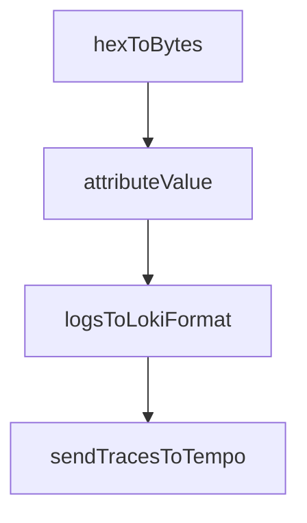

# Chapter 2: Orchestration Architecture

Welcome to **Chapter 2: Orchestration Architecture**. In this part of **CodeMachine CLI Tutorial: Orchestrating Long-Running Coding Agent Workflows**, you will build an intuitive mental model first, then move into concrete implementation details and practical production tradeoffs.


CodeMachine acts as an orchestration layer above coding-agent CLIs.

## Core Layers

| Layer | Role |
|:------|:-----|
| workflow definition | declarative process logic |
| orchestrator runtime | step coordination and control |
| engine adapters | execution via coding-agent CLIs |
| state layer | persistence, context, and transitions |

## Summary

You now understand how CodeMachine coordinates workflows and engines.

Next: [Chapter 3: Workflow Design Patterns](03-workflow-design-patterns.md)

## Depth Expansion Playbook

## Source Code Walkthrough

### `scripts/import-telemetry.ts`

The `hexToBytes` function in [`scripts/import-telemetry.ts`](https://github.com/moazbuilds/CodeMachine-CLI/blob/HEAD/scripts/import-telemetry.ts) handles a key part of this chapter's functionality:

```ts
          scope: { name: 'codemachine.import' },
          spans: spans.map((span) => ({
            traceId: hexToBytes(span.traceId),
            spanId: hexToBytes(span.spanId),
            parentSpanId: span.parentSpanId ? hexToBytes(span.parentSpanId) : undefined,
            name: span.name,
            kind: 1, // INTERNAL
            startTimeUnixNano: String(Math.floor(span.startTime * 1_000_000)),
            endTimeUnixNano: String(Math.floor(span.endTime * 1_000_000)),
            attributes: Object.entries(span.attributes || {}).map(([key, value]) => ({
              key,
              value: attributeValue(value),
            })),
            status: {
              code: span.status.code === 2 ? 2 : span.status.code === 1 ? 1 : 0,
              message: span.status.message,
            },
            events: (span.events || []).map((event) => ({
              name: event.name,
              timeUnixNano: String(Math.floor(event.time * 1_000_000)),
              attributes: Object.entries(event.attributes || {}).map(([key, value]) => ({
                key,
                value: attributeValue(value),
              })),
            })),
          })),
        },
      ],
    },
  ];

  return { resourceSpans };
```

This function is important because it defines how CodeMachine CLI Tutorial: Orchestrating Long-Running Coding Agent Workflows implements the patterns covered in this chapter.

### `scripts/import-telemetry.ts`

The `attributeValue` function in [`scripts/import-telemetry.ts`](https://github.com/moazbuilds/CodeMachine-CLI/blob/HEAD/scripts/import-telemetry.ts) handles a key part of this chapter's functionality:

```ts
            attributes: Object.entries(span.attributes || {}).map(([key, value]) => ({
              key,
              value: attributeValue(value),
            })),
            status: {
              code: span.status.code === 2 ? 2 : span.status.code === 1 ? 1 : 0,
              message: span.status.message,
            },
            events: (span.events || []).map((event) => ({
              name: event.name,
              timeUnixNano: String(Math.floor(event.time * 1_000_000)),
              attributes: Object.entries(event.attributes || {}).map(([key, value]) => ({
                key,
                value: attributeValue(value),
              })),
            })),
          })),
        },
      ],
    },
  ];

  return { resourceSpans };
}

// Convert hex string to byte array for OTLP JSON
// OTLP JSON expects byte arrays as base64-encoded strings
function hexToBytes(hex: string): string {
  // For OTLP JSON format, we need to provide hex string directly
  // The receiver expects lowercase hex
  return hex.toLowerCase();
}
```

This function is important because it defines how CodeMachine CLI Tutorial: Orchestrating Long-Running Coding Agent Workflows implements the patterns covered in this chapter.

### `scripts/import-telemetry.ts`

The `logsToLokiFormat` function in [`scripts/import-telemetry.ts`](https://github.com/moazbuilds/CodeMachine-CLI/blob/HEAD/scripts/import-telemetry.ts) handles a key part of this chapter's functionality:

```ts

// Convert our log format to Loki push format
function logsToLokiFormat(logs: SerializedLog[], serviceName: string): object {
  // Group logs by their label set
  const streams = new Map<string, Array<[string, string]>>();

  for (const log of logs) {
    // Build labels
    const labels: Record<string, string> = {
      service_name: serviceName,
      severity_text: log.severityText || 'UNSPECIFIED',
      imported: 'true',
    };

    // Add trace correlation if present
    if (log.attributes['trace.id']) {
      labels.trace_id = String(log.attributes['trace.id']);
    }
    if (log.attributes['span.id']) {
      labels.span_id = String(log.attributes['span.id']);
    }

    // Create label key for grouping
    const labelKey = Object.entries(labels)
      .sort(([a], [b]) => a.localeCompare(b))
      .map(([k, v]) => `${k}="${v}"`)
      .join(',');

    // Convert timestamp
    const [seconds, nanos] = log.timestamp;
    const timestampNs = String(BigInt(seconds) * BigInt(1_000_000_000) + BigInt(nanos));

```

This function is important because it defines how CodeMachine CLI Tutorial: Orchestrating Long-Running Coding Agent Workflows implements the patterns covered in this chapter.

### `scripts/import-telemetry.ts`

The `sendTracesToTempo` function in [`scripts/import-telemetry.ts`](https://github.com/moazbuilds/CodeMachine-CLI/blob/HEAD/scripts/import-telemetry.ts) handles a key part of this chapter's functionality:

```ts

// Send traces to Tempo via OTLP
async function sendTracesToTempo(spans: SerializedSpan[], serviceName: string, tempoUrl: string): Promise<void> {
  const otlpData = spansToOTLP(spans, serviceName);
  const url = `${tempoUrl}/v1/traces`;

  const response = await fetch(url, {
    method: 'POST',
    headers: {
      'Content-Type': 'application/json',
    },
    body: JSON.stringify(otlpData),
  });

  if (!response.ok) {
    const text = await response.text();
    throw new Error(`Failed to send traces to Tempo: ${response.status} ${text}`);
  }
}

// Send logs to Loki
async function sendLogsToLoki(logs: SerializedLog[], serviceName: string, lokiUrl: string): Promise<void> {
  const lokiData = logsToLokiFormat(logs, serviceName);
  const url = `${lokiUrl}/loki/api/v1/push`;

  const response = await fetch(url, {
    method: 'POST',
    headers: {
      'Content-Type': 'application/json',
    },
    body: JSON.stringify(lokiData),
  });
```

This function is important because it defines how CodeMachine CLI Tutorial: Orchestrating Long-Running Coding Agent Workflows implements the patterns covered in this chapter.


## How These Components Connect


