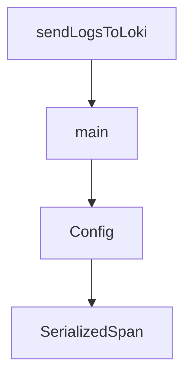

# Chapter 3: Workflow Design Patterns

Welcome to **Chapter 3: Workflow Design Patterns**. In this part of **CodeMachine CLI Tutorial: Orchestrating Long-Running Coding Agent Workflows**, you will build an intuitive mental model first, then move into concrete implementation details and practical production tradeoffs.


Workflow design quality drives reliability in orchestrated coding-agent systems.

## Pattern Types

| Pattern | Best For |
|:--------|:---------|
| linear staged | deterministic tasks |
| looped refinement | iterative bug fixing |
| gated workflow | human approval checkpoints |

## Summary

You now have design patterns for repeatable orchestration workflows.

Next: [Chapter 4: Multi-Agent and Parallel Execution](04-multi-agent-and-parallel-execution.md)

## Depth Expansion Playbook

## Source Code Walkthrough

### `scripts/import-telemetry.ts`

The `sendLogsToLoki` function in [`scripts/import-telemetry.ts`](https://github.com/moazbuilds/CodeMachine-CLI/blob/HEAD/scripts/import-telemetry.ts) handles a key part of this chapter's functionality:

```ts

// Send logs to Loki
async function sendLogsToLoki(logs: SerializedLog[], serviceName: string, lokiUrl: string): Promise<void> {
  const lokiData = logsToLokiFormat(logs, serviceName);
  const url = `${lokiUrl}/loki/api/v1/push`;

  const response = await fetch(url, {
    method: 'POST',
    headers: {
      'Content-Type': 'application/json',
    },
    body: JSON.stringify(lokiData),
  });

  if (!response.ok) {
    const text = await response.text();
    throw new Error(`Failed to send logs to Loki: ${response.status} ${text}`);
  }
}

// Read and parse a JSON file
function readJsonFile<T>(path: string): T | null {
  try {
    const content = readFileSync(path, 'utf-8');
    return JSON.parse(content) as T;
  } catch (error) {
    console.error(`Failed to read ${path}:`, error);
    return null;
  }
}

// Main function
```

This function is important because it defines how CodeMachine CLI Tutorial: Orchestrating Long-Running Coding Agent Workflows implements the patterns covered in this chapter.

### `scripts/import-telemetry.ts`

The `main` function in [`scripts/import-telemetry.ts`](https://github.com/moazbuilds/CodeMachine-CLI/blob/HEAD/scripts/import-telemetry.ts) handles a key part of this chapter's functionality:

```ts

// Main function
async function main() {
  const config = parseArgs();

  if (!config.sourcePath) {
    console.log(`
Usage: bun scripts/import-telemetry.ts <path-to-traces-dir>

Examples:
  bun scripts/import-telemetry.ts .codemachine/traces
  bun scripts/import-telemetry.ts ~/Downloads/bug-report-traces
  bun scripts/import-telemetry.ts ./traces --loki-url http://localhost:3100

Options:
  --loki-url <url>   Loki URL (default: http://localhost:3100)
  --tempo-url <url>  Tempo OTLP URL (default: http://localhost:4318)
  --logs-only        Only import logs
  --traces-only      Only import traces
`);
    process.exit(1);
  }

  if (!existsSync(config.sourcePath)) {
    console.error(`Path not found: ${config.sourcePath}`);
    process.exit(1);
  }

  console.log(`Importing telemetry from: ${config.sourcePath}`);
  console.log(`Loki URL: ${config.lokiUrl}`);
  console.log(`Tempo URL: ${config.tempoUrl}`);
  console.log('');
```

This function is important because it defines how CodeMachine CLI Tutorial: Orchestrating Long-Running Coding Agent Workflows implements the patterns covered in this chapter.

### `scripts/import-telemetry.ts`

The `Config` interface in [`scripts/import-telemetry.ts`](https://github.com/moazbuilds/CodeMachine-CLI/blob/HEAD/scripts/import-telemetry.ts) handles a key part of this chapter's functionality:

```ts
import { join, basename } from 'node:path';

// Configuration
interface Config {
  lokiUrl: string;
  tempoUrl: string;
  logsOnly: boolean;
  tracesOnly: boolean;
  sourcePath: string;
}

// Our serialized formats (from the exporters)
interface SerializedSpan {
  name: string;
  traceId: string;
  spanId: string;
  parentSpanId?: string;
  startTime: number; // ms
  endTime: number; // ms
  duration: number; // ms
  status: {
    code: number;
    message?: string;
  };
  attributes: Record<string, unknown>;
  events: Array<{
    name: string;
    time: number;
    attributes?: Record<string, unknown>;
  }>;
}

```

This interface is important because it defines how CodeMachine CLI Tutorial: Orchestrating Long-Running Coding Agent Workflows implements the patterns covered in this chapter.

### `scripts/import-telemetry.ts`

The `SerializedSpan` interface in [`scripts/import-telemetry.ts`](https://github.com/moazbuilds/CodeMachine-CLI/blob/HEAD/scripts/import-telemetry.ts) handles a key part of this chapter's functionality:

```ts

// Our serialized formats (from the exporters)
interface SerializedSpan {
  name: string;
  traceId: string;
  spanId: string;
  parentSpanId?: string;
  startTime: number; // ms
  endTime: number; // ms
  duration: number; // ms
  status: {
    code: number;
    message?: string;
  };
  attributes: Record<string, unknown>;
  events: Array<{
    name: string;
    time: number;
    attributes?: Record<string, unknown>;
  }>;
}

interface TraceFile {
  version: number;
  service: string;
  exportedAt: string;
  spanCount: number;
  spans: SerializedSpan[];
}

interface SerializedLog {
  timestamp: [number, number]; // [seconds, nanoseconds]
```

This interface is important because it defines how CodeMachine CLI Tutorial: Orchestrating Long-Running Coding Agent Workflows implements the patterns covered in this chapter.


## How These Components Connect


