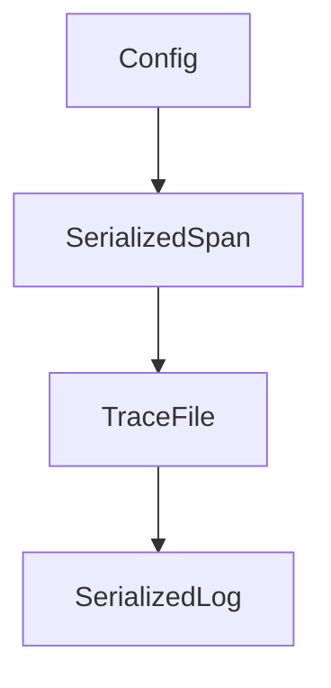

# Chapter 4: Multi-Agent and Parallel Execution

Welcome to **Chapter 4: Multi-Agent and Parallel Execution**. In this part of **CodeMachine CLI Tutorial: Orchestrating Long-Running Coding Agent Workflows**, you will build an intuitive mental model first, then move into concrete implementation details and practical production tradeoffs.


CodeMachine supports assigning different workflow steps to different agent engines in parallel.

## Parallel Strategy

- split tasks by domain responsibility
- define merge and conflict resolution checkpoints
- monitor cross-agent context consistency

## Summary

You now understand how to leverage parallelism without losing control.

Next: [Chapter 5: Context Engineering and State Control](05-context-engineering-and-state-control.md)

## Source Code Walkthrough

### `scripts/import-telemetry.ts`

The `Config` interface in [`scripts/import-telemetry.ts`](https://github.com/moazbuilds/CodeMachine-CLI/blob/HEAD/scripts/import-telemetry.ts) handles a key part of this chapter's functionality:

```ts
import { join, basename } from 'node:path';

// Configuration
interface Config {
  lokiUrl: string;
  tempoUrl: string;
  logsOnly: boolean;
  tracesOnly: boolean;
  sourcePath: string;
}

// Our serialized formats (from the exporters)
interface SerializedSpan {
  name: string;
  traceId: string;
  spanId: string;
  parentSpanId?: string;
  startTime: number; // ms
  endTime: number; // ms
  duration: number; // ms
  status: {
    code: number;
    message?: string;
  };
  attributes: Record<string, unknown>;
  events: Array<{
    name: string;
    time: number;
    attributes?: Record<string, unknown>;
  }>;
}

```

This interface is important because it defines how CodeMachine CLI Tutorial: Orchestrating Long-Running Coding Agent Workflows implements the patterns covered in this chapter.

### `scripts/import-telemetry.ts`

The `SerializedSpan` interface in [`scripts/import-telemetry.ts`](https://github.com/moazbuilds/CodeMachine-CLI/blob/HEAD/scripts/import-telemetry.ts) handles a key part of this chapter's functionality:

```ts

// Our serialized formats (from the exporters)
interface SerializedSpan {
  name: string;
  traceId: string;
  spanId: string;
  parentSpanId?: string;
  startTime: number; // ms
  endTime: number; // ms
  duration: number; // ms
  status: {
    code: number;
    message?: string;
  };
  attributes: Record<string, unknown>;
  events: Array<{
    name: string;
    time: number;
    attributes?: Record<string, unknown>;
  }>;
}

interface TraceFile {
  version: number;
  service: string;
  exportedAt: string;
  spanCount: number;
  spans: SerializedSpan[];
}

interface SerializedLog {
  timestamp: [number, number]; // [seconds, nanoseconds]
```

This interface is important because it defines how CodeMachine CLI Tutorial: Orchestrating Long-Running Coding Agent Workflows implements the patterns covered in this chapter.

### `scripts/import-telemetry.ts`

The `TraceFile` interface in [`scripts/import-telemetry.ts`](https://github.com/moazbuilds/CodeMachine-CLI/blob/HEAD/scripts/import-telemetry.ts) handles a key part of this chapter's functionality:

```ts
}

interface TraceFile {
  version: number;
  service: string;
  exportedAt: string;
  spanCount: number;
  spans: SerializedSpan[];
}

interface SerializedLog {
  timestamp: [number, number]; // [seconds, nanoseconds]
  severityNumber: number;
  severityText?: string;
  body: unknown;
  attributes: Record<string, unknown>;
  resource?: Record<string, unknown>;
}

interface LogFile {
  version: number;
  service: string;
  exportedAt: string;
  logCount: number;
  logs: SerializedLog[];
}

// Parse command line arguments
function parseArgs(): Config {
  const args = process.argv.slice(2);
  const config: Config = {
    lokiUrl: 'http://localhost:3100',
```

This interface is important because it defines how CodeMachine CLI Tutorial: Orchestrating Long-Running Coding Agent Workflows implements the patterns covered in this chapter.

### `scripts/import-telemetry.ts`

The `SerializedLog` interface in [`scripts/import-telemetry.ts`](https://github.com/moazbuilds/CodeMachine-CLI/blob/HEAD/scripts/import-telemetry.ts) handles a key part of this chapter's functionality:

```ts
}

interface SerializedLog {
  timestamp: [number, number]; // [seconds, nanoseconds]
  severityNumber: number;
  severityText?: string;
  body: unknown;
  attributes: Record<string, unknown>;
  resource?: Record<string, unknown>;
}

interface LogFile {
  version: number;
  service: string;
  exportedAt: string;
  logCount: number;
  logs: SerializedLog[];
}

// Parse command line arguments
function parseArgs(): Config {
  const args = process.argv.slice(2);
  const config: Config = {
    lokiUrl: 'http://localhost:3100',
    tempoUrl: 'http://localhost:4318',
    logsOnly: false,
    tracesOnly: false,
    sourcePath: '',
  };

  for (let i = 0; i < args.length; i++) {
    const arg = args[i];
```

This interface is important because it defines how CodeMachine CLI Tutorial: Orchestrating Long-Running Coding Agent Workflows implements the patterns covered in this chapter.


## How These Components Connect


