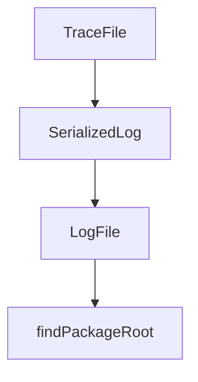

# Chapter 4: Multi-Agent and Parallel Execution

Welcome to **Chapter 4: Multi-Agent and Parallel Execution**. In this part of **CodeMachine CLI Tutorial: Orchestrating Long-Running Coding Agent Workflows**, you will build an intuitive mental model first, then move into concrete implementation details and practical production tradeoffs.


CodeMachine supports assigning different workflow steps to different agent engines in parallel.

## Parallel Strategy

- split tasks by domain responsibility
- define merge and conflict resolution checkpoints
- monitor cross-agent context consistency

## Summary

You now understand how to leverage parallelism without losing control.

Next: [Chapter 5: Context Engineering and State Control](05-context-engineering-and-state-control.md)

## Depth Expansion Playbook

## Source Code Walkthrough

### `scripts/import-telemetry.ts`

The `TraceFile` interface in [`scripts/import-telemetry.ts`](https://github.com/moazbuilds/CodeMachine-CLI/blob/HEAD/scripts/import-telemetry.ts) handles a key part of this chapter's functionality:

```ts
}

interface TraceFile {
  version: number;
  service: string;
  exportedAt: string;
  spanCount: number;
  spans: SerializedSpan[];
}

interface SerializedLog {
  timestamp: [number, number]; // [seconds, nanoseconds]
  severityNumber: number;
  severityText?: string;
  body: unknown;
  attributes: Record<string, unknown>;
  resource?: Record<string, unknown>;
}

interface LogFile {
  version: number;
  service: string;
  exportedAt: string;
  logCount: number;
  logs: SerializedLog[];
}

// Parse command line arguments
function parseArgs(): Config {
  const args = process.argv.slice(2);
  const config: Config = {
    lokiUrl: 'http://localhost:3100',
```

This interface is important because it defines how CodeMachine CLI Tutorial: Orchestrating Long-Running Coding Agent Workflows implements the patterns covered in this chapter.

### `scripts/import-telemetry.ts`

The `SerializedLog` interface in [`scripts/import-telemetry.ts`](https://github.com/moazbuilds/CodeMachine-CLI/blob/HEAD/scripts/import-telemetry.ts) handles a key part of this chapter's functionality:

```ts
}

interface SerializedLog {
  timestamp: [number, number]; // [seconds, nanoseconds]
  severityNumber: number;
  severityText?: string;
  body: unknown;
  attributes: Record<string, unknown>;
  resource?: Record<string, unknown>;
}

interface LogFile {
  version: number;
  service: string;
  exportedAt: string;
  logCount: number;
  logs: SerializedLog[];
}

// Parse command line arguments
function parseArgs(): Config {
  const args = process.argv.slice(2);
  const config: Config = {
    lokiUrl: 'http://localhost:3100',
    tempoUrl: 'http://localhost:4318',
    logsOnly: false,
    tracesOnly: false,
    sourcePath: '',
  };

  for (let i = 0; i < args.length; i++) {
    const arg = args[i];
```

This interface is important because it defines how CodeMachine CLI Tutorial: Orchestrating Long-Running Coding Agent Workflows implements the patterns covered in this chapter.

### `scripts/import-telemetry.ts`

The `LogFile` interface in [`scripts/import-telemetry.ts`](https://github.com/moazbuilds/CodeMachine-CLI/blob/HEAD/scripts/import-telemetry.ts) handles a key part of this chapter's functionality:

```ts
}

interface LogFile {
  version: number;
  service: string;
  exportedAt: string;
  logCount: number;
  logs: SerializedLog[];
}

// Parse command line arguments
function parseArgs(): Config {
  const args = process.argv.slice(2);
  const config: Config = {
    lokiUrl: 'http://localhost:3100',
    tempoUrl: 'http://localhost:4318',
    logsOnly: false,
    tracesOnly: false,
    sourcePath: '',
  };

  for (let i = 0; i < args.length; i++) {
    const arg = args[i];
    if (arg === '--loki-url' && args[i + 1]) {
      config.lokiUrl = args[++i];
    } else if (arg === '--tempo-url' && args[i + 1]) {
      config.tempoUrl = args[++i];
    } else if (arg === '--logs-only') {
      config.logsOnly = true;
    } else if (arg === '--traces-only') {
      config.tracesOnly = true;
    } else if (!arg.startsWith('-')) {
```

This interface is important because it defines how CodeMachine CLI Tutorial: Orchestrating Long-Running Coding Agent Workflows implements the patterns covered in this chapter.

### `bin/codemachine.js`

The `findPackageRoot` function in [`bin/codemachine.js`](https://github.com/moazbuilds/CodeMachine-CLI/blob/HEAD/bin/codemachine.js) handles a key part of this chapter's functionality:

```js
const ROOT_FALLBACK = join(__dirname, '..');

function findPackageRoot(startDir) {
  let current = startDir;
  const maxDepth = 10;
  let depth = 0;

  while (current && depth < maxDepth) {
    const candidate = join(current, 'package.json');
    if (existsSync(candidate)) {
      try {
        const pkg = JSON.parse(readFileSync(candidate, 'utf8'));
        if (pkg?.name === 'codemachine') {
          return current;
        }
      } catch {
        // ignore malformed package.json
      }
    }
    const parent = dirname(current);
    if (parent === current) break;
    current = parent;
    depth++;
  }
  return undefined;
}

const DEFAULT_PACKAGE_ROOT = findPackageRoot(ROOT_FALLBACK) ?? ROOT_FALLBACK;

function runBinary(binaryPath, packageRoot) {
  const child = spawn(binaryPath, process.argv.slice(2), {
    stdio: 'inherit',
```

This function is important because it defines how CodeMachine CLI Tutorial: Orchestrating Long-Running Coding Agent Workflows implements the patterns covered in this chapter.


## How These Components Connect


