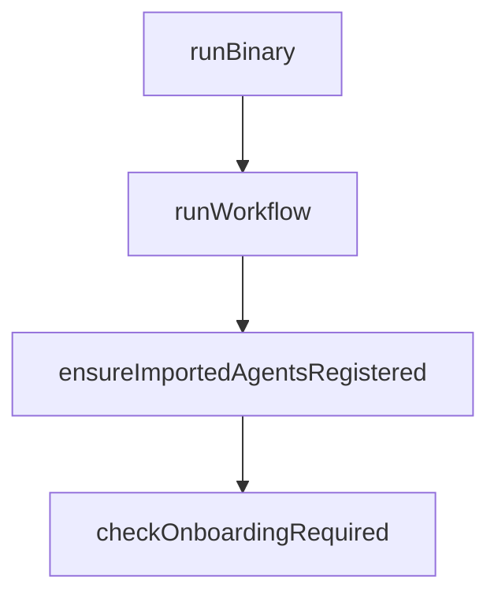

# Chapter 5: Context Engineering and State Control

Welcome to **Chapter 5: Context Engineering and State Control**. In this part of **CodeMachine CLI Tutorial: Orchestrating Long-Running Coding Agent Workflows**, you will build an intuitive mental model first, then move into concrete implementation details and practical production tradeoffs.


Context engineering in CodeMachine determines what each agent sees at each workflow step.

## Controls

| Control | Purpose |
|:--------|:--------|
| scoped context injection | reduce noise and drift |
| dynamic state updates | preserve workflow continuity |
| context reset points | avoid stale accumulation |

## Summary

You now have context controls for maintaining workflow quality across long runs.

Next: [Chapter 6: Persistence and Long-Running Jobs](06-persistence-and-long-running-jobs.md)

## Depth Expansion Playbook

## Source Code Walkthrough

### `bin/codemachine.js`

The `runBinary` function in [`bin/codemachine.js`](https://github.com/moazbuilds/CodeMachine-CLI/blob/HEAD/bin/codemachine.js) handles a key part of this chapter's functionality:

```js
const DEFAULT_PACKAGE_ROOT = findPackageRoot(ROOT_FALLBACK) ?? ROOT_FALLBACK;

function runBinary(binaryPath, packageRoot) {
  const child = spawn(binaryPath, process.argv.slice(2), {
    stdio: 'inherit',
    windowsHide: false,
    env: {
      ...process.env,
      CODEMACHINE_PACKAGE_ROOT: packageRoot,
      CODEMACHINE_PACKAGE_JSON: join(packageRoot, 'package.json'),
    },
  });

  child.on('exit', (code, signal) => {
    if (signal) {
      process.kill(process.pid, signal);
    } else {
      process.exit(code ?? 1);
    }
  });

  child.on('error', (error) => {
    console.error('Error spawning binary:', error.message);
    process.exit(1);
  });
}

// Map Node.js platform/arch to our package names
const platformMap = {
  'linux-x64': { pkg: 'codemachine-linux-x64', bin: 'codemachine' },
  'linux-arm64': { pkg: 'codemachine-linux-arm64', bin: 'codemachine' },
  'darwin-arm64': { pkg: 'codemachine-darwin-arm64', bin: 'codemachine' },
```

This function is important because it defines how CodeMachine CLI Tutorial: Orchestrating Long-Running Coding Agent Workflows implements the patterns covered in this chapter.

### `src/workflows/run.ts`

The `runWorkflow` function in [`src/workflows/run.ts`](https://github.com/moazbuilds/CodeMachine-CLI/blob/HEAD/src/workflows/run.ts) handles a key part of this chapter's functionality:

```ts
 * Note: Pre-flight checks (specification validation) should be done via preflight.ts before calling this
 */
export async function runWorkflow(options: RunWorkflowOptions = {}): Promise<void> {
  const cwd = options.cwd ? path.resolve(options.cwd) : process.cwd();

  // Ensure workspace structure exists (creates .codemachine folder tree)
  await ensureWorkspaceStructure({ cwd });

  // Auto-register agents from all installed imports
  // This ensures imported agents/modules are available before template loading
  clearImportedAgents();
  const importedPackages = getAllInstalledImports();
  for (const imp of importedPackages) {
    registerImportedAgents(imp.resolvedPaths.config);
  }
  debug('[Workflow] Registered agents from %d imported packages', importedPackages.length);

  // Load template
  const cmRoot = path.join(cwd, '.codemachine');
  const templatePath = options.templatePath || (await getTemplatePathFromTracking(cmRoot));
  const { template } = await loadTemplateWithPath(cwd, templatePath);

  // Ensure template.json exists with correct activeTemplate before any setter functions are called
  // This prevents setControllerView/setSelectedTrack/etc from creating file with empty activeTemplate
  const templateFileName = path.basename(templatePath);
  await setActiveTemplate(cmRoot, templateFileName, template.autonomousMode);

  // Clear screen for TUI
  if (process.stdout.isTTY) {
    process.stdout.write('\x1b[2J\x1b[H');
  }

```

This function is important because it defines how CodeMachine CLI Tutorial: Orchestrating Long-Running Coding Agent Workflows implements the patterns covered in this chapter.

### `src/workflows/preflight.ts`

The `ensureImportedAgentsRegistered` function in [`src/workflows/preflight.ts`](https://github.com/moazbuilds/CodeMachine-CLI/blob/HEAD/src/workflows/preflight.ts) handles a key part of this chapter's functionality:

```ts
 * resolveStep() can find agents from imported packages
 */
function ensureImportedAgentsRegistered(): void {
  clearImportedAgents();
  const importedPackages = getAllInstalledImports();
  for (const imp of importedPackages) {
    registerImportedAgents(imp.resolvedPaths.config);
  }
}

/**
 * Onboarding requirements - what the user needs to configure before workflow can start
 */
export interface OnboardingNeeds {
  needsProjectName: boolean;
  needsTrackSelection: boolean;
  needsConditionsSelection: boolean;
  needsControllerSelection: boolean;
  /** @deprecated Controller is now pre-specified via controller() function */
  controllerAgents: AgentDefinition[];
  /** The loaded template for reference */
  template: WorkflowTemplate;
}

/**
 * Check what onboarding steps are needed before workflow can start
 * Does NOT throw - returns the requirements for the UI to handle
 */
export async function checkOnboardingRequired(options: { cwd?: string } = {}): Promise<OnboardingNeeds> {
  const cwd = options.cwd ? path.resolve(options.cwd) : process.cwd();
  const cmRoot = path.join(cwd, '.codemachine');

```

This function is important because it defines how CodeMachine CLI Tutorial: Orchestrating Long-Running Coding Agent Workflows implements the patterns covered in this chapter.

### `src/workflows/preflight.ts`

The `checkOnboardingRequired` function in [`src/workflows/preflight.ts`](https://github.com/moazbuilds/CodeMachine-CLI/blob/HEAD/src/workflows/preflight.ts) handles a key part of this chapter's functionality:

```ts
 * Does NOT throw - returns the requirements for the UI to handle
 */
export async function checkOnboardingRequired(options: { cwd?: string } = {}): Promise<OnboardingNeeds> {
  const cwd = options.cwd ? path.resolve(options.cwd) : process.cwd();
  const cmRoot = path.join(cwd, '.codemachine');

  // Ensure workspace structure exists
  await ensureWorkspaceStructure({ cwd });

  // Ensure imported agents are registered before loading template
  // This allows resolveStep() to find agents from imported packages
  ensureImportedAgentsRegistered();

  // Load template
  const templatePath = await getTemplatePathFromTracking(cmRoot);
  const { template } = await loadTemplateWithPath(cwd, templatePath);

  // Check existing selections
  const selectedTrack = await getSelectedTrack(cmRoot);
  const conditionsSelected = await hasSelectedConditions(cmRoot);
  const existingProjectName = await getProjectName(cmRoot);

  // Determine what's needed
  const hasTracks = !!(template.tracks && Object.keys(template.tracks.options).length > 0);
  const hasConditionGroups = !!(template.conditionGroups && template.conditionGroups.length > 0);
  const needsTrackSelection = hasTracks && !selectedTrack;
  const needsConditionsSelection = hasConditionGroups && !conditionsSelected;
  // TODO: Re-enable project name check - temporarily disabled due to persistence bug
  const needsProjectName = false; // !existingProjectName;

  // Controller is now pre-specified via controller() function - no selection needed
  const needsControllerSelection = false;
```

This function is important because it defines how CodeMachine CLI Tutorial: Orchestrating Long-Running Coding Agent Workflows implements the patterns covered in this chapter.


## How These Components Connect


