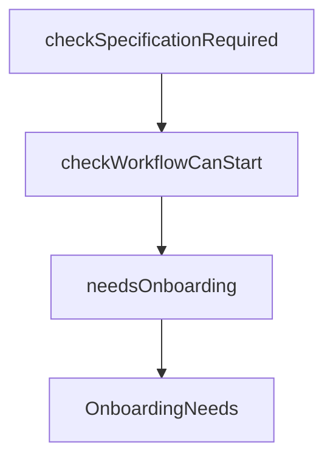

# Chapter 6: Persistence and Long-Running Jobs

Welcome to **Chapter 6: Persistence and Long-Running Jobs**. In this part of **CodeMachine CLI Tutorial: Orchestrating Long-Running Coding Agent Workflows**, you will build an intuitive mental model first, then move into concrete implementation details and practical production tradeoffs.


CodeMachine supports workflows that can run for long durations without manual babysitting.

## Durability Checklist

- persist workflow state after each major step
- support resumable execution after interruption
- define timeout and retry policy per step

## Summary

You now have a durability model for running long-horizon coding workflows.

Next: [Chapter 7: Engine Integrations and Compatibility](07-engine-integrations-and-compatibility.md)

## Depth Expansion Playbook

## Source Code Walkthrough

### `src/workflows/preflight.ts`

The `checkSpecificationRequired` function in [`src/workflows/preflight.ts`](https://github.com/moazbuilds/CodeMachine-CLI/blob/HEAD/src/workflows/preflight.ts) handles a key part of this chapter's functionality:

```ts
 * - Env: CODEMACHINE_SPEC_PATH
 */
export async function checkSpecificationRequired(options: { cwd?: string } = {}): Promise<void> {
  const cwd = options.cwd ? path.resolve(options.cwd) : process.cwd();
  const cmRoot = path.join(cwd, '.codemachine');
  const specificationPath = process.env.CODEMACHINE_SPEC_PATH
    || path.resolve(cwd, '.codemachine', 'inputs', 'specifications.md');

  // Ensure workspace structure exists
  await ensureWorkspaceStructure({ cwd });

  // Ensure imported agents are registered before loading template
  // This allows resolveStep() to find agents from imported packages
  ensureImportedAgentsRegistered();

  // Load template to check specification requirement
  const templatePath = await getTemplatePathFromTracking(cmRoot);
  const { template } = await loadTemplateWithPath(cwd, templatePath);

  // Validate specification only if template requires it
  if (template.specification === true) {
    await validateSpecification(specificationPath);
  }
}

/**
 * Main pre-flight check - verifies workflow can start
 * Throws ValidationError if workflow cannot start due to missing specification
 * Returns onboarding needs if user configuration is required
 */
export async function checkWorkflowCanStart(options: { cwd?: string } = {}): Promise<OnboardingNeeds> {
  const cwd = options.cwd ? path.resolve(options.cwd) : process.cwd();
```

This function is important because it defines how CodeMachine CLI Tutorial: Orchestrating Long-Running Coding Agent Workflows implements the patterns covered in this chapter.

### `src/workflows/preflight.ts`

The `checkWorkflowCanStart` function in [`src/workflows/preflight.ts`](https://github.com/moazbuilds/CodeMachine-CLI/blob/HEAD/src/workflows/preflight.ts) handles a key part of this chapter's functionality:

```ts
 * Returns onboarding needs if user configuration is required
 */
export async function checkWorkflowCanStart(options: { cwd?: string } = {}): Promise<OnboardingNeeds> {
  const cwd = options.cwd ? path.resolve(options.cwd) : process.cwd();

  // First check specification requirement (throws if invalid)
  await checkSpecificationRequired({ cwd });

  // Then check onboarding requirements (returns needs, doesn't throw)
  return checkOnboardingRequired({ cwd });
}

/**
 * Quick check if any onboarding is needed
 * Useful for UI to decide whether to show onboarding flow
 */
export function needsOnboarding(needs: OnboardingNeeds): boolean {
  return (
    needs.needsProjectName ||
    needs.needsTrackSelection ||
    needs.needsConditionsSelection ||
    needs.needsControllerSelection
  );
}

```

This function is important because it defines how CodeMachine CLI Tutorial: Orchestrating Long-Running Coding Agent Workflows implements the patterns covered in this chapter.

### `src/workflows/preflight.ts`

The `needsOnboarding` function in [`src/workflows/preflight.ts`](https://github.com/moazbuilds/CodeMachine-CLI/blob/HEAD/src/workflows/preflight.ts) handles a key part of this chapter's functionality:

```ts
 * Useful for UI to decide whether to show onboarding flow
 */
export function needsOnboarding(needs: OnboardingNeeds): boolean {
  return (
    needs.needsProjectName ||
    needs.needsTrackSelection ||
    needs.needsConditionsSelection ||
    needs.needsControllerSelection
  );
}

```

This function is important because it defines how CodeMachine CLI Tutorial: Orchestrating Long-Running Coding Agent Workflows implements the patterns covered in this chapter.

### `src/workflows/preflight.ts`

The `OnboardingNeeds` interface in [`src/workflows/preflight.ts`](https://github.com/moazbuilds/CodeMachine-CLI/blob/HEAD/src/workflows/preflight.ts) handles a key part of this chapter's functionality:

```ts
 * Onboarding requirements - what the user needs to configure before workflow can start
 */
export interface OnboardingNeeds {
  needsProjectName: boolean;
  needsTrackSelection: boolean;
  needsConditionsSelection: boolean;
  needsControllerSelection: boolean;
  /** @deprecated Controller is now pre-specified via controller() function */
  controllerAgents: AgentDefinition[];
  /** The loaded template for reference */
  template: WorkflowTemplate;
}

/**
 * Check what onboarding steps are needed before workflow can start
 * Does NOT throw - returns the requirements for the UI to handle
 */
export async function checkOnboardingRequired(options: { cwd?: string } = {}): Promise<OnboardingNeeds> {
  const cwd = options.cwd ? path.resolve(options.cwd) : process.cwd();
  const cmRoot = path.join(cwd, '.codemachine');

  // Ensure workspace structure exists
  await ensureWorkspaceStructure({ cwd });

  // Ensure imported agents are registered before loading template
  // This allows resolveStep() to find agents from imported packages
  ensureImportedAgentsRegistered();

  // Load template
  const templatePath = await getTemplatePathFromTracking(cmRoot);
  const { template } = await loadTemplateWithPath(cwd, templatePath);

```

This interface is important because it defines how CodeMachine CLI Tutorial: Orchestrating Long-Running Coding Agent Workflows implements the patterns covered in this chapter.


## How These Components Connect


