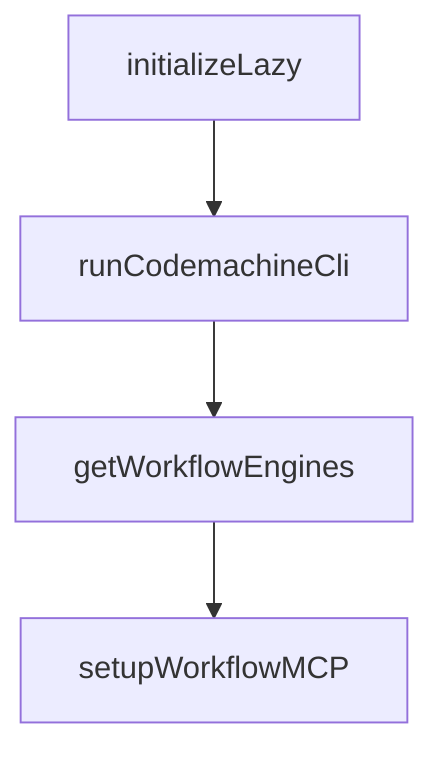

# Chapter 7: Engine Integrations and Compatibility

Welcome to **Chapter 7: Engine Integrations and Compatibility**. In this part of **CodeMachine CLI Tutorial: Orchestrating Long-Running Coding Agent Workflows**, you will build an intuitive mental model first, then move into concrete implementation details and practical production tradeoffs.


CodeMachine integrates with multiple coding-agent engines through headless CLI execution modes.

## Integration Considerations

- normalize invocation flags across engines
- define capability matrix per engine
- handle engine-specific failure modes

## Summary

You now understand how to run cross-engine workflows with consistent orchestration behavior.

Next: [Chapter 8: Production Operations and Team Adoption](08-production-operations-and-team-adoption.md)

## Depth Expansion Playbook

## Source Code Walkthrough

### `src/runtime/cli-setup.ts`

The `initializeLazy` function in [`src/runtime/cli-setup.ts`](https://github.com/moazbuilds/CodeMachine-CLI/blob/HEAD/src/runtime/cli-setup.ts) handles a key part of this chapter's functionality:

```ts
 * 3. Sync engine configs
 */
async function initializeLazy(cwd: string): Promise<void> {
  // Use withRootSpan to create an independent trace (not nested under cli.boot)
  return withRootSpan(cliTracer, 'cli.lazy', async (span) => {
    span.setAttribute('cli.lazy.workspace.path', cwd);
    const lazyStartTime = performance.now();

    // 0. Check default packages for updates (install already happened in pre-boot)
    const { checkDefaultPackageUpdates } = await import('../shared/imports/auto-import.js');
    checkDefaultPackageUpdates()
      .then(() => otel_info(LOGGER_NAMES.CLI, 'Default package update check completed', []))
      .catch(err => {
        otel_warn(LOGGER_NAMES.CLI, 'Default package update check error: %s', [err]);
      });

    // 1. Check for updates
    otel_info(LOGGER_NAMES.CLI, 'Checking for updates...', []);
    const updateStart = performance.now();
    const { check } = await import('../shared/updates/index.js');
    check()
      .then(() => {
        const ms = Math.round(performance.now() - updateStart);
        otel_info(LOGGER_NAMES.CLI, 'Update check completed successfully', []);
        otel_info(LOGGER_NAMES.CLI, 'Update check finished in %dms', [ms]);
      })
      .catch(err => {
        otel_warn(LOGGER_NAMES.CLI, 'Update check error: %s', [err]);
        otel_warn(LOGGER_NAMES.CLI, 'Update check failed after %dms', [Math.round(performance.now() - updateStart)]);
      });

    // LEGACY: Workspace bootstrap - now handled by workflows (preflight.ts, run.ts)
```

This function is important because it defines how CodeMachine CLI Tutorial: Orchestrating Long-Running Coding Agent Workflows implements the patterns covered in this chapter.

### `src/runtime/cli-setup.ts`

The `runCodemachineCli` function in [`src/runtime/cli-setup.ts`](https://github.com/moazbuilds/CodeMachine-CLI/blob/HEAD/src/runtime/cli-setup.ts) handles a key part of this chapter's functionality:

```ts
}

export async function runCodemachineCli(argv: string[] = process.argv): Promise<void> {
  // Use startManualSpanAsync to set boot span as active context (for proper nesting)
  // while still allowing manual span.end() before blocking on TUI
  await startManualSpanAsync(cliTracer, 'cli.boot', async (bootSpan) => {
    const cliArgs = argv.slice(2);
    bootSpan.setAttribute('cli.boot.args', JSON.stringify(cliArgs));
    bootSpan.setAttribute('cli.boot.cwd', process.cwd());
    otel_info(LOGGER_NAMES.CLI, 'CLI invoked with args: %s', [cliArgs.join(' ') || '(none)']);

    let bootSpanEnded = false;
    const endBootSpan = () => {
      if (!bootSpanEnded) {
        bootSpanEnded = true;
        bootSpan.end();
      }
    };

    try {
      const VERSION = await withSpan(cliTracer, 'cli.boot.version', async (verSpan) => {
        const { VERSION: ver } = await import('./version.js');
        verSpan.setAttribute('cli.boot.version', ver);
        otel_info(LOGGER_NAMES.CLI, 'CodeMachine v%s', [ver]);
        return ver;
      });

      const program = new Command()
        .name('codemachine')
        .version(VERSION)
        .description('Codemachine multi-agent CLI orchestrator')
        .option('-d, --dir <path>', 'Target workspace directory', process.cwd())
```

This function is important because it defines how CodeMachine CLI Tutorial: Orchestrating Long-Running Coding Agent Workflows implements the patterns covered in this chapter.

### `src/workflows/mcp.ts`

The `getWorkflowEngines` function in [`src/workflows/mcp.ts`](https://github.com/moazbuilds/CodeMachine-CLI/blob/HEAD/src/workflows/mcp.ts) handles a key part of this chapter's functionality:

```ts
 * Get unique engine IDs used in a workflow template
 */
export function getWorkflowEngines(template: WorkflowTemplate): string[] {
  const engines = new Set<string>();
  const defaultEngine = registry.getDefault();

  for (const step of template.steps) {
    if (step.type === 'module') {
      const engineId = step.engine ?? defaultEngine?.metadata.id;
      if (engineId) {
        engines.add(engineId);
      }
    }
  }

  return Array.from(engines);
}

/**
 * Configure MCP servers for all engines used in a workflow
 *
 * Call this before running the workflow to ensure agents have access
 * to the workflow-signals MCP tools.
 */
export async function setupWorkflowMCP(
  template: WorkflowTemplate,
  workflowDir: string
): Promise<{ configured: string[]; failed: string[] }> {
  const engineIds = getWorkflowEngines(template);
  const configured: string[] = [];
  const failed: string[] = [];

```

This function is important because it defines how CodeMachine CLI Tutorial: Orchestrating Long-Running Coding Agent Workflows implements the patterns covered in this chapter.

### `src/workflows/mcp.ts`

The `setupWorkflowMCP` function in [`src/workflows/mcp.ts`](https://github.com/moazbuilds/CodeMachine-CLI/blob/HEAD/src/workflows/mcp.ts) handles a key part of this chapter's functionality:

```ts
 * to the workflow-signals MCP tools.
 */
export async function setupWorkflowMCP(
  template: WorkflowTemplate,
  workflowDir: string
): Promise<{ configured: string[]; failed: string[] }> {
  const engineIds = getWorkflowEngines(template);
  const configured: string[] = [];
  const failed: string[] = [];

  debug('[MCP] Setting up MCP for engines: %s', engineIds.join(', '));

  for (const engineId of engineIds) {
    const engine = registry.get(engineId);

    if (!engine) {
      debug('[MCP] Engine not found: %s', engineId);
      failed.push(engineId);
      continue;
    }

    if (!engine.mcp?.supported) {
      debug('[MCP] Engine does not support MCP: %s', engineId);
      continue; // Not a failure, just unsupported
    }

    if (!engine.mcp.configure) {
      debug('[MCP] Engine has no configure method: %s', engineId);
      continue;
    }

    try {
```

This function is important because it defines how CodeMachine CLI Tutorial: Orchestrating Long-Running Coding Agent Workflows implements the patterns covered in this chapter.


## How These Components Connect


