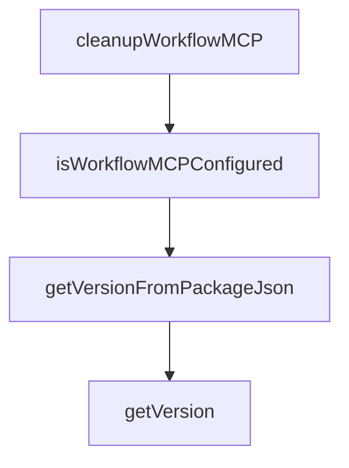

# Chapter 8: Production Operations and Team Adoption

Welcome to **Chapter 8: Production Operations and Team Adoption**. In this part of **CodeMachine CLI Tutorial: Orchestrating Long-Running Coding Agent Workflows**, you will build an intuitive mental model first, then move into concrete implementation details and practical production tradeoffs.


This chapter covers team-scale rollout of CodeMachine orchestration workflows.

## Operations Baseline

- workflow SLOs (success, latency, retries)
- governance checkpoints for high-risk steps
- audit trail retention and incident runbooks

## Summary

You now have a baseline for operationalizing CodeMachine in production engineering teams.

## Depth Expansion Playbook

## Source Code Walkthrough

### `src/workflows/mcp.ts`

The `cleanupWorkflowMCP` function in [`src/workflows/mcp.ts`](https://github.com/moazbuilds/CodeMachine-CLI/blob/HEAD/src/workflows/mcp.ts) handles a key part of this chapter's functionality:

```ts
 * Clean up MCP servers after workflow completes
 */
export async function cleanupWorkflowMCP(
  template: WorkflowTemplate,
  workflowDir: string
): Promise<void> {
  const engineIds = getWorkflowEngines(template);

  debug('[MCP] Cleaning up MCP for engines: %s', engineIds.join(', '));

  for (const engineId of engineIds) {
    const engine = registry.get(engineId);

    if (!engine?.mcp?.cleanup) {
      continue;
    }

    try {
      await engine.mcp.cleanup(workflowDir);
      debug('[MCP] Cleaned up MCP for engine: %s', engineId);
    } catch (error) {
      debug('[MCP] Failed to cleanup MCP for engine %s: %s', engineId, (error as Error).message);
      // Ignore cleanup errors
    }
  }
}

/**
 * Check if MCP is configured for all engines in a workflow
 */
export async function isWorkflowMCPConfigured(
  template: WorkflowTemplate,
```

This function is important because it defines how CodeMachine CLI Tutorial: Orchestrating Long-Running Coding Agent Workflows implements the patterns covered in this chapter.

### `src/workflows/mcp.ts`

The `isWorkflowMCPConfigured` function in [`src/workflows/mcp.ts`](https://github.com/moazbuilds/CodeMachine-CLI/blob/HEAD/src/workflows/mcp.ts) handles a key part of this chapter's functionality:

```ts
 * Check if MCP is configured for all engines in a workflow
 */
export async function isWorkflowMCPConfigured(
  template: WorkflowTemplate,
  workflowDir: string
): Promise<boolean> {
  const engineIds = getWorkflowEngines(template);

  for (const engineId of engineIds) {
    const engine = registry.get(engineId);

    if (!engine?.mcp?.supported) {
      continue; // Skip unsupported engines
    }

    if (!engine.mcp.isConfigured) {
      continue;
    }

    const configured = await engine.mcp.isConfigured(workflowDir);
    if (!configured) {
      return false;
    }
  }

  return true;
}

```

This function is important because it defines how CodeMachine CLI Tutorial: Orchestrating Long-Running Coding Agent Workflows implements the patterns covered in this chapter.

### `src/runtime/version.ts`

The `getVersionFromPackageJson` function in [`src/runtime/version.ts`](https://github.com/moazbuilds/CodeMachine-CLI/blob/HEAD/src/runtime/version.ts) handles a key part of this chapter's functionality:

```ts
let cachedVersion: string | null = null;

function getVersionFromPackageJson(): string {
  try {
    // Traverse up from this file location looking for codemachine package.json
    let currentDir = join(import.meta.dir || __dirname, '..');
    for (let i = 0; i < 10; i++) {
      const pkgPath = join(currentDir, 'package.json');
      try {
        const pkg = JSON.parse(readFileSync(pkgPath, 'utf8'));
        if (pkg?.name === 'codemachine' && pkg?.version) {
          return pkg.version;
        }
      } catch {
        // Try parent directory
      }
      const parent = join(currentDir, '..');
      if (parent === currentDir) break;
      currentDir = parent;
    }
    return '0.0.0';
  } catch (error) {
    otel_warn(LOGGER_NAMES.CLI, '[version] Unexpected error while resolving package version: %s', [
      error instanceof Error ? error.message : String(error),
    ]);
    return '0.0.0-unknown';
  }
}

export function getVersion(): string {
  if (cachedVersion) return cachedVersion;

```

This function is important because it defines how CodeMachine CLI Tutorial: Orchestrating Long-Running Coding Agent Workflows implements the patterns covered in this chapter.

### `src/runtime/version.ts`

The `getVersion` function in [`src/runtime/version.ts`](https://github.com/moazbuilds/CodeMachine-CLI/blob/HEAD/src/runtime/version.ts) handles a key part of this chapter's functionality:

```ts
let cachedVersion: string | null = null;

function getVersionFromPackageJson(): string {
  try {
    // Traverse up from this file location looking for codemachine package.json
    let currentDir = join(import.meta.dir || __dirname, '..');
    for (let i = 0; i < 10; i++) {
      const pkgPath = join(currentDir, 'package.json');
      try {
        const pkg = JSON.parse(readFileSync(pkgPath, 'utf8'));
        if (pkg?.name === 'codemachine' && pkg?.version) {
          return pkg.version;
        }
      } catch {
        // Try parent directory
      }
      const parent = join(currentDir, '..');
      if (parent === currentDir) break;
      currentDir = parent;
    }
    return '0.0.0';
  } catch (error) {
    otel_warn(LOGGER_NAMES.CLI, '[version] Unexpected error while resolving package version: %s', [
      error instanceof Error ? error.message : String(error),
    ]);
    return '0.0.0-unknown';
  }
}

export function getVersion(): string {
  if (cachedVersion) return cachedVersion;

```

This function is important because it defines how CodeMachine CLI Tutorial: Orchestrating Long-Running Coding Agent Workflows implements the patterns covered in this chapter.


## How These Components Connect


