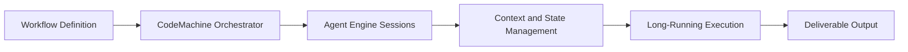

# CodeMachine CLI Tutorial: Orchestrating Long-Running Coding Agent Workflows

> Learn how to use `moazbuilds/CodeMachine-CLI` to orchestrate repeatable coding-agent workflows with multi-agent coordination, context control, and long-running execution.

## Why This Track Matters

Many coding-agent workflows are ad hoc and hard to repeat. CodeMachine turns these workflows into persistent orchestrations with better structure, scalability, and team reuse.

This track focuses on:

- orchestrating coding-agent CLIs into repeatable workflows
- multi-agent and parallel execution patterns
- persistence and long-running process operations
- context engineering and governance for reliable outcomes

## Current Snapshot (Verified February 11, 2026)

- repository: [`moazbuilds/CodeMachine-CLI`](https://github.com/moazbuilds/CodeMachine-CLI)
- stars: about **2.3k**
- latest release: [`v0.8.0`](https://github.com/moazbuilds/CodeMachine-CLI/releases/tag/v0.8.0)
- development activity: active with recent updates
- project positioning: orchestration layer for coding-agent engines (Claude/Codex/Cursor and others)

## Mental Model

## Chapter Guide

| Chapter | Key Question | Outcome |
|:--------|:-------------|:--------|
| [01 - Getting Started](01-getting-started.md) | How do I run first workflows with CodeMachine? | Working baseline |
| [02 - Orchestration Architecture](02-orchestration-architecture.md) | How does CodeMachine coordinate engines and state? | Strong architecture model |
| [03 - Workflow Design Patterns](03-workflow-design-patterns.md) | How do I encode reliable coding workflows? | Reusable orchestration patterns |
| [04 - Multi-Agent and Parallel Execution](04-multi-agent-and-parallel-execution.md) | How do multiple agents collaborate effectively? | Better throughput and specialization |
| [05 - Context Engineering and State Control](05-context-engineering-and-state-control.md) | How do I prevent context drift in long workflows? | Improved reliability |
| [06 - Persistence and Long-Running Jobs](06-persistence-and-long-running-jobs.md) | How do I run workflows for hours/days safely? | Durable operations model |
| [07 - Engine Integrations and Compatibility](07-engine-integrations-and-compatibility.md) | How does CodeMachine support different coding agents? | Integration strategy |
| [08 - Production Operations and Team Adoption](08-production-operations-and-team-adoption.md) | How do teams operationalize CodeMachine? | Production runbook baseline |

## What You Will Learn

- how to turn manual coding-agent loops into reusable workflows
- how to orchestrate parallel agents with explicit state/control
- how to run long-duration workflows safely with persistence
- how to adopt orchestration-first coding practices across teams

## Source References

- [CodeMachine CLI Repository](https://github.com/moazbuilds/CodeMachine-CLI)
- [CodeMachine CLI Releases](https://github.com/moazbuilds/CodeMachine-CLI/releases)
- [CodeMachine Docs](https://docs.codemachine.co/)

## Related Tutorials

- [OpenCode Tutorial](../opencode-tutorial/)
- [HumanLayer Tutorial](../humanlayer-tutorial/)
- [Plandex Tutorial](../plandex-tutorial/)
- [Cline Tutorial](../cline-tutorial/)

---

Start with [Chapter 1: Getting Started](01-getting-started.md).
