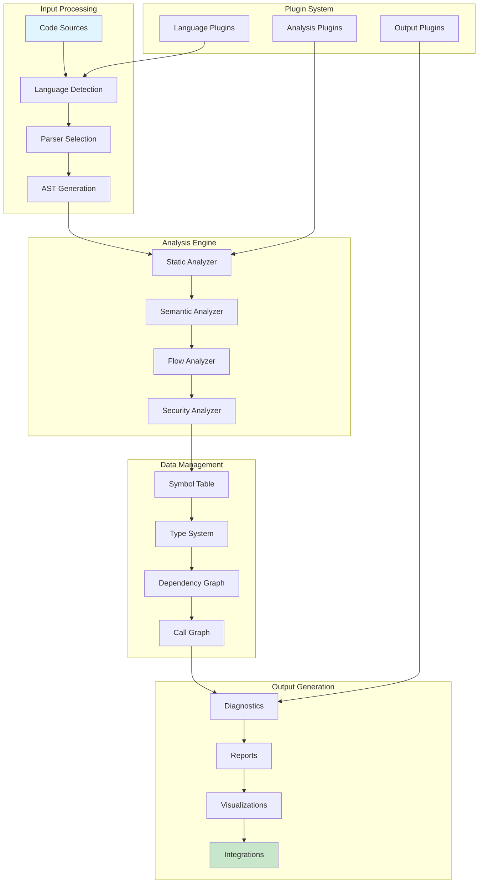

# Chapter 1: Analysis Engine Architecture

> Building comprehensive static code analysis engines with modern architecture patterns

## 🎯 Learning Objectives

By the end of this chapter, you'll understand:
- Core components of a static analysis platform
- Architecture patterns for scalable code analysis
- Language-agnostic analysis frameworks
- Integration with development workflows
- Performance considerations for large codebases

## 🏗️ Analysis Engine Architecture

### **Core Components Overview**

A modern code analysis platform consists of several interconnected components:



### **Language Detection and Parser Selection**

```typescript
// Language detection and parser selection
class LanguageDetector {
  private languagePatterns: Map<string, LanguagePattern> = new Map();
  private parserRegistry: Map<string, ParserFactory> = new Map();

  constructor() {
    this.initializeLanguagePatterns();
    this.initializeParserRegistry();
  }

  private initializeLanguagePatterns() {
    this.languagePatterns.set('javascript', {
      extensions: ['.js', '.jsx', '.mjs', '.cjs'],
      filenames: ['package.json'],
      contentPatterns: [/^#!/.*node/, /import\s+.*from/, /export\s+/],
      shebang: '#!/usr/bin/env node'
    });

    this.languagePatterns.set('typescript', {
      extensions: ['.ts', '.tsx', '.d.ts'],
      filenames: ['tsconfig.json'],
      contentPatterns: [/interface\s+\w+/, /:\s*\w+\s*=>/, /import\s+type/],
      inherits: 'javascript'
    });

    this.languagePatterns.set('python', {
      extensions: ['.py', '.pyw', '.pyi'],
      filenames: ['setup.py', 'requirements.txt', 'pyproject.toml'],
      contentPatterns: [/^#!/.*python/, /import\s+\w+/, /def\s+\w+\s*\(/],
      shebang: '#!/usr/bin/env python'
    });

    this.languagePatterns.set('java', {
      extensions: ['.java'],
      contentPatterns: [/public\s+class\s+\w+/, /import\s+java\./],
      packagePattern: /^package\s+[\w.]+;/
    });

    this.languagePatterns.set('go', {
      extensions: ['.go'],
      filenames: ['go.mod', 'go.sum'],
      contentPatterns: [/^package\s+\w+/, /import\s+\(/, /func\s+\w+\s*\(/]
    });

    this.languagePatterns.set('rust', {
      extensions: ['.rs'],
      filenames: ['Cargo.toml', 'Cargo.lock'],
      contentPatterns: [/^use\s+\w+::/, /fn\s+\w+\s*\(/, /let\s+mut\s+\w+/]
    });
  }

  private initializeParserRegistry() {
    // JavaScript/TypeScript parsers
    this.parserRegistry.set('javascript', new BabelParserFactory());
    this.parserRegistry.set('typescript', new TypeScriptParserFactory());

    // Python parsers
    this.parserRegistry.set('python', new PythonParserFactory());

    // JVM languages
    this.parserRegistry.set('java', new JavaParserFactory());

    // Systems languages
    this.parserRegistry.set('go', new GoParserFactory());
    this.parserRegistry.set('rust', new RustParserFactory());

    // Tree-sitter based parsers for additional languages
    this.parserRegistry.set('ruby', new TreeSitterParserFactory('ruby'));
    this.parserRegistry.set('php', new TreeSitterParserFactory('php'));
    this.parserRegistry.set('csharp', new TreeSitterParserFactory('c-sharp'));
  }

  async detectLanguage(filePath: string, content?: string): Promise<DetectedLanguage> {
    const filename = path.basename(filePath);
    const extension = path.extname(filePath);

    // Check filename patterns
    for (const [lang, pattern] of this.languagePatterns) {
      if (pattern.filenames?.includes(filename)) {
        return { language: lang, confidence: 1.0 };
      }
    }

    // Check extension patterns
    for (const [lang, pattern] of this.languagePatterns) {
      if (pattern.extensions?.includes(extension)) {
        let confidence = 0.8;

        // Check for inheritance (e.g., TypeScript inherits from JavaScript)
        if (pattern.inherits) {
          const parentPattern = this.languagePatterns.get(pattern.inherits);
          if (parentPattern?.extensions?.includes(extension)) {
            confidence = 0.9;
          }
        }

        // If content is available, check content patterns
        if (content) {
          const contentConfidence = this.checkContentPatterns(content, pattern);
          confidence = Math.min(confidence, contentConfidence);
        }

        return { language: lang, confidence };
      }
    }

    // Fallback to content analysis if content is available
    if (content) {
      return this.detectLanguageFromContent(content);
    }

    return { language: 'unknown', confidence: 0.0 };
  }

  private checkContentPatterns(content: string, pattern: LanguagePattern): number {
    let matches = 0;
    let totalPatterns = 0;

    // Check shebang
    if (pattern.shebang) {
      totalPatterns++;
      if (content.startsWith(pattern.shebang)) {
        matches++;
      }
    }

    // Check content patterns
    if (pattern.contentPatterns) {
      totalPatterns += pattern.contentPatterns.length;
      for (const regex of pattern.contentPatterns) {
        if (regex.test(content)) {
          matches++;
        }
      }
    }

    // Check package pattern
    if (pattern.packagePattern) {
      totalPatterns++;
      if (pattern.packagePattern.test(content)) {
        matches++;
      }
    }

    return totalPatterns > 0 ? matches / totalPatterns : 0.5;
  }

  private detectLanguageFromContent(content: string): DetectedLanguage {
    // Analyze content for language-specific patterns
    const detections = [];

    for (const [lang, pattern] of this.languagePatterns) {
      const confidence = this.checkContentPatterns(content, pattern);
      if (confidence > 0.3) { // Minimum confidence threshold
        detections.push({ language: lang, confidence });
      }
    }

    detections.sort((a, b) => b.confidence - a.confidence);

    return detections.length > 0 ? detections[0] : { language: 'unknown', confidence: 0.0 };
  }

  getParser(language: string): Parser | null {
    const factory = this.parserRegistry.get(language);
    return factory ? factory.createParser() : null;
  }

  supportsLanguage(language: string): boolean {
    return this.parserRegistry.has(language);
  }
}

interface LanguagePattern {
  extensions?: string[];
  filenames?: string[];
  contentPatterns?: RegExp[];
  shebang?: string;
  packagePattern?: RegExp;
  inherits?: string;
}

interface DetectedLanguage {
  language: string;
  confidence: number;
}

interface ParserFactory {
  createParser(): Parser;
}

interface Parser {
  parse(content: string, options?: ParseOptions): AST;
}

interface ParseOptions {
  sourceFilename?: string;
  allowImportExportEverywhere?: boolean;
  plugins?: string[];
}
```

### **AST Generation and Processing**

```typescript
// Abstract Syntax Tree processing framework
class ASTProcessor {
  private processors: Map<string, ASTProcessorFunction> = new Map();

  registerProcessor(language: string, processor: ASTProcessorFunction): void {
    this.processors.set(language, processor);
  }

  async processAST(language: string, ast: AST, context: ProcessingContext): Promise<ProcessingResult> {
    const processor = this.processors.get(language);

    if (!processor) {
      throw new Error(`No AST processor registered for language: ${language}`);
    }

    try {
      // Pre-processing
      await this.preProcess(ast, context);

      // Main processing
      const result = await processor(ast, context);

      // Post-processing
      await this.postProcess(result, context);

      return result;

    } catch (error) {
      await this.handleProcessingError(error, context);
      throw error;
    }
  }

  private async preProcess(ast: AST, context: ProcessingContext): Promise<void> {
    // Initialize processing context
    context.symbols = new SymbolTable();
    context.types = new TypeSystem();
    context.dependencies = new DependencyGraph();

    // Extract basic metadata
    context.metadata = {
      language: context.language,
      filename: context.filename,
      loc: ast.loc,
      sourceType: ast.sourceType || 'module'
    };
  }

  private async postProcess(result: ProcessingResult, context: ProcessingContext): Promise<void> {
    // Validate processing results
    await this.validateResults(result);

    // Generate cross-references
    result.crossReferences = await this.generateCrossReferences(result, context);

    // Calculate metrics
    result.metrics = this.calculateMetrics(result, context);
  }

  private async validateResults(result: ProcessingResult): Promise<void> {
    // Validate symbol table consistency
    if (result.symbols) {
      await this.validateSymbolTable(result.symbols);
    }

    // Validate type system
    if (result.types) {
      await this.validateTypeSystem(result.types);
    }

    // Validate dependency graph
    if (result.dependencies) {
      await this.validateDependencyGraph(result.dependencies);
    }
  }

  private async generateCrossReferences(result: ProcessingResult, context: ProcessingContext): Promise<CrossReference[]> {
    const references: CrossReference[] = [];

    // Generate symbol references
    if (result.symbols) {
      for (const symbol of result.symbols.getAllSymbols()) {
        const refs = await this.findReferences(symbol, context);
        references.push(...refs);
      }
    }

    // Generate type references
    if (result.types) {
      for (const type of result.types.getAllTypes()) {
        const refs = await this.findTypeReferences(type, context);
        references.push(...refs);
      }
    }

    return references;
  }

  private calculateMetrics(result: ProcessingResult, context: ProcessingContext): AnalysisMetrics {
    return {
      processingTime: Date.now() - context.startTime,
      symbolsCount: result.symbols?.getSymbolCount() || 0,
      typesCount: result.types?.getTypeCount() || 0,
      dependenciesCount: result.dependencies?.getEdgeCount() || 0,
      functionsCount: result.functions?.length || 0,
      classesCount: result.classes?.length || 0,
      filesProcessed: 1,
      language: context.language
    };
  }

  private async handleProcessingError(error: Error, context: ProcessingContext): Promise<void> {
    // Log error with context
    console.error(`AST processing error in ${context.filename}:`, error);

    // Attempt error recovery
    if (this.canRecoverFromError(error)) {
      await this.attemptErrorRecovery(error, context);
    }

    // Record error in context
    context.errors = context.errors || [];
    context.errors.push({
      message: error.message,
      location: error.location || context.filename,
      severity: 'error',
      timestamp: new Date()
    });
  }

  private canRecoverFromError(error: Error): boolean {
    // Determine if error is recoverable
    const recoverablePatterns = [
      /Unexpected token/,
      /Missing semicolon/,
      /Unterminated string/
    ];

    return recoverablePatterns.some(pattern => pattern.test(error.message));
  }

  private async attemptErrorRecovery(error: Error, context: ProcessingContext): Promise<void> {
    // Implement error recovery strategies
    // This could involve fallback parsing, partial AST construction, etc.
  }
}

interface ASTProcessorFunction {
  (ast: AST, context: ProcessingContext): Promise<ProcessingResult>;
}

interface ProcessingContext {
  language: string;
  filename: string;
  content: string;
  startTime: number;
  symbols?: SymbolTable;
  types?: TypeSystem;
  dependencies?: DependencyGraph;
  metadata?: FileMetadata;
  errors?: ProcessingError[];
}

interface ProcessingResult {
  symbols?: SymbolTable;
  types?: TypeSystem;
  dependencies?: DependencyGraph;
  functions?: FunctionInfo[];
  classes?: ClassInfo[];
  diagnostics?: Diagnostic[];
  crossReferences?: CrossReference[];
  metrics?: AnalysisMetrics;
}

interface ProcessingError {
  message: string;
  location: string;
  severity: 'error' | 'warning' | 'info';
  timestamp: Date;
}
```

## 🔍 Static Analysis Engine

### **Multi-Pass Analysis Architecture**

```typescript
// Static analysis engine with multiple analysis passes
class StaticAnalysisEngine {
  private passes: AnalysisPass[] = [];
  private passResults: Map<string, PassResult> = new Map();

  registerPass(pass: AnalysisPass): void {
    this.passes.push(pass);
  }

  async analyze(files: SourceFile[], config: AnalysisConfig): Promise<AnalysisReport> {
    const context: AnalysisContext = {
      files,
      config,
      symbols: new SymbolTable(),
      types: new TypeSystem(),
      dependencies: new DependencyGraph(),
      diagnostics: [],
      startTime: Date.now()
    };

    try {
      // Execute analysis passes in order
      for (const pass of this.passes) {
        if (config.enabledPasses.includes(pass.name)) {
          console.log(`Executing analysis pass: ${pass.name}`);

          const passContext = await this.createPassContext(pass, context);
          const result = await pass.execute(passContext);

          this.passResults.set(pass.name, result);

          // Merge results into global context
          await this.mergePassResults(result, context);
        }
      }

      // Generate final report
      return this.generateReport(context);

    } catch (error) {
      console.error('Analysis engine error:', error);
      throw error;
    }
  }

  private async createPassContext(pass: AnalysisPass, globalContext: AnalysisContext): Promise<PassContext> {
    return {
      files: globalContext.files,
      config: globalContext.config,
      symbols: globalContext.symbols,
      types: globalContext.types,
      dependencies: globalContext.dependencies,
      previousResults: this.getPreviousPassResults(pass),
      passConfig: globalContext.config.passConfigs[pass.name] || {}
    };
  }

  private getPreviousPassResults(currentPass: AnalysisPass): Map<string, PassResult> {
    const previousResults = new Map<string, PassResult>();

    // Get results from passes that should run before current pass
    for (const pass of this.passes) {
      if (pass === currentPass) break;

      const result = this.passResults.get(pass.name);
      if (result) {
        previousResults.set(pass.name, result);
      }
    }

    return previousResults;
  }

  private async mergePassResults(passResult: PassResult, globalContext: AnalysisContext): Promise<void> {
    // Merge symbols
    if (passResult.symbols) {
      for (const symbol of passResult.symbols) {
        globalContext.symbols.addSymbol(symbol);
      }
    }

    // Merge types
    if (passResult.types) {
      for (const type of passResult.types) {
        globalContext.types.addType(type);
      }
    }

    // Merge dependencies
    if (passResult.dependencies) {
      for (const dep of passResult.dependencies) {
        globalContext.dependencies.addDependency(dep);
      }
    }

    // Merge diagnostics
    if (passResult.diagnostics) {
      globalContext.diagnostics.push(...passResult.diagnostics);
    }
  }

  private generateReport(context: AnalysisContext): AnalysisReport {
    const processingTime = Date.now() - context.startTime;

    return {
      summary: {
        filesProcessed: context.files.length,
        totalSymbols: context.symbols.getSymbolCount(),
        totalTypes: context.types.getTypeCount(),
        totalDependencies: context.dependencies.getEdgeCount(),
        processingTime,
        languages: this.getLanguageBreakdown(context.files)
      },
      symbols: context.symbols,
      types: context.types,
      dependencies: context.dependencies,
      diagnostics: context.diagnostics,
      passResults: this.passResults,
      config: context.config
    };
  }

  private getLanguageBreakdown(files: SourceFile[]): Record<string, number> {
    const breakdown: Record<string, number> = {};

    for (const file of files) {
      breakdown[file.language] = (breakdown[file.language] || 0) + 1;
    }

    return breakdown;
  }
}

interface AnalysisPass {
  name: string;
  description: string;
  dependsOn?: string[]; // Names of passes this pass depends on
  execute(context: PassContext): Promise<PassResult>;
}

interface PassContext {
  files: SourceFile[];
  config: AnalysisConfig;
  symbols: SymbolTable;
  types: TypeSystem;
  dependencies: DependencyGraph;
  previousResults: Map<string, PassResult>;
  passConfig: any;
}

interface PassResult {
  symbols?: SymbolInfo[];
  types?: TypeInfo[];
  dependencies?: Dependency[];
  diagnostics?: Diagnostic[];
  metrics?: PassMetrics;
}

interface AnalysisContext {
  files: SourceFile[];
  config: AnalysisConfig;
  symbols: SymbolTable;
  types: TypeSystem;
  dependencies: DependencyGraph;
  diagnostics: Diagnostic[];
  startTime: number;
}

interface AnalysisReport {
  summary: AnalysisSummary;
  symbols: SymbolTable;
  types: TypeSystem;
  dependencies: DependencyGraph;
  diagnostics: Diagnostic[];
  passResults: Map<string, PassResult>;
  config: AnalysisConfig;
}

interface AnalysisSummary {
  filesProcessed: number;
  totalSymbols: number;
  totalTypes: number;
  totalDependencies: number;
  processingTime: number;
  languages: Record<string, number>;
}
```

## 📊 Semantic Analysis Framework

### **Symbol Resolution and Type Inference**

```typescript
// Symbol resolution system
class SymbolResolver {
  private symbolTable: SymbolTable;
  private scopeStack: Scope[] = [];

  constructor(symbolTable: SymbolTable) {
    this.symbolTable = symbolTable;
    this.scopeStack.push(this.createGlobalScope());
  }

  resolveSymbol(name: string, location: Location): SymbolInfo | null {
    // Search in current scope and parent scopes
    for (let i = this.scopeStack.length - 1; i >= 0; i--) {
      const scope = this.scopeStack[i];
      const symbol = scope.symbols.get(name);

      if (symbol) {
        // Check if symbol is accessible from current location
        if (this.isAccessible(symbol, location)) {
          return symbol;
        }
      }
    }

    // Check symbol table for global symbols
    return this.symbolTable.getSymbol(name);
  }

  enterScope(scopeType: ScopeType, node?: ASTNode): Scope {
    const scope: Scope = {
      type: scopeType,
      symbols: new Map(),
      parent: this.scopeStack[this.scopeStack.length - 1],
      node,
      startLocation: node?.loc?.start,
      endLocation: node?.loc?.end
    };

    this.scopeStack.push(scope);
    return scope;
  }

  exitScope(): Scope | null {
    if (this.scopeStack.length > 1) {
      return this.scopeStack.pop() || null;
    }
    return null;
  }

  declareSymbol(symbol: SymbolInfo): void {
    const currentScope = this.scopeStack[this.scopeStack.length - 1];
    if (currentScope) {
      currentScope.symbols.set(symbol.name, symbol);
    }
  }

  private createGlobalScope(): Scope {
    return {
      type: 'global',
      symbols: new Map(),
      parent: null,
      node: null
    };
  }

  private isAccessible(symbol: SymbolInfo, location: Location): boolean {
    // Check visibility rules based on symbol kind and location
    switch (symbol.kind) {
      case 'private':
        return this.isInSameScope(symbol, location);
      case 'protected':
        return this.isInSameClassOrSubclass(symbol, location);
      case 'public':
        return true;
      case 'internal':
        return this.isInSameModule(symbol, location);
      default:
        return true;
    }
  }

  private isInSameScope(symbol: SymbolInfo, location: Location): boolean {
    if (!symbol.scope) return false;

    // Check if location is within symbol's scope
    return this.isLocationInScope(location, symbol.scope);
  }

  private isLocationInScope(location: Location, scope: Scope): boolean {
    if (!scope.startLocation || !scope.endLocation) return false;

    return location.line >= scope.startLocation.line &&
           location.line <= scope.endLocation.line &&
           (location.line !== scope.startLocation.line || location.column >= scope.startLocation.column) &&
           (location.line !== scope.endLocation.line || location.column <= scope.endLocation.column);
  }

  private isInSameClassOrSubclass(symbol: SymbolInfo, location: Location): boolean {
    // Implement class hierarchy checking
    return false; // Placeholder
  }

  private isInSameModule(symbol: SymbolInfo, location: Location): boolean {
    // Implement module boundary checking
    return false; // Placeholder
  }

  getCurrentScope(): Scope {
    return this.scopeStack[this.scopeStack.length - 1];
  }

  getScopeStack(): Scope[] {
    return [...this.scopeStack];
  }
}

interface Scope {
  type: ScopeType;
  symbols: Map<string, SymbolInfo>;
  parent: Scope | null;
  node?: ASTNode;
  startLocation?: Location;
  endLocation?: Location;
}

type ScopeType = 'global' | 'function' | 'block' | 'class' | 'module' | 'namespace';
```

## 🚀 Performance Optimization

### **Incremental Analysis**

```typescript
// Incremental analysis for changed files
class IncrementalAnalyzer {
  private analysisCache: Map<string, CachedAnalysis> = new Map();
  private dependencyTracker: DependencyTracker;

  constructor(dependencyTracker: DependencyTracker) {
    this.dependencyTracker = dependencyTracker;
  }

  async analyzeIncrementally(changedFiles: SourceFile[]): Promise<IncrementalAnalysisResult> {
    const affectedFiles = new Set<string>();
    const invalidatedCache = new Set<string>();

    // Find all files affected by changes
    for (const changedFile of changedFiles) {
      affectedFiles.add(changedFile.path);

      // Find files that depend on changed file
      const dependents = await this.dependencyTracker.getDependents(changedFile.path);
      dependents.forEach(dep => affectedFiles.add(dep));
    }

    // Invalidate cache for affected files
    for (const filePath of affectedFiles) {
      if (this.analysisCache.has(filePath)) {
        invalidatedCache.add(filePath);
        this.analysisCache.delete(filePath);
      }
    }

    // Re-analyze affected files
    const reanalysisResults: Map<string, AnalysisResult> = new Map();

    for (const filePath of affectedFiles) {
      const file = changedFiles.find(f => f.path === filePath);
      if (file) {
        const result = await this.analyzeFile(file);
        reanalysisResults.set(filePath, result);

        // Update cache with new result
        this.analysisCache.set(filePath, {
          result,
          timestamp: Date.now(),
          dependencies: await this.dependencyTracker.getDependencies(filePath)
        });
      }
    }

    return {
      affectedFiles: Array.from(affectedFiles),
      invalidatedCache: Array.from(invalidatedCache),
      reanalysisResults,
      unchangedFiles: this.getUnchangedFiles(affectedFiles)
    };
  }

  async analyzeFile(file: SourceFile): Promise<AnalysisResult> {
    // Check if we have cached result for unchanged file
    const cached = this.analysisCache.get(file.path);
    if (cached && cached.timestamp > file.lastModified) {
      return cached.result;
    }

    // Perform fresh analysis
    return await this.performAnalysis(file);
  }

  private async performAnalysis(file: SourceFile): Promise<AnalysisResult> {
    // Implementation of analysis logic
    return {
      symbols: [],
      diagnostics: [],
      dependencies: []
    };
  }

  private getUnchangedFiles(affectedFiles: Set<string>): string[] {
    const allFiles = Array.from(this.analysisCache.keys());
    return allFiles.filter(file => !affectedFiles.has(file));
  }

  getCacheStats(): CacheStats {
    const totalEntries = this.analysisCache.size;
    const totalSize = Array.from(this.analysisCache.values())
      .reduce((sum, entry) => sum + this.calculateEntrySize(entry), 0);

    return {
      totalEntries,
      totalSize,
      hitRate: 0, // Would need to track hits/misses
      averageEntrySize: totalSize / totalEntries
    };
  }

  private calculateEntrySize(entry: CachedAnalysis): number {
    // Rough size calculation
    return JSON.stringify(entry.result).length +
           entry.dependencies.length * 100; // Estimate for dependency data
  }
}

interface CachedAnalysis {
  result: AnalysisResult;
  timestamp: number;
  dependencies: string[];
}

interface IncrementalAnalysisResult {
  affectedFiles: string[];
  invalidatedCache: string[];
  reanalysisResults: Map<string, AnalysisResult>;
  unchangedFiles: string[];
}

interface CacheStats {
  totalEntries: number;
  totalSize: number;
  hitRate: number;
  averageEntrySize: number;
}
```

## 🧪 Hands-On Exercise

**Estimated Time: 75 minutes**

1. **Language Detection**: Implement language detection for multiple programming languages using file extensions and content analysis
2. **Parser Integration**: Set up AST parsers for JavaScript/TypeScript and Python using Babel and AST libraries
3. **Symbol Table**: Build a symbol table that tracks variables, functions, and classes across scopes
4. **Dependency Analysis**: Create a dependency graph that shows relationships between files and modules
5. **Incremental Analysis**: Implement caching and incremental analysis for changed files

---

**Ready to dive into AST processing?** Continue to [Chapter 2: AST Processing and Manipulation](02-ast-processing.md)