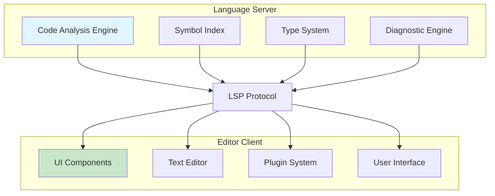

# Chapter 3: Language Server Protocol Implementation

> Implementing the Language Server Protocol for editor integrations and IDE features

## 🎯 Learning Objectives

By the end of this chapter, you'll understand:
- Language Server Protocol fundamentals and architecture
- Implementing LSP server for code analysis
- Client-server communication patterns
- Editor integration and extension development
- Advanced LSP features and customization

## 🏛️ LSP Architecture Overview

### **Client-Server Model**

The Language Server Protocol separates language smarts from editor UI:



### **Protocol Layers**

```typescript
// LSP message structure
interface LSPMessage {
  jsonrpc: "2.0";
  id?: number | string;
  method?: string;
  params?: any;
  result?: any;
  error?: LSPError;
}

interface LSPError {
  code: number;
  message: string;
  data?: any;
}

// Request-Response pattern
interface LSPRequest extends LSPMessage {
  id: number | string;
  method: string;
  params?: any;
}

interface LSPResponse extends LSPMessage {
  id: number | string;
  result?: any;
  error?: LSPError;
}

// Notification (one-way)
interface LSPNotification extends LSPMessage {
  method: string;
  params?: any;
}
```

## 🚀 Building an LSP Server

### **Server Implementation Framework**

```typescript
// Base LSP server class
abstract class LSPServer {
  private connection: LSPConnection;
  private capabilities: ServerCapabilities;
  private documents: Map<string, TextDocument> = new Map();

  constructor(connection: LSPConnection) {
    this.connection = connection;
    this.capabilities = this.getServerCapabilities();

    // Set up message handlers
    this.setupMessageHandlers();
  }

  private setupMessageHandlers(): void {
    // Core protocol messages
    this.connection.onRequest('initialize', this.handleInitialize.bind(this));
    this.connection.onRequest('shutdown', this.handleShutdown.bind(this));
    this.connection.onNotification('exit', this.handleExit.bind(this));

    // Text document synchronization
    this.connection.onNotification('textDocument/didOpen', this.handleDidOpen.bind(this));
    this.connection.onNotification('textDocument/didChange', this.handleDidChange.bind(this));
    this.connection.onNotification('textDocument/didClose', this.handleDidClose.bind(this));

    // Language features
    this.connection.onRequest('textDocument/completion', this.handleCompletion.bind(this));
    this.connection.onRequest('textDocument/hover', this.handleHover.bind(this));
    this.connection.onRequest('textDocument/definition', this.handleDefinition.bind(this));
    this.connection.onRequest('textDocument/references', this.handleReferences.bind(this));
    this.connection.onRequest('textDocument/documentSymbol', this.handleDocumentSymbol.bind(this));
    this.connection.onRequest('workspace/symbol', this.handleWorkspaceSymbol.bind(this));
  }

  // Abstract methods for language-specific implementation
  protected abstract getServerCapabilities(): ServerCapabilities;
  protected abstract analyzeDocument(uri: string, content: string): AnalysisResult;
  protected abstract getCompletions(uri: string, position: Position): CompletionItem[];
  protected abstract getHoverInfo(uri: string, position: Position): Hover | null;
  protected abstract getDefinition(uri: string, position: Position): Location | null;
  protected abstract getReferences(uri: string, position: Position): Location[];
  protected abstract getDocumentSymbols(uri: string): DocumentSymbol[];
  protected abstract getWorkspaceSymbols(query: string): SymbolInformation[];

  // Core protocol handlers
  private async handleInitialize(params: InitializeParams): Promise<InitializeResult> {
    console.log('Initializing LSP server for workspace:', params.rootUri);

    // Initialize workspace
    await this.initializeWorkspace(params);

    return {
      capabilities: this.capabilities,
      serverInfo: {
        name: this.getServerName(),
        version: this.getServerVersion()
      }
    };
  }

  private async handleShutdown(): Promise<null> {
    console.log('Shutting down LSP server');
    await this.shutdown();
    return null;
  }

  private handleExit(): void {
    console.log('Exiting LSP server');
    process.exit(0);
  }

  // Document synchronization
  private handleDidOpen(params: DidOpenTextDocumentParams): void {
    const { textDocument } = params;
    console.log(`Opening document: ${textDocument.uri}`);

    const document: TextDocument = {
      uri: textDocument.uri,
      languageId: textDocument.languageId,
      version: textDocument.version,
      content: textDocument.text
    };

    this.documents.set(textDocument.uri, document);

    // Trigger analysis
    this.analyzeDocumentAsync(textDocument.uri, textDocument.text);
  }

  private handleDidChange(params: DidChangeTextDocumentParams): void {
    const { textDocument, contentChanges } = params;
    console.log(`Updating document: ${textDocument.uri}`);

    const document = this.documents.get(textDocument.uri);
    if (!document) return;

    // Apply content changes
    let newContent = document.content;
    for (const change of contentChanges) {
      if (change.range) {
        // Incremental update
        newContent = this.applyIncrementalChange(newContent, change);
      } else {
        // Full content update
        newContent = change.text;
      }
    }

    document.content = newContent;
    document.version = textDocument.version;

    // Trigger re-analysis
    this.analyzeDocumentAsync(textDocument.uri, newContent);
  }

  private handleDidClose(params: DidCloseTextDocumentParams): void {
    const { textDocument } = params;
    console.log(`Closing document: ${textDocument.uri}`);

    this.documents.delete(textDocument.uri);
  }

  // Language feature handlers
  private async handleCompletion(params: CompletionParams): Promise<CompletionList> {
    const { textDocument, position } = params;

    const completions = await this.getCompletions(textDocument.uri, position);

    return {
      isIncomplete: completions.length > 100, // Indicate if there are more
      items: completions.slice(0, 100)
    };
  }

  private async handleHover(params: HoverParams): Promise<Hover | null> {
    const { textDocument, position } = params;
    return await this.getHoverInfo(textDocument.uri, position);
  }

  private async handleDefinition(params: DefinitionParams): Promise<Location | Location[] | null> {
    const { textDocument, position } = params;
    return await this.getDefinition(textDocument.uri, position);
  }

  private async handleReferences(params: ReferenceParams): Promise<Location[] | null> {
    const { textDocument, position } = params;
    return await this.getReferences(textDocument.uri, position);
  }

  private async handleDocumentSymbol(params: DocumentSymbolParams): Promise<DocumentSymbol[] | SymbolInformation[] | null> {
    const { textDocument } = params;
    return await this.getDocumentSymbols(textDocument.uri);
  }

  private async handleWorkspaceSymbol(params: WorkspaceSymbolParams): Promise<SymbolInformation[] | null> {
    const { query } = params;
    return await this.getWorkspaceSymbols(query);
  }

  // Utility methods
  private async analyzeDocumentAsync(uri: string, content: string): Promise<void> {
    try {
      const result = await this.analyzeDocument(uri, content);

      // Send diagnostics if any
      if (result.diagnostics && result.diagnostics.length > 0) {
        this.connection.sendNotification('textDocument/publishDiagnostics', {
          uri,
          diagnostics: result.diagnostics
        });
      }
    } catch (error) {
      console.error(`Error analyzing document ${uri}:`, error);
    }
  }

  private applyIncrementalChange(content: string, change: TextDocumentContentChangeEvent): string {
    const { range, text } = change;

    if (!range) return text;

    const lines = content.split('\n');
    const startLine = range.start.line;
    const endLine = range.end.line;
    const startChar = range.start.character;
    const endChar = range.end.character;

    if (startLine === endLine) {
      // Single line change
      const line = lines[startLine];
      const newLine = line.substring(0, startChar) + text + line.substring(endChar);
      lines[startLine] = newLine;
    } else {
      // Multi-line change
      const startLineContent = lines[startLine].substring(0, startChar);
      const endLineContent = lines[endLine].substring(endChar);

      lines.splice(startLine, endLine - startLine + 1, startLineContent + text + endLineContent);
    }

    return lines.join('\n');
  }

  // Abstract methods to be implemented by subclasses
  protected abstract getServerName(): string;
  protected abstract getServerVersion(): string;
  protected abstract initializeWorkspace(params: InitializeParams): Promise<void>;
  protected abstract shutdown(): Promise<void>;
}
```

### **Language-Specific Server Implementation**

```typescript
// TypeScript/JavaScript LSP server
class TypeScriptLSPServer extends LSPServer {
  private analyzer: TypeScriptAnalyzer;
  private symbolIndex: SymbolIndex;

  constructor(connection: LSPConnection) {
    super(connection);
    this.analyzer = new TypeScriptAnalyzer();
    this.symbolIndex = new SymbolIndex();
  }

  protected getServerName(): string {
    return 'codex-typescript-lsp';
  }

  protected getServerVersion(): string {
    return '1.0.0';
  }

  protected getServerCapabilities(): ServerCapabilities {
    return {
      textDocumentSync: TextDocumentSyncKind.Incremental,
      completionProvider: {
        resolveProvider: true,
        triggerCharacters: ['.', '"', "'", '`']
      },
      hoverProvider: true,
      definitionProvider: true,
      referencesProvider: true,
      documentSymbolProvider: true,
      workspaceSymbolProvider: true,
      diagnosticProvider: {
        interFileDependencies: true,
        workspaceDiagnostics: false
      }
    };
  }

  protected async initializeWorkspace(params: InitializeParams): Promise<void> {
    // Initialize TypeScript compiler API
    this.analyzer.initialize(params.rootUri);

    // Build initial symbol index
    await this.buildSymbolIndex(params.rootUri);
  }

  protected async shutdown(): Promise<void> {
    // Clean up resources
    this.analyzer.dispose();
    this.symbolIndex.clear();
  }

  protected async analyzeDocument(uri: string, content: string): Promise<AnalysisResult> {
    const sourceFile = this.analyzer.parseFile(uri, content);
    const diagnostics = this.analyzer.getDiagnostics(sourceFile);

    // Update symbol index
    await this.symbolIndex.updateFile(uri, sourceFile);

    return {
      diagnostics: this.convertDiagnostics(diagnostics),
      symbols: this.extractSymbols(sourceFile)
    };
  }

  protected async getCompletions(uri: string, position: Position): Promise<CompletionItem[]> {
    const completions = await this.analyzer.getCompletions(uri, position);

    return completions.map(comp => ({
      label: comp.name,
      kind: this.mapCompletionKind(comp.kind),
      detail: comp.detail,
      documentation: comp.documentation,
      insertText: comp.insertText,
      sortText: comp.sortText
    }));
  }

  protected async getHoverInfo(uri: string, position: Position): Promise<Hover | null> {
    const info = await this.analyzer.getHoverInfo(uri, position);

    if (!info) return null;

    return {
      contents: {
        kind: MarkupKind.Markdown,
        value: `\`\`\`typescript\n${info.signature}\n\`\`\`\n\n${info.documentation}`
      },
      range: info.range
    };
  }

  protected async getDefinition(uri: string, position: Position): Promise<Location | null> {
    const definition = await this.analyzer.getDefinition(uri, position);

    if (!definition) return null;

    return {
      uri: definition.uri,
      range: definition.range
    };
  }

  protected async getReferences(uri: string, position: Position): Promise<Location[]> {
    const references = await this.analyzer.getReferences(uri, position);

    return references.map(ref => ({
      uri: ref.uri,
      range: ref.range
    }));
  }

  protected async getDocumentSymbols(uri: string): Promise<DocumentSymbol[]> {
    const symbols = await this.symbolIndex.getDocumentSymbols(uri);

    return symbols.map(symbol => ({
      name: symbol.name,
      detail: symbol.detail,
      kind: this.mapSymbolKind(symbol.kind),
      range: symbol.range,
      selectionRange: symbol.selectionRange,
      children: symbol.children ? this.convertDocumentSymbols(symbol.children) : undefined
    }));
  }

  protected async getWorkspaceSymbols(query: string): Promise<SymbolInformation[]> {
    const symbols = await this.symbolIndex.searchWorkspaceSymbols(query);

    return symbols.map(symbol => ({
      name: symbol.name,
      kind: this.mapSymbolKind(symbol.kind),
      location: {
        uri: symbol.uri,
        range: symbol.range
      },
      containerName: symbol.containerName
    }));
  }

  // Helper methods
  private convertDiagnostics(tsDiagnostics: TSDiagnostic[]): Diagnostic[] {
    return tsDiagnostics.map(diag => ({
      range: diag.range,
      severity: this.mapDiagnosticSeverity(diag.severity),
      code: diag.code,
      source: 'typescript',
      message: diag.message,
      relatedInformation: diag.relatedInformation?.map(info => ({
        location: {
          uri: info.uri,
          range: info.range
        },
        message: info.message
      }))
    }));
  }

  private mapCompletionKind(kind: TSCompletionKind): CompletionItemKind {
    const kindMap: Record<TSCompletionKind, CompletionItemKind> = {
      'class': CompletionItemKind.Class,
      'interface': CompletionItemKind.Interface,
      'method': CompletionItemKind.Method,
      'function': CompletionItemKind.Function,
      'variable': CompletionItemKind.Variable,
      'property': CompletionItemKind.Property,
      'keyword': CompletionItemKind.Keyword
    };
    return kindMap[kind] || CompletionItemKind.Text;
  }

  private mapSymbolKind(kind: TSSymbolKind): SymbolKind {
    const kindMap: Record<TSSymbolKind, SymbolKind> = {
      'class': SymbolKind.Class,
      'interface': SymbolKind.Interface,
      'method': SymbolKind.Method,
      'function': SymbolKind.Function,
      'variable': SymbolKind.Variable,
      'property': SymbolKind.Property
    };
    return kindMap[kind] || SymbolKind.Variable;
  }

  private mapDiagnosticSeverity(severity: TSDiagnosticSeverity): DiagnosticSeverity {
    const severityMap: Record<TSDiagnosticSeverity, DiagnosticSeverity> = {
      'error': DiagnosticSeverity.Error,
      'warning': DiagnosticSeverity.Warning,
      'info': DiagnosticSeverity.Information
    };
    return severityMap[severity] || DiagnosticSeverity.Error;
  }

  private async buildSymbolIndex(rootUri: string): Promise<void> {
    // Walk workspace and build symbol index
    const files = await this.findSourceFiles(rootUri);

    for (const file of files) {
      try {
        const content = await this.readFile(file);
        const sourceFile = this.analyzer.parseFile(file, content);
        await this.symbolIndex.updateFile(file, sourceFile);
      } catch (error) {
        console.warn(`Failed to index file ${file}:`, error);
      }
    }
  }

  private async findSourceFiles(rootUri: string): Promise<string[]> {
    // Find all TypeScript/JavaScript files in workspace
    // Implementation depends on file system access
    return [];
  }

  private async readFile(uri: string): Promise<string> {
    // Read file content
    // Implementation depends on file system access
    return '';
  }
}
```

## 🔌 Client Integration

### **Editor Extension Development**

```typescript
// VS Code extension for LSP client
import * as vscode from 'vscode';
import { LanguageClient, LanguageClientOptions, ServerOptions } from 'vscode-languageclient';

export function activate(context: vscode.ExtensionContext) {
  // Server options
  const serverOptions: ServerOptions = {
    command: 'codex-lsp-server',
    args: ['--stdio'],
    options: {
      cwd: vscode.workspace.workspaceFolders?.[0]?.uri.fsPath
    }
  };

  // Client options
  const clientOptions: LanguageClientOptions = {
    documentSelector: [
      { scheme: 'file', language: 'typescript' },
      { scheme: 'file', language: 'javascript' },
      { scheme: 'file', language: 'typescriptreact' },
      { scheme: 'file', language: 'javascriptreact' }
    ],
    synchronize: {
      fileEvents: vscode.workspace.createFileSystemWatcher('**/*.{ts,tsx,js,jsx}')
    },
    initializationOptions: {
      workspaceRoot: vscode.workspace.workspaceFolders?.[0]?.uri.fsPath
    }
  };

  // Create and start language client
  const client = new LanguageClient(
    'codexLanguageServer',
    'Codex Language Server',
    serverOptions,
    clientOptions
  );

  // Register commands
  context.subscriptions.push(
    vscode.commands.registerCommand('codex.restartServer', async () => {
      await client.restart();
      vscode.window.showInformationMessage('Codex Language Server restarted');
    })
  );

  // Start the client
  client.start();
}

export function deactivate(): Thenable<void> | undefined {
  if (!client) {
    return undefined;
  }
  return client.stop();
}
```

### **Custom Protocol Extensions**

```typescript
// Extending LSP with custom capabilities
interface CustomServerCapabilities extends ServerCapabilities {
  // Custom capabilities
  codexCodeAnalysisProvider?: boolean;
  codexRefactoringProvider?: boolean;
  codexMetricsProvider?: boolean;
}

interface CodexAnalysisParams {
  textDocument: TextDocumentIdentifier;
  range?: Range;
  analysisType: 'complexity' | 'maintainability' | 'security';
}

interface CodexAnalysisResult {
  score: number;
  issues: CodexIssue[];
  suggestions: string[];
}

interface CodexIssue {
  range: Range;
  severity: 'info' | 'warning' | 'error';
  code: string;
  message: string;
  suggestion?: string;
}

// Custom LSP messages
const CODEX_ANALYZE = 'codex/analyze';

// Server implementation
class ExtendedLSPServer extends LSPServer {
  protected getServerCapabilities(): CustomServerCapabilities {
    return {
      ...super.getServerCapabilities(),
      codexCodeAnalysisProvider: true,
      codexRefactoringProvider: true,
      codexMetricsProvider: true
    };
  }

  // Register custom message handlers
  private setupMessageHandlers(): void {
    super.setupMessageHandlers();

    this.connection.onRequest(CODEX_ANALYZE, this.handleCodexAnalysis.bind(this));
  }

  private async handleCodexAnalysis(params: CodexAnalysisParams): Promise<CodexAnalysisResult> {
    const { textDocument, range, analysisType } = params;

    // Perform custom analysis
    const result = await this.performCodexAnalysis(textDocument.uri, range, analysisType);

    return {
      score: result.score,
      issues: result.issues.map(issue => ({
        range: issue.range,
        severity: issue.severity,
        code: issue.code,
        message: issue.message,
        suggestion: issue.suggestion
      })),
      suggestions: result.suggestions
    };
  }

  private async performCodexAnalysis(uri: string, range: Range | undefined, analysisType: string): Promise<AnalysisResult> {
    // Implement custom analysis logic
    const document = this.documents.get(uri);
    if (!document) {
      throw new Error('Document not found');
    }

    // Analyze based on type
    switch (analysisType) {
      case 'complexity':
        return await this.analyzeComplexity(document, range);
      case 'maintainability':
        return await this.analyzeMaintainability(document, range);
      case 'security':
        return await this.analyzeSecurity(document, range);
      default:
        throw new Error(`Unknown analysis type: ${analysisType}`);
    }
  }
}

// Client-side integration
class CodexClientExtension {
  private client: LanguageClient;

  constructor(client: LanguageClient) {
    this.client = client;
  }

  async analyzeCode(document: vscode.TextDocument, range?: vscode.Range): Promise<CodexAnalysisResult> {
    const params: CodexAnalysisParams = {
      textDocument: {
        uri: document.uri.toString()
      },
      range: range ? {
        start: { line: range.start.line, character: range.start.character },
        end: { line: range.end.line, character: range.end.character }
      } : undefined,
      analysisType: 'complexity' // or get from user selection
    };

    return await this.client.sendRequest(CODEX_ANALYZE, params);
  }

  // Register VS Code commands
  registerCommands(context: vscode.ExtensionContext): void {
    context.subscriptions.push(
      vscode.commands.registerCommand('codex.analyzeCode', async () => {
        const editor = vscode.window.activeTextEditor;
        if (!editor) return;

        const range = editor.selection.isEmpty ? undefined : editor.selection;

        try {
          const result = await this.analyzeCode(editor.document, range);
          this.displayAnalysisResults(result);
        } catch (error) {
          vscode.window.showErrorMessage(`Analysis failed: ${error}`);
        }
      })
    );
  }

  private displayAnalysisResults(result: CodexAnalysisResult): void {
    // Create diagnostic collection
    const diagnostics = result.issues.map(issue => {
      const range = new vscode.Range(
        issue.range.start.line,
        issue.range.start.character,
        issue.range.end.line,
        issue.range.end.character
      );

      const severity = issue.severity === 'error' ? vscode.DiagnosticSeverity.Error :
                      issue.severity === 'warning' ? vscode.DiagnosticSeverity.Warning :
                      vscode.DiagnosticSeverity.Information;

      return new vscode.Diagnostic(range, issue.message, severity);
    });

    // Display in problems panel
    const uri = vscode.window.activeTextEditor?.document.uri;
    if (uri) {
      this.diagnosticCollection.set(uri, diagnostics);
    }

    // Show summary
    vscode.window.showInformationMessage(
      `Analysis complete. Score: ${result.score}, Issues: ${result.issues.length}`
    );
  }
}
```

## 📊 Performance Optimization

### **Incremental Updates**

```typescript
// Incremental document analysis
class IncrementalAnalyzer {
  private documentCache: Map<string, DocumentCacheEntry> = new Map();

  async analyzeIncrementally(uri: string, changes: TextDocumentContentChangeEvent[]): Promise<AnalysisResult> {
    const cached = this.documentCache.get(uri);

    if (!cached) {
      // Full analysis for new documents
      return await this.performFullAnalysis(uri);
    }

    // Apply incremental changes
    let updatedAst = cached.ast;
    let updatedSymbols = { ...cached.symbols };

    for (const change of changes) {
      if (change.range) {
        // Incremental update
        const affectedRange = this.getAffectedRange(change.range);

        // Update AST
        updatedAst = this.updateAST(updatedAst, change);

        // Update symbols in affected range
        updatedSymbols = this.updateSymbolsInRange(updatedSymbols, affectedRange, change);
      } else {
        // Full content replacement
        return await this.performFullAnalysis(uri);
      }
    }

    // Update cache
    this.documentCache.set(uri, {
      ast: updatedAst,
      symbols: updatedSymbols,
      version: cached.version + 1,
      lastModified: new Date()
    });

    return {
      diagnostics: await this.generateDiagnostics(updatedAst),
      symbols: Object.values(updatedSymbols)
    };
  }

  private updateAST(ast: ASTNode, change: TextDocumentContentChangeEvent): ASTNode {
    // Implement AST transformation for incremental changes
    // This is complex and would involve partial reparsing
    return ast; // Placeholder
  }

  private updateSymbolsInRange(symbols: SymbolTable, range: Range, change: TextDocumentContentChangeEvent): SymbolTable {
    // Update symbol information for affected range
    // Remove symbols in the changed range and re-analyze
    return symbols; // Placeholder
  }

  private getAffectedRange(range: Range): Range {
    // Expand range to include affected context
    const expansion = 5; // lines

    return {
      start: {
        line: Math.max(0, range.start.line - expansion),
        character: 0
      },
      end: {
        line: range.end.line + expansion,
        character: 0
      }
    };
  }
}

interface DocumentCacheEntry {
  ast: ASTNode;
  symbols: SymbolTable;
  version: number;
  lastModified: Date;
}
```

## 🧪 Hands-On Exercise

**Estimated Time: 75 minutes**

1. **Set Up LSP Server**: Create a basic LSP server using the framework provided
2. **Implement Language Features**: Add completion, hover, and definition support for a simple language
3. **Editor Integration**: Create a VS Code extension that connects to your LSP server
4. **Custom Protocol**: Extend the LSP with custom messages for advanced features
5. **Performance Testing**: Implement incremental analysis and measure performance improvements

---

**Ready for code intelligence?** Continue to [Chapter 4: Code Intelligence](04-code-intelligence.md)