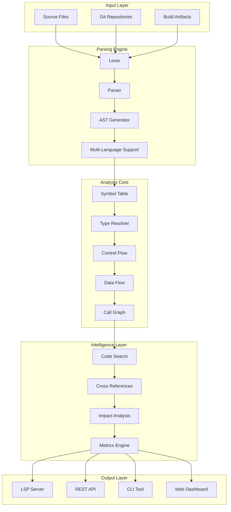

# Codex Analysis Platform: Building Code Intelligence Systems

> Master building sophisticated code analysis platforms with static analysis, AST manipulation, and developer tooling.

[](https://github.com/microsoft/TypeScript)
[](https://opensource.org/licenses/Apache-2.0)
[](https://github.com/microsoft/TypeScript)


---

## 🎯 What You'll Build

A comprehensive code analysis platform that provides:
- **Static Code Analysis**: Multi-language analysis engines
- **AST Processing**: Abstract syntax tree manipulation and transformation
- **Code Intelligence**: Symbol resolution, cross-references, and semantic analysis
- **Developer Tools**: Editor integrations and CLI interfaces
- **Visualization**: Interactive code exploration dashboards

## 🏗️ Architecture Overview



## 📋 Tutorial Chapters

| Chapter | Topic | Time | Difficulty |
|:--------|:------|:-----|:-----------|
| **[01-analysis-engine](01-analysis-engine.md)** | Building the Analysis Engine | 45 min | 🟡 Intermediate |
| **[02-ast-processing](02-ast-processing.md)** | AST Manipulation & Transformation | 50 min | 🟡 Intermediate |
| **[03-symbol-resolution](03-symbol-resolution.md)** | Symbol Tables & Type Resolution | 55 min | 🔴 Expert |
| **[04-code-intelligence](04-code-intelligence.md)** | Cross-References & Search | 45 min | 🔴 Expert |
| **[05-lsp-implementation](05-lsp-implementation.md)** | Language Server Protocol | 60 min | 🔴 Expert |
| **[06-visualization](06-visualization.md)** | Interactive Code Exploration | 40 min | 🟡 Intermediate |
| **[07-automation-pipelines](07-automation-pipelines.md)** | CI Integration & Reporting | 40 min | 🟡 Intermediate |
| **[08-production-rollout](08-production-rollout.md)** | Governance & Platform Ops | 35 min | 🟡 Intermediate |

## 🎯 Learning Outcomes

By the end of this tutorial, you'll be able to:

- ✅ Build multi-language static analysis engines
- ✅ Parse and manipulate abstract syntax trees
- ✅ Implement symbol resolution and type inference
- ✅ Create cross-reference and code search systems
- ✅ Build LSP-compliant language servers
- ✅ Develop interactive code visualization tools
- ✅ Handle enterprise-scale codebases efficiently

## 🛠️ Prerequisites

### Technical Knowledge
- **Compiler Theory**: Understanding of lexers, parsers, and ASTs
- **TypeScript/JavaScript**: Advanced knowledge for tooling development
- **Language Processing**: Familiarity with multiple programming languages
- **Web Technologies**: React, Node.js, and modern web development

### Development Environment
- Node.js 18+ and npm/yarn
- TypeScript 5.0+
- Git and a code editor (VS Code recommended)
- Docker (optional, for containerized deployment)

## 🚀 Quick Start

```bash
# Clone starter project
git clone https://github.com/example/codex-analysis-starter.git
cd codex-analysis-starter

# Install dependencies
npm install

# Install analysis libraries
npm install @babel/parser @babel/traverse tree-sitter
npm install typescript vscode-languageserver

# Start development
npm run dev
```

## 🎨 What Makes This Tutorial Special

### 🏆 **Production-Grade Patterns**
- Incremental analysis for performance
- Multi-threaded processing
- Caching and persistence strategies

### 🔧 **Multi-Language Focus**
- JavaScript/TypeScript analysis
- Python analysis
- Generic parsing frameworks

### 📊 **Enterprise Scale**
- Handling millions of lines of code
- Distributed analysis architectures
- Real-time incremental updates

### 🌟 **Editor Integration**
- Full LSP implementation
- VS Code extension patterns
- IDE feature development

## 💡 Use Cases

### Developer Tooling
- Code navigation and search
- Refactoring assistance
- Documentation generation
- Code review automation

### Code Quality
- Static analysis rules
- Security vulnerability detection
- Code smell identification
- Technical debt tracking

### Enterprise Intelligence
- Dependency analysis
- Impact assessment
- Architecture visualization
- Migration planning

## 🤝 Contributing

Found an issue or want to improve this tutorial? Contributions are welcome!

1. Fork this repository
2. Create a feature branch
3. Make your changes
4. Submit a pull request

## 📚 Additional Resources

- [Babel Parser Documentation](https://babeljs.io/docs/en/babel-parser)
- [Tree-sitter Documentation](https://tree-sitter.github.io/tree-sitter/)
- [LSP Specification](https://microsoft.github.io/language-server-protocol/)
- [TypeScript Compiler API](https://github.com/microsoft/TypeScript/wiki/Using-the-Compiler-API)

---

**Ready to build powerful code analysis tools?** Let's start with [Chapter 1: Analysis Engine](01-analysis-engine.md)! 🚀

*Generated for [Awesome Code Docs](https://github.com/johnxie/awesome-code-docs)*
