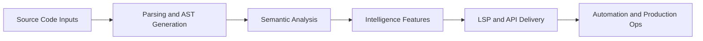

# Codex Analysis Platform Tutorial: Build Code Intelligence Systems

> Design and operate a production-grade code analysis platform with parsing, symbol resolution, code intelligence features, LSP integration, and rollout governance.

## Why This Track Matters

Most engineering teams rely on code intelligence features but do not understand how they are built or operated.

This track focuses on:

- architecture of multi-language analysis systems
- AST and symbol pipelines that power developer tooling
- practical LSP implementation patterns
- production rollout, governance, and CI automation

## Current Snapshot (auto-updated)

- tutorial scope: design and implementation patterns for code analysis platforms
- primary references: TypeScript Compiler API, Babel parser/traverse, Tree-sitter, and LSP specification
- chapter set includes architecture -> implementation -> operations
- structure and links validated by repository docs-health checks

## Mental Model

## Chapter Guide

| Chapter | Key Question | Outcome |
|:--------|:-------------|:--------|
| [01 - Analysis Engine](01-analysis-engine.md) | How should the core analysis runtime be structured? | Engine architecture baseline |
| [02 - AST Processing](02-ast-processing.md) | How do we parse and transform code safely? | Robust AST workflow |
| [03 - Symbol Resolution](03-symbol-resolution.md) | How do we map identifiers to meaning? | Semantic foundation |
| [04 - Code Intelligence](04-code-intelligence.md) | How do we expose search/navigation features? | Developer-facing intelligence layer |
| [05 - LSP Implementation](05-lsp-implementation.md) | How do we integrate with editors? | LSP-compatible service |
| [06 - Visualization](06-visualization.md) | How do we make insights explorable? | Interactive analysis views |
| [07 - Automation Pipelines](07-automation-pipelines.md) | How do we operationalize analysis in CI/CD? | Reliable automation patterns |
| [08 - Production Rollout](08-production-rollout.md) | How do we govern and scale the platform? | Rollout and operations playbook |

## What You Will Learn

- how to design static analysis architecture for real repositories
- how to build symbol/type/code-intelligence features incrementally
- how to integrate analysis output into editor and CI workflows
- how to operate analysis infrastructure with governance and reliability

## Source References

- [TypeScript Compiler API](https://github.com/microsoft/TypeScript/wiki/Using-the-Compiler-API)
- [Babel Parser](https://babeljs.io/docs/babel-parser)
- [Tree-sitter](https://tree-sitter.github.io/tree-sitter/)
- [Language Server Protocol](https://microsoft.github.io/language-server-protocol/)

## Related Tutorials

- [Aider Tutorial](../aider-tutorial/)
- [Cline Tutorial](../cline-tutorial/)
- [Roo Code Tutorial](../roo-code-tutorial/)
- [LangGraph Tutorial](../langgraph-tutorial/)

---

Start with [Chapter 1: Building the Analysis Engine](01-analysis-engine.md).

## Navigation & Backlinks

- [Start Here: Chapter 1: Building the Analysis Engine](01-analysis-engine.md)
- [Back to Main Catalog](../../README.md#-tutorial-catalog)
- [Browse A-Z Tutorial Directory](../../discoverability/tutorial-directory.md)
- [Search by Intent](../../discoverability/query-hub.md)
- [Explore Category Hubs](../../README.md#category-hubs)

## Full Chapter Map

1. [Chapter 1: Building the Analysis Engine](01-analysis-engine.md)
2. [Chapter 2: AST Processing](02-ast-processing.md)
3. [Chapter 3: Symbol Resolution](03-symbol-resolution.md)
4. [Chapter 4: Code Intelligence](04-code-intelligence.md)
5. [Chapter 5: LSP Implementation](05-lsp-implementation.md)
6. [Chapter 6: Visualization](06-visualization.md)
7. [Chapter 7: Automation Pipelines](07-automation-pipelines.md)
8. [Chapter 8: Production Rollout](08-production-rollout.md)

*Generated by [AI Codebase Knowledge Builder](https://github.com/The-Pocket/Tutorial-Codebase-Knowledge)*
