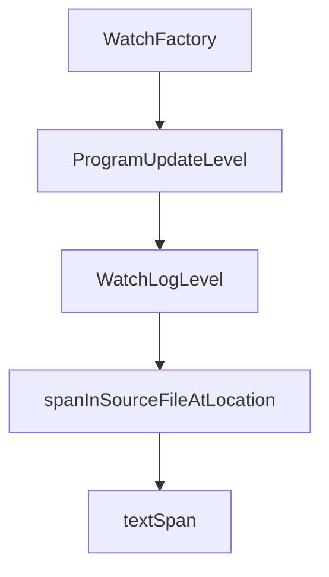

# Chapter 7: Automation Pipelines

Welcome to **Chapter 7: Automation Pipelines**. In this part of **Codex Analysis Platform Tutorial: Build Code Intelligence Systems**, you will build an intuitive mental model first, then move into concrete implementation details and practical production tradeoffs.


This chapter covers operationalizing analysis outputs inside CI/CD and scheduled workflows.

## Pipeline Integration Layers

1. **Pull Request checks**: fail on new high-severity analysis findings
2. **Nightly index refresh**: rebuild code graph and dependency metadata
3. **Report publishing**: generate trend dashboards and team-level summaries

## PR Workflow Pattern

```text
new PR -> scoped analysis -> annotate changed files -> enforce policy thresholds
```

Use changed-file scoping for fast feedback and reserve full-repo scans for scheduled jobs.

## Reliability Controls

- checkpoint index state between runs
- retry transient parser/network failures with backoff
- isolate language workers to prevent cross-language failures
- time-box expensive graph traversals

## Data Products for Engineering Leadership

- architecture drift alerts
- ownership hotspot reports
- dependency risk trendlines
- complexity deltas by repository area

## Operational Metrics

| Metric | Why It Matters |
|:-------|:---------------|
| analysis duration | CI throughput and developer UX |
| stale-index ratio | data freshness confidence |
| parser failure rate | source-coverage reliability |
| policy violation trend | risk posture over time |

## Summary

You can now embed code analysis into continuous delivery with measurable reliability.

Next: [Chapter 8: Production Rollout](08-production-rollout.md)

## Depth Expansion Playbook

## Source Code Walkthrough

### `src/compiler/watchUtilities.ts`

The `WatchFactory` interface in [`src/compiler/watchUtilities.ts`](https://github.com/microsoft/TypeScript/blob/HEAD/src/compiler/watchUtilities.ts) handles a key part of this chapter's functionality:

```ts

/** @internal */
export interface WatchFactoryHost {
    watchFile(path: string, callback: FileWatcherCallback, pollingInterval?: number, options?: WatchOptions): FileWatcher;
    watchDirectory(path: string, callback: DirectoryWatcherCallback, recursive?: boolean, options?: WatchOptions): FileWatcher;
    getCurrentDirectory?(): string;
    useCaseSensitiveFileNames: boolean | (() => boolean);
}

/** @internal */
export interface WatchFactory<X, Y = undefined> {
    watchFile: (file: string, callback: FileWatcherCallback, pollingInterval: PollingInterval, options: WatchOptions | undefined, detailInfo1: X, detailInfo2?: Y) => FileWatcher;
    watchDirectory: (directory: string, callback: DirectoryWatcherCallback, flags: WatchDirectoryFlags, options: WatchOptions | undefined, detailInfo1: X, detailInfo2?: Y) => FileWatcher;
}

/** @internal */
export type GetDetailWatchInfo<X, Y> = (detailInfo1: X, detailInfo2: Y | undefined) => string;
/** @internal */
export function getWatchFactory<X, Y = undefined>(host: WatchFactoryHost, watchLogLevel: WatchLogLevel, log: (s: string) => void, getDetailWatchInfo?: GetDetailWatchInfo<X, Y>): WatchFactory<X, Y> {
    setSysLog(watchLogLevel === WatchLogLevel.Verbose ? log : noop);
    const plainInvokeFactory: WatchFactory<X, Y> = {
        watchFile: (file, callback, pollingInterval, options) => host.watchFile(file, callback, pollingInterval, options),
        watchDirectory: (directory, callback, flags, options) => host.watchDirectory(directory, callback, (flags & WatchDirectoryFlags.Recursive) !== 0, options),
    };
    const triggerInvokingFactory: WatchFactory<X, Y> | undefined = watchLogLevel !== WatchLogLevel.None ?
        {
            watchFile: createTriggerLoggingAddWatch("watchFile"),
            watchDirectory: createTriggerLoggingAddWatch("watchDirectory"),
        } :
        undefined;
    const factory = watchLogLevel === WatchLogLevel.Verbose ?
        {
```

This interface is important because it defines how Codex Analysis Platform Tutorial: Build Code Intelligence Systems implements the patterns covered in this chapter.

### `src/compiler/watchUtilities.ts`

The `ProgramUpdateLevel` interface in [`src/compiler/watchUtilities.ts`](https://github.com/microsoft/TypeScript/blob/HEAD/src/compiler/watchUtilities.ts) handles a key part of this chapter's functionality:

```ts
}

export enum ProgramUpdateLevel {
    /** Program is updated with same root file names and options */
    Update,
    /** Loads program after updating root file names from the disk */
    RootNamesAndUpdate,
    /**
     * Loads program completely, including:
     *  - re-reading contents of config file from disk
     *  - calculating root file names for the program
     *  - Updating the program
     */

    Full,
}

/** @internal */
export interface SharedExtendedConfigFileWatcher<T> extends FileWatcher {
    watcher: FileWatcher;
    projects: Set<T>;
}

/**
 * Updates the map of shared extended config file watches with a new set of extended config files from a base config file of the project
 *
 * @internal
 */
export function updateSharedExtendedConfigFileWatcher<T>(
    projectPath: T,
    options: CompilerOptions | undefined,
    extendedConfigFilesMap: Map<Path, SharedExtendedConfigFileWatcher<T>>,
```

This interface is important because it defines how Codex Analysis Platform Tutorial: Build Code Intelligence Systems implements the patterns covered in this chapter.

### `src/compiler/watchUtilities.ts`

The `WatchLogLevel` interface in [`src/compiler/watchUtilities.ts`](https://github.com/microsoft/TypeScript/blob/HEAD/src/compiler/watchUtilities.ts) handles a key part of this chapter's functionality:

```ts

/** @internal */
export enum WatchLogLevel {
    None,
    TriggerOnly,
    Verbose,
}

/** @internal */
export interface WatchFactoryHost {
    watchFile(path: string, callback: FileWatcherCallback, pollingInterval?: number, options?: WatchOptions): FileWatcher;
    watchDirectory(path: string, callback: DirectoryWatcherCallback, recursive?: boolean, options?: WatchOptions): FileWatcher;
    getCurrentDirectory?(): string;
    useCaseSensitiveFileNames: boolean | (() => boolean);
}

/** @internal */
export interface WatchFactory<X, Y = undefined> {
    watchFile: (file: string, callback: FileWatcherCallback, pollingInterval: PollingInterval, options: WatchOptions | undefined, detailInfo1: X, detailInfo2?: Y) => FileWatcher;
    watchDirectory: (directory: string, callback: DirectoryWatcherCallback, flags: WatchDirectoryFlags, options: WatchOptions | undefined, detailInfo1: X, detailInfo2?: Y) => FileWatcher;
}

/** @internal */
export type GetDetailWatchInfo<X, Y> = (detailInfo1: X, detailInfo2: Y | undefined) => string;
/** @internal */
export function getWatchFactory<X, Y = undefined>(host: WatchFactoryHost, watchLogLevel: WatchLogLevel, log: (s: string) => void, getDetailWatchInfo?: GetDetailWatchInfo<X, Y>): WatchFactory<X, Y> {
    setSysLog(watchLogLevel === WatchLogLevel.Verbose ? log : noop);
    const plainInvokeFactory: WatchFactory<X, Y> = {
        watchFile: (file, callback, pollingInterval, options) => host.watchFile(file, callback, pollingInterval, options),
        watchDirectory: (directory, callback, flags, options) => host.watchDirectory(directory, callback, (flags & WatchDirectoryFlags.Recursive) !== 0, options),
    };
    const triggerInvokingFactory: WatchFactory<X, Y> | undefined = watchLogLevel !== WatchLogLevel.None ?
```

This interface is important because it defines how Codex Analysis Platform Tutorial: Build Code Intelligence Systems implements the patterns covered in this chapter.

### `src/services/breakpoints.ts`

The `spanInSourceFileAtLocation` function in [`src/services/breakpoints.ts`](https://github.com/microsoft/TypeScript/blob/HEAD/src/services/breakpoints.ts) handles a key part of this chapter's functionality:

```ts
 * @internal
 */
export function spanInSourceFileAtLocation(sourceFile: SourceFile, position: number): TextSpan | undefined {
    // Cannot set breakpoint in dts file
    if (sourceFile.isDeclarationFile) {
        return undefined;
    }

    let tokenAtLocation = getTokenAtPosition(sourceFile, position);
    const lineOfPosition = sourceFile.getLineAndCharacterOfPosition(position).line;
    if (sourceFile.getLineAndCharacterOfPosition(tokenAtLocation.getStart(sourceFile)).line > lineOfPosition) {
        // Get previous token if the token is returned starts on new line
        // eg: let x =10; |--- cursor is here
        //     let y = 10;
        // token at position will return let keyword on second line as the token but we would like to use
        // token on same line if trailing trivia (comments or white spaces on same line) part of the last token on that line
        const preceding = findPrecedingToken(tokenAtLocation.pos, sourceFile);

        // It's a blank line
        if (!preceding || sourceFile.getLineAndCharacterOfPosition(preceding.getEnd()).line !== lineOfPosition) {
            return undefined;
        }
        tokenAtLocation = preceding;
    }

    // Cannot set breakpoint in ambient declarations
    if (tokenAtLocation.flags & NodeFlags.Ambient) {
        return undefined;
    }

    // Get the span in the node based on its syntax
    return spanInNode(tokenAtLocation);
```

This function is important because it defines how Codex Analysis Platform Tutorial: Build Code Intelligence Systems implements the patterns covered in this chapter.


## How These Components Connect


