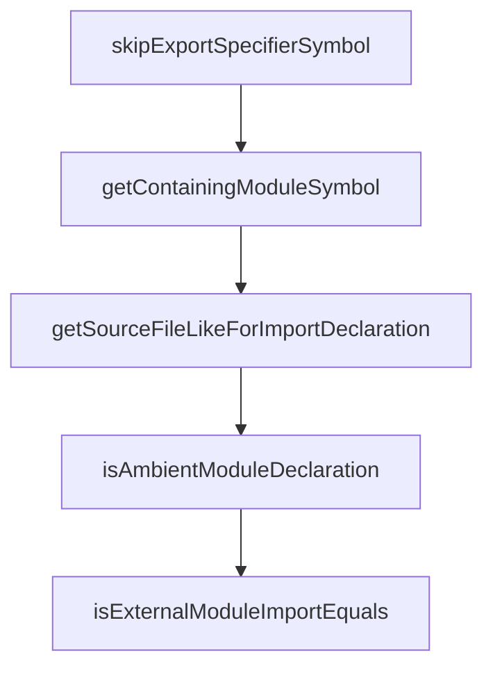

# Chapter 8: Production Rollout

Welcome to **Chapter 8: Production Rollout**. In this part of **Codex Analysis Platform Tutorial: Build Code Intelligence Systems**, you will build an intuitive mental model first, then move into concrete implementation details and practical production tradeoffs.


This chapter finalizes rollout strategy, governance, and long-term operations.

## Rollout Phasing

Start with low-risk adoption:

1. read-only insights and dashboards
2. non-blocking PR annotations
3. soft policy thresholds with override process
4. hard enforcement after baseline stabilization

## Governance Model

- define policy owners per rule class
- separate policy authoring from enforcement runtime
- version policy bundles with change approval
- maintain documented exception process

## Capacity and Scaling

- shard analysis queues by repository and language
- isolate heavy graph jobs from latency-sensitive PR checks
- precompute frequently requested dependency paths

## Incident Response Playbook

Prepare for:

- parser version regressions
- stale or corrupt index snapshots
- policy misconfiguration causing false positives
- provider/toolchain outages

Each failure mode needs rollback and communication steps.

## Final Success Criteria

- <target> CI latency overhead accepted by teams
- stable policy precision/recall for key risk classes
- clear ownership for platform and policy operations

## Final Summary

You now have an operational rollout framework for sustained code-intelligence platform adoption.

Related:
- [Language Server Protocol](https://microsoft.github.io/language-server-protocol/)
- [TypeScript Compiler API](https://github.com/microsoft/TypeScript/wiki/Using-the-Compiler-API)

## Depth Expansion Playbook

## Source Code Walkthrough

### `src/services/importTracker.ts`

The `skipExportSpecifierSymbol` function in [`src/services/importTracker.ts`](https://github.com/microsoft/TypeScript/blob/HEAD/src/services/importTracker.ts) handles a key part of this chapter's functionality:

```ts

        // Search on the local symbol in the exporting module, not the exported symbol.
        importedSymbol = skipExportSpecifierSymbol(importedSymbol, checker);

        // Similarly, skip past the symbol for 'export ='
        if (importedSymbol.escapedName === "export=") {
            importedSymbol = getExportEqualsLocalSymbol(importedSymbol, checker);
            if (importedSymbol === undefined) return undefined;
        }

        // If the import has a different name than the export, do not continue searching.
        // If `importedName` is undefined, do continue searching as the export is anonymous.
        // (All imports returned from this function will be ignored anyway if we are in rename and this is a not a named export.)
        const importedName = symbolEscapedNameNoDefault(importedSymbol);
        if (importedName === undefined || importedName === InternalSymbolName.Default || importedName === symbol.escapedName) {
            return { kind: ImportExport.Import, symbol: importedSymbol };
        }
    }

    function exportInfo(symbol: Symbol, kind: ExportKind): ExportedSymbol | undefined {
        const exportInfo = getExportInfo(symbol, kind, checker);
        return exportInfo && { kind: ImportExport.Export, symbol, exportInfo };
    }

    // Not meant for use with export specifiers or export assignment.
    function getExportKindForDeclaration(node: Node): ExportKind {
        return hasSyntacticModifier(node, ModifierFlags.Default) ? ExportKind.Default : ExportKind.Named;
    }
}

function getExportEqualsLocalSymbol(importedSymbol: Symbol, checker: TypeChecker): Symbol | undefined {
    if (importedSymbol.flags & SymbolFlags.Alias) {
```

This function is important because it defines how Codex Analysis Platform Tutorial: Build Code Intelligence Systems implements the patterns covered in this chapter.

### `src/services/importTracker.ts`

The `getContainingModuleSymbol` function in [`src/services/importTracker.ts`](https://github.com/microsoft/TypeScript/blob/HEAD/src/services/importTracker.ts) handles a key part of this chapter's functionality:

```ts
                        if (!direct.exportClause) {
                            // This is `export * from "foo"`, so imports of this module may import the export too.
                            handleDirectImports(getContainingModuleSymbol(direct, checker));
                        }
                        else if (direct.exportClause.kind === SyntaxKind.NamespaceExport) {
                            // `export * as foo from "foo"` add to indirect uses
                            addIndirectUser(getSourceFileLikeForImportDeclaration(direct), /*addTransitiveDependencies*/ true);
                        }
                        else {
                            // This is `export { foo } from "foo"` and creates an alias symbol, so recursive search will get handle re-exports.
                            directImports.push(direct);
                        }
                        break;

                    case SyntaxKind.ImportType:
                        // Only check for typeof import('xyz')
                        if (!isAvailableThroughGlobal && direct.isTypeOf && !direct.qualifier && isExported(direct)) {
                            addIndirectUser(direct.getSourceFile(), /*addTransitiveDependencies*/ true);
                        }
                        directImports.push(direct);
                        break;

                    default:
                        Debug.failBadSyntaxKind(direct, "Unexpected import kind.");
                }
            }
        }
    }

    function handleImportCall(importCall: ImportCall) {
        const top = findAncestor(importCall, isAmbientModuleDeclaration) || importCall.getSourceFile();
        addIndirectUser(top, /** addTransitiveDependencies */ !!isExported(importCall, /*stopAtAmbientModule*/ true));
```

This function is important because it defines how Codex Analysis Platform Tutorial: Build Code Intelligence Systems implements the patterns covered in this chapter.

### `src/services/importTracker.ts`

The `getSourceFileLikeForImportDeclaration` function in [`src/services/importTracker.ts`](https://github.com/microsoft/TypeScript/blob/HEAD/src/services/importTracker.ts) handles a key part of this chapter's functionality:

```ts
                        }
                        else if (!isAvailableThroughGlobal && isDefaultImport(direct)) {
                            addIndirectUser(getSourceFileLikeForImportDeclaration(direct)); // Add a check for indirect uses to handle synthetic default imports
                        }
                        break;

                    case SyntaxKind.ExportDeclaration:
                        if (!direct.exportClause) {
                            // This is `export * from "foo"`, so imports of this module may import the export too.
                            handleDirectImports(getContainingModuleSymbol(direct, checker));
                        }
                        else if (direct.exportClause.kind === SyntaxKind.NamespaceExport) {
                            // `export * as foo from "foo"` add to indirect uses
                            addIndirectUser(getSourceFileLikeForImportDeclaration(direct), /*addTransitiveDependencies*/ true);
                        }
                        else {
                            // This is `export { foo } from "foo"` and creates an alias symbol, so recursive search will get handle re-exports.
                            directImports.push(direct);
                        }
                        break;

                    case SyntaxKind.ImportType:
                        // Only check for typeof import('xyz')
                        if (!isAvailableThroughGlobal && direct.isTypeOf && !direct.qualifier && isExported(direct)) {
                            addIndirectUser(direct.getSourceFile(), /*addTransitiveDependencies*/ true);
                        }
                        directImports.push(direct);
                        break;

                    default:
                        Debug.failBadSyntaxKind(direct, "Unexpected import kind.");
                }
```

This function is important because it defines how Codex Analysis Platform Tutorial: Build Code Intelligence Systems implements the patterns covered in this chapter.

### `src/services/importTracker.ts`

The `isAmbientModuleDeclaration` function in [`src/services/importTracker.ts`](https://github.com/microsoft/TypeScript/blob/HEAD/src/services/importTracker.ts) handles a key part of this chapter's functionality:

```ts

    function handleImportCall(importCall: ImportCall) {
        const top = findAncestor(importCall, isAmbientModuleDeclaration) || importCall.getSourceFile();
        addIndirectUser(top, /** addTransitiveDependencies */ !!isExported(importCall, /*stopAtAmbientModule*/ true));
    }

    function isExported(node: Node, stopAtAmbientModule = false) {
        return findAncestor(node, node => {
            if (stopAtAmbientModule && isAmbientModuleDeclaration(node)) return "quit";
            return canHaveModifiers(node) && some(node.modifiers, isExportModifier);
        });
    }

    function handleNamespaceImport(importDeclaration: AnyImportOrJsDocImport, name: Identifier, isReExport: boolean, alreadyAddedDirect: boolean): void {
        if (exportKind === ExportKind.ExportEquals) {
            // This is a direct import, not import-as-namespace.
            if (!alreadyAddedDirect) directImports.push(importDeclaration);
        }
        else if (!isAvailableThroughGlobal) {
            const sourceFileLike = getSourceFileLikeForImportDeclaration(importDeclaration);
            Debug.assert(sourceFileLike.kind === SyntaxKind.SourceFile || sourceFileLike.kind === SyntaxKind.ModuleDeclaration);
            if (isReExport || findNamespaceReExports(sourceFileLike, name, checker)) {
                addIndirectUser(sourceFileLike, /*addTransitiveDependencies*/ true);
            }
            else {
                addIndirectUser(sourceFileLike);
            }
        }
    }

    /** Adds a module and all of its transitive dependencies as possible indirect users. */
    function addIndirectUser(sourceFileLike: SourceFileLike, addTransitiveDependencies = false): void {
```

This function is important because it defines how Codex Analysis Platform Tutorial: Build Code Intelligence Systems implements the patterns covered in this chapter.


## How These Components Connect


