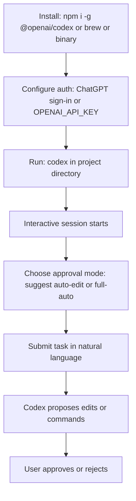

# Chapter 1: Getting Started

Welcome to **Chapter 1: Getting Started**. In this part of **Codex CLI Tutorial: Local Terminal Agent Workflows with OpenAI Codex**, you will build an intuitive mental model first, then move into concrete implementation details and practical production tradeoffs.

This chapter gets Codex CLI installed and running on your machine.

## Learning Goals

- install Codex CLI with package manager or binary
- run first interactive session
- choose ChatGPT sign-in vs API key auth
- verify basic command loop behavior

## Quick Install Paths

- `npm i -g @openai/codex`
- `brew install --cask codex`
- or download binaries from latest release

## Source References

- [Codex README: Quickstart](https://github.com/openai/codex/blob/main/README.md)
- [Codex Releases](https://github.com/openai/codex/releases/latest)
- [Codex CLI Features](https://developers.openai.com/codex/cli/features#running-in-interactive-mode)

## Summary

You now have a working Codex CLI baseline.

Next: [Chapter 2: Architecture and Local Execution Model](02-architecture-and-local-execution-model.md)

## Source Code Walkthrough

### `README.md`

The [`README.md`](https://github.com/openai/codex/blob/HEAD/README.md) is the primary reference for this chapter. It covers all three installation methods (npm global, brew, binary), the two authentication paths (ChatGPT sign-in for Plus/Pro users, API key for API users), and the quickstart command loop. The Quickstart section maps directly to the goals of this chapter.

The README also explains the three approval modes (`suggest`, `auto-edit`, `full-auto`) which determine how much autonomy Codex has during a session — a key configuration decision to understand before your first run.

### `codex-cli/package.json`

The [`codex-cli/package.json`](https://github.com/openai/codex/blob/HEAD/codex-cli/package.json) shows the npm package metadata: the published package name (`@openai/codex`), the entry point, and the `bin` field that maps `codex` to the CLI executable. This confirms the install path and helps diagnose PATH issues after global npm install.

## How These Components Connect

