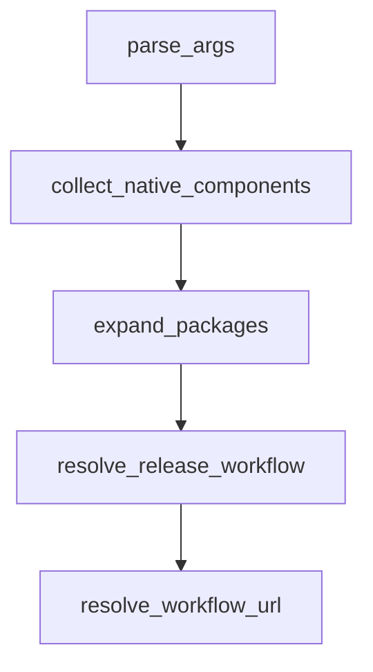

# Chapter 1: Getting Started

Welcome to **Chapter 1: Getting Started**. In this part of **Codex CLI Tutorial: Local Terminal Agent Workflows with OpenAI Codex**, you will build an intuitive mental model first, then move into concrete implementation details and practical production tradeoffs.


This chapter gets Codex CLI installed and running on your machine.

## Learning Goals

- install Codex CLI with package manager or binary
- run first interactive session
- choose ChatGPT sign-in vs API key auth
- verify basic command loop behavior

## Quick Install Paths

- `npm i -g @openai/codex`
- `brew install --cask codex`
- or download binaries from latest release

## Source References

- [Codex README: Quickstart](https://github.com/openai/codex/blob/main/README.md)
- [Codex Releases](https://github.com/openai/codex/releases/latest)
- [Codex CLI Features](https://developers.openai.com/codex/cli/features#running-in-interactive-mode)

## Summary

You now have a working Codex CLI baseline.

Next: [Chapter 2: Architecture and Local Execution Model](02-architecture-and-local-execution-model.md)

## Depth Expansion Playbook

## Source Code Walkthrough

### `scripts/stage_npm_packages.py`

The `parse_args` function in [`scripts/stage_npm_packages.py`](https://github.com/openai/codex/blob/HEAD/scripts/stage_npm_packages.py) handles a key part of this chapter's functionality:

```py


def parse_args() -> argparse.Namespace:
    parser = argparse.ArgumentParser(description=__doc__)
    parser.add_argument(
        "--release-version",
        required=True,
        help="Version to stage (e.g. 0.1.0 or 0.1.0-alpha.1).",
    )
    parser.add_argument(
        "--package",
        dest="packages",
        action="append",
        required=True,
        help="Package name to stage. May be provided multiple times.",
    )
    parser.add_argument(
        "--workflow-url",
        help="Optional workflow URL to reuse for native artifacts.",
    )
    parser.add_argument(
        "--output-dir",
        type=Path,
        default=None,
        help="Directory where npm tarballs should be written (default: dist/npm).",
    )
    parser.add_argument(
        "--keep-staging-dirs",
        action="store_true",
        help="Retain temporary staging directories instead of deleting them.",
    )
    return parser.parse_args()
```

This function is important because it defines how Codex CLI Tutorial: Local Terminal Agent Workflows with OpenAI Codex implements the patterns covered in this chapter.

### `scripts/stage_npm_packages.py`

The `collect_native_components` function in [`scripts/stage_npm_packages.py`](https://github.com/openai/codex/blob/HEAD/scripts/stage_npm_packages.py) handles a key part of this chapter's functionality:

```py


def collect_native_components(packages: list[str]) -> set[str]:
    components: set[str] = set()
    for package in packages:
        components.update(PACKAGE_NATIVE_COMPONENTS.get(package, []))
    return components


def expand_packages(packages: list[str]) -> list[str]:
    expanded: list[str] = []
    for package in packages:
        for expanded_package in PACKAGE_EXPANSIONS.get(package, [package]):
            if expanded_package in expanded:
                continue
            expanded.append(expanded_package)
    return expanded


def resolve_release_workflow(version: str) -> dict:
    stdout = subprocess.check_output(
        [
            "gh",
            "run",
            "list",
            "--branch",
            f"rust-v{version}",
            "--json",
            "workflowName,url,headSha",
            "--workflow",
            WORKFLOW_NAME,
            "--jq",
```

This function is important because it defines how Codex CLI Tutorial: Local Terminal Agent Workflows with OpenAI Codex implements the patterns covered in this chapter.

### `scripts/stage_npm_packages.py`

The `expand_packages` function in [`scripts/stage_npm_packages.py`](https://github.com/openai/codex/blob/HEAD/scripts/stage_npm_packages.py) handles a key part of this chapter's functionality:

```py


def expand_packages(packages: list[str]) -> list[str]:
    expanded: list[str] = []
    for package in packages:
        for expanded_package in PACKAGE_EXPANSIONS.get(package, [package]):
            if expanded_package in expanded:
                continue
            expanded.append(expanded_package)
    return expanded


def resolve_release_workflow(version: str) -> dict:
    stdout = subprocess.check_output(
        [
            "gh",
            "run",
            "list",
            "--branch",
            f"rust-v{version}",
            "--json",
            "workflowName,url,headSha",
            "--workflow",
            WORKFLOW_NAME,
            "--jq",
            "first(.[])",
        ],
        cwd=REPO_ROOT,
        text=True,
    )
    workflow = json.loads(stdout or "null")
    if not workflow:
```

This function is important because it defines how Codex CLI Tutorial: Local Terminal Agent Workflows with OpenAI Codex implements the patterns covered in this chapter.

### `scripts/stage_npm_packages.py`

The `resolve_release_workflow` function in [`scripts/stage_npm_packages.py`](https://github.com/openai/codex/blob/HEAD/scripts/stage_npm_packages.py) handles a key part of this chapter's functionality:

```py


def resolve_release_workflow(version: str) -> dict:
    stdout = subprocess.check_output(
        [
            "gh",
            "run",
            "list",
            "--branch",
            f"rust-v{version}",
            "--json",
            "workflowName,url,headSha",
            "--workflow",
            WORKFLOW_NAME,
            "--jq",
            "first(.[])",
        ],
        cwd=REPO_ROOT,
        text=True,
    )
    workflow = json.loads(stdout or "null")
    if not workflow:
        raise RuntimeError(f"Unable to find rust-release workflow for version {version}.")
    return workflow


def resolve_workflow_url(version: str, override: str | None) -> tuple[str, str | None]:
    if override:
        return override, None

    workflow = resolve_release_workflow(version)
    return workflow["url"], workflow.get("headSha")
```

This function is important because it defines how Codex CLI Tutorial: Local Terminal Agent Workflows with OpenAI Codex implements the patterns covered in this chapter.


## How These Components Connect


