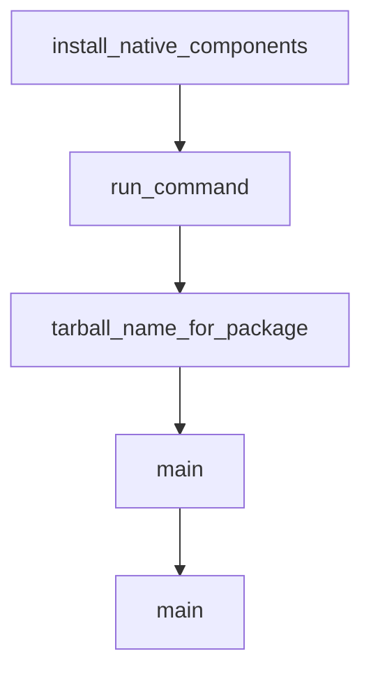

# Chapter 2: Architecture and Local Execution Model

Welcome to **Chapter 2: Architecture and Local Execution Model**. In this part of **Codex CLI Tutorial: Local Terminal Agent Workflows with OpenAI Codex**, you will build an intuitive mental model first, then move into concrete implementation details and practical production tradeoffs.


This chapter explains how Codex CLI behaves as a local terminal agent.

## Learning Goals

- understand local-first execution boundaries
- map core components and workflow stages
- identify where policy controls apply
- reason about model/tool interactions in terminal loops

## Architecture Highlights

- terminal-native interaction model
- configurable execution and policy surfaces
- support for MCP and connector integrations
- explicit sandbox/approval controls for risky operations

## Source References

- [Codex README](https://github.com/openai/codex/blob/main/README.md)
- [Codex AGENTS Context](https://github.com/openai/codex/blob/main/AGENTS.md)
- [Codex Docs Home](https://developers.openai.com/codex)

## Summary

You now have a clear mental model for Codex local execution behavior.

Next: [Chapter 3: Authentication and Model Configuration](03-authentication-and-model-configuration.md)

## Depth Expansion Playbook

## Source Code Walkthrough

### `scripts/stage_npm_packages.py`

The `install_native_components` function in [`scripts/stage_npm_packages.py`](https://github.com/openai/codex/blob/HEAD/scripts/stage_npm_packages.py) handles a key part of this chapter's functionality:

```py


def install_native_components(
    workflow_url: str,
    components: set[str],
    vendor_root: Path,
) -> None:
    if not components:
        return

    cmd = [str(INSTALL_NATIVE_DEPS), "--workflow-url", workflow_url]
    for component in sorted(components):
        cmd.extend(["--component", component])
    cmd.append(str(vendor_root))
    run_command(cmd)


def run_command(cmd: list[str]) -> None:
    print("+", " ".join(cmd))
    subprocess.run(cmd, cwd=REPO_ROOT, check=True)


def tarball_name_for_package(package: str, version: str) -> str:
    if package in CODEX_PLATFORM_PACKAGES:
        platform = package.removeprefix("codex-")
        return f"codex-npm-{platform}-{version}.tgz"
    return f"{package}-npm-{version}.tgz"


def main() -> int:
    args = parse_args()

```

This function is important because it defines how Codex CLI Tutorial: Local Terminal Agent Workflows with OpenAI Codex implements the patterns covered in this chapter.

### `scripts/stage_npm_packages.py`

The `run_command` function in [`scripts/stage_npm_packages.py`](https://github.com/openai/codex/blob/HEAD/scripts/stage_npm_packages.py) handles a key part of this chapter's functionality:

```py
        cmd.extend(["--component", component])
    cmd.append(str(vendor_root))
    run_command(cmd)


def run_command(cmd: list[str]) -> None:
    print("+", " ".join(cmd))
    subprocess.run(cmd, cwd=REPO_ROOT, check=True)


def tarball_name_for_package(package: str, version: str) -> str:
    if package in CODEX_PLATFORM_PACKAGES:
        platform = package.removeprefix("codex-")
        return f"codex-npm-{platform}-{version}.tgz"
    return f"{package}-npm-{version}.tgz"


def main() -> int:
    args = parse_args()

    output_dir = args.output_dir or (REPO_ROOT / "dist" / "npm")
    output_dir.mkdir(parents=True, exist_ok=True)

    runner_temp = Path(os.environ.get("RUNNER_TEMP", tempfile.gettempdir()))

    packages = expand_packages(list(args.packages))
    native_components = collect_native_components(packages)

    vendor_temp_root: Path | None = None
    vendor_src: Path | None = None
    resolved_head_sha: str | None = None

```

This function is important because it defines how Codex CLI Tutorial: Local Terminal Agent Workflows with OpenAI Codex implements the patterns covered in this chapter.

### `scripts/stage_npm_packages.py`

The `tarball_name_for_package` function in [`scripts/stage_npm_packages.py`](https://github.com/openai/codex/blob/HEAD/scripts/stage_npm_packages.py) handles a key part of this chapter's functionality:

```py


def tarball_name_for_package(package: str, version: str) -> str:
    if package in CODEX_PLATFORM_PACKAGES:
        platform = package.removeprefix("codex-")
        return f"codex-npm-{platform}-{version}.tgz"
    return f"{package}-npm-{version}.tgz"


def main() -> int:
    args = parse_args()

    output_dir = args.output_dir or (REPO_ROOT / "dist" / "npm")
    output_dir.mkdir(parents=True, exist_ok=True)

    runner_temp = Path(os.environ.get("RUNNER_TEMP", tempfile.gettempdir()))

    packages = expand_packages(list(args.packages))
    native_components = collect_native_components(packages)

    vendor_temp_root: Path | None = None
    vendor_src: Path | None = None
    resolved_head_sha: str | None = None

    final_messages = []

    try:
        if native_components:
            workflow_url, resolved_head_sha = resolve_workflow_url(
                args.release_version, args.workflow_url
            )
            vendor_temp_root = Path(tempfile.mkdtemp(prefix="npm-native-", dir=runner_temp))
```

This function is important because it defines how Codex CLI Tutorial: Local Terminal Agent Workflows with OpenAI Codex implements the patterns covered in this chapter.

### `scripts/stage_npm_packages.py`

The `main` function in [`scripts/stage_npm_packages.py`](https://github.com/openai/codex/blob/HEAD/scripts/stage_npm_packages.py) handles a key part of this chapter's functionality:

```py


def main() -> int:
    args = parse_args()

    output_dir = args.output_dir or (REPO_ROOT / "dist" / "npm")
    output_dir.mkdir(parents=True, exist_ok=True)

    runner_temp = Path(os.environ.get("RUNNER_TEMP", tempfile.gettempdir()))

    packages = expand_packages(list(args.packages))
    native_components = collect_native_components(packages)

    vendor_temp_root: Path | None = None
    vendor_src: Path | None = None
    resolved_head_sha: str | None = None

    final_messages = []

    try:
        if native_components:
            workflow_url, resolved_head_sha = resolve_workflow_url(
                args.release_version, args.workflow_url
            )
            vendor_temp_root = Path(tempfile.mkdtemp(prefix="npm-native-", dir=runner_temp))
            install_native_components(workflow_url, native_components, vendor_temp_root)
            vendor_src = vendor_temp_root / "vendor"

        if resolved_head_sha:
            print(f"should `git checkout {resolved_head_sha}`")

        for package in packages:
```

This function is important because it defines how Codex CLI Tutorial: Local Terminal Agent Workflows with OpenAI Codex implements the patterns covered in this chapter.


## How These Components Connect


