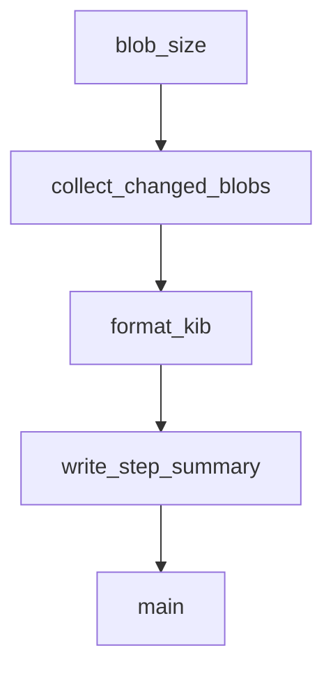

# Chapter 2: Architecture and Local Execution Model

Welcome to **Chapter 2: Architecture and Local Execution Model**. In this part of **Codex CLI Tutorial: Local Terminal Agent Workflows with OpenAI Codex**, you will build an intuitive mental model first, then move into concrete implementation details and practical production tradeoffs.


This chapter explains how Codex CLI behaves as a local terminal agent.

## Learning Goals

- understand local-first execution boundaries
- map core components and workflow stages
- identify where policy controls apply
- reason about model/tool interactions in terminal loops

## Architecture Highlights

- terminal-native interaction model
- configurable execution and policy surfaces
- support for MCP and connector integrations
- explicit sandbox/approval controls for risky operations

## Source References

- [Codex README](https://github.com/openai/codex/blob/main/README.md)
- [Codex AGENTS Context](https://github.com/openai/codex/blob/main/AGENTS.md)
- [Codex Docs Home](https://developers.openai.com/codex)

## Summary

You now have a clear mental model for Codex local execution behavior.

Next: [Chapter 3: Authentication and Model Configuration](03-authentication-and-model-configuration.md)

## Source Code Walkthrough

### `scripts/check_blob_size.py`

The `blob_size` function in [`scripts/check_blob_size.py`](https://github.com/openai/codex/blob/HEAD/scripts/check_blob_size.py) handles a key part of this chapter's functionality:

```py


def blob_size(commit: str, path: str) -> int:
    return int(run_git("cat-file", "-s", f"{commit}:{path}").strip())


def collect_changed_blobs(base: str, head: str, allowlist: set[str]) -> list[ChangedBlob]:
    blobs: list[ChangedBlob] = []
    for path in get_changed_paths(base, head):
        blobs.append(
            ChangedBlob(
                path=path,
                size_bytes=blob_size(head, path),
                is_allowlisted=path in allowlist,
                is_binary=is_binary_change(base, head, path),
            )
        )
    return blobs


def format_kib(size_bytes: int) -> str:
    return f"{size_bytes / 1024:.1f} KiB"


def write_step_summary(
    max_bytes: int,
    blobs: list[ChangedBlob],
    violations: list[ChangedBlob],
) -> None:
    summary_path = os.environ.get("GITHUB_STEP_SUMMARY")
    if not summary_path:
        return
```

This function is important because it defines how Codex CLI Tutorial: Local Terminal Agent Workflows with OpenAI Codex implements the patterns covered in this chapter.

### `scripts/check_blob_size.py`

The `collect_changed_blobs` function in [`scripts/check_blob_size.py`](https://github.com/openai/codex/blob/HEAD/scripts/check_blob_size.py) handles a key part of this chapter's functionality:

```py


def collect_changed_blobs(base: str, head: str, allowlist: set[str]) -> list[ChangedBlob]:
    blobs: list[ChangedBlob] = []
    for path in get_changed_paths(base, head):
        blobs.append(
            ChangedBlob(
                path=path,
                size_bytes=blob_size(head, path),
                is_allowlisted=path in allowlist,
                is_binary=is_binary_change(base, head, path),
            )
        )
    return blobs


def format_kib(size_bytes: int) -> str:
    return f"{size_bytes / 1024:.1f} KiB"


def write_step_summary(
    max_bytes: int,
    blobs: list[ChangedBlob],
    violations: list[ChangedBlob],
) -> None:
    summary_path = os.environ.get("GITHUB_STEP_SUMMARY")
    if not summary_path:
        return

    lines = [
        "## Blob Size Policy",
        "",
```

This function is important because it defines how Codex CLI Tutorial: Local Terminal Agent Workflows with OpenAI Codex implements the patterns covered in this chapter.

### `scripts/check_blob_size.py`

The `format_kib` function in [`scripts/check_blob_size.py`](https://github.com/openai/codex/blob/HEAD/scripts/check_blob_size.py) handles a key part of this chapter's functionality:

```py


def format_kib(size_bytes: int) -> str:
    return f"{size_bytes / 1024:.1f} KiB"


def write_step_summary(
    max_bytes: int,
    blobs: list[ChangedBlob],
    violations: list[ChangedBlob],
) -> None:
    summary_path = os.environ.get("GITHUB_STEP_SUMMARY")
    if not summary_path:
        return

    lines = [
        "## Blob Size Policy",
        "",
        f"Default max: `{max_bytes}` bytes ({format_kib(max_bytes)})",
        f"Changed files checked: `{len(blobs)}`",
        f"Violations: `{len(violations)}`",
        "",
    ]

    if blobs:
        lines.extend(
            [
                "| Path | Kind | Size | Status |",
                "| --- | --- | ---: | --- |",
            ]
        )
        for blob in blobs:
```

This function is important because it defines how Codex CLI Tutorial: Local Terminal Agent Workflows with OpenAI Codex implements the patterns covered in this chapter.

### `scripts/check_blob_size.py`

The `write_step_summary` function in [`scripts/check_blob_size.py`](https://github.com/openai/codex/blob/HEAD/scripts/check_blob_size.py) handles a key part of this chapter's functionality:

```py


def write_step_summary(
    max_bytes: int,
    blobs: list[ChangedBlob],
    violations: list[ChangedBlob],
) -> None:
    summary_path = os.environ.get("GITHUB_STEP_SUMMARY")
    if not summary_path:
        return

    lines = [
        "## Blob Size Policy",
        "",
        f"Default max: `{max_bytes}` bytes ({format_kib(max_bytes)})",
        f"Changed files checked: `{len(blobs)}`",
        f"Violations: `{len(violations)}`",
        "",
    ]

    if blobs:
        lines.extend(
            [
                "| Path | Kind | Size | Status |",
                "| --- | --- | ---: | --- |",
            ]
        )
        for blob in blobs:
            status = "allowlisted" if blob.is_allowlisted else "ok"
            if blob in violations:
                status = "blocked"
            kind = "binary" if blob.is_binary else "non-binary"
```

This function is important because it defines how Codex CLI Tutorial: Local Terminal Agent Workflows with OpenAI Codex implements the patterns covered in this chapter.


## How These Components Connect


